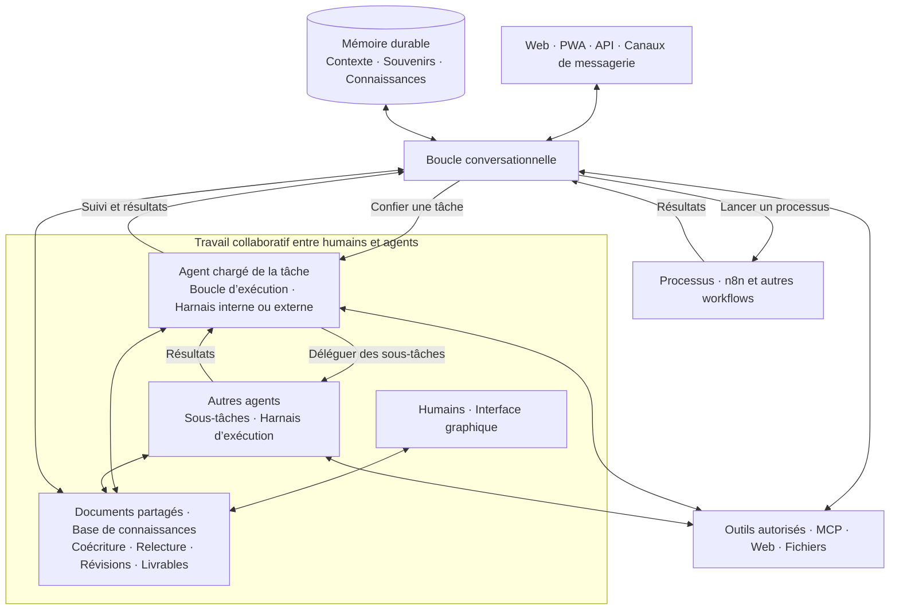

  <a href="README.md">English</a> · <strong>Français</strong> · <a href="README-zh.md">简体中文</a>

  

<h1 align="center">Galaris</h1>

<strong>Ne discutez plus avec l’IA. Mettez-la au travail.</strong>

  Le centre de contrôle auto-hébergé pour des agents qui agissent, collaborent, mémorisent 
  et progressent. Vos modèles, vos outils, vos données, vos règles.

  <a href="INSTALL.md"><strong>Lancer Galaris</strong></a> ·
  <a href="#ce-que-galaris-apporte">Découvrir la plateforme</a> ·
  <a href="docs/fr/features.md">Tour complet des fonctionnalités</a> ·
  <a href="docs/fr/README.md">Documentation</a>

  
  
  
  

Un modèle sait raisonner. Une force de travail IA opérationnelle a aussi besoin d’identités, de
permissions, d’outils, de mémoire, de coordination, d’exécutions durables et de preuves.

**Galaris fournit cette couche opérationnelle.** Donnez à des agents nommés un rôle, un modèle,
des skills, des outils et des objectifs de long terme. Ils peuvent répondre dans les canaux de
votre équipe, déléguer un travail borné, utiliser le web et vos systèmes métier, reprendre après
un incident et construire une connaissance gouvernée à partir du travail accompli.

> **Les modèles répondent. Galaris livre — et conserve les preuves.**

## Ce que Galaris apporte

| Avant | Avec Galaris |
|---|---|
| Des prompts isolés | Des agents nommés avec identité, consignes, skills, outils et workspace privé |
| Un chat éphémère | Des conversations texte et voix historisées, supervisées en direct et capables de lancer un travail de fond |
| Une réponse en un coup | Des tâches, plans, délégations, reprises, annulations et checkpoints sûrs |
| Un contexte à reconstruire | Une session partagée et une mémoire durable avec révisions, provenance, ACL et rappel hybride |
| Des notes dispersées | Une base de connaissances vivante, faite de documents coécrits par humains et agents et organisés en dossiers thématiques |
| Des agents figés | Un entretien Dream optionnel qui consolide la mémoire et apprend des retours d’expérience fondés sur des preuves |
| Une automatisation opaque | Des traces LLM/outils, coûts, erreurs, runs de processus et benchmarks reproductibles dans le Lab IA |
| L’écosystème d’un fournisseur | Des harnais internes ou externes pour les tâches, des bridges LLM, MCP et des processus comme n8n |

### Sous le capot

1. **Une double boucle agentique** — converser avec l’agent pendant qu’il pilote des tâches
   et des processus en arrière-plan.
2. **Des agents qui collaborent** — déléguer des sous-tâches à d’autres agents, suivre leur
   progression et réutiliser leurs résultats.
3. **Des documents coécrits par humains et agents** — produire ensemble, relire et enrichir
   des documents qui constituent une base de connaissances durable.
4. **Une mémoire qui entretient la continuité** — retrouver le contexte, consolider les
   connaissances et apprendre des expériences grâce à Dream.
5. **Des modèles spécialisés pour décider** — associer les LLM génératifs à des modèles
   comme Jev pour orienter les tâches et organiser les connaissances.
6. **Un travail qui survit aux interruptions** — conserver les tâches, reprendre leur
   exécution et suivre les tentatives jusqu’au résultat.
7. **Une IA observable et évaluable** — inspecter les décisions, les appels et les coûts ;
   comparer les modèles et les mécanismes dans le Lab.
8. **Une architecture ouverte et maîtrisée** — auto-hébergement, choix des modèles et des
   harnais, outils MCP, workflows n8n et multiples canaux de communication.
9. **Une mise en œuvre accessible** — installation Docker simple, application préconfigurée
   et pilotage quotidien dans une interface graphique pensée pour être ergonomique.

### Transformer une mission complexe en opération durable

Demandez de comparer des offres, rechercher les risques, vérifier les totaux, construire une
matrice de décision et envoyer la recommandation pour validation. Galaris route la demande vers
une exécution directe ou un plan persistant, délègue des étapes spécialisées, attend les
informations manquantes et reprend après un redémarrage. Tâches, tentatives, processus et
livrables restent liés et consultables.

### Rendre chaque conversation actionnable

Les agents répondent depuis le web, la PWA Android/iOS, Matrix, Nextcloud Talk, OneBot, Telegram
et WhatsApp Business. La boucle conversationnelle agrège les rafales, évite les boucles de
réponses et garde le fil des échanges. Elle peut confier une tâche à un harnais d’exécution
ou lancer un processus comme n8n, puis en suivre les résultats sans bloquer la conversation.
La voix en direct accepte aussi bien un pipeline
STT → agent → TTS composable que des fournisseurs speech-to-speech natifs lorsqu’ils sont configurés.

### Construire une connaissance plutôt que perdre le contexte

Galaris associe l’historique récent à une mémoire privée et gouvernée. Les agents recherchent de
façon lexicale ou sémantique, maintiennent des documents de travail collaboratifs, conservent la
provenance et organisent les connaissances dans des dossiers thématiques indépendants d’un salon.
Dream peut profiter des périodes calmes pour dédupliquer et consolider les souvenirs, puis retenir
une leçon uniquement lorsque les preuves de la tâche la justifient.

### Mesurer le comportement de l’IA avant de lui faire confiance

Le Lab IA transforme de vraies Tasks, conversations texte et conversations vocales en jeux de
données versionnés. Comparez Dispatcher, Briefing, Planner, exécuteurs Task/Conversation/Voice et
mécanismes Dream/Goal avec rubriques sémantiques, cas figés, runs reprenables et diagnostics du juge.

## Des modèles spécialisés pour décider

Galaris associe les LLM génératifs à des **modèles décisionnels comme [Jev](https://openrouter.ai/blog/insights/what-is-jev/)**
pour orienter les tâches, classer les sujets et sélectionner les informations à mémoriser.
Des choix encadrés, validés et traçables.

## Une surface d’action complète

- catalogue MCP avec connexions par agent, restrictions par fonction et découverte différée selon
  les droits réels ;
- recherche web locale et navigateur Chromium isolé, sessions privées, snapshots accessibles et
  captures de page complète bornées ;
- fichiers privés ou partagés, génération/retouche/analyse d’images et exécution SSH contrôlée ;
- transcription audio/vidéo, segmentation des enregistrements longs et synthèse hiérarchique ; les
  sous-titres YouTube publics suivent le même parcours sans télécharger la vidéo ;
- processus personnels et administratifs durables, dont n8n avec idempotence, callbacks,
  annulation et suivi lié aux Tasks ;
- objectifs de long terme avec propriétaire, référent, planning, cycles, preuves et contrôles manuels.

Les capacités sont gouvernées par agent et les plus spécialisées restent inactives par défaut. Le
runtime ne voit que les outils et fonctions autorisés par ses connexions actives et les droits de
l’utilisateur courant.

## Démarrage rapide

**La mise en route est très simple : Galaris tourne dans Docker et arrive préconfiguré.**
La configuration et le pilotage au quotidien passent par une interface graphique pensée
pour être simple et ergonomique.

Suivez le [guide INSTALL.md](INSTALL.md) : une procédure courte pour installer Galaris,
commencer à discuter, puis gérer les mises à jour, l’arrêt, le démarrage et la désinstallation.

## Une double boucle agentique, un travail collaboratif

Galaris articule deux boucles complémentaires :

- **La boucle conversationnelle** dialogue avec vous, s’appuie sur la mémoire pour garder
  le contexte et retrouver les connaissances utiles, utilise les outils autorisés et suit
  le travail en cours. Elle peut confier une tâche à un harnais ou lancer un processus comme n8n.
- **La boucle d’exécution des tâches** est portée par le harnais sélectionné, interne ou
  externe. L’agent raisonne, agit, vérifie les résultats et peut **déléguer des sous-tâches
  à d’autres agents**, puis reprendre leurs résultats pour poursuivre son travail.

**Humains et agents coécrivent les documents**, les relisent et les enrichissent.
Ils constituent une **base de connaissances vivante**, avec des sources, des révisions
et des droits d’accès. La conversation reste reliée à ce travail commun ; la mémoire
assure la continuité des échanges.

Les tâches et processus s’exécutent en arrière-plan pendant que la conversation reste disponible.
Galaris conserve les états, les tentatives, les traces et les possibilités de reprise.
Chaque agent accède à la mémoire, aux documents et aux outils selon ses droits ; le partage
permet la collaboration. Les harnais apportent la capacité d’exécution à cette architecture.

Galaris propose des bridges natifs vers les grands écosystèmes de modèles — notamment OpenAI,
Anthropic, Google, Mistral, OpenRouter, Ollama et d’autres fournisseurs compatibles — sans faire du
choix du fournisseur l’architecture de vos agents.

## Documentation

- [Tour complet des fonctionnalités](docs/fr/features.md)
- [Installation et exploitation](INSTALL.md)
- [Portail documentaire](docs/fr/README.md)
- [Guide utilisateur](docs/fr/user/README.md)
- [Guide administrateur](docs/fr/admin/README.md)
- [Guide développeur et architecture](docs/fr/dev/README.md)
- [Cartographie et flux d’architecture](docs/fr/architecture/README.md)
- [Décisions du projet](project/decisions/README.md)
- [English overview](README.md)

## Vos modèles sont capables. Rendez-les opérationnels.

Construisez des agents qui agissent, conversent, reprennent, mémorisent et progressent tout en
gardant le contrôle de l’infrastructure, des permissions et des preuves.

**Clonez Galaris. Connectez un modèle. Donnez-lui une mission.**

Galaris est distribué sous licence libre CeCILL. Voir [LICENSE-FR.md](LICENSE-FR.md) et
[LICENSE.md](LICENSE.md).
