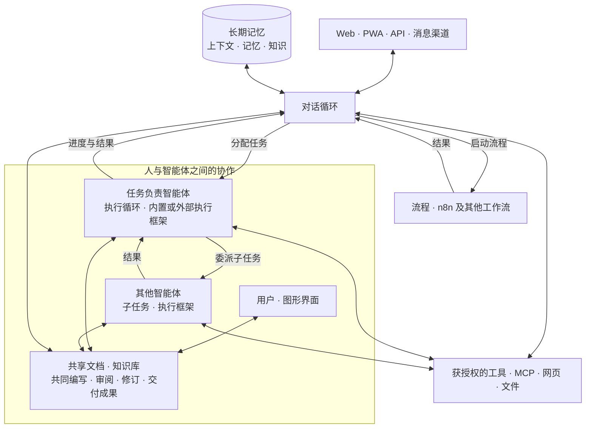

  <a href="README.md">English</a> · <a href="README-fr.md">Français</a> · <strong>简体中文</strong>

  

<h1 align="center">Galaris</h1>

<strong>不止与 AI 对话，更让 AI 为你工作。</strong>

  自托管的智能体控制中心，让智能体执行任务、协作、记忆并持续进步。 
  你的模型、你的工具、你的数据、你的规则。

  <a href="INSTALL.md"><strong>开始使用 Galaris</strong></a> ·
  <a href="#what-galaris-delivers">了解平台</a> ·
  <a href="docs/en/features.md">完整功能介绍（英文）</a> ·
  <a href="docs/en/README.md">文档（英文）</a>

  
  
  
  

模型能够推理。但要让 AI 团队真正投入工作，还需要身份、权限、工具、记忆、协调机制、
可持久执行的任务，以及能够说明实际执行过程的证据。

**Galaris 提供了这套运行基础。** 为具名智能体分配角色、模型、技能、工具和长期目标。
它们可以在团队的沟通渠道中回复消息，委派范围明确的工作，使用浏览器和业务系统，
在故障后恢复执行，并将完成的工作沉淀为可管理、可追溯的知识。

> **模型给出回答，Galaris 交付成果，并保留证据。**

## Galaris 带来什么

| 原有方式 | 使用 Galaris 后 |
|---|---|
| 零散的提示词 | 具名智能体，拥有稳定身份、指令、技能、工具和私有工作空间 |
| 临时聊天 | 保留历史的文本与语音对话，支持实时监督和后台任务交接 |
| 一次性回答 | 持久化任务、多步计划、委派、重试、取消、安全检查点和恢复 |
| 反复重建上下文 | 共享会话上下文，以及具备修订、来源记录、访问控制和混合检索的长期记忆 |
| 分散的笔记 | 人与智能体共同编写文档，按主题整理，形成持续积累的知识库 |
| 固定不变的智能体 | 可选的 Dream 维护机制，整合记忆并从有证据支持的结果中学习经验 |
| 难以观察的自动化 | 可检查的模型与工具调用轨迹、流程执行记录、成本、故障和可复现的 AI 实验室评测 |
| 受限于单一供应商生态 | 使用内置或外部任务执行框架、模型供应商桥接、MCP 工具，以及 n8n 等流程 |

### 技术内核

1. **双智能体循环** — 智能体在后台管理任务和流程时，你仍然可以继续与它交流。
2. **智能体之间的协作** — 将子任务委派给其他智能体，跟踪进度并利用它们的结果继续工作。
3. **人与智能体共同编写文档** — 一起创作、审阅和完善文档，建立持久的知识库。
4. **保持连续性的记忆** — 找回上下文、整合知识，并通过 Dream 从经验中学习。
5. **专门的模型负责决策** — 将生成式大语言模型与 Jev 等模型结合，用于任务调度和知识整理。
6. **中断后仍能继续的工作** — 持久保存任务、恢复执行，并跟踪每次尝试直至产生结果。
7. **可观察、可评估的 AI** — 检查决策、调用和成本，在 AI 实验室中比较模型与机制。
8. **开放且自主可控的架构** — 支持自托管，可选择模型和执行框架，连接 MCP 工具、n8n 工作流和多种沟通渠道。
9. **简单易用的部署与管理** — 通过 Docker 轻松安装，应用已完成预配置，日常操作使用注重易用性的图形界面。

### 让复杂工作持续推进

你可以让 Galaris 比较方案、调查风险、核对总额、建立决策矩阵，并将建议提交审批。
它会将请求交给直接执行流程或持久化计划，委派专业步骤，在缺少信息时暂停，
并在重启后继续。任务、执行尝试、流程运行和交付成果始终保持关联，可供查看。

### 让每次对话都能促成行动

智能体可以通过网页应用、Android/iOS PWA、Matrix、Nextcloud Talk、OneBot、Telegram
和 WhatsApp Business 回复消息。对话循环合并密集消息，防止回复循环，并保持对话连贯。
它可以将任务交给执行框架，或启动 n8n 等流程，再跟踪执行结果，而不阻塞对话。
实时语音既支持可组合的 STT → 智能体 → TTS 流程，也支持已配置供应商的原生语音到语音能力。

### 积累知识，而不是丢失上下文

Galaris 将近期对话上下文与私有、受控的记忆相结合。智能体可以进行关键词或语义检索，
维护协作文档，保留信息来源，并将知识整理到不依赖单个聊天室的主题档案中。
Dream 可以利用空闲时间去重、整合记忆，且仅在任务证据支持时保留经验教训。

### 先评估 AI 的行为，再建立信任

AI 实验室将真实任务、文本对话和语音对话转为有版本记录的数据集。
你可以借助语义评分标准、固定测试用例、可恢复的评测运行和明确的评审诊断，
比较 Dispatcher、Briefing、Planner、Task/Conversation/Voice 执行器以及 Dream/Goal 机制。

## 专门的模型负责决策

Galaris 将生成式大语言模型与 **[Jev](https://openrouter.ai/blog/insights/what-is-jev/) 等决策模型**结合使用，
用于任务调度、主题分类和筛选值得记住的信息。决策范围明确，结果经过校验且可追溯。

## 内置执行能力

- MCP 工具目录：按智能体配置连接、按功能限制权限，并根据实际权限按需发现工具；
- 本地网页搜索与隔离的 Chromium 浏览器，支持私有会话、无障碍快照和有大小限制的整页截图；
- 共享与私有文件、图像生成与编辑分析，以及受控的 SSH 执行；
- 音视频转录、长录音分段和分层摘要；公开的 YouTube 字幕也走同一流程，无需下载视频；
- 可持久运行的个人与管理流程，包括具备幂等性、回调、取消和关联任务跟踪的 n8n 执行；
- 长期目标（Goal），包含所有者、负责人、计划、周期、证据和人工控制。

能力按智能体管理，专业能力默认保持未启用。运行时只能看到当前有效连接和用户权限允许的工具与功能。

## 快速开始

**上手非常简单：Galaris 在 Docker 中运行，并已完成预配置。**
日常配置和管理通过图形界面完成，力求简洁易用。

请查看 [INSTALL.md（英文）](INSTALL.md)，按照简明步骤完成安装、开始首次对话，
并了解如何更新、停止、启动和卸载。

## 双智能体循环与协作工作

Galaris 将两个相互配合的智能体循环连接起来：

- **对话循环**负责与你交流，借助记忆保持上下文、检索有用知识，使用获授权的工具，
  并跟踪正在进行的工作。它可以将任务交给执行框架（harness），或启动 n8n 等流程。
- **任务执行循环**由选定的内置或外部执行框架承载。智能体通过推理、行动和结果检查
  推进工作，也可以**将子任务委派给其他智能体**，再利用它们的结果继续执行。

**人与智能体共同编写、审阅和完善文档**，形成**持续积累的知识库**，
并保留来源、修订记录和访问权限。文档是协作工作的基础，对话始终关联这些共同成果，
记忆则让交流保持连贯。

任务与流程在后台运行，对话始终保持可用。Galaris 保留状态、执行尝试、执行轨迹和恢复选项。
每个智能体根据自身权限访问记忆、文档和工具，通过共享实现协作。执行框架为这一架构提供执行能力。

Galaris 为主流模型生态提供原生桥接，包括 OpenAI、Anthropic、Google、Mistral、OpenRouter、
Ollama 及其他兼容供应商，让智能体架构不受单一供应商选择的限制。

## 文档

以下指南主要为英文；完整文档也提供[法文版本](docs/fr/README.md)。

- [完整功能介绍](docs/en/features.md)
- [安装与运维](INSTALL.md)
- [文档入口](docs/en/README.md)
- [用户指南](docs/en/user/README.md)
- [管理员指南](docs/en/admin/README.md)
- [开发与架构指南](docs/en/dev/README.md)
- [架构图与流程](docs/en/architecture/README.md)
- [项目决策](project/decisions/README.md)
- [英文项目介绍](README.md)
- [法文项目介绍](README-fr.md)

## 让模型的能力转化为实际成果

构建能够执行、对话、恢复、记忆并持续进步的智能体，同时保留对基础设施、权限和执行证据的控制。

**克隆 Galaris，连接模型，交给它一个任务。**

Galaris 按 CeCILL 自由软件许可证发布。参见 [LICENSE.md](LICENSE.md) 和
[LICENSE-FR.md](LICENSE-FR.md)。
