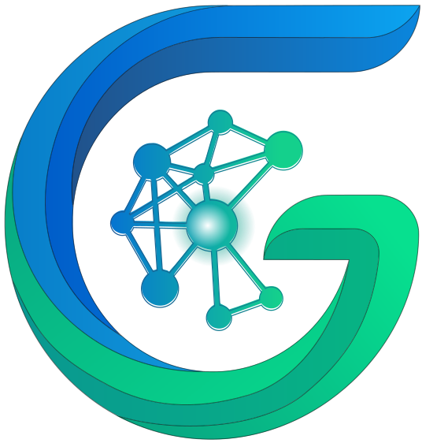
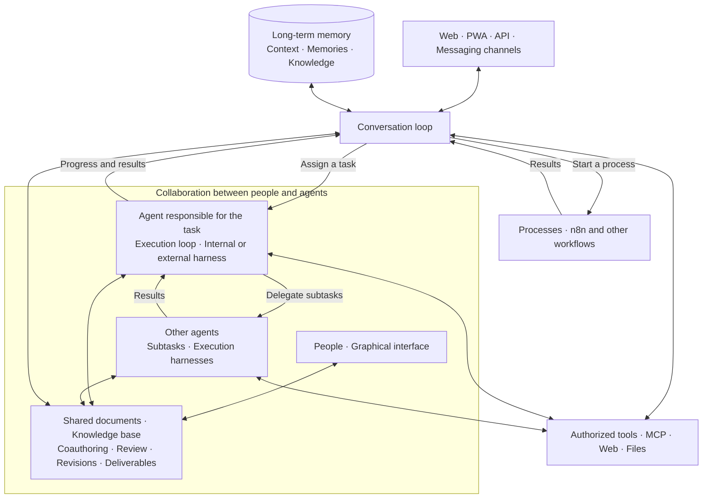

  <strong>English</strong> · <a href="README-fr.md">Français</a> · <a href="README-zh.md">简体中文</a>

  

<h1 align="center">Galaris</h1>

<strong>Stop chatting with AI. Put it to work.</strong>

  The self-hosted control plane for agents that act, collaborate, remember and improve. 
  Your models, your tools, your data, your rules.

  <a href="INSTALL.md"><strong>Launch Galaris</strong></a> ·
  <a href="#what-galaris-delivers">Explore the platform</a> ·
  <a href="docs/en/features.md">Full feature tour</a> ·
  <a href="docs/en/README.md">Documentation</a>

  
  
  
  

A model can reason. A production AI workforce also needs identity, permissions, tools, memory,
coordination, durable execution and a way to prove what actually happened.

**Galaris is that operating layer.** Give named agents a role, a model, skills, tools and long-term
goals. Let them answer in your team’s channels, delegate bounded work, use browsers and business
systems, recover from failures, and build governed knowledge from completed work.

> **Models answer. Galaris delivers — and keeps the evidence.**

## What Galaris delivers

| From | To |
|---|---|
| Isolated prompts | Named agents with stable identity, instructions, skills, tools and private workspaces |
| Ephemeral chat | Text and voice conversations with durable history, live supervision and background-task handoff |
| One-shot answers | Persisted tasks, multi-step plans, delegation, retries, cancellation, safe checkpoints and recovery |
| Rebuilt context | Shared session context plus governed long-term memory, revisions, provenance, ACLs and hybrid recall |
| Scattered notes | A living knowledge base built from documents coauthored by people and agents, organized into thematic dossiers |
| Static agents | Optional Dream maintenance that consolidates memories and learns evidence-backed experience from outcomes |
| Opaque automation | Inspectable LLM/tool traces, process runs, costs, failures and reproducible AI Lab benchmarks |
| One provider’s ecosystem | Internal or external task harnesses, provider bridges, MCP tools and processes such as n8n |

### Under the hood

1. **Two complementary agent loops** — keep talking with your agent while it manages tasks
   and processes in the background.
2. **Agents that collaborate** — delegate subtasks to other agents, track their progress
   and build on their results.
3. **Documents coauthored by people and agents** — create, review and enrich documents
   together to build a lasting knowledge base.
4. **Memory that maintains continuity** — recall context, consolidate knowledge and learn
   from experience through Dream.
5. **Specialized models for decisions** — combine generative LLMs with models such as Jev
   to route tasks and organize knowledge.
6. **Work that survives interruptions** — persist tasks, resume execution and track
   attempts through to the result.
7. **Observable and evaluable AI** — inspect decisions, calls and costs; compare models
   and mechanisms in the Lab.
8. **An open architecture under your control** — self-hosting, a choice of models and
   harnesses, MCP tools, n8n workflows and multiple communication channels.
9. **Accessible setup and operation** — simple Docker installation, a preconfigured app
   and everyday operation through a graphical interface designed for ease of use.

### Turn complex work into a durable operation

Ask Galaris to compare proposals, research risks, verify totals, build a decision matrix and send
the recommendation for approval. It can route the request to direct execution or a durable plan,
delegate specialist steps, pause for missing information and resume after a restart. Tasks,
attempts, process runs and deliverables remain linked and inspectable.

### Make every conversation actionable

Agents can respond through the web app, the Android/iOS PWA, Matrix, Nextcloud Talk, OneBot,
Telegram and WhatsApp Business. The conversation loop aggregates bursts, prevents reply loops
and maintains the thread of the discussion. It can hand tasks to execution harnesses or start
processes such as n8n workflows, then track their results without blocking the conversation.
Live voice supports both a composable STT → agent → TTS pipeline and native speech-to-speech
providers where configured.

### Build knowledge instead of losing context

Galaris combines recent conversation context with private, governed memory. Agents can search
lexically or semantically, maintain collaborative working documents, preserve provenance and
organize knowledge into thematic dossiers independent of a single room. Dream can use idle time to
deduplicate and consolidate memories, then retain lessons only when task evidence supports them.

### Measure AI behavior before trusting it

The AI Lab turns real Tasks, text rounds and voice turns into versioned datasets. Benchmark the
Dispatcher, Briefing, Planner, Task/Conversation/Voice executors and Dream/Goal mechanisms with
semantic rubrics, frozen cases, resumable runs and explicit judge diagnostics.

## Specialized models for decisions

Galaris combines generative LLMs with **decision models such as [Jev](https://openrouter.ai/blog/insights/what-is-jev/)**
to route tasks, classify topics and select information worth remembering.
Choices are constrained, validated and traceable.

## Built-in action surface

- MCP tool catalog with per-agent connections, per-function restrictions and rights-aware deferred
  discovery;
- local web search plus an isolated Chromium browser with private sessions, accessible snapshots
  and bounded full-page captures;
- shared and private files, image generation/editing/analysis, and controlled SSH execution;
- audio/video transcription, long-recording segmentation and hierarchical summaries; public
  YouTube captions use the same workflow without downloading the video;
- durable personal and administrative processes, including idempotent n8n runs, callbacks,
  cancellation and linked Task tracking;
- long-running Goals with owners, referrers, schedules, cycles, evidence and manual controls.

Capabilities are governed per agent, and specialized ones remain inactive by default. The runtime
sees only the tools and functions permitted by its active connections and the current user’s
rights.

## Quick start

**Getting started is very simple: Galaris runs in Docker and comes preconfigured.**
Everyday configuration and operation happen through a graphical interface designed
for simplicity and ease of use.

Follow [INSTALL.md](INSTALL.md) for a short guide to installation, your first chat,
updates, stopping and starting services, and uninstallation.

## Two agent loops, collaborative work

Galaris connects two complementary agent loops:

- **The conversation loop** talks with you, relies on memory to maintain context and recall
  useful knowledge, uses authorized tools and follows ongoing work. It can hand a task to
  a harness or start a process such as an n8n workflow.
- **The task execution loop** runs through the selected internal or external harness. The
  agent reasons, acts, checks results and can **delegate subtasks to other agents**, then
  use their results to continue its work.

**People and agents coauthor documents**, review them and build on each other's work.
These documents form a **living knowledge base**, with sources, revisions and access rights.
The conversation stays linked to this shared work, while memory provides continuity
across exchanges.

Tasks and processes run in the background while the conversation remains available.
Galaris preserves states, attempts, traces and recovery options. Each agent accesses memory,
documents and tools according to its permissions; sharing enables collaboration.
Harnesses provide the execution capability within this architecture.

Galaris provides native bridges for major model ecosystems—including OpenAI, Anthropic, Google,
Mistral, OpenRouter, Ollama and other compatible providers—without making provider choice the
architecture of your agents.

## Documentation

- [Complete feature tour](docs/en/features.md)
- [French product overview](README-fr.md)
- [Installation and operations](INSTALL.md)
- [Documentation portal](docs/en/README.md)
- [User guide](docs/en/user/README.md)
- [Administrator guide](docs/en/admin/README.md)
- [Developer and architecture guide](docs/en/dev/README.md)
- [Architecture maps and flows](docs/en/architecture/README.md)
- [Project decisions](project/decisions/README.md)

The complete documentation is available in both [English](docs/en/README.md) and
[French](docs/fr/README.md), with matching paths and a language switch on every page.

## Your models are capable. Make them operational.

Build agents that can act, converse, recover, remember and improve while you keep control of the
infrastructure, permissions and evidence.

**Clone Galaris. Connect a model. Give it a mission.**

Galaris is distributed under the CeCILL free-software license. See [LICENSE.md](LICENSE.md) and
[LICENSE-FR.md](LICENSE-FR.md).
