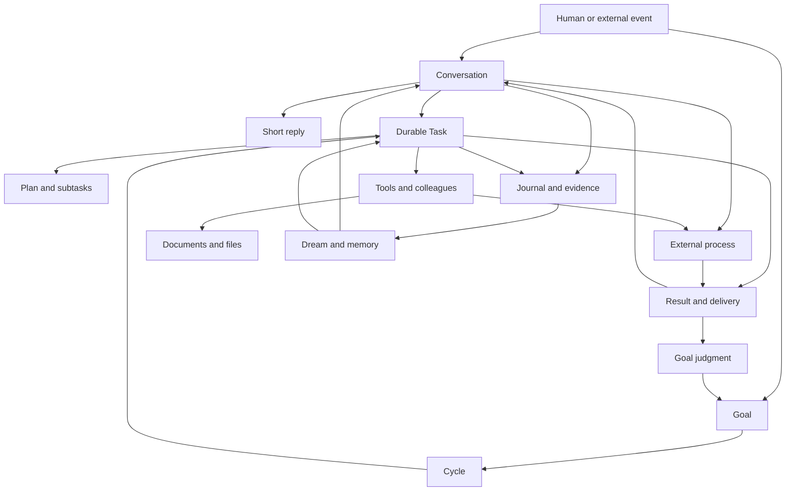
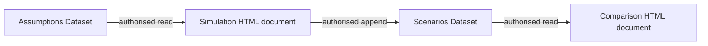

<a href="../../fr/reference/functional-catalogue.md">Français</a> · <strong>English</strong>

# Galaris — detailed feature and concept catalogue

Galaris is a self-hosted platform for building a team of AI agents, giving them tools to act and
following their work over time. Conversations, tasks, goals, documents, memory, models and
integrations form a common system. An agent can converse, consult authorized information,
produce deliverables, involve colleagues, trigger external workflows and retain useful knowledge.

This catalogue describes features present in the repository as of **25 September 2026**,
including agent functions, administration screens and background mechanisms. It is organized
by use, followed by a native MCP inventory and coverage of **every declared module**. Sources
make that coverage verifiable. This is the exhaustive reference for preparing the product website.

“Available” means implemented: effective access depends on rights, module activation,
connections, models and external accounts. This describes the software without certifying
every provider or installation configuration.

The underlying review covers **22–25 September 2026**, through commit `9dc6d03`, against current
contracts and tests. New features appear in their domain sections, conditions and inventories.
The inventory covers **183 native MCP functions, 71 backend modules and 36 frontend modules**.
Implemented features remain distinct from intentions in the [plan register](../../../project/plans/README.md).
Quality controls appear under [operations](#exploitation).

## Contents

1. [Concepts and relationships](#concepts)
2. [Getting started and shared interface](#interface)
3. [Accounts, roles and teams](#comptes)
4. [Agent identity and management](#agents)
5. [AI models, profiles and providers](#modeles)
6. [Harnesses and execution environments](#harnais)
7. [Conversations and native chat](#chat)
8. [External messaging and contacts](#messageries)
9. [Voice and live calls](#voix)
10. [Tasks, planning and collaboration](#taches)
11. [Durable goals](#objectifs)
12. [Memory and knowledge retrieval](#memoire)
13. [Documents, Datasets and applications](#documents)
14. [Topics](#sujets)
15. [Dream and learning](#dream)
16. [Skill library](#skills)
17. [Tools, connections and MCP server](#outils)
18. [Files and resources](#fichiers)
19. [Web search and browser](#web)
20. [Console and Linux environment](#console)
21. [Images, audio, music and video](#medias)
22. [Email](#mail)
23. [Calendars and triggers](#calendrier)
24. [Business processes, n8n and webhooks](#processus)
25. [AI Lab and evaluation](#lab)
26. [Activity, costs and incidents](#supervision)
27. [Settings, hosting and operations](#exploitation)
28. [Complete example journeys](#parcours)
29. [Availability and limitations](#limites)
30. [Inventory of agent-accessible functions](#mcp)
31. [Module coverage and sources](#couverture)

## 1. Concepts and relationships

### Objects you work with

| Concept | Meaning | Role in Galaris |
|---|---|---|
| **User** | A person with an account | Signs in, manages preferences, converses, supervises agents and receives granted access. |
| **Agent** | A durable AI identity | Has a name, personality, job description, human manager, models, tools, skills and memory. |
| **Team** | People and agents grouped together | Organizes membership, authorizes supported conversations and can receive document shares. |
| **Model / AI resource** | Provider inference capability | Produces text, embeddings, images, transcription, speech or media according to capabilities. |
| **Model profile** | Coherent AI resource selection | Assigns four text levels and specialized uses; may be current, agent-specific or selected by a person. |
| **Decision model** | Closed-choice resource | Selects allowed answers for routing, topics or memory; writing stays with the same profile's text model. |
| **Harness** | The program running an agent | Executes the model–tool loop, reports progress and returns a result. |
| **Tool** | Integration or capability set | Declares functions, parameters and optional messaging, file or event services. |
| **Connection** | An agent's access to a Tool | Holds activation, configuration, credentials and allowed functions; the four system-service connections are mandatory and protected. |
| **Durable inference** | Model request recorded before execution | Freezes request/authority, retains attempts/results and supports reading, subscription, pause, stop, resume and replay. |
| **Skill** | Packaged instructions and resources | Describes a reusable method, possibly with files; grants no Tool permissions. |
| **Conversation / room** | An exchange on a channel | Retains messages, authors, files, topics and resulting work. |
| **Round** | Processing of incoming messages | Aggregates input, executes a short response and records actions, attempts and deliveries. |
| **Task** | Work with an identifiable result | Retains a self-contained objective, agent, optional steps, attempts and durable result. |
| **Plan / subtask** | Real decomposition of work | Each step becomes tracked work with dependencies, criteria and deliverables. |
| **Goal** | Objective pursued over cycles | Triggers work by frequency or parent goal, evaluates progress and maintains follow-up. |
| **Goal cycle** | Work-and-evaluation pass | Links a Task to a verdict and prepares the next Goal step. |
| **Process** | External processing definition | Describes workflow, engine and assignment; every launch creates a tracked execution. |
| **Run / attempt** | A concrete execution | Distinguishes a try, recovery and new execution, with costs and errors. |
| **Memory** | Durable, governed knowledge | Searchable, revisable, sourced and access-controlled. |
| **Document** | Durable HTML or Dataset resource | Stable URI, title, owner, versions and shares; HTML may combine text, media and interactive applications. |
| **Dataset** | JSON document | Organized/shared in the library; multiple pages can read/update it with required rights and consent. |
| **Application in a document** | HTML, CSS and JavaScript running in the page | Forms, simulators and visualizations; Dataset access requires reader rights and personal consent for the document revision. |
| **Personal document folder** | User-specific classification | Organizes accessible documents without changing content, rights or anyone else's organization. |
| **Attachment memory** | A file's textual/documentary companion | Retains attachment identity, metadata, descriptions and links to documents using it. |
| **Topic** | Subject shared across activities | Links conversations, tasks, documents, memories and participants beyond one channel. |
| **Contact** | Person observed by an agent | Links messaging identities and knowledge within the agent's scope. |
| **Resource URI** | Canonical object/file address | Lets tools read and transmit the same resource without inventing local paths. |
| **Dream** | Platform background work | Classifies topics, extracts knowledge, maintains memory and optionally learns procedures. |
| **AI Lab** | Experimentation workspace | Captures cases, compares models and measures mechanisms with judgments and evidence. |
| **Galaris knowledge** | Installed-version documentation searchable by authorized agents | Guides, navigation, architecture, decisions and plans with provenance; plans remain prospective. |
| **Incident** | Recorded failure | Links error/context, groups occurrences and retains diagnosis/remediation. |

### From a message to a result

Conversation remains available during background work. Goal cycles reread follow-up and previous
results rather than merely repeating prompts. A Process can continue in n8n while Galaris tracks
it. Documents support successive contributions; memory retains knowledge worth recalling.
**Production, delivery and evidence** are separate: “file sent” in prose does not replace a
transport result. Resource origins, executed tools, results and available delivery receipts persist.

## 2. Getting started and shared interface

- **Guided home page:** discovery panels check usable chat models, agents, tools, active
  messaging, skills and processes, respecting rights and existing configuration.
- **Contextual help:** explains domain concepts/workflows. Closing or selecting “Got it”
  dismisses help for the account across devices. Failed saves leave it visible for retry.
- **Domain navigation:** chat, agents, activity, goals, documents, memory, topics, Dream, Lab,
  incidents, processes, models and settings, sometimes as tabs/panels of shared pages.
- **French/English UI**, light/dark themes and **Solaire** palette; interface language is
  independent of agents' working languages and content languages.
- **Environment labels:** development, test, staging and demo have distinct banners/labels;
  only `dev` enables development behavior.
- **Responsive UI:** mobile below 1024 CSS pixels, desktop above; panels/forms/editors adapt.
- **Installable PWA:** Android/iPhone home-screen installation and persistent sessions.
  Updates renew interface cache and reload tabs while preserving sessions.
- **Live updates:** messages, activity, Tasks, LLM calls and Dream use events; subscriptions
  target active authorized consumers and restore/resynchronize after reconnect.
- **Search/filter/pagination:** domain-specific text, agent, state, period, topic, owner and
  provider filters; default 50 items with 10, 20, 50, 100 and 500 choices.
- **Lazy selectors:** agents/topics load on opening, retain selections, allow retry and reject
  late results from previous contexts where applicable.
- **Diagnostics:** API errors show available problem, route and HTTP status, distinguishing
  timeout from network failure.
- **Long operations:** no general client HTTP deadline for Lab, document transfers or harness
  work; explicit cancellation remains. Old-session responses are rejected; server/provider/proxy limits apply.
- **Resource opening:** authorized links, Task references and attachments open appropriate
  details/viewers; relevant inspectors allow copying references and JSON.
- **Information pages:** About provides features, credits and license; menu footer shows build
  tag, otherwise branch/short commit. Welcome and unknown-route handling complete the shell.
- **Documented navigation:** screen/tab guide and generated frontend routes, FR/EN labels and
  visibility conditions; product-aware agents can use them to guide users.

The PWA still needs the Galaris server and business services; agents are not autonomous offline.
Update checks retry even if the browser incorrectly reports offline. Development disables PWA
caching. Shared identity/agent/privilege loading coalesces requests and rejects old-session results.

Sources: [user guide](../user/README.md), [PWA](../user/pwa.md),
[onboarding](../../../back/app/onboarding/), [shell](../../../front/app/index/),
[help](../../../back/core/user/help_service.py), [navigation](../user/navigation.md),
[menu map](../architecture/generated/navigation.md), [HTTP waiting](../../../front/core/apiWaiting.test.mjs).

## 3. Accounts, roles and teams

### Accounts and sessions

- Register the first administrator on a fresh instance. Further registrations default to
  closed; System preferences can open them. Role assignments grant new accounts their rights.
- Sign in/out and edit profiles. **My preferences** groups identity, language, security,
  models, voice, messaging identities and chat document display.
- Authorized user creation/view/edit/activation/deletion, protecting the last administrator access.
- Personal display name and avatar upload/display/removal.
- Personal model profile/voice selection, also manageable by authorized administrators,
  used notably for document dictation and read-aloud.
- **TOTP** setup/confirmation/status/disabling and regeneration of single-use backup codes.
- Repeated-login protection, rotating session tokens and session-family revocation.
- Explicit login waits for identity before closing; errors remain visible and late responses
  cannot replace the current account.
- Named personal integration tokens: create, enable, disable, delete; distinct from agent MCP tokens.

### Rights and roles

**RBAC** groups privileges into assigned roles. Administration manages privileges, roles,
assignments and privilege lists. Users select active roles/default assignments within their
allowed choices. Viewing, editing, administration and particular actions have separate rights,
enforced by menus, APIs and resource access. Agent management, team membership and document
readership do not automatically grant all administrative rights.

### Teams and conversation permissions

- Create, rename, delete and reorder teams using drag, touch or keyboard.
- Add/remove people and agents, with multiple memberships; inspect counts/members, search
  humans and select agents.
- Shared teams permit supported dialogues. Managers retain access to their agents; global
  administrators may contact them. Agent-to-agent dialogue/delegation requires a shared team.
- Rights are not transitive through a third member and do not expose others' private conversations.
- Revocation blocks new exchanges/affected response fragments; admitted Tasks keep their lifecycle.
- Team document shares follow current membership and remain separate from chat rights.

Native calls also require `CHAT_CALL` in a personal conversation; teams are not their sole control.

Sources: [accounts](../../../back/core/user/router.py), [authorization](../../../back/core/authorize/router.py),
[teams](../user/teams.md), [team contract](../../../back/core/team/contracts.py).

## 4. Agent identity and management

An agent retains identity through conversations, Tasks and model changes. Its profile includes:

- permanent system code, first/last name, title and avatar;
- job title, rich-text job description and personality;
- human manager and teams;
- model profile, voice and harness;
- tool connections, authorized skills and MCP access.

Profiles, avatars and titles are managed under rights. Permanent codes serve integrations and
workspaces and never change after creation. Selectors filter by action: manageable agents,
authorized chat partners or eligible team members. Standard titles follow UI language; custom
labels, deletions and customizations survive initialization.

`agent_list`/`agent_get` expose colleagues and detailed profiles. Delegation retains requester
and recipient rather than silently changing executor identity. Directory results include
`galaris://agent/<id>` for authorized rereading of current job/personality. Profiles also expose
harness state, lifecycle actions, logs, blocking Tasks and MCP URL/tokens for external clients.

### The Galaris assistant offered at installation

**Galaris** is offered once to help understand/configure/administer the platform. It uses the
**internal harness**, follows the **current LLM profile** and belongs to the first active
administrator. Fresh installs wait for registration; existing installs receive the offer at DB sync.

Ordinary skills/connections are initialized. **Galaris Admin** is enabled at creation for
product documentation and permitted execution inspections, unlike its inactive default for other
agents. This does not automatically grant Lab access.

Identity, mission, profile, harness and permissions remain editable. Subsequent sync preserves
choices, revocations and deletion, without recreating renamed/deleted agents. A preexisting
`galaris` code results in a suffix rather than modification. A usable model and connections remain required.

Sources: [schemas](../../../back/app/agent/schemas.py), [API](../../../back/app/agent/router.py),
[UI](../../../front/app/agent/), [initialization](../../../back/app/agent/defaults.py),
[customization guarantees](../../../back/app/agent/tests/test_default_agent.py).

## 5. AI models, profiles and providers

### Connecting and discovering AI resources

Administration supports choosing catalogue providers/custom compatible servers; configuring URLs,
parameters, authentication and activation; testing connections and discovering/selecting resources;
recording stable Galaris codes, labels, technical names and capabilities; viewing/editing context
limits, modalities and pricing; refreshing metadata, including `models_dev` enrichment;
installing/removing models where supported (notably Ollama); and connecting/disconnecting
supported device-code authentication.

Resources distinguish text, decision, vision, documents, embeddings, images, transcription,
voices, audio/video understanding, music, sound effects and video generation. Provider support
does not guarantee every model's capabilities. Multiple capabilities on one resource survive
save/reopen. Discovery filters include **Documents / PDF** and **Decision**; document discovery
selects file-input/text-output resources, so incomplete metadata can hide compatible models.
Multimodal discovery retains all capabilities; explicit refresh updates metadata.

### Optional initial OpenRouter configuration

A **fresh installation** receives OpenRouter without an API key, nine models and a prefilled
**Default** profile. No network call, account, secret or installation-specific pricing is supplied.
Provider access must be configured or assignments replaced before use.

| Shipped resource | Initial assignment |
|---|---|
| DeepSeek V4.1 Flash | Four text levels and vision |
| GPT 5.4 Nano | Documents |
| Whisper large v3 | Transcription |
| MiniMax Hailuo 3 Max | Video generation |
| Google Lyria 3 Clip Preview | Music generation |
| TypeSafe Jev 1.13 | Decisions |
| Qwen3 Embedding 4B | Embeddings |
| Google Nano Banana Pro / Gemini 3 Pro Image | Images |
| NVIDIA Nemotron 3 Nano Omni (free) | Audio/video understanding |

Text levels use `none`, `low`, `medium`, `high` reasoning effort respectively. Text fallback for
decisions is initially allowed. These are stored references, not commercial availability promises.
Administrator edits, renames and deletions persist. **Existing databases are not prefilled.**
Deleting the last profile requires creating a replacement, possibly empty. Prices refresh normally.

### Profiles and model selection

Profiles change model policy without reconfiguring every agent. A profile can be current,
explicitly assigned to an agent or selected in a person's preferences.

| Level | Code-assigned uses |
|---|---|
| **Ultra low** | Model-based Dream mechanisms |
| **Low** | Dispatcher and short conversations |
| **Standard** | Standard execution, Goal follow-up and retained Briefing mechanism |
| **High** | High execution, Planner and Lab |

Each level may set provider **reasoning effort**, distinct from Task standard/high complexity.
Specialized selections cover vision, documents, audio/video, sound/music/video generation,
images, transcription and embeddings. Voice is per agent/user. Optional **Decision** selection
accepts decision-capable resources and a fallback policy; text remains for writing and unconfigured
specialization. **Explicit profiles are exclusive**: missing resources are not borrowed. Otherwise,
agents/users follow the current profile. Profiles support creation, editing, deletion and activation.

Text uses **Pydantic AI**, SDK profiles and endpoint constraints for reasoning, token limits and
sampling, without guessing profiles from model prefixes or borrowing another provider's profile.
Unknown extensions pass through. An explicit parameter rejection before generation may permit
removing that optional setting and a bounded retry, never messages, tools, budgets or output formats.
Timeouts, quota errors and partial streams do not trigger this negotiation. Functional incompatibility
remains an error; requested effort remains in activity even if translated. The
[parameter matrix](../dev/provider-parameters.md) covers simulated-transport contracts without paid calls.

### Specialized decisions and governed fallback

Closed-choice answers are validated before application. The current adapter uses OpenRouter;
decision-only resources cannot serve chat. Without Decision selection, existing text paths remain,
including a single local LLM.

| Workflow | Decision role | Retained text/code role |
|---|---|---|
| Task dispatcher and AI-peer admission | Select allowed routes, efforts and other choices | Rights, harness policy; no inference if only one route/effort remains |
| Activity/message topics | Reuse topic, detect continuity or request creation | Write new title/description/keywords and apply creation policy |
| Dream memory extraction | Ignore sources without durable facts, link covered facts or request extraction | Write/validate new or incompletely covered knowledge |
| Memory acquisition | Confirm full equivalence with a close candidate | Retrieval, rights, fact preservation and idempotent provenance linking |

Planner, Briefing, Goal follow-up and learning remain generative. Deterministic maintenance and
transitions add no decisions. **Text fallback on failure** permits at most one call in the **same
profile**, low for Dispatcher, ultra low for Dream, or can be disabled. A personal profile lacking
specialization does not borrow the global one. Authentication, permission/payment refusal,
cancellation, stop and lease loss never become model bypasses. Low confidence alone does not
trigger fallback; absent probabilities are not invented.

Durable requests freeze choices/models/parameters. Traces distinguish specialized/fallback calls,
retain costs and identify origin/reason. Resume rejects incompatible model/connection changes.
No dedicated Decision deadline is imposed by default; explicit/workflow limits apply. Quality,
cost and latency are measured in Lab: filtering followed by writing can add a call.

Sources: [profile decisions](../../../back/app/llm/profile_decisions.py),
[decision inference](../../../back/app/llm/decision_service.py),
[workflow guarantees](../../../back/tests/test_decision_workflows.py),
[initial configuration](../../../back/app/llm/initial_configuration.py).

### Providers present in the repository

| Integration | Role |
|---|---|
| **OpenAI API** | Models/services including text, media and real-time according to resource |
| **OpenAI Codex device authentication** | Personal connection separate from API keys; authority follows its human owner |
| **Anthropic API** | Anthropic models through the provider contract |
| **Google Gemini** | Declared multimodal services, including images, embeddings and voice |
| **Google Cloud TTS** | Dedicated voice catalogue and synthesis |
| **OpenRouter** | Multiple models, discovery and registered multimodal services |
| **Mammouth AI** | Text, vision, embeddings, images and audio/video understanding |
| **DeepSeek** | Text and model-specific protocol adaptation |
| **Fireworks** | Declared text, vision, images and embeddings |
| **Groq** | Declared text/vision and transcription |
| **Mistral** | Declared text, vision and embeddings |
| **Together, Cerebras, xAI, NVIDIA, Hugging Face, Cohere, Perplexity** | Dedicated discovery/adaptation bridges and their own capabilities |
| **ElevenLabs** | Synthesis, transcription, music and sound effects by selected service |
| **SunoAPI.org** | Third-party music/sound generation; account separate from a Suno subscription |
| **BytePlus LAS** | Video generation, notably Seedance |
| **Azure Speech** | Regional speech synthesis |
| **Ollama** | Local model discovery and management |
| **models.dev** | Model metadata, not an execution engine |

See [provider bridges](../architecture/flows/llm-provider-bridges.md). Commercial capabilities,
quotas and models remain those of the configured external account.

### Using Galaris as a model gateway

Compatible **Chat Completions**, **Responses** and **Anthropic Messages** facades include model
discovery and Anthropic token counting. External clients such as Claude Code use configured models
with Galaris traces. Explicit model codes win; family/level aliases map Haiku → ultra low,
Sonnet/Luna → low, Opus/Terra → standard and Fable/Sol → high. These are Galaris mappings, not
universal product equivalences.

Personal subscriptions retain their owners across originating-user work/delegations; technical
identities cannot borrow another person's subscription. Tracking distinguishes inference cost,
billed/estimated cost, subscription usage and missing data. Personal ChatGPT use requires explicit
stored confirmation. Revocation blocks calls despite connected authentication; ownership changes
require new confirmation.

### ChatGPT subscription limits

Device-authenticated provider settings show account-reported **percentage used**, window duration
and reset date when available, with check time and refresh. These are **whole-account** limits,
including outside use; reading them makes no inference call. Provider-admin rights, valid owner
and usable authentication are required. Missing windows/errors remain unavailable, without invented
quotas. This is neither a per-agent budget nor API-model billing.

Sources: [quota reading](../../../back/bridge/openai/codex_quota.py),
[checks/errors](../../../back/bridge/openai/tests/test_quota.py).

### Profile-based public APIs

Profiles have a stable **API Code**, preserved on rename and backfilled by DB sync. Clients select
uses rather than providers; reassignments affect subsequent calls without redirecting admitted ones.

| Selector | Use |
|---|---|
| `<profile>/text/ultra-low`, `<profile>/text/low` | Ultra low and low |
| `<profile>/text/standard`, `<profile>/text/high` | Standard and high |
| `<profile>/text/default` | Standard alias |
| `<profile>/embedding/default` | Embeddings |
| `<profile>/decision/default` | Decisions |

Bases are `/api/profile/openai` and `/api/profile/anthropic`. `/models` and `/v1/models` expose
assignments from **all profiles**, not only current; `/api/profile/models` also includes specialized
uses. Both protocols accept a Bearer **user API token** with LLM API access.

- **Text:** Chat Completions, Responses/compaction when supported, Anthropic Messages/token counting,
  ordinary responses and streams.
- **Embeddings:** `/api/profile/openai/embeddings` takes one text or 1–2,048 nonempty texts,
  preserves order and available usage, supports `float`/`base64`; dimensions depend on provider.
  Pretokenized input is unsupported.
- **Decisions:** `/api/profile/decisions` accepts closed questions/criteria and returns choices
  and specialized/text origin. Recoverable failure may use the same profile's `text/standard`
  if allowed, recording the reason.

Missing/unavailable/protocol-incompatible uses fail without profile borrowing. User-client messages
and tool results are content: Task URIs/model names inside them cannot change routing/correlation.
Legacy `/api/llm/openai` and `/api/llm/anthropic` retain concrete-model access.

### Preparing an external client in the interface

The **Claude Code / Codex** configurator, in LLM usage or user tokens, offers available profiles
and text levels. It generates `.claude/settings.json` or `~/.codex/config.toml` snippets with
instance URL/selector. Secret placement is separate: Claude local config or Codex `GALARIS_API_TOKEN`;
existing secrets are not inserted. Codex uses Responses; Claude uses Messages and family-level aliases.
Missing Claude levels explicitly reuse the selected model in generated config, not an implicit
server fallback. Users merge snippets locally; failed loading can retry and no-model states are shown.

Sources: [profile API](../user/profile-api.md), [Codex](../user/codex.md),
[Claude Code](../user/claude-code.md), [gateway tests](../../../back/tests/test_profile_gateway.py),
[client configuration](../../../front/browser-tests/client-config.spec.mjs).

### Durable inference: submitting, following and controlling a request

Text, structured and protocol requests may persist as **durable inferences** before autonomous
execution. Frozen request, requester authority, correlations, attempts, physical calls and results
are retained. Structured contracts use versioned keys/schemas/validation context; unknown or
incompatible contracts fail.

| Action | Behavior |
|---|---|
| Create | Persist before worker execution; reused admission identity requires identical request/authority |
| Read | Retrieve request, state, attempts, result and costs without recalling the model |
| Subscribe | Replay recorded messages through one terminal result; reconnect from a cursor |
| Pause | Interrupt even when the provider emits no fragment |
| Stop | Request stop while keeping recorded messages/results |
| Resume | New attempt of paused/interrupted inference from its frozen request |
| Replay | New linked inference without rewriting original history |

Authenticated `/api/llm/openai/inferences` provides creation/read/commands/SSE under requester or
management scope. Commands have idempotent identifiers. Chat/Responses expose
`X-Galaris-Inference-Id`. Closing autonomous subscriptions does not cancel execution; synchronous/
ordinary HTTP adapters keep their own cancellation behavior. Lease loss closes abandoned calls
and rejects late writes without implicit provider replay. Old attempts/results remain immutable.
Large-trace preparation does not hold finalization locks; journaling/lease renewal continue,
covered by [lifecycle tests](../../../back/tests/test_inference_lifecycle.py).

Resume resubmits and may be billed; it does not resume provider computation token by token.
This layer executes no tool effects. Deferred creation, a global deadline and extending this
lifecycle to all media are not advertised as implemented.

Sources: [contracts](../../../back/app/llm/contracts.py), [facade](../../../back/app/llm/facade.py),
[lifecycle ADR](../../../project/decisions/0097-durable-inference-lifecycle.md).

### Calling agents from compatible clients and using Janus

A separate facade exposes **agents as models**, with codes, rights and Task-backed execution.
Clients provide history and receive JSON/SSE; Process calls may correlate with workflows.
This is distinct from an LLM-only proxy. **Janus** lists accessible agents, accepts `@code`/`#code`,
and routes exchanges. Clients can change agent, `/reset` or `/restart` selection, and configure
Janus aliases. History can recover selection when conversation identity is not retained.
Preferences document URL and personal-token authentication.

Sources: [agent API](../../../back/app/agent/openai_router.py), [Janus](../../../back/app/agent/janus.py),
[provider API](../../../back/app/llm/provider_router.py), [profiles](../../../back/app/llm/profile_schemas.py),
[uses](../../../back/app/llm/model_usages.py), [subscription policy](../../../back/app/llm/subscription_policy.py).

Additional references: [Claude Code guide](../user/claude-code.md).

## 6. Harnesses and execution environments

Harnesses are replaceable while Galaris retains identity, admission, rights, tasks, memory and results.

| Harness | Capabilities |
|---|---|
| **Internal Pydantic AI** | Native loop, on-demand tools, Galaris model selection, streaming, cancellation, history and effect checkpoints; no harness container |
| **Hermes** | Per-agent isolated runtime, managed Galaris models, dedicated config/files, projected skills, common memory and console |
| **Claude Agent** | Per-agent SDK instance connected to Anthropic gateway/MCP; correlated tool progress, final answer and usage |
| **Codex** | Bridge-managed runtime using common model/tool contracts and normalized execution/telemetry |
| **DeepSeek Harness** | Per-agent DSH with protocol adaptation, streamed messages/tools and terminal result |
| **Remote Chat Completions-compatible server** | Configurable URL/model/authentication/discovery; only server-exposed capabilities |

### Catalogue and lifecycle

- Browse providers; add/edit/test/enable/remove supported remote entries.
- Assign reusable entries per agent with separate instances; return to internal execution.
- Inspect availability, status, errors, actions and logs.
- Create/recreate/start/stop/update/refresh according to provider and state; long operations run in background.
- Inspect Tasks blocking changes; explicitly terminate paused Tasks where needed.
- Project parameters, skills, MCP endpoint and system tokens, separating provider defaults from agent settings.
- Manage configuration/runtime files where exposed.

Selection alone does not install an environment. Recreation/replacement may delete old containers/
data; the interface explains this and unfinished Tasks block concurrent transitions. External
instances currently admit one concurrent run; internal follows scheduler limits. Selection cannot
create undeclared capabilities. **Harness Manager** applies Compose definitions, bounded actions,
diagnostics and files. Rotating system tokens avoid distributing business credentials.

Preferences separate internal/managed/external harnesses. Manager configuration uses service URL,
Galaris callback address and encrypted shared key; diagnostics check connection/versions. Downloadable
config or installation archives prepare host installation without remote command execution.
Authenticated manager updates check version/integrity, preserve config/instances, back up code,
attempt restoration on failure, never rebuild agent containers and reject downgrades. Runtimes
are image-pinned; DSH explicitly uses **Chat Completions**. See [DSH](../components/deepseek-harness.md).

### Effective capabilities and execution choices

Effective support intersects implemented, configured and target-verified capabilities.

| Harness | EXEC standard | EXEC high | PLAN high | BRIEFING |
|---|---|---|---|---|
| Internal | Yes | Yes | Yes | Disabled |
| Managed Hermes | Yes | Yes | No | No |
| Managed Codex | Yes | Yes | No | No |
| Managed Claude Agent | Yes | Yes | No | No |
| Managed DeepSeek Harness | Yes | Yes | No | No |
| Generic compatible server, including runtimes with their own API | Yes | No | No | No |

High requires Galaris model selection/call accounting. All four managed runtimes require the
gateway, without independent-subscription mode. SDK reasoning support alone does not establish
high support. Short conversation's controller remains independent of the Task harness.

### Attachments understood directly by the model

Internal chat/Task harnesses can pass **images, audio, video and PDF** from current messages and
retained history directly to the model, preserving original message and canonical URI. Support
depends on model, provider and transport. Native audio/video uses the same model through compatible
protocols; video requires a declared provider adapter, notably OpenRouter. External harnesses and
provider-advertised formats do not inherit support automatically.

Media are reread under agent rights within a total byte budget, current messages before recent
history. Each URI is materialized once; temporaries are cleaned and resume reuses checkpointed
media. Refusals, format incompatibility and size limits are reported to the model. Dedicated
Image/Audio/Multimedia analysis, saved descriptions/transcripts and fallbacks remain available.
A URI in prose alone does not download media.

Sources: [media flow](../architecture/flows/media-resources.md),
[native capabilities](../../../back/app/llm/native_media.py),
[multimodal tests](../../../back/app/harness/tests/test_native_media.py).

### Policy, cancellation and result acceptance

- Common provider policy, including internal: governed capabilities, run/inactivity/closing
  durations and volumes. Revision checks and settings/global rights apply; stricter runtime limits win.
- Results wait for normal stream closure/cleanup. Missing/duplicate results, post-result events,
  exceptions or blocked closure fail before success is published.
- Stream budgets count messages/result. Individual progress/checkpoint bounds do not recount
  whole history; errors identify surface, volume and limit.
- Cancellation separates requested/confirmed/unknown and local/remote outcomes. Accepted requests
  do not prove remote termination; generic transport claims no unsupported cancellation protocol.
- Drivers interpret checkpoints: safe, requiring reconciliation or forbidden. Incompatible identity,
  invalid envelope or missing evidence blocks automatic restart; amendments retain effect evidence.

Sources: [common contract](../../../project/decisions/0100-harness-capability-and-recovery-contract.md),
[choices](../../../project/decisions/0102-harness-dispatch-choices.md),
[contracts](../../../back/app/harnesses/contracts.py), [API](../../../back/app/harnesses/router.py),
[manager](../components/harness-manager.md), [Hermes](../components/hermes.md),
[Claude Agent](../components/claude-agent.md), [Codex](../../../back/bridge/codex/).

Additional references: [DeepSeek Harness](../components/deepseek-harness.md).

## 7. Chat and the conversational loop

### Conversations and interactions

The native chat supports several named conversations with an agent, including creation from an
empty list; search and rename; latest-message previews; archive/unarchive; unread counts and mute;
replies, reactions and frequently used emoji; files, voice notes and dictation; explicit reasoning
effort and Task creation; and streamed activity. It also provides speech playback, resource links
and viewers, Topic assignment and correction, and access to related Tasks, documents and Processes.
Users can create a working document from the conversation.

Authorised choice and approval buttons record the responder and selected answer durably and accept
an answer only once. A message's Topic can be corrected, optionally extending the correction to
following messages belonging to the same Topic.

External rooms are associated through verified user identities and can be hidden from the list.
The supervisory “view conversations of” selector respects agent-management rights: visibility does
not automatically permit sending or other mutations. Columns can be resized and the list shows the
latest message.

Read markers are server-side. Web Push requires installation configuration and browser permission;
notifications respect mute settings and access rights and are cleared when read. Notification keys
are persisted, and contact notification delays are configurable.

### Working on a document alongside chat

A document opened from search, a link or a preview uses the full editor. On desktop (at least
1024 CSS pixels), it can sit beside or below the conversation, with mouse, touch and keyboard
resizing; insufficient width stacks the layout while retaining the conversation sidebar. Mobile
uses a dialog. Desktop preferences choose integrated editing by default or a dialog, and opening
in a dialog remains available.

The editor uses the library's access and save rules. Sending a message waits for the document save
and attaches the URI and visible loaded-document context separately from the message text. A failed
save retains the draft. Closing the document or losing access clears this context. Only the latest
incoming message can supply an active focus; historic messages do not silently restore it.

`document_show` lets an agent request document opening during an internal textual Conversation run.
It checks round freshness, room scope, access and the canonical URI, UUID or local URL. A dirty
editor saves before changing document. This is neither sharing nor a read receipt, and is not a
Task, voice or external-messenger command. Reconnection and delayed responses preserve the current
selection rather than reopening stale requests.

### From a message to durable work

The controller aggregates incoming messages and chronological attachments with contact context,
Tasks, pending interactions and memory. Human messages use standard EXEC directly, without a
Dispatcher call; exchanges with AI peers choose EXEC or END to prevent loops.

Task admission preserves the original messages and attachments. Contextual supplements resolve
references and carry relevant pre-message facts without replacing the request with a lossy summary
or removing its constraints.

An ongoing or queued Task can be amended when the work retains the same primary deliverable and
acceptance criteria. Definition revisions are checked; unrelated technical progress does not
invalidate an amendment. A conflict does not create an extra Task. Independent work preserves the
previous Task. Explicit replacement creates a successor which waits for release of the previous
lease **and evidence that execution stopped**: accepting cancellation or lease expiry alone is not
proof. Replacement is restricted to eligible root work, without child Tasks, Goal ownership or an
external wait. Existing human pauses remain effective.

Users can request pause, resume, retry, stop or status. Deterministic `@task`, `@plan` and `@effort`
commands persist the Task before invoking the controller and confirm only after creation; native
controls provide equivalent metadata. Other requests use automatic admission.

### Freshness, failures and delivery

Rounds are serialised and check freshness before effects. New messages interrupt obsolete
preparation or generation; a tool already running can finish. Internal draft traces are not public
messages. Late UI responses cannot replace a newer view, and a recovered success supersedes an old
failure without erasing history.

A successful answer is not rejected merely because it contains no action or repeats information.
Actual errors use scheduler budgets; a conversational attempt has a 15-minute bound and terminal
fallbacks expose a category and useful detail while masking secrets.

Task and Process results return to the conversation. If a previous delivery receipt leaves the
outcome unknown, automatic redelivery is suppressed until explicitly resolved rather than sending
blind duplicates.

Additional references: [Chat schemas](../../../back/app/chat/schemas.py),
[Chat API](../../../back/app/chat/router.py),
[Conversation contracts](../../../back/app/conversation/contracts.py),
[Conversation tools](../../../back/app/conversation/mcp.py),
[State machines](../architecture/state-machines.md),
[Messaging flow](../architecture/flows/messaging.md).

## 8. Messaging bridges and contacts

### One canonical messenger, several transports

| Channel | Implemented capabilities and conditions |
|---|---|
| Native chat | Galaris conversations, messages, activity, resources and interactions. |
| Nextcloud Talk | Messages, history, unread state, reactions, rooms and members, user search, files and voice. |
| Matrix | Messages, history, users, files, voice notes, synchronisation and live voice. |
| OneBot v11 | Reverse WebSocket messaging; file and voice capabilities are not assumed equivalent to other bridges. |
| Telegram | Polling, files, voice notes, a durable incoming journal, album grouping and recovery. |
| WhatsApp | Cloud API, signed webhooks, files and voice, available history, templates and messaging-window restrictions. |
| Mail | IMAP messages admitted as Tasks, with SMTP replies and optional human approval. |

### Routing, search and sending

Conversation tools list rooms with canonical and external identifiers, retrieve paginated history
and chronological attachments, find users, and send text, canonical file resources or audio. The
originating connection is the default reply route. A different destination must be explicit;
ambiguous routing does not silently choose another connection. Connection testing is available.

History represents what the bridge has observed and may not include the entire remote history.
Agent-to-agent exchanges retain loop prevention. Incoming events are authenticated, normalised and
deduplicated in a durable journal before dispatch, allowing recovery after interruption. Identity
association uses verified identifiers, not display names.

### Cross-channel contacts

Contacts are scoped to an agent. Users and agents can search identities and associated memory,
merge contacts, or forget them. Merging updates references and preserves the relevant scope;
forgetting cleans associated memory. Matching names alone do not establish that two identities
belong to the same person.

Additional references: [Messenger interface](../../../back/app/messenger/interface.py),
[Messenger tools](../../../back/app/messenger/mcp.py),
[Messaging flow](../architecture/flows/messaging.md),
[Telegram and WhatsApp](../bridges/telegram-whatsapp.md),
[Contacts API](../../../back/app/contact/router.py).

## 9. Voice notes, dictation and live calls

### Two live-conversation modes

Dictation, recorded voice notes and real-time calls are distinct capabilities. Live calls use either
speech recognition → agent → speech synthesis with configured resources, or a compatible native
real-time voice model. Native WebRTC, Matrix and Nextcloud Talk are supported according to the
connection; network traversal may require TURN, and supported channels can auto-answer.

### Actions and continuity

Calls support start, status, stop and interruption where the selected runtime permits it. Context
includes contacts, recent documents and tools; an agent can start a Task while speaking. Dream work
yields priority to interactive activity, and revoking a call's access stops audio promptly.

Call records expose metadata, turns and transcripts when available, the effective objective,
responses and model calls, time to first text/audio and other timings, and Topic correction. Calls
can be exported to the Lab. Evaluation concerns the available transcript, not acoustic quality.

A periodic access check runs independently from the audio packet path. Refusal, error or timeout
closes the call and clears queued audio even during silence. Hangup stops microphone capture,
transport and monitoring. ICE candidates use ordered batches of at most 50, including candidates
arriving during a send and late relay candidates. Signalling errors are visible without killing an
already working route. Onset buffering uses PCM duration rather than frame count to preserve the
beginning of spoken words.

Additional references: [Voice implementation](../../../back/app/voice/),
[Chat API](../../../back/app/chat/router.py),
[Messaging flow](../architecture/flows/messaging.md).

## 10. Tasks, plans and delegation

### Admission, routing and execution context

Tasks originate from the UI, conversations, mail, agents, Goals or calendar activity. They retain
a label, HTML objective, assigned agent, origin and resource references. Execution can be automatic
or explicitly select an allowed EXEC/PLAN route and standard/high effort.

Dispatch considers cognitive complexity and runtime capabilities, not simply file length. The
effective model identity is frozen for the attempt. Choices are limited to declared EXEC
standard/high, declared BRIEFING and PLAN high, with inherited restrictions applied. A single
choice is deterministic and does not resolve a decision model. An unavailable model or invalid
choice selects the first allowed option with a recorded reason; no allowed option is an error,
not an invented PLAN-standard fallback. Disabled historical Briefing runs remain readable.

The execution capsule keeps original source material separate from contextual supplements,
pre-message facts and their provenance, truncation notices, role instructions, skills and tool
catalogues.

### Plans and collaboration between agents

The Planner either asks for clarification or creates a plan of real Tasks with dependencies,
deliverables and acceptance criteria. Depth, node and leaf counts are bounded, and a parent
synthesises child results. Internal PLAN execution is managed by Galaris; Hermes has its direct
execution path. Briefing is also available for Lab experiments where declared.

An agent can delegate to peers, creating correlated parent/child work with deadlines and turn
limits. Waiting suspends work and a reply resumes it, while human pauses retain priority.
### Clarification and approval

Clarification and approval requests are correlated to the intended interaction: ambiguous answers
do not grant permission. Automatic approval requires an explicit policy; a cross-agent boundary
can require consent. An adapter, including Claude Agent, may refuse a permission request it cannot
represent rather than manufacture approval.

### Activity and operator controls

Activity provides search, filters and totals; states and operations; Goal links; Dispatcher,
Planner and Briefing decisions; results, child trees and progress; tool arguments/results;
resources; attempts; errors and costs. Operators can pause/resume, cancel descendants, terminate
blocked work, retry, edit eligible definitions, logically delete, restore or permanently clean
finished work with the required privileges. Editing checks revisions and status, not just changed
text. Tasks have canonical `galaris://task/<uuid>` URIs and can be exported to the Lab.

Chat and Task detail restore activity on opening and reconnecting, including the latest attempt,
next retry, original requests, resources and delivery receipts. These admission records belong to
new Tasks and are not retroactively invented for older ones. Progress is bounded: the harness's
native mechanism is used when available, otherwise a correlated model fallback, never both.
Late progress cannot replace a terminal result. Text/reasoning blocks and live tool states remain
available while the conversational stream continues.

Forced termination releases dependencies and Goal progression. Logically deleting active work
invalidates its workers.

### Recovery and side effects

PostgreSQL leases and heartbeats support recovery. Transient errors may retry; terminal errors do
not. Internal execution journals checkpoints before and after effects. An unknown outcome for a
non-idempotent operation blocks blind automatic replay until reconciled.

Observed tool failures return structured rejected/unknown outcomes and recovery guidance. They are
not treated as schema-validation retries, and repeated failures alone do not immediately terminate
the Task: normal budgets still apply. Saved errors are replayed without executing the tool again;
receipts can reconcile outcomes. Manual retry preserves the journal, and stale attempts cannot
write results.

The WorkingSet identifies canonical inputs, produced resources and deliverables. Delivery retry
retries transport rather than regenerating content. Successful Messenger uploads produce receipts
that prevent duplicates even when the resource is absent from the WorkingSet; explicit resending
remains possible. This does not promise atomicity between the database and a remote network, and
Git output or shell text is not delivery evidence.

### Observed time and retained costs

Timings distinguish admission, processing, waiting, pause and backoff using persisted intervals.
Older model-call records may support reconstruction; missing intervals are not invented. Accounting
includes all persisted gateway calls, including invalid Dispatcher choices, and finalises once.
Subscription usage can have zero invoiced API cost while retaining an estimate; known charges and
estimates remain distinguishable.

### Budgets and capacity

Optional token, cost and time budgets apply to Task trees and shared Goal cycles. Phase reservations
consider the remaining budget; scheduling controls concurrency and fairness between users. They
are not guaranteed provider billing caps: an already running phase can exceed its reservation.

Additional references: [Task schemas](../../../back/app/task/schemas.py),
[Task commands](../../../back/app/task/router.py),
[Agent contracts](../../../back/app/agent/contracts.py),
[Agent execution flow](../architecture/flows/agent-execution.md),
[State machines](../architecture/state-machines.md),
[Task tests](../../../back/app/task/tests/).

## 11. Goals and continuing objectives

A Goal gives an agent a continuing purpose and a human referrer reachable through Messenger.

### Configuring and organising Goals

Users configure its title, HTML description, agent, referrer, and either a frequency or a parent-Goal
trigger. These trigger modes are exclusive and parent relationships cannot cycle. Weekly windows
intersect with global scheduling rules; each Goal keeps its own mode. Controls include pause,
resume, finish, manual cycle, global pause and calendar display. Definition edits check revisions;
the agent cannot change after cycles exist, and unfinished Goals cannot be deleted.

### Work, judgement and follow-up

Each cycle creates an ordinary Task, then judges its result against evidence and previous follow-up
to continue or stop. Description and follow-up are protected documents managed by the Goal domain.
History includes paginated cycles, Tasks, verdicts, costs and calls. An ended Goal can resume without
losing history. Scheduling waits for a busy agent and respects configured windows.

“Run now” remains pending until a Task is actually created. It bypasses time windows, but not a
global pause. A failed judgement can be recovered as CONTINUE, permitting an immediate cycle, or
STOP, cancelling continuation. Retrying follow-up only reruns evaluation and keeps the old Task
and result intact.

### Personal filing of Goal documents

For each user, automatic folders organise Goals by label, with localised description/follow-up
names and deliverables proven to originate from their Tasks, including delegated Tasks. Mentioning
a Goal in a title is not provenance. Eligibility combines direct, team, public and managed-agent
access. Only documents not yet filed by that user are automatically placed; generated names follow
Goal renaming unless customised, and personal moves are preserved. Goals with identical names
remain distinct, and empty branches are not created.

Deleting a folder does not delete documents; automatic filing may recreate an eligible branch.
A durable paginated, deduplicated queue reruns when requests arrive during processing. Administrators
can reconcile globally or by user, Goal or their intersection. The `/api/memory/goal-folders/reconcile` endpoint reports
job admission, not completion. DbAdmin backfills existing data; opening a document does not trigger
this work. Filing changes neither content, versions nor access rights and uses the shared locking
contract in [ADR 0107](../../../project/decisions/0107-personal-goal-folders.md).

### Questions to the referrer

An agent can ask its referrer a correlated question and wait. Reminders default to a 24-hour delay
and one attempt, with configuration available. An unanswered request pauses the Goal; a reply
resumes it according to its state. Ordinary progress notifications do not create a waiting state.

Additional references: [Goal schemas](../../../back/app/goal/schemas.py),
[Goal API](../../../back/app/goal/router.py),
[Goal tools](../../../back/app/goal/mcp.py),
[Goal tests](../../../back/app/goal/tests/).

## 12. Memory, recall and the knowledge graph

### Records and acquisition

Memory records carry a title, HTML body, keywords, type/nature, metadata, owner, dates and access
rights. The current content is the source of truth, without an independent summary field. Revisions
retain dates, authors and Task sources, without an arbitrary “reason for change” field.

Six memory types describe use: core, working, episodic, semantic, procedural and social. The node's
nature separately distinguishes memory, document, attachment and folder.

`memory_remember` acquires an important, uncommon fact immediately; ordinary consolidation belongs
to Dream. Users can view, create and edit records and keywords, save without closing, inspect
read-only history and retry a failed save without losing the draft. Late responses are guarded.
Sharing supports humans, agents and teams with read/write access. Forgetting owned records removes
associated revisions/resources, subject to protected-domain restrictions. Automatically generated
memory is private; domain projections remain read-only and their original business object remains
authoritative.

`memory_summarize` produces attributed facts, decisions, commitments and open questions from at most
200 messages and the latest 32,000 characters, using the agent's model. It follows the HTML and
normal acquisition contract, without replacing all room memories. Empty history or model failure
does not store a fake summary or a raw fallback copy. The obsolete global-overwrite argument is no
longer exposed.

Content deduplication respects validity periods: a fact confirmed for a new period does not silently
reuse an expired record. Expired records retain dates and provenance and are excluded from recall.
When the effective profile has a Decision model, a specialised choice must confirm full equivalence
before an acquisition merely attaches provenance to an existing candidate. New information,
contradiction or partial overlap remains separate. The candidate revision is rechecked after the
model call; concurrent changes preserve the incoming knowledge. Attachment adds provenance without
rewriting or deleting the existing record. Without this specialisation, existing deduplication applies.

### Hybrid search and contextual recall

Recall combines lexical title/keyword/content matches, embedding similarity, current or preselected
Topics, confirmed relationships, provenance, freshness and configured weights, then diversifies a
bounded selection. **Rights and validity filter candidates before ranking.** Topic and global
permitted candidates are merged so a bad Topic assignment cannot hide relevant knowledge.

The best available candidates are returned up to the requested limit, without a lexical/vector
admission threshold. Query terms, rarity, exact titles and identifiers lead ranking; context is
secondary. An agent still judges usefulness: a result does not prove the corpus answers the
question, and recall can be empty when no valid authorised candidates exist.

Full document content is searchable, including distant passages. Each document contributes one
result with up to three passages, references and revision, within item/character budgets.
Complementary similar documents remain separate; redundant titles and content are limited.

Indexing preserves sections, lists, tables and code blocks where their size permits. Existing,
changed and pending content is reconciled in the background. Changing the embedding model requires
rebuilding; incomplete or differently modelled indexes are not treated as current. Rights and
revisions are checked again before return, including resumed Tasks. Missing embeddings or indexes
produce an explicitly explained lexical fallback. Bounded recall is not exhaustive pagination;
the administrative list separately provides paginated lexical search.

Automatic memory context before selected runs requires no generative model call. Agents can deepen
it through `file_search` on `memory://`. Search and injection use the same recall policy; core
memory does not automatically reserve space at the expense of relevance.

### Documentary structure and attachment memory

An attachment has one companion Memory identity, MIME type, size and acquired text, not a duplicate
binary. Descriptions and revisions are preserved for all accepted attachment kinds. Dream 4, off by
default, can fill empty descriptions. Folders have independent identities.

Confirmed structural relations include document `references` document, `has_attachment` for active
attachments, `uses_attachment` for embedded/linked attachments, `in_folder` for direct personal
classification, and `parent_of` for folder hierarchy. Extraction uses valid canonical/local URLs
in structured HTML links and images, not arbitrary plain strings, external URLs, missing objects or
legacy free-form paths. It requires no model or embedding call and preserves unrelated manual edges.

Updates occur transactionally before API success. DbAdmin backfills existing structure and Dream
repairs it without promising an immediate deadline. Reconciliation is idempotent and does not
reweight or reactivate deliberately removed relationships.

Graph recall explores up to four hops and 500 visible edges per level, within candidate budgets.
Query terms still matter; reachable attachment neighbours are eligible. Rights apply before limits
and inaccessible nodes cannot act as bridges. References are directional, containment works both
ways, weights decay with distance and results retain their traversal path.

### Rights and lifetime of structural relationships

Folders are personal. Agents see the readable ancestry of accessible documents, not unrelated
siblings or a separate folder permission grant. Empty/unreadable branches disappear and losing the
last readable document removes its path. Several personal classifications never duplicate a document.
Removing an attachment hides it from current structure while old revision text remains; forgetting
a document removes its attachment descriptions and versions. Deleting a folder removes classification
edges, not documents.

Invalidation events expose neither secret content nor identifiers that have become inaccessible.
Denied views revalidate, including after reconnect,
and a late response cannot refill a revoked view.

### Interlocutor scope

Contact memory keeps exact identity scope. Topic proximity or a shared fact cannot merge people;
identity merging is explicit.

### Browsing and maintenance

The graph UI supports node types and relationships, expansion, centring, full screen and bounded
periods. Memory uses a desktop table or mobile cards without horizontal overflow; titles open
details and available actions respect rights and node nature. Attachments provide acquired text and
original-file preview from lists, search, graph and detail, including full-screen viewing scoped
to the agent. Retry, agent change, closing and late responses preserve scope. Folders open browsing,
not the memory editor or a file preview.

The UI localises relationship labels and suggestions and offers attachment, merge and split
operations where appropriate. Conversation memory shows content and provenance rather than an
independent summary.

Administration provides metrics, retention previews, duplicates, conflicts, ageing, suggestions,
apply/dismiss controls and off/manual/automatic policies. Ageing alone does not erase knowledge.
Targeted periodic or manual reconciliation is available; a retention preview is not deletion,
which requires an explicit forgetting operation.

Additional references: [Memory acquisition](../../../back/app/memory/acquisition_service.py),
[Decision workflow tests](../../../back/tests/test_decision_workflows.py),
[Dream mechanisms](#dream),
[Document structure contract](../../../project/decisions/0106-document-structure-memory.md),
[Structure and access tests](../../../back/app/memory/tests/test_document_structure.py),
[Memory API](../../../back/app/memory/router.py),
[Memory schemas](../../../back/app/memory/schemas.py),
[Memory browsing tests](../../../front/browser-tests/memory.spec.mjs),
[Sharing](../../../back/app/memory/item_sharing.py),
[Recall and maintenance](../architecture/flows/memory.md),
[Document retrieval tests](../../../back/app/memory/tests/test_document_retrieval.py).

## 13. Documents, Datasets and applications

Documents are shared working material: text, multimedia or an application page combining editable
explanations, forms, calculations and charts. Separate Dataset documents can hold durable data used
by several pages. Both retain library membership, filing, icons, ownership, access, history and
stable references.

| Immutable type, chosen at creation | Content | Editor |
|---|---|---|
| HTML | Rich text, media, forms, CSS and JavaScript; reports, simulators and small applications. | CKEditor, with code available through Source. |
| Dataset | JSON values, response arrays, simulation parameters, reference data and structured results. | JSON CodeEditor. |

Other document types, such as a standalone image type, are not available; images/media can already
be embedded in or attached to HTML documents.

### Canonical home for authored content

Agents use Galaris documents for durable reports, articles, analyses, plans, notes and drafts.
They find, create or enrich the relevant document and reuse its `document://` URI through research,
writing, review, delegation and conversation. Sources and cross-references stay in the shared
content; messages discuss it and transmit its reference.

For example, `file_create(path="document://", name="Report", content="
HTML content.
")`
creates a private document. Agents identify recipients with `memory_sharing` and grant access with
`document_share` before handing work over. Sending a URI or calling `document_show` grants no rights.

Short replies belong in chat and concise durable facts can become memories. A Task does not itself
require a document: actions, answers and business-object updates need no artificial report.
Explicitly requested Markdown/HTML files and separately delivered code remain valid. Interactive
pages can be native HTML documents. Technical artefacts retain their tool contracts; an authored
synthesis favours a document. Temporary failure does not justify silently creating a competing file.
This policy neither converts old files nor changes their permissions.

### Library, ownership and deletion

Users can create either type, select an authorised human/agent owner (retaining an editor agent
where required), search titles/content, filter by type and access, browse folders, move documents,
change ownership subject to its own rules, and find conversation/Goal-related documents. The library
shows owner, sharing, revision and collaborators; supports existing/new keywords; and provides
canonical `document://<uuid>` links. Protected business documents retain their restrictions.

The library unites human access and managed-agent access without duplicating shared documents.
Displayed ownership is the actual owner, not the agent through which access is obtained. Personal
filing requires only read access. Confirmed deletion from the library/editor requires the relevant
owner-management rights; shared, protected or business-managed documents keep their restrictions.

Deletion removes content, versions, files and associated indexes. Historical chat references show
the last title and “Document deleted”, without content preview, opening or download; older deletions
without a preserved title use a generic label. The card restores no access.

### Personal folders, navigation and ordering

Each user has a folder/subfolder tree separate from global Topics. The contract permits multiple
personal associations; drag-and-drop atomically replaces that user's associations with the target
folder, leaving everyone else's filing intact. `document_path` remains a compatibility field for its
producers; human filing uses personal folders only. Unassociated documents are unfiled, subject to
automatic Goal filing.

- Create root, child or sibling folders and immediately rename the selected name. Cancelling rename
  preserves the new folder's initial name; failed creation never inserts a fictitious folder.
- Click a folder or its icon to expand/collapse. Edit opens name/icon controls; F2 renames, Enter or
  blur saves, and Escape cancels.
- Move folders without cycles. Foreign destinations and stale anchors are refused before mutation.
- Drop centrally to file, or before/after a row to order. Subfolders precede documents, with separate
  personal ordering for each category.
- Sort direct children A–Z/Z–A ignoring case/accents. This saves the current order, not an automatic
  rule for future creations. Expand/collapse an entire branch; keyboard and touch actions remain
  available without hover.
- Return to the unfiled list to remove personal associations. Reordering a list preserves filing,
  restores manual order and retains rows outside the current filter/page.
- Delete an empty folder immediately. A populated branch displays a summary before confirmation,
  then recalculates its contents and removes personal filing only: documents, rights and other
  users' folders remain intact.

A mouse/keyboard-resizable separator places the tree above the filterable list; height is remembered
per user. Opening a branch loads all direct documents in server batches of 500 without visible
pagination; subfolders load their own contents. Tree order is independent from list filters.
The tree shows titles/icons, while the list retains authors/dates and footer counts/pagination.
Updates refresh affected branches while preserving visible documents and pagination during loading.
Valid cached branches can reopen; revoked data is removed.

**Unfiled** is on by default; disabling it shows all accessible documents. Search, actual owner,
classification, branch and creation/modification date bounds apply before counting/pagination.
Dates use the local timezone and an end date includes the whole day; missing modification dates
use creation. Page sizes are 10, 20, 50, 100 or 500, default 50. Resetting filters/changing user
restores Unfiled. Errors offer retry; responses for closed branches/old sessions are ignored.
Opening an off-page link adds no fictitious search result. Revocation hides the document and
prevents filing mutations even if an old association remains.

### Personal icons

Editing a folder's icon opens searchable collections and saves the entered name and icon together:
Unicode emoji in the active language, open/closed Solaire folders in 11 colours, Material Design
Icons, Font Awesome Free and private SVG uploads. Catalogues load on demand. SVGs are limited to
64 KiB, reject active/external content and render as images.

Documents have per-user emoji/font/SVG icons, excluding folder-only pictograms. The choice appears
in library, editor, chat/previews, Tasks, Topics and memory details. Readers can customise their
view without changing content, revision, dates or rights. Icons survive filing changes/folder
deletion and can reset to default. Failed saves preserve the confirmed choice for retry; session
changes clear caches and old responses cannot replace newly saved icons.

### Rich editing

CKEditor 5 stores semantic HTML under a defined profile. Shorter fields—memory, personality, job
description, Task objective and Goal description/follow-up—use a narrower rich-content profile.
HTML document editing provides headings, paragraphs, text styles/sizes, bold/italic/underline/
highlight; lists, alignment, quotes, code blocks and links; tables with rows/columns, headers,
merged/split cells and adjustable widths; find/replace, undo/redo, Source and full screen;
Information, Warning, Question, Error, Stop, Forbidden and Review callouts; searchable Galaris
resource links; and page/full-width display without changing saved content.

Internal links never share their target. Their label belongs to the document and stable references
survive target renaming. Page mode adapts to available width, including read-only/full-screen views,
while preserving content and manual preference. Mobile editing, formatting, voice, link, file and
sharing actions wrap as compact icons rather than an overflow menu. Find/replace and full-screen
controls remain desktop features. Width changes preserve typing/dictation; fixed toolbars follow
panel resizing and dialogs/backdrops appear above them.

### Datasets: shared data in real documents

A Dataset has its own title, personal icon, owner, keywords, filing, sharing, history and
`document://` URI, independent from pages that use it. Multiple pages can share responses or
parameters without duplication. Content is validated UTF-8 JSON: array, object or another JSON
value; appendable collections use a root array, usually `[]`.

CodeEditor also renders historical versions. Autosave waits for valid JSON, retaining invalid drafts
without replacing saved data. Revision conflicts, history and restoration retain document protections.
Agents create one with `file_create(path="document://", name="Responses", document_type="dataset",
content="[]")`, then read/edit through file operations using the expected revision. Pagination and
edits address actual JSON lines, not HTML. Writes, copies into an existing document and restoration
cannot change its type. Copying `application/json` into the Documents collection creates a Dataset;
an existing target keeps its type and validates incoming content.

### Forms, simulators and applications in a page

Agents can write HTML, CSS and JavaScript directly into a document: fields, buttons, forms,
calculations and visualisations. A credit simulator, questionnaire or tracker can live beside its
explanation. Canvas, SVG and browser-compatible 3D are possible within isolation constraints;
required libraries/resources must be embedded. Ordinary text documents retain their usual behaviour.

Saved code runs in an isolated context on opening. The toolbar stays visible and HTML text remains
editable. JavaScript-controlled areas are usable without promising full WYSIWYG editing; Source
edits their code. No additional launch/edit mode is required. Entering Source or changing content
stops the affected execution; valid saving resumes rendering. Older application blocks remain
compatible. Larger applications can use linked pages and shared Datasets, without a promise of
general instantaneous synchronisation between applications.

### Connecting applications to Datasets

HTML declares up to ten bindings with `data-dataset`, `data-dataset-alias` and
`data-dataset-access`. The `galaris.datasets` SDK reads current JSON/revision, appends a value to a
root array, or replaces JSON with write access. Every mutation supplies an expected revision and
creates history. A conflict refuses the write: a form can retain input, reread and offer submission
again, but writes are not automatically retried.

Page sharing and data sharing are separate. A read-only page can contain a form writing to a Dataset
on which the reader has write access. Neither a URI nor an HTML declaration grants permission.
### Application permissions and protections

Code uses the **reader's current rights**, never the author's. In addition, each reader must grant
personal application/Dataset permissions through the document toolbar's **Application permissions**
control. Dataset access is denied by default, including existing documents.

Consent is stored server-side, outside HTML, for the exact content version. Content edits/restoration
require renewed consent; title-only changes do not. Consent transfers neither to another reader nor
another document; generated code and MCP cannot grant it. Without consent the page still displays,
but Dataset operations fail. Revocation blocks future calls without undoing recorded writes or
retracting already read data. Page and Dataset ACLs are checked on every operation.

Read/write permission allows append **and full replacement**, potentially on opening. Authorised
sources and destinations therefore matter together: an application authorised for both can transfer
data between Datasets.

Isolation blocks direct parent DOM, cookies and application storage, transmits no session token,
and blocks ordinary network loading and native form submission. WebRTC constructors and executable
Blob URLs are disabled; selected passive images/audio/video can use Blobs. Generic previews and
history never run application code.

Server write limits require finite JSON numbers, depth ≤32, ≤20,000 nodes and ≤2,000,000 serialised
UTF-8 bytes. This validates structure, not a business schema for form fields. Each user–Dataset pair
shares **30 writes and 4,000,000 resulting bytes per 60 seconds** across pages, tabs and workers;
reloading or renewing consent does not reset it. JavaScript can still overconsume browser CPU/memory;
these controls are not a universal guarantee against malicious code.

### Files, images and cards

Users can select/drop/paste multiple attachments with progress/cancel; insert at the cursor;
remove an embedding without necessarily deleting its file; and manage all attachments in a dedicated
dialog. Images support captions, alt text, proportional resizing, wrapping and movement. PDF,
video and audio render inline, with other formats in viewers. A deliberate web-link conversion
creates a title/description/thumbnail card and can revert to a link; YouTube can display its player.
Pasting a full HTML page offers intact attachment, rich-text extraction or cancellation. Interactive
HTML/3D can be attached and opened separately, or authored as a native document application.

Embedded editorial images are restricted to ordinary documents, not memory, profiles or Task/Goal
content, even when Goal documents appear in the library. Remote images and SVG are not accepted as
embedded editorial images. Automatic link previews require supported public URLs.

Images open full screen without an extra title bar. Markdown attachments render; code, JSON and
text use read-only source views with copy/original download. HTML retains isolated preview rather
than injection into the editor. Failed reads can retry and stale responses for other files are ignored.

### Revision-linked thumbnails

HTML cards use the beginning of the first printed page, including snapshot styles/images. A
thumbnail belongs to a saved revision; editing invalidates its cache and refreshes visible previews.
Reads recheck rights, including direct human access. Off-screen previews wait until near the viewport;
old responses are ignored. Thumbnail failure never blocks opening. Cards do not add an independent
summary field.

### Saving, history and human–agent collaboration

Autosave retains an in-tab draft. Expected revisions detect concurrent changes and preserve the
draft for an explicit choice. Collaboration uses saves and version control, not real-time keystroke
merging. History supports viewing, comparing and restoring content. Restoration creates a new
revision under current rights; it does not restore old sharing. Historical attachments remain
associated according to retention. Metadata/sharing have their own concurrency checks; after a
sharing conflict the form can reload its reference revision and retry without losing pending choices.

### Sharing

New resources are private. Authorised owners/managers can grant application-public read/write,
team access based on current membership, or individual human/agent access; combine recipients,
change rights, remove direct grants and inspect current sharing. “Public” does not mean anonymous
Internet publishing. Editing alone does not permit resharing; removing a direct grant does not
remove access through a team or another route. Agents use `document_share`, `memory_sharing` and
`memory_share` to discover recipient identifiers and update owner-authorised sharing.

### Dictation, speech, printing and exports

HTML editing supports cursor dictation using the personal transcription model, write permission and
microphone, bounded to five minutes/20 MiB. Personal TTS reads selection or full text with pause,
resume and stop; long text is segmented and HTML attributes are not spoken. Datasets retain their
JSON editor instead.

Print includes current unsaved content, images, tables and callouts without editor controls.
Direct PDF export produces selectable text on A4 without a new revision. Native sharing prepares
a PDF from current content and requires an explicit user action; a Galaris URL accompanies sharing
where supported but is not inserted into the PDF. Unsupported file sharing offers PDF saving.
Cancel/document changes discard stale preparation. ZIP export includes `document.html` and
`attachments/` with local links preserved after extraction; external attachment dependencies remain
external.

For an application running inside a document, print/PDF/PDF sharing/HTML archive capture current
fields, calculated results, styles, SVG and canvas images as a cleaned static copy, without rerunning
code or writing Datasets. Layout recalculates for printable width so a narrow editor does not
compress the PDF to one side. Failed capture reports an error; document changes cancel preparation.
Exports are not Dataset-connected applications. A separately opened HTML attachment is not
implicitly included in its parent document's printout.

Sources: [rich editing](../user/rich-content.md), [document API](../../../back/app/memory/router.py),
[editorial contracts](../dev/editorial-html.md), [document applications](../dev/document-apps.md),
[Dataset tests](../../../back/app/memory/tests/test_dataset_documents.py),
[application permissions and quotas](../../../back/app/memory/tests/test_document_apps.py),
[editor/isolation/export tests](../../../front/browser-tests/document-apps.spec.mjs),
[classification](../../../front/browser-tests/document-classification.spec.mjs),
[deletion](../../../front/browser-tests/document-deletion.spec.mjs).

Additional references: [Personal filing contract](../../../project/decisions/0099-personal-document-classification.md),
[Document components](../../../front/app/memory/).

## 14. Topics

A Topic groups cross-channel work. It is neither a chat room, a personal document folder nor a
security boundary. Users can create/search/edit titles and supported summary/keywords; inspect
associated messages, rooms, Tasks, text rounds, voice turns and accessible memory/documents;
see participating agents, people and teams plus monthly activity/cost; assign/correct an exact
item's Topic; merge while preserving linked content; split a selection; delete according to the
contract without confusing projection deletion with erasing all related memories; and explore
thematic graph relationships.

Automatic detection examines continuity and reuses or proposes Topics. Creation is prohibited,
human-reviewed or automatic according to policy. A fixed conversation Topic avoids needless
reclassification. Human corrections and Dream choices remain traceable.

### Classification during message admission

With a Decision model and its Dream text companion, incoming text classification can start in
parallel with common Messenger admission for chat and bridges. Replies/execution do not wait;
without specialisation, deferred Dream processing remains available. Messages within a room are
sequential, while different rooms can proceed concurrently. Shared Dream receipts avoid maintenance
reclassifying an applied result. Failure, cancellation or unavailable reservation leaves background
catch-up work; imported history excluded from admission does not trigger artificial live processing.

Results respect room Topics, manual assignments and creation policy. Older results cannot override
newer incoming entries. The latest incoming message can pass its Topic to the round and directly
created Tasks that do not already have one. Harnesses, memory tools and Task creation can reread a
classification arriving after round start; completed searches are not repeated, but subsequent
operations can use it. A Topic grants no access and does not replace human contact-scoped recall
with a filter excluding other authorised knowledge.

### Inheritance and selection

Agent text responses and successive audio segments inherit the latest incoming entry's Topic,
without a classifier call per output. Late transcription/classification resynchronises existing
outputs while preserving explicit choices and room resolution. Unknown remains unknown; explicitly
removed Topics are not reinvented. Lab Topics uses the same inheritance at zero classification cost
for AI messages; an initial `null` means no Topic, not an artificial folder.

Public Topics support common organisation while private content/contacts retain their rights.
The shared selector has paginated search and preserves selections beyond the first page. Creation
is offered to users with `TOPIC_EDIT` and `AGENT_MANAGE_ALL` in entry forms: new conversation,
preferences, `@topic`, reassignment, Tasks, text/voice rounds and merge targets. The new Topic becomes
the selection without losing the draft. Disabled/read-only fields and history filters cannot create;
merge excludes its source from targets.

Memory filters retain permitted projection identifiers for the selected agent, not raw Topic IDs.
Lab Topics remain dataset records. Cancellation, errors, revocation and context changes prevent
late responses from replacing a newer selection.

Sources: [schemas](../../../back/app/topic/schemas.py), [API](../../../back/app/topic/router.py),
[tools](../../../back/app/topic/mcp.py), [tests](../../../back/app/topic/tests/),
[live classification](../../../back/app/dream/live_topics.py),
[publication guarantees](../../../back/tests/test_live_topic_decisions.py),
[voice inheritance](../../../back/app/voice/tests/test_conversation_service.py).

## 15. Dream and learning

### Sequential background work

Dream uses available time with one mechanism at a time, bounded duration and persisted receipts,
rather than independent parallel workers. Priority activity, especially voice, can interrupt it.
Settings control activation, delays, leases and attempts.

The twelve registered mechanisms cover Topic classification for messages/Tasks/turns; knowledge
extraction from Tasks, conversation rounds and voice turns; memory projection of Process definitions
and results; duplicate/conflict/ageing findings; deterministic repair of documents, attachments,
folders and references; four optional attachment analyses (text, non-text-extractable documents,
images and video audio); and optional procedural learning from Task outcomes.

Extractors wait for required Topics and proven contact identity for conversational knowledge.
They choose CREATE for a new fact, LINK for added provenance or IGNORE. Linking does not rewrite
existing memory; server normalisation and thresholds reject insufficiently supported proposals.

With Decision configured, Dream can avoid unnecessary drafting: ignore input with no durable fact,
or link when **all** durable facts are already covered. Novelty, contradiction, partial coverage,
uncertainty or an inconsistent choice (such as LINK without a target) invokes the text extractor
with complete input. Rights and eligible targets are checked before writing. Specialised and
acquisition calls/costs remain tied to the receipt even if application fails. Admission-time
classification uses the same receipts; Dream catches up remaining messages.

### Describing attachments with empty memory

Four independent **off-by-default** options in Preferences → Dream fill empty Memory companions
of active attachments:

| Option | Processing |
|---|---|
| Text and convertible documents | Extract text, textual PDF and supported DOCX/XLSX/PPTX/ODT/ODS/ODP, then summarise with Dream; long text is segmented and combined. |
| Non-convertible documents | Use the configured document model when extraction yields no useful text, such as scanned PDF. Convertible files use the previous option. |
| Images | Factual description using the configured vision model. |
| Video | Extract/transcribe audio, then summarise text; this does not analyse video frames. |

Each turn processes at most one attachment for the selected mechanism. Conversions are isolated
and bounded; required models must be configured. Unsupported/unusable files may remain undescribed.
Errors are recorded and recoverable without blocking other attachments. Acquired descriptions
create revisions and trigger semantic indexing. Existing text or text added during analysis is
preserved; removal or document-owner change blocks applying stale results. Receipts reuse prepared
descriptions without another model call; document rights govern companion access.

### Monitoring and recovery

Dream displays mechanism, subject, phase, coverage, cost, attempts and errors. Receipts support
search/filter, prepared-output inspection and Topic-decision inspection. They record prepared and
applied work for recovery without unnecessary model calls; visible monitoring pages receive updates.
Opening the page does not wake background work. Deterministic document repair is hidden from
inference monitoring, while attachment analyses have separate entries.

Memory owns structural repair; Dream supplies receipted/recoverable maintenance which rereads
current sources and preserves manual edges and acquired text. No fictitious AI reasoning is added;
high-volume mechanical findings do not inflate inference gauges. Memory background computations
are isolated from interactive processing. Opportunistic Dream promises no repair deadline.

### Procedural learning

Procedural learning has **off**, **observe** and **learn** modes and is off by default. Observe stores
proposals; learn can apply them. Evidence includes terminal outcomes, tools, attempts, children,
verdicts, human corrections and memory usage. Learning can create, strengthen, revise or weaken a
candidate procedure; evidence, polarity, weight, confidence and justification are separate from
ordinary memory. One success cannot inject a new skill: a score threshold and several distinct
Tasks—three by default—are required, within the active-skill cap. Historical Tasks are scanned
progressively. Users can inspect procedures, evidence and scores and suspend/reactivate them.

Sources: [Dream flow](../architecture/flows/dream.md), [registry](../../../back/app/dream/registry.py),
[attachment processing](../../../back/app/dream/attachment_processing.py),
[attachment recovery tests](../../../back/app/memory/tests/test_dream_attachments.py),
[settings tests](../../../front/browser-tests/dream-settings.spec.mjs),
[learning](../../../back/app/skill/learning_service.py), [monitoring API](../../../back/app/dream/router.py).

Additional references: [Dream mechanisms](../../../back/app/dream/).

## 16. Skills library

A skill package contains `SKILL.md` and optional support files, scripts, templates and references.
Skills retain Markdown, distinct from document editorial HTML. Users can create/edit/read/delete
managed skills; import/export packages and download individual files; browse/read text and inspect
file counts/size; rescan directories to discover/restore skills or identify invalid packages;
distinguish protected system packages; create/rename/delete categories and assign skills; configure
global activation, category rules and per-agent exceptions; inspect the permission matrix/effective
state/affected agents; and project permitted skills into supporting harnesses.

Agents with Skill Management use `skills_list`, `skill_read`, `galaris://skill/` and permitted
`file_*` operations. A new package starts with valid `SKILL.md`; revisions, system files and main-file
operations retain their protections. Dream-learned procedures form a separate evidence/scored
collection and complement ordinary skills when eligible.

### Applying changes at the next execution

Before each new Task, Galaris compares authorised skills/files with the selected managed harness's
last successful projection. Edits, imports, categories, permissions, support files and learned skills
are included without browser refresh; successive changes coalesce until the next execution.
Refresh commands persist a request rather than restart a harness beneath active work or provision
an absent runtime. Status distinguishes pending, current, error and not applicable. Interrupted or
failed copying blocks driver startup with stale skills and remains retryable. Changes during copying
trigger rechecking; continual changes can fail preparation.

Active executions retain loaded context. Checkpoint recovery also retains the skills/credentials
of the remote operation being reconciled, leaving updates for the next new execution. The internal
harness reloads capabilities normally; a network harness without projection retains bounded
`SKILL.md` injection. Availability does not guarantee the model consults a skill.

System skills `galaris-knowledge` and `galaris-lab` support product documentation and experiments.
The first is globally on by default but still requires documentation access; the second is off by
default. Assignment never replaces Tool permissions.

Sources: [API](../../../back/app/skill/router.py), [schemas](../../../back/app/skill/schemas.py),
[library](../../../back/app/skill/), [synchronisation](../../../back/app/harnesses/skill_sync.py),
[synchronisation tests](../../../back/app/harnesses/tests/test_skill_sync.py).

## 17. Tools, connections and the MCP server

### Catalogue and configuration

A Tool can expose MCP functions, file services, messaging and a listener. It includes parameter
schemas and may define a Task template populated from incoming-event variables. Users can browse
built-in/added Tools and search functions/descriptions; open substantive role/capability/example/
limitation descriptions (no empty description links); and create/edit/delete/import/export eligible
definitions. Remote MCP supports HTTP/SSE and command-based stdio. Configuration includes URL,
command, arguments, environment, headers, timeout and bearer/custom-header/basic authentication
according to transport. Pre-save testing reports DNS, TCP, TLS, authentication, protocol, discovery
and detected functions. Conversation eligibility adds to agent connections/permissions, except
mandatory system services.

### Four mandatory system services

**Galaris (`galaris`), Conversation (`conversation`), Memory (`memory`) and File Sharing
(`file_sharing`)** belong to every agent. `can_disable=false` is a software property, not a user
setting. DbAdmin creates/reactivates connections and conversational access; historical global or
connection-level function denials are ignored for these four services. APIs/services cannot edit
or delete their definitions, connections, parameters or permissions. The UI labels them mandatory
and makes relevant controls read-only. This does not bypass business ACLs or harness/context limits.

The nine admission/status/control `conversation_*` commands and `document_show` belong to Conversation.
`conversation_round_get`, `voice_turn_get`, `llm_call` and `llm_calls` belong to optional, initially
inactive Galaris Admin. Each inspection rechecks the Admin connection even if discovery preceded
revocation. Synchronisation fills missing standard descriptions, updates recognised old defaults
and preserves custom descriptions.

### Optional connections and shared settings

For optional Tools, users can add/activate/edit/delete agent connections, fill parameters individually
or in bulk, centralise global values with per-connection overrides unless enforced, discover/toggle
individual functions and global function rules, refresh catalogues/connections and synchronise
missing built-ins. Secrets are encrypted and masked. Per-agent diagnostics show native/external/mixed
origins, availability and discovery errors.

Browser, Search, Image and Multimedia connections start active; these and Console receive
conversation eligibility at first initialisation. Explicit disablement, restrictions and credentials
are preserved. Multimedia still needs compatible profile resources.

### On-demand loading

Agents receive a permission/connection-filtered catalogue. On-demand discovery loads relevant
capabilities instead of injecting every detailed schema. Tool search can use semantic indexing with
lexical fallback. Filtering precedes selection; indexes grant no rights. Invocation and deferred
supervisory execution recheck restrictions. `tools_list` distinguishes current-run functions from
those requiring a new context. Reactivation permits a previously loaded function without silently
adding other functions to an active run. The Planner retains allowed names; assigned Processes
appear as business capabilities with input contracts, not invented tools.

### MCP access for external clients

An agent's unified Streamable HTTP MCP server combines native and connected functions under its
identity. The UI supplies URL/client configuration and named per-client tokens with activation and
revocation. Secrets appear at creation and are subsequently masked. External clients receive only
the agent's permitted scope, not implicit global administration.

Galaris Admin, Galaris Lab, Goal Management, Skill Management, Topics and Process Administration
separate specialised functions. Lab is initially inactive; its 50 functions are inventoried below.

### Installed product documentation for agents

Authorised agents can explain the installed Galaris version without changing personality or mission.
A shared index covers user/admin/developer guides, navigation/architecture maps, decisions and plans.
`documentation_catalog` exposes version, languages, domains and entry points and controls access to
`galaris://documentation/`. `documentation_search` accepts question, language/domain/source-kind/path
filters and returns titles, sections, excerpts, URIs, status and fingerprints. `file_list`, `file_info`
and `file_read` browse/read permitted Markdown/JSON/HTML sources; they are read-only and specialised
search uses `documentation_search`. Long reads use zero-based Unicode-character offsets; listing
cursors are invalidated when the corpus changes.

Text/exact search needs no embedding model. A configured model progressively adds hybrid search;
missing models, errors or incomplete indexes are reported while text search remains available.
Access requires Galaris Admin, permitted documentation functions and, for chat, conversation mode.
`galaris-knowledge` additionally requires `documentation_catalog` and skill/category permissions.
It can guide section → screen → tab → action from documented journeys/menus without presuming
user rights.

A help agent can separately disable the four execution-inspection functions: documentation does
not require reading live runs. Admin is off by default except when the initial Galaris assistant
is created; enabling it unrestricted retains its other usual function permissions. Revoking Admin
or `documentation_catalog` blocks reading, metadata and copying known URIs. Revoking only search
leaves permitted reads. Documentation grants no mutation, reveals no actual account configuration,
and distinguishes implemented behaviour from plans; current guides outrank historical intentions
and results preserve provenance.

The corpus ships in images and refreshes on update; development sources can refresh without restart.
Fingerprints identify sources even without a build reference. Existing chat answers are not
rewritten; new reads use refreshed sources.

Sources: [Tool schemas](../../../back/app/tools/schemas.py), [API](../../../back/app/tools/router.py),
[connections](../../../back/app/connection/router.py), [MCP](../../../back/app/mcp/router.py),
[mandatory Tools](../../../back/app/tools/mandatory_tools.py),
[product knowledge setup](../admin/product-knowledge.md),
[documentation contracts](../../../back/app/documentation/contracts.py),
[access/search tests](../../../back/app/documentation/tests/test_documentation.py).

Additional references: [Mandatory system services](../../../project/decisions/0105-mandatory-system-tools.md),
[Lab capabilities](#lab),
[MCP inventory](#mcp).

## 18. Files and resources

### Stable resource identities

The file facade uses common operations across services. A URI identifies the object and the provider
controlling access; a display name is not its identity.

| URI/family | Resources |
|---|---|
| `console://` | Active agent console home; advertised only when that console exists. |
| `document://` | HTML documents, JSON Datasets and `document://<uuid>/attachments/`. |
| `memory://` | Authorised knowledge search/read. |
| `galaris://` | Exposed projections of Tasks, text rounds, voice turns, Goals, cycles and Processes. |
| `galaris://skill/` | Managed skill files with the specialised connection active. |
| `galaris://agent/<id>` | Permitted current agent profile, including editorial identity/mission; directory supplies the integer ID. |
| `galaris://documentation/` | Installed read-only corpus under Admin and `documentation_catalog`. |
| Connected file Tool URI | Provider files/collections, such as Nextcloud; the exact Tool code is the scheme. |
| Messenger attachment URI | Original Tool/room retained; conversation access governs reads. |
| `mail://` | Message/MIME-part attachments; read/copy without generic mutation. |
| Public HTTPS | Bounded web reads/transfers under provider controls. |

### Common operations and revision rules

`file_schemes` discovers capabilities. Tools list collections and metadata (size/type/name/capabilities),
search names/content including hybrid Memory search, page text with a cursor or read bounded binary,
create text/binary files, replace/append/edit ranges, copy across providers, rename/move/delete where
supported, preserve source names into target collections with explicit overwrite, add/delete document
attachments with edit rights, and export business projections into writable providers.

HTML pages/offsets address complete blocks; edits require the previously read revision. Dataset
reads/edits use real JSON lines and validate the whole result. `file_append` concatenates text under
that validation; application collection insertion uses the Dataset SDK. `file_create` accepts
`document_type="dataset"`; HTML remains the default and existing types are immutable. Other formats
and units depend on providers. Business snapshots are read-only and use business commands for
mutation. Memory/document removal uses business forgetting, not a bypass through `file_delete`.

### Transfers and materialisation

Image, transcription and messaging tools receive source URIs directly. Galaris transfers/materialises
within size/time limits and cleans up. Server temporary paths required by libraries are neither
persistent resources nor paths given to the agent; large files are not injected into every model
message. Persistent copies require a work purpose. Without an active console, an agent uses available
service URIs and has no implicit fallback directory.

For staged copies, source-download rejection happens before upload and can be reported as an effect-free
rejection so the agent corrects the source. After upload begins, or during direct transfer, failure
can leave an unknown outcome that forbids blind replay. Both paths clean temporary files. SFTP creates
missing parents after path resolution, confined to the home; losing a response after rename publication
still leaves an uncertain outcome.

### Previews and viewers

Shared viewers cover images, PDF, audio, video, HTML, Markdown, code, text and 3D, with available
playback/zoom and original download. Unsupported formats remain downloadable. Attached interactive
HTML opens separately in isolation; native document applications render in their editor with their
own isolation. Markdown is recognised by extension/MIME and renders headings/lists/tables/code
without executing embedded scripts. Source/text preserves indentation in read-only highlighted
views with copy/original-byte download. Full-screen, close/reopen and context changes reject stale
loads.

3D previews support GLB, standalone glTF, OBJ, STL and PLY with rotation, pan, zoom, recentering and
full screen via mouse, keyboard or touch. Thumbnails are on demand and graphics resources are
released after use. Limits: 32 MB and two million vertices per preview; no animation playback,
external glTF dependencies, STEP/IFC/FBX or CAD replacement. Meshopt is supported; Draco/KTX2 are not.

Sources: [file tools](../../../back/app/file_share/mcp.py),
[resource flow](../architecture/flows/media-resources.md), [3D previews](../components/resource-previews.md),
[viewers](../../../front/core/util/resourceViewer.ts).

## 19. Web search and browser

### Search

`search_web` uses the installation's SearXNG metasearch service, with configurable language/timeout.
It supplies search results rather than interactive page reading. Partial results remain usable when
an engine fails or an entry is unreadable, with degraded coverage reported. Timeout, HTTP refusal
and invalid responses are distinct from a successful empty search. Network waits are cancellable
and do not block other conversations. Base Compose mounts SearXNG configuration in development and
production.

### Interactive browsing

Interactive browsing uses a Chromium sidecar with temporary isolated contexts per agent/Task:
open HTTP(S) URLs and choose mobile/desktop viewport; navigate/back/close; read paginated accessible
content with stable element references; click, replace field content, submit, press keys/shortcuts
and scroll; capture full-page JPEG/PNG with bounded vertical slicing; inspect real dimensions and
capture limits. Image blocks can render without local storage; an active console enables contracted
saving. Reachable development services include Docker, LAN and the host through `host.docker.internal`.

Browser preferences control inactivity expiry, capacity, action timeout, viewport and read/capture
limits. Running or accepted actions protect their session from expiry; reducing capacity does not
destroy existing sessions. Expired sessions return an explicit error without replaying the action.
Sessions are not persistent personal browser profiles, and Chromium presence does not imply an
arbitrary automation API beyond the exposed actions.

Sources: [browser tools](../../../back/app/browser/mcp.py),
[browser flow](../architecture/flows/browser.md), [search](../../../back/app/tools/mcp.py).

## 20. Console and Linux environment

Console supplies computation/files through SSH/SFTP, using the bundled Debian executor or an external
machine. Creating an internal-harness agent provisions its account and activates the connection after
SSH/SFTP verification. If unavailable, the agent still exists with an inactive connection and an
administrator can retry. Existing connections—including inactive/external ones—are preserved; other
harnesses do not automatically receive SSH Console.

### Configuration and administration

Configuration covers host, port, dedicated user, private key/passphrase, pinned host key and timeouts.
Administrators can scan host keys, generate connection keys, test SSH/SFTP/home, explicitly provision
an embedded account whose login follows agent code, inspect/manage executor availability and use an
authorised UI terminal. A successful test permits installing/upgrading `galaris-exec` on a compatible
external target without root; the target needs Bash and Python 3.11+. Embedded homes/repositories
persist in the installation data volume; public keys and administration are outside writable agent
homes. External machines use the same driver logic.

### Short and long commands

| Function | Capability |
|---|---|
| `console_exec` | Run in the authorised home and wait for stdout, stderr and status. |
| `console_start` | Start a durable `galaris-exec` run. |
| `console_poll` | Read bounded new output from a cursor. |
| `console_write` | Write stdin. |
| `console_stop` | Stop the run's process group. |
| `console_status` | Inspect connection and advanced-mode support. |

Durable commands need the helper. `console://` and `file_*` are confined to the home; terminal access
is not Galaris-host administrator access.

### Receipts and recovery after a lost response

Helper v2 persists receipts for operation identities chosen
before sending. After a lost response, recovery queries the same server/operation instead of rerunning.
Detection favours v2 over a user-installed v1; the UI offers upgrade even when old helpers report
advanced mode, then verifies `operation_recovery_available`.

A `running` receipt confirms `console_start` admission, not completion of interrupted `console_exec`.
Long builds/tests use start/poll with the same ID. Without a receipt or replay policy, the outcome
remains blocked; upgrading cannot reconstruct old missing receipts.

Sources: [Console](../../../back/app/console/), [embedded executor](../components/ssh-executor.md),
[terminal](../../../front/app/console/).

## 21. Images, audio, music and video

### Image generation, editing and understanding

Agents generate with a configured image model, edit/compose using reference URIs, request preferred
dimensions (mapped to supported native sizes with actual dimensions retained), save into writable
providers and attach/deliver results. `image_read` uses the vision resource to describe/analyse images.
Calls, usage, qualified costs and errors are inspectable. Exact post-generation resizing/cropping is
not promised; editing/reference limits depend on the model. Sources may be Console, documents,
Messenger, Mail or web without an agent-prepared copy.

`image_read` persists its description before reporting success. For an active document attachment it
enriches the Memory companion's HTML with a revision and agent/Task provenance; identical descriptions
are idempotent and document rights are rechecked. Removed attachments retained only for history cannot
be enriched. Other URIs produce a stable private agent/URI memory, without sharing the source.
Storage failure fails the tool even when visual analysis succeeded.

### Transcription and long-content synthesis

`audio_transcribe` accepts audio/video resources and public YouTube URLs. Files have their useful
audio extracted and normalised with FFmpeg, limits checked and transcription performed with the
dedicated model. Long content is segmented; verbatim text is retained as a resource and hierarchical
synthesis avoids filling the executor context. YouTube uses available public manual/automatic
subtitles, not video download or fabricated transcription when subtitles are absent; the same long
synthesis can use that text. Separate meeting/video prompts cover segment, reduction and final
summary. Verbatim/summary URIs support rereading, report preparation and delivery.

### Sound and video understanding

Multimedia's `audio_read` analyses sound, music, instruments, ambience or audible events from an URI
and question; `video_read` analyses video with an instruction. Dedicated profile models distinguish
these from speech transcription. Current materialisation is bounded to 32 MB/20 minutes. The internal
harness can also send current and retained-history attachments directly to compatible models, subject
to transport, rights and byte budgets. Specialised tools remain useful for explicit analysis, durable
transcription and unsupported native formats.

### Long-running generation

| Function | Output | Integrated providers for this path |
|---|---|---|
| `sound_generate` | Sound effects | ElevenLabs, SunoAPI.org sound service |
| `music_generate` | Music | Eleven Music, Lyria through OpenRouter, SunoAPI.org |
| `video_generate` | Video | OpenRouter, Seedance through BytePlus LAS |

Each accepts instructions and a writable destination collection. Duration, lyrics, style, ratio or
resolution depend on the provider; unsupported options are rejected. Submission returns a Process
run so conversation can continue. Success requires files actually written to the destination;
final URIs link to the Task. Callbacks are authenticated and relevant provider APIs recheck status.
Invocation keys distinguish repeated requests from new variations; uncertain submissions are not
automatically repeated. Publication is currently bounded to four files of 100 MB each. Unknown
costs remain explicit.

Administrative APIs expose publication receipts and resolve uncertain delivery by attaching an
existing file whose bytes match retained output, or authorising another write after explicitly
establishing absence. Decision/evidence persist; this does not submit a new generation. Unexposed
provider features—some remixes, personas or composition plans—are outside this surface. Multimedia starts active by default, preserving explicit disablement. Functions
without a compatible resource remain absent from the agent catalogue.

Sources: [image](../../../back/app/image/mcp.py), [audio](../../../back/app/audio/mcp.py),
[Multimedia](../components/multimedia.md), [Multimedia tools](../../../back/app/multimedia/mcp.py),
[YouTube](../../../back/bridge/youtube/).

## 22. Email

### Connecting and reading a mailbox

Mail uses encrypted IMAP/SMTP. Connections hold address/password; hosts, ports, security, timeouts
and limits can be global and locally overridden unless enforced. Authorised agents inspect status,
list folders, search with supported filters, read paginated messages, read/copy `mail://` attachments,
send with recipients/copies/attachments, reply/forward, change flags, move or trash messages.
Opaque references identify a message's mailbox and IMAP generation; changed mailbox identity rejects
old references rather than acting on another message.

### Automatic reception

Active connections poll INBOX every 60 seconds by default. First activation establishes a baseline
rather than importing all history as Tasks. New messages use a durable journal, deduplication and
cursor to create dedicated Tasks. IMAP generation changes establish a new baseline. The agent reads
through Mail; Task completion does **not** automatically reply—SMTP sending is explicit. Observed
senders/recipients enrich contacts with reception/sending evidence.

### Preparing, approving and sending

Send/reply/forward requires an idempotency key. Full sender, recipients, subject, body and attachments
persist before submission. Connections can require human approval: preparation stores a pending mail
without contacting SMTP; the reviewer fixed at creation inspects the exact content, approves or rejects
with an optional reason; approval sends that saved version. Only that reviewer with required rights
can decide; later configuration changes do not reassign pending mail.

Mails displays pending sends then history, with agent filtering and sender/recipient/subject/body
search. Detail shows outcome/reviewer. Ambiguous SMTP failure becomes uncertain; reconciliation can
search Sent by Message-ID without blind resend. A server-added signature identifies AI-agent sending
through Galaris. Bcc remains in the SMTP envelope, not message headers. Name-only recipients require
contact lookup; missing/ambiguous matches require clarification.

Sources: [Mail flow](../architecture/flows/mail.md), [tools](../../../back/bridge/mail/mcp.py),
[approval/history](../../../back/bridge/mail/router.py).

## 23. Calendars and triggers

Calendar connects one or more HTTPS iCalendar resources with timezone, working-day start/end and
slot-search interval preferences. Users configure calendar, human owner, activation and read/write
mode; test synchronisation and preview upcoming occurrences without triggering work. Tools list
calendars/events over a period with recurrence expansion, check conflicts/availability, find free
slots, create/edit/delete on writable resources, and trigger Tasks or assigned Processes at event
start or alarms.

Cancelled/transparent events do not block availability. Recurrences/alarms come from iCalendar.
Writes replace the `.ics` resource using an ETag precondition where supplied; this is not a general
CalDAV client. Scheduler synchronisation currently runs every 15 minutes. Durable fingerprints avoid
duplicate occurrences, recovery examines at most seven days, and disabling the connection removes
its functions and automatic calendar processing.

Sources: [calendar flow](../architecture/flows/calendar.md), [API](../../../back/bridge/calendar/router.py),
[tools](../../../back/bridge/calendar/mcp.py).

## 24. Business Processes, n8n and webhooks

### Definitions and assignments

A Process describes an external-engine treatment with definition, engine Tool, workflow identifier,
label, description and agent assignment. Users list/test engines for connectivity, authentication
and cancellation support; synchronise workflows; create definitions and edit/delete assignments.
Agents discover/start personal Processes, while Process Administration governs all-agent definitions
and runs. Assigned Processes appear in agent context so existing workflows can be reused.

### Starting and monitoring a run

Runs accept structured input, file URIs and an idempotency key according to contract, persist an input
snapshot and create the run before calling the engine. Temporary authorised references expose files.
From Tasks, conversations, administration or calendar, users/agents can start, immediately receive
a reference or use supported bounded waiting, inspect status/progress/events/output/resources/error,
refresh or attach a known external execution, request retained analysis, cancel/retry/delete when
allowed, export the run dossier, view operating metrics and trace originating Tasks and workflow
model/agent calls. UI states distinguish pending submission, running, cancelling and terminal outcomes.
Cancellation may be fully supported, best-effort or unavailable.

### n8n and durable recovery

Preferences → Processes accepts n8n URL/API key, displays derived addresses and provides advanced
overrides plus webhook/callback authentication. Test connection saves settings and verifies API and
workflow-list access without executing a workflow; it does not qualify webhooks/callbacks. Secrets
stay masked; blank retains a saved value and a dedicated action requests deletion.

The bridge maps submission, snapshots and callbacks to Process contracts. Authenticated idempotent
callbacks cannot overwrite terminal states with late events. Submission/refresh work is bounded,
tracked and recoverable. A callback completing before submission returns preserves result, error and
remote identity even if that response is lost/late. Concurrent discoveries of one external execution
find one run; collisions with another workflow fail.

n8n model/agent calls can correlate cost/activity with the run. Completion can wake a waiting Task or
notify its conversation. Eligible definitions/results project into Memory. Operations expose pending
starts, stale active runs, recent failures and separate retention for raw snapshots, events, outputs
and runs.

### Generic webhooks

The Webhook module exposes no generic Task-creation endpoint. Dedicated Process callbacks, messaging
integrations and authenticated APIs retain their own controls; conversational input normalises and
enters through Messenger.

Sources: [API](../../../back/app/process/router.py), [schemas](../../../back/app/process/schemas.py),
[flow](../architecture/flows/process.md), [n8n](../../../back/bridge/n8n/),
[Webhook](../../../back/app/webhook/router.py), [n8n example](../n8n/README.md).

## 25. AI Lab and evaluation

The Lab evaluates mechanisms used by Galaris, separating tested variables, item-specific context,
shared dataset parameters, candidate output and judgement.

### Evaluable mechanisms

| Lab | Input | Evaluation |
|---|---|---|
| Dispatcher | Request and effective harness policy | Allowed route/effort and language; inspectable deterministic decisions/local reasons. |
| Briefing | Objective | Work preparation and resource choice. |
| Planner | Objective | Plan or clarification need. |
| Topic detection | Message sequence | Topic assigned per message. |
| Memory extraction | Exchange or Task report | CREATE/LINK/IGNORE and retained knowledge. |
| Learning | Outcome/evidence | Supported lessons/procedures. |
| Goal follow-up | Cycle result | Verdict and durable follow-up. |
| Task executor | Request | Answer and tool calls. |
| Conversation executor | Current request | Answer and actions. |
| Voice executor | Transcribed request | Spoken answer and actions. |
| Task analysis | Execution dossier | Structured diagnosis. |

### Datasets and cases

Users create/name/edit/delete mechanism-specific datasets; define shared instructions, resources,
catalogue, corpus, limits and rubric; use adapted editors, parameter search, expandable sections and
JSON controls; and create items with label, variable, context and reference. Captures import Tasks,
rounds, voice turns or message sequences with provenance. Source/dataset differences are shown before
import and explicitly confirmed, retaining source settings and required review status. Item history
includes clarifications/media where relevant. Resolved inputs and actual prompts can be previewed.
Model-proposed references require review, not automatic human validation. Cases can be duplicated,
edited, removed and restored where supported.

Dataset roles separate Work, Validation and Holdout. Categories cover nominal cases, ambiguity,
incomplete context, multilingual use, robustness, security, real incidents and valid alternatives.
Incomplete cases remain drafts; captures with inseparable objective/context are not declared ready,
and voice turns without transcription are not usable voice cases. Initial loading completes before
automatic experiment creation to avoid duplicating an apparently missing experiment. Dispatcher
captures effective provider policy and production route/effort pairs, including declared BRIEFING
and deterministic single-choice cases; judgement follows production contracts.

### Contextual synthetic generation

All eleven labs generate synthetic datasets: name, generator model, language, 1–20 cases, categories
and business situations/constraints, with at least one case per category. The form explains testable
mechanism behaviour; generation proposes shared settings, variables, contexts and references.
With a selected dataset, default-on “Reuse dataset context” retains saved settings, corpus, tools,
algorithm configuration and prompts, not its cases. Source context ID/revision are retained; stale
revisions fail. Disabling reuse creates a separate fictitious environment. Unsaved source edits must
first be saved.

Scenarios adapt to the mechanism: Topic continuity/returns, facts/corpus, plan dependencies, learning/
diagnostic evidence, Goal cycles, conversation history, delegation and transcribed voice interruption.
References must respect simulated tools/outcomes rather than turning a configured failure into an
expected success. Generation imports no real conversations or Tasks. The whole dataset validates
before saving; invalid cases/provider errors leave no partial dataset and preserve existing ones.
All generated cases remain drafts for review/correction/saving before benchmarking. Provenance
includes model, prompts and generation cost. Reopening the dialog recovers in-progress generation;
changing labs cannot move its result to another mechanism.

### Running, judging and comparing

Candidate and judge are independent choices. Launch freezes ready cases, settings, models and
comparison data. Dispatcher, Topics and Memory Extraction also accept Decision candidates. The
latter two freeze the required Dream text companion and fingerprint; later profile changes cannot
redirect trials and incompatible frozen models fail. Specialised-candidate text fallback is disabled
so another candidate's answer is not credited to Decision. Text candidates do not silently use the
current Decision model. Costs include all necessary choices and drafting.

Pass one publishes candidate outputs/objective checks; pass two judges them. Candidates never see
references. Judges treat a reference as an example and assess constraints, allowing several valid
answers. Detail exposes outputs, dimension scores/reasons, checks, critical failures, unjudged cases,
coverage, costs, timings, input/reference and raw data. Optional narrative analysis summarises without
rewriting scores.

Result consistency appears as a percentage. The mean is arithmetic over available scores across
all repetitions, accompanied by scored/planned counts. Zero counts; absent scores are excluded,
not replaced with zero or similarity. List filters do not change that mean; criteria remain mechanism
specific. Text previews strip HTML while editors/tests retain original inputs.

Users can cancel while retaining published results, resume remaining cases from the frozen snapshot,
rejudge retained outputs in a new campaign without rerunning candidates, inspect prior campaigns and
compare equivalent scope, repeat each item 1–20 times and inspect pass rates, judged coverage, means,
extremes and dispersion. Optional budget covers candidate/judges and stops admission at the recorded
amount without deleting results; optional narrative analysis is separate. Completion does not mean
all cases passed. Judge failure leaves scores absent; critical violations can prohibit success.
Repetition measures stability on these cases, not universal generalisation.

### Human review and diagnosis

Blind human review can hide model identity and automatic scores until a reviewer records dimension
scores/reasons. Disagreements then become visible. Reviews are independent per person and frozen
once revealed; rejudging creates another campaign. Interactive Task diagnosis separately accepts a
dossier and human context and analyses canonical evidence without replaying the Task; its diagnosis
can become a Lab case. Simulated tool answers do not prove external effects, and voice Lab does not
evaluate audio recognition. External-service qualification remains complementary.

### Agent-operated experiments

Optional Galaris Lab connection exposes 50 MCP functions over the same UI objects; both connection
and `galaris-lab` system skill are independently off by default. Experiment edits never change
production prompts/models. Authorised agents can:

- Discover eleven mechanisms, schemas, rubrics, compatible models and defaults.
- Create/read/revision-edit datasets/cases, clone experiments with cases, duplicate cases, restore
  sources and delete eligible objects.
- Preview resolved inputs/prompts without inference, generate synthetic datasets and propose references.
- Discover/import evidence and preview/capture complete Topic message ranges.
- Start/monitor/cancel/resume/rejudge runs, inspect campaigns and compare on an explicit model,
  prompt or parameter axis while reporting confounding differences.
- Register existing Tasks, analyse/reread evidence without replay and submit attributed agent reviews
  separate from human and automatic judgement.

Real evidence/diagnosis additionally requires Galaris Admin and all four execution-inspection functions;
documentation-only access is insufficient. Captures retain provenance and require confirmation of
source-setting differences. Truncated ranges cannot masquerade as complete captures.

Repeated invocation keys/arguments retrieve their receipt; reusing a key for different commands
conflicts. Revisions protect concurrent edits and dataset deletion waits for active benchmarks.
Rights are checked at invocation and before new work units; revocation blocks continuation without
promising interruption of an already sent provider call.

Generation, reference proposals and long analysis return durable operations to inspect/cancel.
Results are reread without new model calls; uncertain interrupted effects may remain unknown without
blind repetition. Lab technical operations do not clutter personal Process catalogues. Required models/
revisions are frozen; generation/analysis costs are separate from benchmark budgets.

Lists use 50 by default and 10/20/50/100/500 choices. MCP outputs cap at 1 MB; summaries and
`lab_content_read` page large content by characters with fingerprint checks. Operation results also
provide continuation, never silent evidence truncation. Comparisons flag corpus/context/settings/
judge changes, missing outputs and ambiguous pairing. Descriptive differences alone do not establish
statistical superiority. Agents need an experimental question, budget and stopping condition;
production promotion is not automatic.

### Agent-attributed reviews

Agent reviews use a frozen rubric and submit immutable scores/reasons attributed to agent, campaign
and result. UI displays provenance separately from human/judge assessments. The review route hides
automatic judgement until that agent submits, but cannot prove the agent never read scores through
another route. Runs retain their initiating agent/Task.

Sources: [Lab guide](../user/lab-ai.md), [contracts](../../../back/app/lab/contracts.py),
[API](../../../back/app/lab/router.py), [architecture](../architecture/ai-lab-evaluation.md),
[synthetic generation](../../../back/app/lab/tests/test_synthetic_datasets.py),
[MCP](../../../back/app/lab/mcp.py), [access](../../../back/app/lab/mcp_access.py),
[agent workflows](../../../back/app/lab/tests/test_mcp.py).

## 26. Activity, costs and incidents

### Dashboard

The monthly dashboard shows authorised-scope Task counts/successes/errors, model calls/inference
failures/incidents/tokens, costs/inference cost/average duration, Task/call success rates, prior-month
comparison, month selection, daily model/provider trends and agent workload. Historical statistics
use retained cost data rather than recomputing past usage at current prices. Monthly aggregates and
recently visited months are cached; refresh/access changes invalidate affected data so old scope
cannot remain visible.

### Model and execution activity

Activity spans Tasks, conversation rounds, calls, model inference, Processes and Dream with search,
filters and adapted detail. A recovered round is successful while previous errors remain in attempt
history. Detail distinguishes completed processing, returned text and actions, including no final text.

Model-call data can include requester, agent, Task/attempt/run, conversation/Process, purpose,
provider, requested/effective model, effort, streaming, messages/system prompt, answer, publicly returned
reasoning, tools, retained raw response, finish reason, error, duration and first-token time.
User API calls retain the token's name **at call time**, even after rename/deletion. Unlabelled tokens
are identified as such; historical missing attribution is not fabricated. Decision traces distinguish
specialised calls/text fallback and costs of both. Tokens distinguish input/output/cache/reasoning
where supplied; cost qualification distinguishes estimates, known charges, subscription and partial
usage. Harness progress is separate from the authoritative terminal outcome.

Inspection can start from call ID/time range or Task/round/voice/Process. Ordinary views redact to
rights; administrative tools expose fuller dossiers. “Reasoning” means blocks actually returned by
the model/runtime, not unpublished internal thought. Tasks/rounds share progress, tools, results,
tokens and billed-cost presentation. Execution trace opens first; Memory operations are separate and
open the full document editor under current rights. Calls expose purpose/effort/normalised data.
Failed loads retry; stale details/snapshots cannot overwrite live activity, and saved times/costs
survive reopening. Mobile headers wrap, long tool names wrap, and header excerpts hide to preserve
status readability while expanded steps retain full content.

### Durable incident journal

AI, tool, Task, conversation and Process failures can create durable incidents grouped by fingerprint,
with first/last occurrence, counts and review status. The Failure Journal under Supervise at `/incident`
respects view/edit rights and supports family/category/phase/severity/correlation filters; original
error/retry/recovery/causal distinction; bounded redacted/truncated traces and execution links;
diagnosis/root cause/remediation/fix commit/regression test; review states new, triaged, fix planned,
resolved, ignored or regression; and authorised retention/cleanup. It is an evidence dossier, not
automatic code repair; operational recovery and incident resolution are separate.

Sources: [dashboard](../../../back/app/dashboard/schemas.py), [calls](../../../back/app/llm/schemas.py),
[inspection](../../../back/app/llm/call_router.py), [incidents](../../../back/app/incident/schemas.py),
[incident API](../../../back/app/incident/router.py).

## 27. Settings, hosting and operations

### Application settings

Persisted preferences use typed fields, descriptions and allowed values, grouped by purpose with
advanced options initially collapsed. Closing/reopening groups preserves prompt drafts; failed
value saves restore confirmed values. Fields respect edit rights and remain usable on mobile.

| Area | Settings |
|---|---|
| System | Registration and encrypted telemetry export configuration. |
| Language/location | Optional fallbacks, with user-profile language taking priority. |
| Messaging | Channels/bridges, incoming-file limits, voice-note duration, chat contact and notification delay. |
| Memory | Session window, context activation/size, recall candidates/weights, acquisition, duplicates, conflicts and ageing. |
| Dream | Activation, Topic creation, mechanism prompts, four attachment analyses, learning, evidence/score thresholds, active skills, delays and link reconciliation. |
| Voice | Activation, auto-answer, audio and call discovery. |
| Audio | Meeting/video prompts for segment, reduction and final synthesis. |
| Tasks/execution | Scheduling, concurrency, leases, recovery, budgets, Goals, collaboration, model/tool limits and capability-aware Planner settings. |
| Processes | Engine, file references, submission, refresh, waiting, idempotency, recovery and retention. |
| Harnesses | Internal/managed/external policies, technical limits, internal binary files, Compose, manager connection/distribution. |
| Browser | Sessions, inactivity, capacity, action timeout, viewport, content and capture limits. |
| Search | Language and timeout. |
| Instructions | Task/conversation/voice executor prompts, durable-work admission and canonical-document authoring. |
| Janus | Agent-gateway connection guide and model aliases. |
| Logs | Automatic incident/model-trace retention, preview and manual eligible cleanup. |

Default prompts are governed: retain customisation, compare with a new default and explicitly
replace. Updates must not silently overwrite installation choices. Secrets are write-protected and
ordinary APIs do not return plaintext. User language leads conversation/Task/diagnostic language;
without an associated user, context language precedes configured fallback, then English. Fallback
language/location may be empty; no location is invented.

Displayed/input MB are decimal (1,000,000 bytes), preserving API units. Defaults include 4 MB for
embedded input attachments and 20 MB for internal-harness binary files, configurable in preferences.

### Hosting and durable data

- Guided setup follows `make install` → customise configuration → `make start`. The installer offers
  embedded PostgreSQL and a free port (8484 by default), prepares files/secrets without building and
  preserves existing configuration. First start builds, prepares the shared volume, initialises the
  database and waits for availability; later starts reuse containers.
- `POSTGRES_MODE` chooses embedded or external PostgreSQL with pgvector; both use the same declarative
  schema/data convergence. Compose hosts frontend, backend, database and capability-specific services.
- `make stop` preserves containers; `make build` builds only. `make start` can attempt full recovery
  for missing/unavailable services without changing source version.
- `make uninstall` is project-scoped, with three separate default-no confirmations for volumes/data,
  generated local images and orphan containers. `make uninstall FORCE` answers all three affirmatively.
  Configuration, host mounts, external resources and shared build cache remain.
- Providers can use local/remote models; a local model does not make other tools, voice or media local.
  Durable state belongs to PostgreSQL and declared volumes/providers; external resources retain URIs.
- DbAdmin derives SQLAlchemy schema and encapsulates Atlas: tables, constraints, indexes, privileges,
  reference datasets, idempotent contributions and bounded data actions. Development `make sync-db`
  converges without restart; production `make update` rebuilds/restarts and waits for convergence/health.
- `make update` also supports development. Only exact `APP_ENV=dev` enables development behaviour;
  `test`, empty, unknown and other values retain production protections. Tests adapt through isolated
  infrastructure; the environment label remains separately available.
- Normal updates reuse Docker cache and preserve HTTPS. `RELEASE_DIR` uses qualified images unchanged.
  Visible PWA tabs check versions each minute, on refocus and reconnect; save forms before deployment
  because installation reloads the page.
- Plain `make update` builds current sources, including local edits, without implicit Git operations.
  `make update VERSION=<tag-or-branch>` selects an exact tag or remote branch and refuses local source
  changes; private installation settings are preserved. `make update VERSIONS` lists available tags
  followed by branches without deploying.
- The DbAdmin journal retains verdicts and bounded failure details. Backup/restoration covers database,
  files, executor and decryption material, with restore/upgrade rehearsal commands available.

Session-signing/Web Push keys are internally managed, encrypted and retained across restarts.
Browser-executor access uses a dedicated shared-secret file. Ordinary settings APIs do not expose
these secrets. The deployment encryption master key must accompany backups to decrypt stored secrets.

### Health, observability and qualification

The supervisor manages service loops, shutdown and restart after incidents. Probes distinguish
reachability, liveness and readiness, checking database/critical components and reporting optional
bridge degradation. Application logs and configured Logfire/OpenTelemetry add correlated traces,
errors, metrics and operating measures. Encrypted export tokens in Preferences → System can be
added/replaced/cleared without restart; no token means no remote export.

`make status` inspects the stack or `SERVICE=…`; `make restart-service SERVICE=…` restarts without
building. `logs-*` and `make status-executor` support diagnosis. The
[Make reference](../dev/make-commands.md) owns operating/test/qualification procedures.

Delivery checks include typing, architecture, ephemeral-database business tests, real components,
selected E2E, concurrency/recovery, load, mutation, security and image qualification. Their existence
is not certification of every provider combination.

- `make validate` tests an isolated snapshot including uncommitted changes, with separate services,
  source fingerprints, logs and `artifacts/validation/` summaries. Later source edits invalidate current
  worktree qualification; it neither commits nor deploys.
- `make tests-coverage` includes never-imported backend modules and reports full/critical subsets.
  The blocking 95% threshold applies to the aggregate critical subset, combining lines/branches;
  domain floors and changed-critical-branch checks complement it.
- Regression scenarios cover sessions/late responses, reopening selectors/tabs, document versions,
  Process concurrency, Lab publication, media, storage/transfers and DbAdmin diagnostics. Mutation
  checks reintroduce defects into disposable copies and verify previously green scenarios detect them.
- `make tests-harness-contracts` checks terminal acceptance, capabilities, policies, checkpoints,
  cancellation and boundaries; mutations target protocol/isolation/recovery regressions.
- `make tests-harness-runtimes` builds four pinned images and exercises actual SDKs/binaries against
  a deterministic local model without provider accounts/production secrets, retaining versions,
  digests and fingerprints. Included in `make validate`, it does not qualify real subscriptions or
  guarantee third-party services.
- `make tests-recovery` covers lost SSH acknowledgements, PostgreSQL rereads, receipts and avoiding
  repeated mutations with unknown outcomes.
- Generated maps are checkout-path-independent. `make docs-prepare` regenerates project/menu maps
  and checks freshness, FR/EN guides, active corpus, boundaries and links; `make docs-check` checks
  without regeneration. These detect missing translations, not automatically validate their meaning.
- Development `make docs-update` prepares sources, checks agreement with the live backend, synchronises
  shared text search and verifies FR/EN journey search/read. It changes no agent rights/skills;
  stale mounts/images fail explicitly.
- Source-based `make update` prepares docs before build then refreshes/verifies the common index.
  `RELEASE_DIR` uses the qualified embedded corpus. Documentary failure prevents success reporting,
  but does not automatically restore a replaced version. Vector indexing progresses separately
  without blocking text search or update completion.

Sources: [settings presentation](../../../front/core/params/presentation.ts),
[field catalogue](../../../front/core/params/settingsCatalog.ts), [parameters](../../../back/core/params/),
[administration](../admin/README.md), [installation](../admin/installation.md),
[DbAdmin](../dev/dbadmin.md), [operations](../dev/reliability-operations.md),
[functional guarantees](../dev/functional-tests.md), [testing](../dev/testing.md),
[product knowledge](../admin/product-knowledge.md).

Additional references: [Functional guarantees](../dev/functional-tests.md).

## 28. Complete example journeys

These combinations require each step's connections/permissions and review of model-produced results.

### Conversation to shared deliverable

A human requests an analysis and attaches a file. Admission creates a Task with a self-contained
objective and resource URIs. The agent researches, reads files, browses where needed and authors a
canonical document, retaining its URI through review. It shares with the human/team before sending
the link. An internal conversational round can use `document_show`; the Task itself cannot. The human
can export or the agent can deliver a file. Chat retains Task/document/delivery links and inspectable
costs/errors.

### Correcting and filing a document together

A human opens a chat preview/search result and edits within their rights, then requests a correction.
Chat saves first and attaches the visible document reference. The agent enriches the same document
and revision-linked previews refresh. The human selects personal filing/icon without changing other
readers' organisation. References/attachments contribute to recall under current rights.

### Meeting or video to minutes

Audio/video or a public-subtitled YouTube URL becomes retained verbatim plus long synthesis. The
agent authors rich minutes that a human can correct, hear, print or export. Important knowledge is
explicitly acquired or extracted by Dream under policy.

### Multi-document simulator and data collection

For a credit simulator retaining scenarios, an agent creates an assumptions Dataset and an empty-array
scenario Dataset, plus an explanatory HTML form/calculator and a comparison page. All are ordinary
library documents; Datasets are visible/fileable/JSON-editable. The agent shares pages and data;
each reader separately authorises application access. Simulation reads assumptions and appends
scenarios; comparison reads the same results. Revisions handle concurrency and history retains writes.

Humans edit prose with WYSIWYG and code through Source. Print/PDF preserve displayed values/results
with paper-adapted layout. The same structure supports questionnaires, collection forms, calculators
and tracking pages; generated calculations still need checking for the intended use.

### Human-approved email

New mail creates a Task. The agent reads it/attachments and prepares a reply through Mail. When
approval is required, the human inspects exact content in Mails and approves/rejects. The run retains
sending outcome and avoids duplicate submissions.

### Periodic or calendar-driven work

A Goal schedules allowed-window cycles, or a calendar event triggers a Task/Process. Results/documents
accumulate with provenance, judgement updates follow-up and missing decisions go to the referrer.
Pause/resume/run-now remain available. Goal/Task documents enter eligible readers' personal Goal
folders only if unfiled; later personal moves/renames are respected.

### Technical production with an agent team

A console-equipped agent works on files/repositories, runs durable commands, checks a browser preview,
delegates an authorised contribution, shares necessary documents and waits. The Task tree shows
responsibilities, waits, resources and outcomes.

### Measured improvement of an AI mechanism

A problematic Task/round becomes a Lab case. Candidate models use the same context/settings, outputs
are judged/repeated, and human review checks business criteria. Incident diagnosis retains fix evidence
and regression tests; configuration decisions use those observations.

### Asking an agent how Galaris works

With Admin/documentation access, an agent searches the installed version, reads sources and provides
section → screen → tab → action guidance with provenance. It distinguishes implemented features from
plans and checks whether guidance requires rights/configuration beyond its evidence.

### Delegating an experimental campaign

An authorised Lab agent receives an experimental question, budget and stopping condition; prepares
cases, launches/comparisons and reports evidence. Costs, missing judgement and comparability limits
stay visible. Production changes remain separate, and real-trace capture additionally needs Admin
inspection rights.

### Using a profile from a development client

A user chooses a profile/text level, copies Codex or Claude Code configuration and supplies a personal
LLM-authorised token. The client calls a stable profile selector; administrators can change the model
for subsequent calls without editing client files. Logs retain token name and actual model/provider.

## 29. Availability conditions and limits

| Area | Accurate product boundary |
|---|---|
| Integrated capability | May require a privilege, active connection, credentials and compatible resource. |
| System services | Galaris, Conversation, Memory and File Sharing are mandatory without granting new resource rights. |
| Initial assistant | Created once with internal harness and Admin; later edits/revocation/deletion persist. A usable model is still required. |
| OpenRouter defaults | New databases only, without a key or network call; nine editable references with no promise of remote availability. |
| Profile API | Stable codes, all profiles' available usages and authorised user tokens; missing usage never borrows another profile. |
| Specialised decisions | Optional OpenRouter adapter, governed same-profile fallback; no invented probabilities or promised universal gains. |
| ChatGPT quotas | Account-wide provider windows observed at one instant, not agent quotas or API billing budgets. |
| Managed harnesses | Standard/high through Galaris; one simultaneous run per external instance; generic transport remains standard. |
| Skill synchronisation | Before new execution without interrupting active work; remote continuations retain context and projection failure blocks startup. |
| Routing | Only declared pairs; Briefing is disabled in current policies. |
| Durable inference | Stream reconnection avoids generation; explicit retry may incur another charge, not continue provider internals. |
| Native chat | Human–agent; external group rooms do not imply universal native human messaging. |
| Learned skills | Off by default; explicit observation/learning with thresholds and evidence. |
| Document collaboration | Saves, revisions, conflicts and sharing, not keystroke-level concurrent editing. |
| Document types | HTML and JSON Dataset; creation fixes type, other types inactive. |
| Document applications | Automatically rendered isolated HTML/CSS/JS, editable prose and Source code; ordinary external loading blocked, browser CPU/memory not capped. |
| Dataset application access | Reader ACLs plus personal content-version consent, denied by default; write includes replacement, not a separate append-only permission. |
| Data quotas | Bounded JSON without business schema; 30 writes/4,000,000 resulting bytes per minute per user–Dataset across apps. |
| Application exports | Static current rendering without new execution/writes, with print-width layout independent of editor width. |
| Public documents | Application access, not anonymous web publishing. |
| Folders | Personal classification, not Topics; Memory visibility derives from readable documents, not folder sharing. |
| Attachments | Memory identity/structure; four optional off-by-default Dream descriptions. Dream video uses audio only; `image_read` also persists descriptions. |
| Native multimodal input | Internal models can receive images/audio/video/PDF subject to model/transport, rights, formats and byte limits; tools/fallbacks remain. |
| Agent document display | `document_show` is for permitted internal text rooms, not Tasks/voice/external channels, and grants no ACLs. |
| Goal filing | Durable background work respecting rights/manual filing; catch-up admission is not completion. |
| Native PDF sharing | Browser-dependent with download fallback; no automatic publishing. |
| YouTube | Available public subtitles, not universal download/private-video access. |
| Providers/bridges | Capabilities vary; integration is not the provider's entire API. |
| Budgets | Consumption/reservation-based admission, not guaranteed billing caps. |
| Recovery | Requires valid state/effect evidence; ambiguous external action may need explicit resolution. |
| Task replacement | Explicit, waits for stop evidence; roots with active children, Goals or external waits are excluded. |
| Independent work | Original request and context remain separate; independent work/refused amendments do not silently replace Tasks. |
| Tool errors | Observed errors return for agent decisions; interrupted unknown outcomes require reconciliation; global budgets still apply. |
| Local storage | Agent-local files require an active configured console. |
| PWA | Installable with persistent sessions; processing needs the server. |
| Memory | Bounded governed recall, not every memory on every request. |
| Early Topics | Parallel with Decision/Dream text, no admission wait/new rights/replay of completed search. |
| Product knowledge | Admin/documentation permissions, read-only text search without embeddings, plans marked prospective; actual configuration separately verified. |
| Agent Lab | Optional off-by-default connection/skill, 50 shared-object functions, no automatic production changes; captures/diagnosis need Admin. |
| Synthetic cases | 1–20 contextual cases, all drafts, saved wholly or not at all. |
| Lab assessments | Missing scores are not zero; agent/human/judge reviews separate; descriptive comparison is not statistical superiority. |
| Generic webhook | No active endpoint; dedicated integrations retain their own contracts. |
| Traces | Only provider/runtime-exposed data, with limits and redaction. |

Extension contracts cover file providers, preview converters, bridges, harnesses, Dream mechanisms
and DbAdmin contributions.

## 30. Inventory of agent-accessible functions

These are the **183 native functions declared with `@mcp_tool` in the reviewed code**, including
conversation-only and administrative functions. They are not all visible to every agent; MCP exposes
full argument schemas. External MCP servers discover their own evolving functions at connection time,
with descriptions/status in the effective catalogue. External-runtime capabilities and discovery
mechanisms are not counted as additional native functions.

Families follow effective ownership: Conversation handles conversational commands; optional Admin
handles detailed inspection and documentation (initially inactive except on initial Galaris creation);
optional Lab handles experiments. Mandatory services still respect execution context. Family columns
show declared namespaces or the Topics Tool's explicit selection; Messenger's transport connection
selects the concrete Tool.

### Agents, Tasks and conversations

| Function | Family | Action/result |
|---|---|---|
| `agent_list` | `galaris` | List available agents with short profiles and current-profile URIs. |
| `agent_get` | `galaris` | Read full identity, personality and job description, with a `file_read`-readable URI. |
| `task_run` | `galaris` | Delegate a child Task to an authorised colleague and return its canonical URI; self-targeting is forbidden. |
| `task_get` | `galaris` | Read compact operational state, progress, waits and available result. |
| `task_stop` | `galaris` | Permanently stop another active root and unfinished descendants; reject current Task, ancestors and child targets. |
| `conversation_task_submit` | `conversation` | Create/amend/explicitly replace with scope/revision checks; amendment conflict creates nothing and replacement waits for stop evidence. |
| `conversation_task_list` | `conversation` | List recent conversation-scoped Tasks. |
| `conversation_task_status` | `conversation` | Read a Task's phase, plan progress, error and bounded result. |
| `conversation_task_pause` | `conversation` | Pause Task and unfinished descendants. |
| `conversation_task_resume` | `conversation` | Resume user-paused work. |
| `conversation_task_retry` | `conversation` | Retry failed work through its state machine. |
| `conversation_task_stop` | `conversation` | Cancel unfinished work or return an already terminal state unchanged. |
| `conversation_choice_resolve` | `conversation` | Resolve a pending interaction from an unambiguous human reply. |
| `conversation_process_start` | `conversation` | Start an assigned Process linked to the conversation without awaiting completion. |
| `document_show` | `conversation` | Request opening of a readable document in the current internal text room after rights/freshness checks; no sharing or Task invocation. |
| `conversation_round_get` | `galaris_admin` | Full administrative round dossier: messages, attempts, created/amended Tasks, Processes, result and calls. |

### Goals

| Function | Family | Action/result |
|---|---|---|
| `goal_create` | `goal_management` | Create with responsible agent, human referrer and trigger/frequency. |
| `goal_update` | `goal_management` | Edit allowed fields at the expected revision. |
| `goal_update_suivi` | `galaris` | Replace visible Goal HTML follow-up without arbitrarily changing state. |
| `goal_pause` | `goal_management` | Pause future cycles. |
| `goal_resume` | `goal_management` | Resume, including ended Goals while preserving history. |
| `goal_complete` | `goal_management` | Finish the objective and stop future cycles. |
| `goal_run_now` | `galaris` | Request an immediate cycle under activation/availability conditions. |
| `goal_ask_referrer` | `galaris` | Ask a correlated human question, await reply and apply reminders/pause. |
| `goal_delete` | `goal_management` | Logically delete when no unfinished cycle prevents it. |

Goals/cycles also use `file_list`, `file_search` and `file_read` on `galaris://` collections. Cross-agent
management needs the specialised connection; ordinary actions stay within the agent's scope.

### Memory, sharing and skills

| Function | Family | Action/result |
|---|---|---|
| `memory_remember` | `memory` | Immediately acquire an uncommon important durable fact as HTML with metadata/sources; ordinary extraction belongs to Dream. |
| `memory_forget` | `memory` | Permanently forget owned memory/document and eligible versions; document forgetting also removes attachment descriptions/revisions. |
| `memory_summarize` | `memory` | Use the agent model for attributed facts, decisions, commitments and open questions from ≤200 messages/32,000 characters, without replacing memory or saving after model failure. |
| `memory_sharing` | `memory` | Read sharing, possible recipients and lock version, with recipient search/filter/pagination. |
| `memory_share` | `memory` | Grant/revoke direct read/edit for agent, human or group on owned memory/documents. |
| `document_share` | `memory` | Equivalent targeted sharing for owned working documents. |
| `skills_list` | `skill_management` | Discover skills within permitted/administrable scope. |
| `skill_read` | `skill_management` | Read skill/details; support files use the resource facade. |

### Topics

| Function | Family | Action/result |
|---|---|---|
| `topic_list` | `topic` | Search/list global Topics. |
| `topic_get` | `topic` | Read one Topic. |
| `topic_items_list` | `topic` | List linked items with exact type/identifier. |
| `topic_create` | `topic` | Create a Topic. |
| `topic_update` | `topic` | Revision-controlled metadata edit. |
| `topic_item_move` | `topic` | Reassign an exact typed item. |
| `topic_merge` | `topic` | Merge while preserving content/eligible relationships. |
| `topic_split` | `topic` | Split selected items into a separate Topic. |

### Files

| Function | Family | Action/result |
|---|---|---|
| `file_schemes` | `file_sharing` | Discover this agent's schemes, examples and capabilities. |
| `file_list` | `file_sharing` | List files, attachments or projected business objects. |
| `file_info` | `file_sharing` | Read metadata/capabilities. |
| `file_search` | `file_sharing` | Search collection names/content; Memory uses hybrid recall and authorised structural paths. |
| `file_read` | `file_sharing` | Read paginated text/HTML blocks, Dataset JSON lines or bounded binary, with continuation/revision. |
| `file_create` | `file_sharing` | Create text/binary, attachment or HTML/Dataset; `document_type="dataset"` selects JSON at creation. |
| `file_write` | `file_sharing` | Replace under preconditions/expected revision; retain type and validate Dataset JSON. |
| `file_append` | `file_sharing` | Append text/HTML to compatible resources; complete Dataset result must remain valid JSON. |
| `file_edit` | `file_sharing` | Replace HTML-block or JSON/text-line ranges with required revision checks. |
| `file_copy` | `file_sharing` | Copy URIs, including name-preserving collection destinations; JSON into Documents creates a Dataset. |
| `file_move` | `file_sharing` | Move/rename with supported provider mutations. |
| `file_delete` | `file_sharing` | Delete resources supporting generic deletion; protected objects use their domain. |

Document applications use browser-side `galaris.datasets`, separate from agent MCP. Personal
application–Dataset consent is managed in the human UI, not exposed through MCP.

### Web and Console

| Function | Family | Action/result |
|---|---|---|
| `search_web` | `search` | Query SearXNG, return sources and report partial/degraded/failed search. |
| `tools_list` | `galaris` | Inspect permitted functions and distinguish current-run availability from a required new context. |
| `browser_open` | `browser` | Open an isolated session with optional viewport. |
| `browser_navigate` | `browser` | Change session URL. |
| `browser_content` | `browser` | Read accessible content/element references, continuing by offset. |
| `browser_screenshot` | `browser` | Capture the full page in bounded parts. |
| `browser_click` | `browser` | Click an observed element reference. |
| `browser_type` | `browser` | Replace field content and optionally submit. |
| `browser_press` | `browser` | Send a key/shortcut. |
| `browser_scroll` | `browser` | Scroll vertically. |
| `browser_back` | `browser` | Return through navigation history. |
| `browser_close` | `browser` | Close/release the session. |
| `console_status` | `console` | Inspect SSH/SFTP/home, helper version/capabilities and durable-command recovery support. |
| `console_exec` | `console` | Execute and wait. |
| `console_start` | `console` | Start an advanced durable command. |
| `console_poll` | `console` | Read new output from a cursor. |
| `console_write` | `console` | Write stdin. |
| `console_stop` | `console` | Stop the process group. |

### Messaging and voice

| Function | Family | Action/result |
|---|---|---|
| `messenger_list_rooms` | `messenger` | List rooms accessible through the resolved connection. |
| `messenger_room_history` | `messenger` | Read paginated history with files in their original messages. |
| `messenger_search_users` | `messenger` | Find users across active channels with exact identifiers. |
| `messenger_room_send_message` | `messenger` | Send Markdown to a room/conversation. |
| `messenger_send_message_to_user` | `messenger` | Send to a resolved user with explicit channel if necessary; coordinate another-agent requests. |
| `messenger_room_send_file` | `messenger` | Attach a canonical-URI resource to a room. |
| `messenger_send_file_to_user` | `messenger` | Deliver a canonical file to a specific user. |
| `messenger_send_audio_message` | `messenger` | Produce MP3 using agent TTS and deliver to the recipient's resolved room. |
| `voice_call_start` | `voice` | Start through the connection's voice provider. |
| `voice_call_stop` | `voice` | Stop within the authorised scope. |
| `voice_call_list` | `voice` | List accessible calls. |
| `voice_turn_get` | `galaris_admin` | Full administrative voice-turn dossier and correlated calls. |

### Media

| Function | Family | Action/result |
|---|---|---|
| `image_generate` | `image` | Generate/edit/compose using references and destination; return actual dimensions. |
| `image_read` | `image` | Analyse URI and persist active-attachment Memory description or private agent/URI memory; storage failure prevents success. |
| `audio_transcribe` | `audio` | Transcribe audio/video or fetch YouTube subtitles, retain verbatim and synthesise long content. |
| `audio_read` | `multimedia` | Analyse sounds/music/audible events against a question. |
| `video_read` | `multimedia` | Analyse with a specialised video model. |
| `sound_generate` | `multimedia` | Start sound-effect generation tracked as a Process. |
| `music_generate` | `multimedia` | Start music generation tracked as a Process. |
| `video_generate` | `multimedia` | Start video generation tracked as a Process. |

### Mail

| Function | Family | Action/result |
|---|---|---|
| `mail_connection_status` | `mail` | Check connection availability. |
| `mail_list_mailboxes` | `mail` | List IMAP folders. |
| `mail_search` | `mail` | Search with supported criteria. |
| `mail_get` | `mail` | Read message/accessible parts from an opaque reference. |
| `mail_send` | `mail` | Prepare/send idempotently with human approval if configured. |
| `mail_reply` | `mail` | Prepare/send a reply linked to the original. |
| `mail_forward` | `mail` | Prepare/send a forward with specified content. |
| `mail_set_flags` | `mail` | Change message flags. |
| `mail_move` | `mail` | Move to a folder. |
| `mail_trash` | `mail` | Move to trash. |

### Calendar

| Function | Family | Action/result |
|---|---|---|
| `calendar_list` | `calendar` | Discover active-connection calendars. |
| `calendar_events` | `calendar` | Read occurrences over a period. |
| `calendar_is_available` | `calendar` | Check a time range and return conflicts. |
| `calendar_find_free_slots` | `calendar` | Find slots by duration, calendars and preferences. |
| `calendar_create_event` | `calendar` | Add to a writable calendar. |
| `calendar_update_event` | `calendar` | Edit a specific event. |
| `calendar_delete_event` | `calendar` | Delete a specific event. |

### Personal Processes

| Function | Family | Action/result |
|---|---|---|
| `process_list` | `galaris` | Discover assigned Processes. |
| `process_get` | `galaris` | Read definition, parameters and start contract. |
| `process_start` | `galaris` | Start with structured input/files and durable tracking. |
| `process_list_runs` | `galaris` | List agent-scoped executions. |
| `process_get_run` | `galaris` | Read status, output, resources and error. |
| `process_analyze_run` | `galaris` | Produce/read analysis of an authorised run dossier. |

### Process administration

| Function | Family | Action/result |
|---|---|---|
| `process_admin_engines` | `process_admin` | List engines/capabilities. |
| `process_admin_sync` | `process_admin` | Synchronise engine definitions. |
| `process_admin_list` | `process_admin` | List all-agent definitions within administrative scope. |
| `process_admin_get` | `process_admin` | Read an administrative definition. |
| `process_admin_create` | `process_admin` | Create definition/assignment. |
| `process_admin_update` | `process_admin` | Edit definition, engine or assignment. |
| `process_admin_delete` | `process_admin` | Delete an authorised definition. |
| `process_admin_start` | `process_admin` | Start for the selected agent. |
| `process_admin_list_runs` | `process_admin` | Search platform runs. |
| `process_admin_get_run` | `process_admin` | Read detailed run information. |
| `process_admin_refresh_run` | `process_admin` | Refresh remote status. |
| `process_admin_cancel_run` | `process_admin` | Request cancellation according to engine capability. |
| `process_admin_retry_run` | `process_admin` | Create an allowed recovery/new attempt. |
| `process_admin_analyze_run` | `process_admin` | Analyse execution evidence. |
| `process_admin_delete_run` | `process_admin` | Delete under state/retention rules. |

### Product documentation

| Function | Family | Action/result |
|---|---|---|
| `documentation_catalog` | `galaris_admin` | Discover version/languages/domains/entry points; also permits corpus reads under `galaris://documentation/`. |
| `documentation_search` | `galaris_admin` | Search installed sources with filters, excerpts, URIs, sections, status/provenance and text fallback when semantic search is unavailable. |

### Lab: discovery, datasets and cases

Lab datasets are mechanism-specific experiments, distinct from JSON Dataset documents. All fifty
functions below belong to optional `lab`.

| Function | Family | Action/result |
|---|---|---|
| `lab_list` | `lab` | Discover eleven mechanisms and whether real-source inspection is permitted. |
| `lab_get` | `lab` | Read input/configuration/output contracts, example and judging rubric. |
| `lab_models` | `lab` | List compatible candidates/judges, defaults and hybrid-generation needs, without credentials. |
| `lab_prompt_defaults` | `lab` | Read effective defaults without creating a dataset. |
| `lab_dataset_list` | `lab` | Server-paginated mechanism datasets. |
| `lab_dataset_get` | `lab` | Read revision, configuration and coverage. |
| `lab_dataset_create` | `lab` | Create with an idempotent invocation key. |
| `lab_dataset_update` | `lab` | Edit selected fields at expected revision, preserving omitted fields. |
| `lab_dataset_clone` | `lab` | Atomically copy experiment/cases with comparison provenance. |
| `lab_dataset_delete` | `lab` | Revision-checked logical deletion after active benchmarks end. |
| `lab_case_list` | `lab` | Paginate cases. |
| `lab_case_get` | `lab` | Read content/revision. |
| `lab_case_create` | `lab` | Create variable/context/reference under the mechanism contract. |
| `lab_case_update` | `lab` | Revision-checked edit preserving omitted fields. |
| `lab_case_duplicate` | `lab` | Duplicate from the known revision. |
| `lab_case_delete` | `lab` | Delete at expected revision. |
| `lab_case_restore_source` | `lab` | Restore source; parameter differences may need a confirmation token. |
| `lab_input_preview` | `lab` | Preview resolved input/exact prompts without inference. |

### Lab: capturing real evidence

These functions additionally require Admin inspection permissions.

| Function | Family | Action/result |
|---|---|---|
| `lab_source_list` | `lab` | Discover capturable real sources for a mechanism. |
| `lab_case_import` | `lab` | Import typed source; inspect parameter differences and explicitly confirm with the returned token. |
| `lab_topic_agent_list` | `lab` | List agents with Topic capture sources. |
| `lab_topic_person_list` | `lab` | List an agent's Topic-source interlocutors. |
| `lab_topic_messages_preview` | `lab` | Preview a bounded real-message range. |
| `lab_topic_messages_import` | `lab` | Capture a complete range, rejecting truncation. |

### Lab: benchmarks, campaigns and comparison

| Function | Family | Action/result |
|---|---|---|
| `lab_run_start` | `lab` | Start durably with frozen dataset/models, repetitions and optional budget. |
| `lab_run_list` | `lab` | List dataset benchmarks for the mechanism. |
| `lab_run_get` | `lab` | Read frozen settings, state and progress. |
| `lab_run_results` | `lab` | Paginate retained results. |
| `lab_run_cancel` | `lab` | Request cancellation, preserving published results. |
| `lab_run_resume` | `lab` | Resume remaining items of a cancelled run using frozen settings. |
| `lab_run_rejudge` | `lab` | Open a campaign over retained outputs without rerunning candidates. |
| `lab_run_delete` | `lab` | Delete terminal runs under state checks. |
| `lab_campaign_list` | `lab` | List independent judging campaigns. |
| `lab_campaign_get` | `lab` | Read a campaign/paginated judgements. |
| `lab_run_compare` | `lab` | Compare model, prompt or parameter axes, flagging corpus/context/judge differences and unpairable evidence. |

### Lab: durable operations and diagnosis

| Function | Family | Action/result |
|---|---|---|
| `lab_dataset_generate` | `lab` | Generate draft synthetic datasets through a durable operation. |
| `lab_expected_generate` | `lab` | Asynchronously propose a case reference without automatically validating it. |
| `lab_run_analyze` | `lab` | Analyse terminal benchmarks in a separately billed operation. |
| `lab_task_analyze` | `lab` | Diagnose a registered Task's evidence asynchronously; Admin required. |
| `lab_operation_get` | `lab` | Inspect operation state and full result through character pages. |
| `lab_operation_cancel` | `lab` | Cancel pending/request running stop without presuming provider interruption. |
| `lab_task_candidates` | `lab` | Search/paginate Tasks available for diagnosis; Admin required. |
| `lab_task_list` | `lab` | List registered Tasks; Admin required. |
| `lab_task_add` | `lab` | Register without executing, returning canonical URI; Admin required. |
| `lab_task_remove` | `lab` | Remove Lab reference while preserving canonical Task/diagnoses; Admin required. |
| `lab_task_diagnoses` | `lab` | List immutable diagnoses; Admin required. |

### Lab: attributed reviews and large content

| Function | Family | Action/result |
|---|---|---|
| `lab_review_list` | `lab` | List agent-attributed assessments separately from human reviews. |
| `lab_review_get` | `lab` | Read output/rubric for independent assessment, hiding automatic judgement until that agent submits. |
| `lab_review_submit` | `lab` | Save immutable agent review without writing a human review or changing the judge. |
| `lab_content_read` | `lab` | Character-page large JSON objects with fingerprints ensuring continuity. |

### Model inspection

| Function | Family | Action/result |
|---|---|---|
| `llm_calls` | `galaris_admin` | Obtain recent call identifiers within a timestamped period. |
| `llm_call` | `galaris_admin` | Inspect UUID/unique-prefix calls: request, response, tools, usage, cost, errors and context. |

## 31. Module coverage and sources

### How this catalogue is established

The review cross-checks `back/modules.py`, `front/modules.ts`, generated maps, HTTP/WebSocket routers,
schemas/contracts, MCP declarations, workflow services, business tests, UI catalogues and guides.
Compatibility routes and tables do not artificially become new features: capabilities are grouped
by user intent and mechanism. Inventories reveal missing domains but names alone do not replace
behavioural review. Technical evidence remains in the [generated map](../architecture/generated/project-map.md),
[tested functional guarantees](../dev/functional-tests.md) and each section's sources.

### Declared backend modules

All **71 declared modules** map to one or more sections; runtime activation/configuration still applies.

| Module | Capability/section |
|---|---|
| `core.user` | [Accounts, sessions, MFA, tokens, profile](#comptes) |
| `core.team` | [Mixed teams, membership and ordering](#comptes) |
| `core.authorize` | [Privileges, roles, assignments and access](#comptes) |
| `core.params` | [Persistent settings and governed defaults](#exploitation) |
| `core.dbadmin` | [Schema/dataset convergence and updates](#exploitation) |
| `app.incident` | [Failure journal and remediation](#supervision) |
| `app.tools` | [Catalogue, integrations, search and function restrictions](#outils) |
| `app.documentation` | [Installed corpus, provenance, hybrid search and agent access](#outils), [shared-index refresh](#exploitation) |
| `app.agent` | [Identity](#agents), [orchestration](#taches), [agent API/Janus](#modeles) |
| `app.harness` | [Internal Pydantic AI execution](#harnais) |
| `app.harnesses` | [Harness catalogue, selection and lifecycle](#harnais) |
| `app.connection` | [Agent connections/settings](#outils) |
| `app.skill` | [Library/permissions](#skills), [learning](#dream) |
| `app.webhook` | [No active generic endpoint; dedicated integration input](#processus) |
| `app.llm` | [Models, profiles, gateways and durable inference](#modeles), [traces/costs](#supervision) |
| `app.topic` | [Topics and classification](#sujets) |
| `app.memory` | [Knowledge, document structure and attachments](#memoire), [HTML/Datasets/apps/permissions/filing/sharing](#documents), [Goal filing](#objectifs) |
| `app.contact` | [Contacts and cross-channel identities](#messageries) |
| `app.dream` | [Extraction, classification and maintenance](#dream) |
| `app.task` | [Durable work, scheduler, attempts, controls and budgets](#taches) |
| `app.goal` | [Objectives, cycles, referrers and follow-up](#objectifs) |
| `app.dashboard` | [Monthly indicators/workload](#supervision) |
| `app.lab` | [Contextual synthetic cases, text/Decision benchmarks, judgements, human/agent reviews and MCP](#lab) |
| `app.messenger` | [Journal, channels, transport and directory](#messageries) |
| `app.chat` | [Chat, unread state, files, push](#chat), [native calls](#voix) |
| `app.conversation` | [Rounds, admission, commands and work returns](#chat) |
| `app.browser` | [Interactive browsing/captures](#web) |
| `app.image` | [Image generation, editing and analysis](#medias) |
| `app.audio` | [Transcription/long summaries](#medias) |
| `app.onboarding` | [Guided initial setup](#interface) |
| `app.voice` | [Voice conversations/turn history](#voix) |
| `app.file_share` | [Resource facade/files/transfers](#fichiers) |
| `app.console` | [SSH/SFTP, terminal and durable commands](#console) |
| `app.process` | [Definitions, runs, callbacks and recovery](#processus) |
| `app.multimedia` | [Audio/video analysis and long generation](#medias) |
| `app.mcp` | [Unified server and per-agent tokens](#outils) |
| `bridge.harness` | [Manager access, diagnostics and infrastructure](#harnais) |
| `bridge.claude_agent` | [Claude Agent runtime](#harnais) |
| `bridge.codex` | [Codex runtime/managed credentials](#harnais) |
| `bridge.deepseek_harness` | [DSH runtime](#harnais) |
| `bridge.n8n` | [External workflows](#processus) |
| `bridge.mail` | [IMAP/SMTP, human approval/history](#mail) |
| `bridge.calendar` | [iCalendar, availability/triggers](#calendrier) |
| `bridge.hermes` | [Hermes runtime/configuration](#harnais) |
| `bridge.one_bot` | [OneBot v11 adapter](#messageries) |
| `bridge.matrix` | [Matrix messages](#messageries), [calls](#voix) |
| `bridge.nextcloud` | [Talk](#messageries), [files](#fichiers), [calls](#voix) |
| `bridge.telegram` | [Telegram bot/media](#messageries) |
| `bridge.whatsapp` | [WhatsApp Business/webhooks](#messageries) |
| `bridge.openrouter` | [Multi-model provider](#modeles), [media](#medias) |
| `bridge.mammouth` | [Mammouth provider](#modeles), [media](#medias) |
| `bridge.openai` | [API, personal subscription and realtime](#modeles) |
| `bridge.anthropic` | [Anthropic provider](#modeles) |
| `bridge.deepseek` | [DeepSeek provider](#modeles) |
| `bridge.fireworks` | [Fireworks provider](#modeles) |
| `bridge.groq` | [Groq provider/transcription](#modeles) |
| `bridge.mistral` | [Mistral provider](#modeles) |
| `bridge.models_dev` | [Model metadata](#modeles) |
| `bridge.together` | [Together provider](#modeles) |
| `bridge.cerebras` | [Cerebras provider](#modeles) |
| `bridge.google` | [Gemini/Google Cloud TTS](#modeles) |
| `bridge.xai` | [xAI provider](#modeles) |
| `bridge.nvidia` | [NVIDIA provider](#modeles) |
| `bridge.huggingface` | [Hugging Face provider](#modeles) |
| `bridge.cohere` | [Cohere provider](#modeles) |
| `bridge.perplexity` | [Perplexity provider](#modeles) |
| `bridge.elevenlabs` | [Voice](#voix), [transcription/music/sound](#medias) |
| `bridge.sunoapi` | [Music/sound through SunoAPI.org](#medias) |
| `bridge.byteplus` | [BytePlus LAS video](#medias) |
| `bridge.azure_speech` | [Azure speech synthesis](#modeles) |
| `bridge.ollama` | [Local models/management](#modeles) |

### Declared frontend modules

All **36 frontend modules** are covered. Bridges usually contribute forms/guides to shared screens,
rather than independent applications.

| Module | Screens/contribution |
|---|---|
| `core/user` | Login, registration, users, tokens, account preferences and help acknowledgements |
| `core/team` | Teams/membership |
| `core/authorize` | Roles, privileges, assignments and profile |
| `core/params` | Categorised preferences/harnesses |
| `app/index` | Home, welcome, dashboard, About, credits, licence and unknown-page handling |
| `app/agent` | Profiles, avatars, teams, forms of address and configuration |
| `app/harnesses` | Catalogue, details, Compose and manager diagnostics |
| `app/tools` | Catalogue, editing, import/export, parameters/functions |
| `app/browser` | Session/action/read/capture preferences |
| `app/connection` | Connection setup and Mails |
| `app/skill` | Library, categories, permissions, files and learned procedures |
| `app/llm` | Providers, resources/filters, subscription quotas, text/Decision profiles, external-client configuration, preferences and calls |
| `app/task` | Activity, Tasks, details, trees, commands and budgets |
| `app/conversation` | Round history, shared execution details and delivery resolution |
| `app/chat` | Chat/rooms, message editor, previews, adaptive document workspace, linked Tasks/documents/Processes |
| `app/voice` | Call history/voice-turn detail |
| `app/dream` | Background-mechanism monitoring/receipts |
| `app/topic` | Topic list/detail/reorganisation |
| `app/goal` | Objectives, tree, cycles, referrers, schedules and follow-up |
| `app/memory` | Search, document graph, contacts, HTML/Dataset library, JSON CodeEditor, apps/permissions, personal folders/icons/thumbnails/sharing |
| `app/lab` | Task diagnosis, contextual synthetic datasets, mechanism evaluation, consistency and attributed reviews |
| `app/incident` | Incidents, families and review |
| `app/process` | Definitions, execution, diagnostics/administration |
| `app/console` | Terminal/executor management |
| `bridge/nextcloud` | Nextcloud/Talk setup/guide |
| `bridge/matrix` | Matrix setup/guide |
| `bridge/telegram` | Telegram setup/guide |
| `bridge/whatsapp` | WhatsApp setup/guide |
| `bridge/one_bot` | OneBot setup/guide |
| `bridge/n8n` | n8n setup/guide |
| `bridge/calendar` | Calendars in connection forms |
| `bridge/claude_agent` | Harness catalogue/configuration |
| `bridge/codex` | Harness catalogue/configuration |
| `bridge/deepseek_harness` | Harness catalogue/configuration |
| `bridge/hermes` | Hermes configuration, files/integration |
| `bridge/ollama` | Ollama setup/resource management |

### Shared surfaces and support components

Not all shared functions are activatable modules:

- `front/core/util`: rich/mobile editing, interactive Source preservation, static print/PDF capture,
  links, files and viewers including Markdown, code and 3D.
- `front/core/api`, navigation, theme, i18n and WebSocket: session, transports and shared shell.
- `front/app/onboarding`: initialisation blocks used by Home.
- `back/core/preview`: previews, thumbnails, PDF and converter extension points.
- `back/core/runtime`, API, database, observability and util: supervision, health, storage and shared
  security/resource contracts.
- `bridge.youtube`: Audio subtitle support without a separately activated module.
- `browser-executor`, `ssh-executor`, SearXNG and TURN: browser/console/search/voice infrastructure.
- `bridge/harness_manager`: harness-instance manager service, separate from the API bridge.
- Makefile build, test, backup and qualification tooling.

### Maintaining completeness

For every functional addition/removal, update the relevant business section, access conditions,
MCP entries and module mapping in **both languages**. Check declarations, routes, components and
workflow tests. Regenerate maps when code surfaces change and verify links/status consistency.
Change the review date after a new scope review, not merely a typographical correction. Keep this
standalone inventory complete for product-site preparation; concise guides must not replace it.
