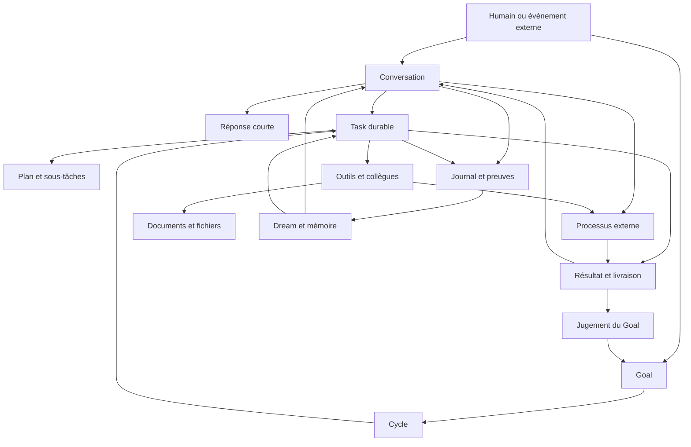
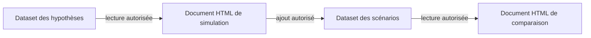

<strong>Français</strong> · <a href="../../en/reference/functional-catalogue.md">English</a>

# Galaris — catalogue détaillé des fonctionnalités et des concepts

Galaris est une plateforme auto-hébergée pour constituer une équipe d’agents IA, lui donner des
moyens d’action et suivre son travail dans la durée. Elle réunit les conversations, les tâches,
les objectifs, les documents, la mémoire, les modèles IA et les intégrations dans un système commun.
Un même agent peut discuter avec une personne, consulter ses informations autorisées, produire un
livrable, solliciter un collègue, déclencher un workflow externe et conserver les connaissances utiles.

Ce catalogue décrit les fonctionnalités présentes dans le dépôt au **26 septembre 2026**, y compris
les fonctions destinées aux agents, les écrans d’administration et les mécanismes de fond. Il est
organisé par usages, puis complété par un inventaire des fonctions MCP et une correspondance avec
**tous les modules déclarés**. Les sources de chaque domaine sont indiquées pour rendre la couverture
vérifiable et faciliter les mises à jour. Il constitue la référence exhaustive pour préparer le site web
du produit ; les guides plus courts ne remplacent pas cet inventaire.

« Disponible » signifie implémenté : l’accès effectif dépend des droits, de l’activation du module,
des connexions, du modèle et, pour un service externe, du compte configuré. Ce catalogue se fonde
sur l’implémentation actuelle et ses usages accessibles. Il décrit le logiciel, sans attester la
configuration ou la qualification de tous les fournisseurs d’une installation particulière.

La présente actualisation examine les changements des **deux derniers jours, du 24 au 26 septembre
2026**, jusqu’au commit `66a3100`, et les confronte aux contrats et tests courants. Elle complète
le catalogue précédent sans en retirer les capacités : nouveautés, changements de comportement
et conditions d’accès sont intégrés à leurs sections métier et aux inventaires.

Les inventaires couvrent **183 fonctions MCP natives, 71 modules backend et 36 modules frontend**.
Les fonctionnalités réalisées restent distinctes des intentions du
[registre des plans](../../../project/plans/README.md) ; les contrôles de
qualité figurent dans [l’exploitation](#exploitation).

## Sommaire

1. [Les concepts et leur articulation](#concepts)
2. [Prise en main et interface commune](#interface)
3. [Comptes, rôles et équipes](#comptes)
4. [Identité et gestion des agents](#agents)
5. [Modèles IA, profils et fournisseurs](#modeles)
6. [Harnais et environnements d’exécution](#harnais)
7. [Conversations et chat natif](#chat)
8. [Messageries externes et contacts](#messageries)
9. [Voix et appels en direct](#voix)
10. [Tâches, planification et collaboration](#taches)
11. [Objectifs durables](#objectifs)
12. [Mémoire et recherche de connaissances](#memoire)
13. [Documents, Datasets et applications](#documents)
14. [Dossiers thématiques](#sujets)
15. [Dream et apprentissage](#dream)
16. [Bibliothèque de compétences](#skills)
17. [Outils, connexions et serveur MCP](#outils)
18. [Fichiers et ressources](#fichiers)
19. [Recherche web et navigateur](#web)
20. [Console et environnement Linux](#console)
21. [Images, audio, musique et vidéo](#medias)
22. [Courrier électronique](#mail)
23. [Calendriers et déclenchements](#calendrier)
24. [Processus métier, n8n et webhooks](#processus)
25. [Lab IA et évaluation](#lab)
26. [Activité, coûts et incidents](#supervision)
27. [Réglages, hébergement et exploitation](#exploitation)
28. [Exemples de parcours complets](#parcours)
29. [Conditions de disponibilité et limites](#limites)
30. [Inventaire des fonctions accessibles aux agents](#mcp)
31. [Couverture des modules et sources](#couverture)

## 1. Les concepts et leur articulation

### Les objets que l’on manipule

| Concept | Ce qu’il représente | Comment il sert dans Galaris |
|---|---|---|
| **Utilisateur** | Une personne disposant d’un compte | Se connecte, gère ses préférences, dialogue, supervise ses agents et reçoit les accès accordés. |
| **Agent** | Une identité IA durable | Possède un nom, une personnalité, une fiche de poste, un manager humain, des modèles, des outils, des compétences et une mémoire. |
| **Équipe** | Un groupe d’humains et d’agents | Organise les appartenances, autorise les dialogues prévus et peut recevoir un partage documentaire. |
| **Modèle / ressource IA** | Une capacité d’inférence chez un fournisseur | Produit du texte, des embeddings, des images, une transcription, une voix ou un média selon ses capacités. |
| **Profil de modèles** | Une sélection cohérente de ressources IA | Affecte des modèles aux quatre niveaux de texte et aux usages spécialisés. Peut être courant, propre à un agent ou choisi par un humain. |
| **Modèle de décision** | Une ressource spécialisée dans les choix fermés | Choisit parmi des réponses autorisées pour le routage, les sujets ou la mémoire ; la rédaction reste confiée au modèle texte du même profil. |
| **Harnais** | Le programme qui fait travailler l’agent | Exécute la boucle modèle–outils, restitue sa progression et rend son résultat à Galaris. |
| **Tool / outil** | Une intégration ou un ensemble de capacités | Déclare ses fonctions, ses paramètres et éventuellement ses services de messagerie, de fichiers ou de réception d’événements. |
| **Connexion** | L’accès d’un agent à un Tool | Porte l’activation, la configuration, les credentials et les fonctions autorisées pour cet agent ; les connexions des quatre services système sont obligatoires et protégées. |
| **Inférence durable** | Une requête modèle conservée avant son exécution | Fige demande et autorité, conserve tentatives et résultats, permet lecture, abonnement, pause, arrêt, reprise et rejeu explicites. |
| **Skill / compétence** | Un paquet de consignes et de ressources | Explique une méthode réutilisable ; ses fichiers peuvent accompagner les instructions. Une skill ne confère pas de droit sur un Tool. |
| **Conversation / salon** | Un échange sur un canal déterminé | Conserve les messages, leurs auteurs, les fichiers, les sujets et les travaux qui en découlent. |
| **Round** | Le traitement d’un ou plusieurs messages reçus | Agrège l’entrée, exécute une réponse courte et enregistre ses actions, tentatives et livraisons. |
| **Task / tâche** | Un travail avec un résultat identifiable | Conserve une consigne autonome, un agent, des étapes éventuelles, des tentatives et un résultat durable. |
| **Plan / sous-tâche** | Une décomposition réelle du travail | Chaque étape devient un travail suivi avec ses dépendances, ses critères et ses livrables. |
| **Goal / objectif** | Une finalité poursuivie sur plusieurs cycles | Relance du travail selon une fréquence ou un objectif parent ; juge l’avancement et conserve un suivi. |
| **Cycle d’objectif** | Un passage de travail et d’évaluation | Relie une Task à un verdict et prépare la suite du Goal. |
| **Process / processus** | Une définition de traitement externe | Décrit un workflow, son moteur et son affectation ; chaque lancement crée une exécution suivie. |
| **Run / tentative** | Une exécution concrète | Permet de distinguer un essai, une reprise et une nouvelle exécution, avec leurs coûts et erreurs. |
| **Mémoire** | Une connaissance durable et gouvernée | Est recherchable, révisable, attribuée à une source et soumise à des droits. |
| **Document** | Une ressource durable de type HTML ou Dataset | Conserve une URI stable, un titre, un propriétaire, des versions et des partages ; sa page HTML peut associer texte, médias et application interactive. |
| **Dataset** | Un document contenant des données JSON | Se classe et se partage dans la même bibliothèque ; plusieurs pages peuvent lire ou alimenter le même jeu de données selon les droits et autorisations accordés. |
| **Application dans un document** | Du HTML, du CSS et du JavaScript exécutés dans la page | Permet formulaires, simulateurs et visualisations ; son accès aux Datasets exige les droits du lecteur et son accord personnel pour la version du document. |
| **Dossier documentaire personnel** | Un classement propre à un utilisateur | Organise les documents déjà accessibles sans changer leur contenu, leurs droits ni le classement des autres utilisateurs. |
| **Mémoire de pièce jointe** | Le compagnon textuel et documentaire d’un fichier joint | Conserve l’identité de la pièce jointe, ses métadonnées, les descriptions acquises et les liens avec les documents qui l’utilisent. |
| **Topic / dossier thématique** | Un sujet commun à plusieurs activités | Relie conversations, tâches, documents, souvenirs et participants au-delà d’un seul canal. |
| **Contact** | Une personne observée par un agent | Relie ses identités de messagerie et les connaissances associées dans le périmètre de cet agent. |
| **URI de ressource** | L’adresse canonique d’un objet ou fichier | Permet aux outils de lire et transmettre la même ressource sans inventer de chemin local. |
| **Dream** | Le travail de fond de la plateforme | Classe les sujets, extrait des connaissances, entretient la mémoire et, si activé, apprend des procédures. |
| **Lab IA** | L’espace d’expérimentation | Capture des cas, compare des modèles et mesure les mécanismes avec des jugements et des preuves conservés. |
| **Connaissance de Galaris** | La documentation de la version installée, recherchable par les agents autorisés | Réunit guides, navigation, architecture, décisions et plans avec leur provenance ; les plans restent identifiés comme prospectifs. |
| **Incident** | Une défaillance enregistrée | Relie l’erreur à son contexte, regroupe les occurrences et conserve le diagnostic et le correctif. |

### Du message au résultat

La conversation reste disponible pendant qu’un travail de fond avance. Un Goal ne se réduit pas
à une répétition de prompt : ses cycles relisent le suivi et les résultats antérieurs. Un Process
peut continuer dans n8n pendant que Galaris suit son état. Le document sert de support commun aux
productions successives, et la mémoire conserve les connaissances qui méritent d’être retrouvées.

La plateforme sépare **production**, **livraison** et **preuve** : un texte disant « fichier envoyé »
ne remplace pas le résultat du transport. Elle conserve l’origine des ressources, l’outil exécuté,
son résultat et, lorsqu’il existe, le reçu de livraison.

## 2. Prise en main et interface commune

- **Accueil guidé.** Les blocs de découverte contrôlent la présence d’un modèle de chat réellement
  utilisable, d’agents, d’outils, d’une connexion de messagerie active, de skills et de processus.
  Ils tiennent compte des droits et de la configuration déjà présente.
- **Aides contextuelles.** Les écrans métier expliquent les notions et parcours propres à Galaris.
  La croix et « J’ai compris » masquent durablement l’aide pour le compte courant, y compris
  sur ses autres appareils. Une erreur d’enregistrement laisse l’aide visible et permet de réessayer.
- **Navigation par domaine.** Accès au chat, aux agents, à l’activité, aux objectifs, aux documents,
  à la mémoire, aux sujets, à Dream, au Lab, aux incidents, aux processus, aux modèles et aux réglages.
  Certains domaines apparaissent comme onglets ou panneaux d’une page commune.
- **Interface français/anglais**, thème clair ou sombre et palette commune **Solaire**. La langue de
  l’interface est distincte des langues de travail des agents et des langues des contenus.
- **Repérage de l’environnement.** Les éditions développement, test, préproduction et démonstration
  possèdent un bandeau et un libellé distinctifs ; seule l’édition `dev` active le mode développement.
- **Interface adaptative.** Le mode mobile s’applique sous 1024 pixels CSS ; à partir de cette
  largeur, la disposition desktop s’applique. Les panneaux, formulaires et éditeurs s’adaptent.
- **Application installable.** La PWA peut être ajoutée à l’écran d’accueil sur Android et iPhone,
  avec une session persistante. Les nouvelles versions renouvellent le cache de l’interface et
  rechargent automatiquement les onglets après installation, en conservant les sessions.
- **Actualisation en direct.** Messages, activité, états de tâche, appels LLM et Dream utilisent
  les événements temps réel. Les abonnements ciblent les consommateurs actifs, sous contrôle
  des droits ; une reconnexion restaure les abonnements et resynchronise les vues concernées.
- **Recherche, filtres et pagination.** Les listes métier proposent les filtres adaptés : texte,
  agent, statut, période, sujet, propriétaire ou fournisseur selon le domaine. La convention des
  listes paginées est 50 lignes par défaut avec 10, 20, 50, 100 ou 500 lignes.
- **Chargement à la demande.** Les sélecteurs d’agents et de sujets chargent leurs options à
  l’ouverture, conservent les valeurs déjà choisies et permettent une nouvelle tentative après
  erreur. Les filtres concernés écartent les réponses tardives d’un ancien contexte.
- **Diagnostics compréhensibles.** Les erreurs API précisent le problème reçu, la route concernée
  et le statut HTTP disponibles ; elles distinguent aussi délai dépassé et problème réseau.
- **Attente des opérations longues.** Le client HTTP de l’interface n’impose plus de délai maximal
  général, notamment pour les analyses du Lab, transferts documentaires et opérations de harnais.
  L’annulation explicite reste possible et les réponses d’une ancienne session sont rejetées.
  Les limites propres au serveur, au fournisseur et aux proxys continuent de s’appliquer.
- **Ouverture des ressources.** Les liens internes, références de tâches et pièces jointes ouvrent
  le bon détail ou la visionneuse sous contrôle des droits ; les références et données JSON peuvent
  être copiées dans les vues d’inspection concernées.
- **Pages d’information.** La page « À propos » présente Galaris, ses fonctionnalités, crédits et
  licence. Le bas du menu donne accès à cette page et affiche la référence Git de construction
  (tag exact, sinon branche ou commit court). Bienvenue et traitement des routes inconnues
  complètent le shell applicatif.
- **Guidage documenté.** Le guide de navigation décrit les parcours par section, écran et onglet ;
  une carte générée depuis le frontend conserve routes, libellés FR/EN et conditions de visibilité.
  Les agents disposant de la connaissance du produit peuvent s’y référer pour guider l’utilisateur.

La PWA ne transforme pas les agents en logiciel autonome hors connexion : les actions métier ont
besoin du serveur Galaris et des services qu’elles utilisent.

Les vérifications de mise à jour sont réessayées même si l’indicateur réseau du navigateur reste
à tort hors ligne. Le mode développement désactive le cache PWA. Les chargements communs
d’identité, d’agents et de privilèges mutualisent les demandes concurrentes et ignorent les
réponses d’une ancienne session pour éviter les rafales de requêtes et les remplacements tardifs.

Sources : [guide utilisateur](../user/README.md), [PWA](../user/pwa.md),
[onboarding](../../../back/app/onboarding/), [shell](../../../front/app/index/),
[aides par compte](../../../back/core/user/help_service.py), [navigation](../user/navigation.md),
[carte des menus](../architecture/generated/navigation.md),
[attente HTTP](../../../front/core/apiWaiting.test.mjs).

## 3. Comptes, rôles et équipes

### Comptes et sessions

- Création du premier compte administrateur sur une instance vierge. Les inscriptions suivantes
  sont fermées par défaut ; l’administrateur peut les ouvrir dans les préférences Système.
  Un compte ainsi créé reçoit ses droits par attribution de rôle.
- Connexion, déconnexion et modification du profil. **Mes préférences** rassemble identité,
  langue, sécurité, modèles, voix, identités de messagerie et affichage documentaire du chat.
- Gestion des utilisateurs : création, consultation, modification, activation et suppression selon
  les privilèges ; protection du dernier accès administrateur.
- Nom affiché et avatar personnel : téléversement, affichage et suppression.
- Choix personnel du profil de modèles et de la voix, également administrable pour un autre compte
  par un utilisateur autorisé. Ces choix servent notamment à la dictée et à la lecture des documents.
- Second facteur **TOTP** : préparation, confirmation, consultation de l’état, désactivation et
  régénération des codes de secours. Les codes de secours sont à usage unique.
- Protection contre les tentatives de connexion répétées ; renouvellement de session par jetons
  rotatifs et révocation de la famille de sessions concernée.
- Une connexion explicite attend le chargement de l’identité avant de fermer le formulaire ;
  une erreur reste affichée et une réponse tardive d’une ancienne session ne remplace pas le compte courant.
- Gestion de tokens personnels : création avec libellé, activation, désactivation et suppression.
  Les tokens d’intégration sont distincts des tokens MCP par agent.

### Droits et rôles

Galaris applique un **RBAC**, c’est-à-dire des droits regroupés en rôles puis affectés aux personnes.
L’administration permet de gérer les privilèges, les rôles, leurs affectations et des listes de
privilèges. Un utilisateur peut sélectionner son rôle actif et son affectation par défaut selon
les possibilités qui lui sont accordées.

Les droits portent séparément sur la consultation, l’édition, l’administration et certaines actions
spécifiques. Les menus utilisent ces droits, mais les API et les accès aux ressources les vérifient
aussi. Être manager d’un agent, membre d’une équipe ou lecteur d’un document sont des relations
complémentaires : elles ne donnent pas automatiquement tous les droits d’administration.

### Équipes et autorisations de dialogue

- Créer, renommer, supprimer et réordonner des équipes ; le réordonnancement fonctionne par glisser,
  au toucher et au clavier.
- Ajouter ou retirer des humains et des agents ; chacun peut appartenir à plusieurs équipes.
- Consulter les effectifs et les membres ; rechercher les humains et sélectionner les agents.
- Deux membres partageant une équipe peuvent utiliser les dialogues autorisés par les canaux.
  Le manager conserve l’accès à ses agents ; l’administrateur disposant du droit global peut les
  contacter. Deux agents doivent partager une équipe pour dialoguer ou déléguer selon ces règles.
- Les autorisations ne se transmettent pas par un troisième membre et ne donnent pas accès aux
  conversations personnelles d’autres humains.
- Retirer un droit bloque les nouveaux échanges et les nouveaux fragments de réponse concernés.
  Une tâche déjà admise conserve son propre cycle de vie.
- Le partage d’un document avec une équipe suit les membres actuels de cette équipe. Il reste
  distinct de l’autorisation de chat.

Les appels vocaux natifs utilisent leur privilège spécifique `CHAT_CALL` dans une conversation
personnelle ; les règles d’équipes ne doivent pas être interprétées comme leur seul contrôle.

Sources : [comptes](../../../back/core/user/router.py), [autorisations](../../../back/core/authorize/router.py),
[équipes](../user/teams.md), [contrat des équipes](../../../back/core/team/contracts.py).

## 4. Identité et gestion des agents

Un agent garde son identité à travers les conversations, les tâches et les changements de modèle.
Sa fiche permet de renseigner :

- son code système stable, son prénom obligatoire, son nom facultatif, sa civilité et son avatar ;
- son intitulé de poste, sa fiche de poste et sa personnalité en texte enrichi ;
- son manager humain et ses appartenances aux équipes ;
- son profil de modèles, sa voix et son harnais d’exécution ;
- ses connexions aux outils, ses compétences autorisées et son accès MCP.

Un agent peut porter seulement un prénom. La création et les modifications refusent un prénom
vide ou composé d’espaces ; le nom peut être omis ou effacé sans empêcher l’enregistrement.

Les fiches, avatars et civilités sont administrables selon les droits. Le code permanent sert aux
intégrations et aux espaces de travail ; il ne change pas après création. Les sélecteurs d’agents
filtrent selon l’action : agents administrables pour une modification, interlocuteurs autorisés
pour un chat, membres possibles pour une équipe.

Les civilités standard suivent la langue de l’interface ; les libellés personnalisés restent
ceux saisis par l’administrateur. Leur initialisation préserve les suppressions et personnalisations.

Les agents peuvent découvrir les collègues disponibles et lire leur fiche détaillée avec les
outils `agent_list` et `agent_get`. Une délégation conserve l’auteur de la demande et le destinataire ;
elle ne transforme pas silencieusement l’agent exécutant en un autre agent.

Les résultats de l’annuaire exposent aussi une URI `galaris://agent/<id>` permettant de relire
le profil courant, notamment sa fiche de poste et sa personnalité, sous les droits applicables.

La fiche donne également accès au statut du harnais, aux opérations de cycle de vie disponibles,
aux logs et aux tâches qui empêchent un changement d’environnement. Elle fournit l’URL MCP et les
tokens à utiliser pour connecter un client externe au périmètre de cet agent.

### Assistant Galaris proposé à l’installation

Un agent **Galaris** est proposé une seule fois, avec une mission d’aide à la compréhension,
à la configuration et à l’administration de la plateforme. Il utilise le **harnais interne**,
suit le **profil LLM courant** et dépend du premier administrateur actif. Sur une installation
vierge, sa création attend l’inscription de cet administrateur ; une installation existante
reçoit également la proposition à la synchronisation de la base.

Ses connexions et compétences ordinaires sont initialisées. Sa connexion **Galaris Admin** est
activée lors de cette création, notamment pour consulter la documentation ; elle peut aussi
autoriser les inspections d’exécution selon les fonctions accordées. Ce cas diffère du défaut
inactif de cette connexion pour les autres agents. Les skills `galaris-knowledge` et `galaris-lab`
sont autorisés individuellement pour cet assistant à sa création, tout en restant désactivés
globalement. La connexion Lab reste inactive : disposer du skill ne suffit pas à exécuter ses outils.

L’agent reste entièrement personnalisable : identité, mission, profil, harnais et autorisations.
Les synchronisations suivantes préservent ces choix, les révocations et sa suppression ; elles ne
le recréent pas après renommage ou suppression dans l’application. Si le code `galaris` existe
déjà, un suffixe permet de créer la proposition sans modifier l’agent préexistant. L’assistant
exige toujours un modèle utilisable et les connexions nécessaires pour agir.

Sources : [schémas Agent](../../../back/app/agent/schemas.py),
[API Agent](../../../back/app/agent/router.py), [interface Agent](../../../front/app/agent/),
[initialisation](../../../back/app/agent/defaults.py),
[garanties de personnalisation](../../../back/app/agent/tests/test_default_agent.py).

## 5. Modèles IA, profils et fournisseurs

### Connecter et inventorier des ressources IA

L’administration des modèles permet de :

- choisir un fournisseur dans le catalogue ou définir un serveur compatible personnalisé ;
- configurer son URL, ses paramètres, son authentification et son activation ;
- tester la connexion, découvrir ses modèles et ressources, puis sélectionner celles à utiliser ;
- enregistrer un code Galaris stable, un libellé, le nom technique du modèle et ses capacités ;
- consulter ou renseigner contexte maximal, modalités d’entrée/sortie et informations tarifaires ;
- distinguer les ressources texte, décision, vision, documents, embeddings, images, transcription, voix,
  analyse audio/vidéo, musique, bruitages et génération vidéo ;
- récupérer des métadonnées tarifaires disponibles ; le bridge `models_dev` enrichit le catalogue ;
- installer ou supprimer un modèle lorsque le fournisseur expose cette gestion, notamment Ollama ;
- connecter et déconnecter l’authentification par code d’appareil pour le profil qui la prend en charge.

Une capacité déclarée par un fournisseur n’est pas une promesse pour tous ses modèles : le catalogue
et la ressource choisie déterminent les fonctions effectivement disponibles.
Une même ressource peut cumuler plusieurs capacités, par exemple texte, vision et documents ;
leur sélection est conservée lors de l’enregistrement et de la réouverture du modèle.

Le catalogue du fournisseur propose un sélecteur de type de ressource, incluant **Documents / PDF**
et **Décision**. Le filtre documentaire retient les modèles déclarant des **fichiers en entrée et
du texte en sortie** ; des métadonnées incomplètes peuvent masquer un modèle compatible. La
découverte multimodale conserve toutes les capacités d’un même modèle ; le rafraîchissement
explicite permet de renouveler les métadonnées disponibles.

La page **Fournisseurs & Modèles** s’ouvre par défaut sur **Fournisseurs**, sauf si le lien demande
un autre onglet autorisé. L’onglet **Modèles utilisés** conserve la configuration des profils et
le configurateur de clients externes ; le bloc explicatif déroulant sur l’accès API par profil
a été retiré, sans supprimer l’API ni les configurations de clients.

### Configuration initiale facultative OpenRouter

Une **installation neuve** reçoit un fournisseur OpenRouter sans clé API, neuf modèles et un
profil **Défaut** prérempli. Cette proposition ne fait aucun appel réseau et ne fournit aucun
compte, secret ou tarif propre à une installation. Il faut configurer l’accès au fournisseur ou
remplacer les affectations avant de pouvoir utiliser les ressources concernées.

| Ressource livrée dans la configuration | Affectation initiale |
|---|---|
| DeepSeek V4.1 Flash | Les quatre niveaux texte et la vision |
| GPT 5.4 Nano | Documents |
| Whisper large v3 | Transcription |
| MiniMax Hailuo 3 Max | Génération vidéo |
| Google Lyria 3 Clip Preview | Génération musicale |
| TypeSafe Jev 1.13 | Décision |
| Qwen3 Embedding 4B | Embeddings |
| Google Nano Banana Pro / Gemini 3 Pro Image | Génération d’images |
| NVIDIA Nemotron 3 Nano Omni (free) | Compréhension audio et vidéo |

Les niveaux texte ont respectivement les efforts `none`, `low`, `medium` et `high`. Le repli
des décisions vers le texte est autorisé initialement. Ce tableau décrit les références
enregistrées par Galaris, sans garantir leur disponibilité commerciale distante.

La proposition appartient ensuite à l’administrateur : modifications, renommages et suppressions
sont conservés. **Les bases existantes ne sont pas préremplies.** Pour supprimer le dernier profil,
il faut d’abord en créer un remplaçant, éventuellement vide. Les prix peuvent être actualisés
avec le mécanisme habituel du fournisseur.

### Profils et choix des modèles

Créer plusieurs profils permet de changer une politique de modèles sans reconfigurer chaque agent.
Un profil peut devenir le **profil courant**, être sélectionné explicitement par un agent ou être
choisi dans les préférences d’un humain.

Les modèles texte sont répartis en quatre niveaux communs :

| Niveau | Usages courants affectés par le code |
|---|---|
| **Ultra low** | Mécanismes Dream utilisant un modèle |
| **Low** | Dispatcher et conversations courtes |
| **Standard** | Exécution standard, suivi des Goals et mécanisme Briefing conservé |
| **High** | Exécution high, Planner et Lab |

Chaque niveau peut aussi porter un **effort de raisonnement**. Ce réglage du fournisseur est distinct
de la complexité `standard` ou `high` de la Task. Les usages spécialisés disposent de leurs propres
sélections : vision, documents, audio, vidéo, génération sonore, musicale et vidéo, images,
transcription et embeddings. La voix se choisit sur l’agent ou l’utilisateur.

Le profil comporte également une sélection **Décision**, facultative et réservée aux ressources
annonçant cette capacité, avec sa politique de repli. Les niveaux texte du tableau restent les
modèles génératifs utilisés en l’absence de spécialisation ou lorsque le traitement doit rédiger.

**Un profil explicitement sélectionné est exclusif.** S’il manque une ressource, Galaris ne la prend
pas silencieusement dans un autre profil. Sans sélection particulière, l’agent ou l’humain suit le
profil courant. L’interface permet de créer, modifier, supprimer et activer les profils.

Les appels texte passent par **Pydantic AI**, ses profils SDK et les contraintes de l’endpoint
pour adapter raisonnement, plafonds de tokens et échantillonnage. Un routeur ne reçoit pas un
profil deviné à partir du préfixe d’un modèle ou emprunté arbitrairement à un autre fournisseur.
Les extensions inconnues sont transmises au fournisseur. Un refus explicite de paramètre avant
génération peut autoriser le retrait du réglage optionnel concerné, puis un nouvel essai borné.
Cette négociation ne retire ni messages, ni outils, ni budget, ni format de sortie ; un timeout,
un quota ou un flux partiel ne déclenche pas ce retrait. Les incompatibilités fonctionnelles
restent des erreurs explicites. L’activité conserve l’effort demandé même si sa valeur est
traduite. La [matrice des paramètres](../dev/provider-parameters.md) décrit les contrats vérifiés
par des transports simulés, sans appel facturable aux services externes.

### Décisions spécialisées et repli gouverné

Le modèle Décision traite des questions à choix fermés et ses réponses sont validées avant
application. L’adaptateur disponible passe par OpenRouter ; une ressource limitée aux décisions
n’est pas utilisable comme modèle de chat. Sans sélection Décision, les parcours texte existants
restent utilisables, y compris avec un unique modèle local.

| Parcours | Rôle de Décision | Rôle conservé pour le texte ou les règles |
|---|---|---|
| Dispatcher Task et admission des pairs IA | Choisir parmi les routes, efforts et autres choix autorisés | Droits, politique du harnais et choix déterministe sans appel si une seule route/effort reste possible |
| Sujets des activités et messages | Réutiliser un sujet, détecter une continuité ou demander un nouveau dossier | Rédiger le titre, la description et les mots-clés d’un nouveau sujet ; appliquer la politique de création |
| Extraction Memory par Dream | Ignorer une source sans fait durable, rattacher des faits déjà couverts ou demander l’extraction | Rédiger et valider les connaissances nouvelles ou incomplètement couvertes |
| Acquisition Memory | Confirmer l’équivalence complète avec un candidat proche | Recherche, droits, conservation des faits et rattachement idempotent de provenance |

Planner, Briefing, suivi de Goal et apprentissage restent génératifs. Les règles déterministes de
maintenance et de transition n’ajoutent pas d’appel de décision.

La politique **repli texte en cas d’échec** peut autoriser un seul appel au modèle du **même
profil** : niveau low pour le dispatcher, ultra low pour Dream. Elle peut être désactivée.
Un profil personnel sans spécialisation n’emprunte pas celle du profil global. Les refus
d’authentification, d’autorisation ou de paiement, l’annulation, l’arrêt et la perte de lease ne
deviennent pas un contournement par un autre modèle. Une confiance faible ne déclenche pas à elle
seule un repli ; les probabilités absentes ne sont jamais inventées.

La requête durable fige les choix, modèles et paramètres. La trace distingue l’appel spécialisé
du repli éventuel, conserve leurs coûts et précise l’origine de la réponse et la raison du repli.
Une reprise refuse une configuration de modèle ou de connexion devenue incompatible. Il n’y a
pas de délai propre à Décision imposé par défaut ; les échéances explicites et limites du workflow
restent appliquées. Le gain de qualité, de coût ou de rapidité se mesure dans le Lab : une décision
suivie d’une rédaction peut ajouter un appel.

Sources : [décisions par profil](../../../back/app/llm/profile_decisions.py),
[inférence spécialisée](../../../back/app/llm/decision_service.py),
[garanties des workflows](../../../back/tests/test_decision_workflows.py),
[configuration initiale](../../../back/app/llm/initial_configuration.py).

### Fournisseurs présents dans le dépôt

| Intégration | Rôle dans Galaris |
|---|---|
| **OpenAI API** | Modèles et services IA exposés par le bridge, dont texte, médias et temps réel selon la ressource. |
| **OpenAI Codex par authentification d’appareil** | Connexion personnelle distincte de la clé API ; règles d’autorité liées au propriétaire humain. |
| **Anthropic API** | Accès aux modèles Anthropic via le contrat de fournisseur. |
| **Google Gemini** | Modèles multimodaux et services déclarés, dont génération d’images, embeddings et voix selon ressource. |
| **Google Cloud TTS** | Catalogue et synthèse vocale dédiés. |
| **OpenRouter** | Accès multi-modèles, découverte et services multimodaux enregistrés. |
| **Mammouth AI** | Texte, vision, embeddings, images et compréhension audio/vidéo intégrés au catalogue. |
| **DeepSeek** | Modèles texte et adaptation de protocole selon le modèle. |
| **Fireworks** | Modèles texte, vision, images et embeddings déclarés. |
| **Groq** | Inférence texte/vision et transcription déclarées. |
| **Mistral** | Texte, vision et embeddings déclarés. |
| **Together, Cerebras, xAI, NVIDIA, Hugging Face, Cohere, Perplexity** | Bridges dédiés pour découverte, adaptation des modèles et capacités propres à chacun. |
| **ElevenLabs** | Synthèse, transcription, génération musicale et bruitages selon le service sélectionné. |
| **SunoAPI.org** | Service tiers de génération musicale et sonore ; compte distinct d’un abonnement Suno. |
| **BytePlus LAS** | Génération vidéo, notamment via Seedance. |
| **Azure Speech** | Synthèse vocale avec configuration régionale. |
| **Ollama** | Modèles locaux, découverte et gestion des modèles. |
| **models.dev** | Métadonnées de modèles ; ce n’est pas un moteur d’exécution. |

Les intégrations sont détaillées dans les [bridges fournisseurs](../architecture/flows/llm-provider-bridges.md).
Les capacités commerciales, quotas et modèles disponibles restent ceux du compte externe configuré.

### Utiliser Galaris comme passerelle de modèles

Galaris expose des façades compatibles avec **Chat Completions**, **Responses** et **Messages
Anthropic**, avec découverte de modèles et comptage de tokens sur la façade Anthropic. Des clients
externes, dont Claude Code, peuvent ainsi utiliser les modèles configurés tout en conservant la
traçabilité Galaris.

Les codes de modèles explicites sont prioritaires. Des alias de familles ou de niveaux peuvent se
résoudre vers les quatre niveaux du profil : Haiku vers ultra low ; Sonnet/Luna vers low ;
Opus/Terra vers standard ; Fable/Sol vers high. Ce sont des correspondances Galaris, pas une
équivalence universelle entre les produits portant ces noms.

Les abonnements personnels conservent leur propriétaire. Le contrôle suit l’utilisateur à l’origine
du travail et ses délégations ; une identité technique ne permet pas d’emprunter l’abonnement
personnel d’un autre utilisateur. Le suivi distingue coût d’inférence, coût facturé ou estimé,
usage sous abonnement et éventuelles données manquantes.

L’utilisation de la connexion personnelle ChatGPT exige une confirmation explicite enregistrée
dans la configuration du fournisseur. Sa révocation bloque les appels, même si l’authentification
est encore connectée ; un changement de propriétaire exige une nouvelle confirmation.

### Limites de l’abonnement ChatGPT

La configuration du fournisseur connecté par authentification d’appareil affiche les fenêtres
d’utilisation renvoyées par le compte ChatGPT : **pourcentage consommé**, durée de la fenêtre et
date de réinitialisation lorsqu’elles sont disponibles. L’heure de vérification et une action
d’actualisation permettent de distinguer la donnée consultée d’un suivi permanent.

Ces limites portent sur **l’ensemble du compte**, y compris ses usages hors de Galaris. Leur
consultation ne lance pas d’inférence. Elle exige les droits d’administration du fournisseur,
un titulaire valide et une authentification utilisable. Une erreur ou une fenêtre absente est
signalée comme indisponible, sans fabriquer un quota de remplacement. Cette vue ne constitue
ni un budget par agent ni une mesure de la facture des modèles API.

Sources : [lecture des quotas](../../../back/bridge/openai/codex_quota.py),
[contrôles et erreurs](../../../back/bridge/openai/tests/test_quota.py).

### API publiques fondées sur les profils

Chaque profil possède un **Code API stable**, généré à sa création et conservé lors d’un renommage.
Les profils existants reçoivent ce code à la synchronisation de la base. Le client choisit un
usage du profil plutôt qu’un fournisseur concret ; une nouvelle affectation s’applique aux appels
suivants, sans rediriger un appel déjà admis.

| Sélecteur de modèle | Usage |
|---|---|
| `<profil>/text/ultra-low`, `<profil>/text/low` | Niveaux texte ultra low et low |
| `<profil>/text/standard`, `<profil>/text/high` | Niveaux texte standard et high |
| `<profil>/text/default` | Alias du niveau standard |
| `<profil>/embedding/default` | Modèle vectoriel du profil |
| `<profil>/decision/default` | Modèle de décision du profil |

Les URL communes sont `/api/profile/openai` et `/api/profile/anthropic`. Leurs catalogues
`/models` et `/v1/models` présentent les affectations disponibles de **tous les profils**, y compris
ceux qui ne sont pas courants ; `/api/profile/models` inclut aussi les usages spécialisés.
L’authentification utilise un **jeton API utilisateur** avec le droit d’accès à l’API LLM,
transmis en Bearer dans les deux protocoles.

- **Texte :** Chat Completions, Responses et compaction selon le support du fournisseur ; Messages
  et comptage de tokens côté Anthropic. Réponses ordinaires et flux restent disponibles.
- **Embeddings :** `/api/profile/openai/embeddings` accepte un texte ou de 1 à 2 048 textes non
  vides, conserve leur ordre et restitue l’usage disponible. Les formats sont `float` ou `base64` ;
  les dimensions dépendent du fournisseur. Les entrées déjà tokenisées ne sont pas acceptées.
- **Décisions :** `/api/profile/decisions` accepte les questions et critères fermés, puis renvoie
  les choix et leur origine spécialisée ou texte. Un échec récupérable peut utiliser le
  `text/standard` du même profil si la politique l’autorise ; la raison du repli est conservée.

Un usage absent, indisponible ou incompatible avec le protocole produit une erreur, sans emprunt
à un autre profil. Les messages et résultats d’outils fournis par un client utilisateur restent
du contenu : une URI de Task ou un nom de modèle dans ce contenu ne modifie ni le routage ni
la corrélation de l’appel. Les routes historiques `/api/llm/openai` et `/api/llm/anthropic` restent
disponibles pour les codes des modèles concrets.

### Préparer un client externe depuis l’interface

Depuis les usages LLM ou la page des jetons utilisateur, le configurateur **Claude Code / Codex**
propose les profils et niveaux texte actuellement disponibles. Il génère le contenu à copier
pour `.claude/settings.json` ou `~/.codex/config.toml`, avec l’URL de l’instance et le sélecteur
choisi. Le placement du secret est présenté séparément : configuration locale Claude Code ou
variable `GALARIS_API_TOKEN` pour Codex. Aucun secret existant n’est inséré dans le modèle de fichier.

La configuration Codex utilise Responses ; celle de Claude Code utilise Messages et affecte les
alias de familles aux niveaux du profil. Dans le fichier Claude généré, un niveau non configuré
reprend explicitement le modèle choisi ; cela ne crée aucun repli implicite côté serveur.
L’utilisateur fusionne ces extraits avec sa configuration locale. Le configurateur permet de
réessayer un chargement échoué et signale l’absence de modèles disponibles.

Sources : [API par profil](../user/profile-api.md), [guide Codex](../user/codex.md),
[guide Claude Code](../user/claude-code.md),
[garanties des passerelles](../../../back/tests/test_profile_gateway.py),
[configurations client](../../../front/browser-tests/client-config.spec.mjs).

### Inférences durables : lancer, suivre et contrôler une requête

Les requêtes texte, structurées et de protocole peuvent être enregistrées comme **inférences
durables** avant leur exécution autonome. Chaque inférence conserve la requête figée, l’autorité
du demandeur, ses corrélations, ses tentatives, les appels physiques au fournisseur et leurs
résultats. Les contrats de sorties structurées ont une clé versionnée, un schéma et un contexte
de validation ; un contrat inconnu ou incompatible est refusé.

| Action | Comportement observable |
|---|---|
| Créer | Admettre et persister la requête avant le travail du worker ; réutiliser une identité d’admission exige la même requête et la même autorité. |
| Lire | Retrouver requête, état, tentatives, résultat et coûts sans relancer le modèle. |
| S’abonner | Relire les messages persistés et suivre la tentative jusqu’à son unique résultat terminal ; reprendre depuis un curseur après déconnexion. |
| Mettre en pause | Interrompre la tentative, y compris si le fournisseur ne produit aucun fragment. |
| Arrêter | Demander l’arrêt en conservant les messages et résultats déjà enregistrés. |
| Reprendre | Créer une nouvelle tentative d’une inférence suspendue ou interrompue, à partir de la requête figée. |
| Rejouer | Créer une autre inférence liée à l’originale, sans réécrire l’histoire de celle-ci. |

L’API authentifiée `/api/llm/openai/inferences` expose création, lecture, commandes et flux SSE.
Elle vérifie le demandeur ou son périmètre de gestion. Les commandes possèdent des identifiants
idempotents. Les réponses Chat/Responses exposent `X-Galaris-Inference-Id` pour retrouver
l’inférence associée.

Fermer l’abonnement d’une inférence autonome ne l’annule pas. Les adaptateurs synchrones et HTTP
ordinaires conservent leur propre contrat d’annulation lors de l’abandon de l’appel. Une perte
de lease ferme les appels abandonnés et rejette les écritures tardives, sans relancer implicitement
le fournisseur. Les résultats des anciennes tentatives restent immuables et leurs traces sont
préservées pour la relecture.

La préparation des traces volumineuses ne conserve plus le verrou de finalisation des appels :
le journal peut continuer à enregistrer la progression et renouveler le lease pendant cette
préparation. Cette garantie de concurrence est couverte par les
[tests du cycle d’inférence](../../../back/tests/test_inference_lifecycle.py).

La reprise soumet de nouveau la requête et peut être facturée : elle ne reprend pas le calcul
interne du fournisseur token par token. Cette couche n’exécute pas d’effets d’outils. La création
différée, une échéance globale et la généralisation de ce cycle de vie aux médias ne sont pas
annoncées comme réalisées.

Sources : [contrats d’inférence](../../../back/app/llm/contracts.py),
[façade](../../../back/app/llm/facade.py),
[décision sur le cycle de vie durable](../../../project/decisions/0097-durable-inference-lifecycle.md).

### Appeler un agent depuis un client compatible et utiliser Janus

Une seconde façade compatible expose les **agents eux-mêmes comme modèles**, avec leur code,
leurs droits et leur exécution adossée à une Task. Le client peut transmettre un historique et
recevoir une réponse JSON ou un flux SSE. Les appels issus d’un Process peuvent être corrélés au
workflow. Cette façade est distincte du proxy qui appelle seulement un modèle LLM.

**Janus** est la porte d’entrée de ce parcours : il présente les agents accessibles, accepte une
sélection par `@code` ou `#code`, puis transmet l’échange à l’agent choisi. On peut changer d’agent,
utiliser `/reset` ou `/restart` pour revenir à la sélection et configurer des alias du modèle Janus.
Le routage peut retrouver la sélection dans l’historique quand le client ne conserve pas
l’identifiant de conversation. Le guide des préférences fournit l’URL et l’authentification par
token personnel.

Sources : [API des agents et Janus](../../../back/app/agent/openai_router.py),
[routage Janus](../../../back/app/agent/janus.py), [catalogue et API](../../../back/app/llm/provider_router.py),
[profils](../../../back/app/llm/profile_schemas.py), [affectation des usages](../../../back/app/llm/model_usages.py),
[politique d’abonnement](../../../back/app/llm/subscription_policy.py), [Claude Code](../user/claude-code.md).

## 6. Harnais et environnements d’exécution

Le harnais est remplaçable sans déplacer les responsabilités de Galaris : identité, admission,
droits, tâches, mémoire et résultat durable restent sous le contrôle de la plateforme.

| Harnais | Fonctionnement et possibilités |
|---|---|
| **Interne Pydantic AI** | Boucle d’exécution native, outils chargés à la demande, modèles résolus par Galaris, streaming, annulation, historique et checkpoints d’effets. Aucun conteneur de harnais à provisionner. |
| **Hermès** | Runtime autonome isolé par agent, modèles servis par la passerelle Galaris dans le mode géré actuel, configuration et fichiers dédiés, skills projetées, mémoire commune et console. |
| **Claude Agent** | Instance du SDK Claude Agent par agent, reliée à la passerelle Anthropic et au MCP Galaris ; progression des outils, réponse finale et usage corrélés. |
| **Codex** | Runtime Codex géré par son bridge, relié aux contrats de modèles et d’outils Galaris ; exécution et télémétrie normalisées. |
| **DeepSeek Harness** | Instance DSH par agent avec adaptation de son protocole vers l’exécution commune ; streaming des messages/outils et résultat terminal. |
| **Serveur distant compatible Chat Completions** | Entrée configurable du catalogue : URL, modèle, authentification et test de découverte. Les capacités restent celles exposées par ce serveur. |

### Catalogue et cycle de vie

- Consulter le catalogue commun et les providers de harnais ; ajouter les configurations distantes
  prises en charge, les modifier, les tester, les activer ou les retirer.
- Sélectionner une entrée réutilisable pour un agent ; chaque agent conserve son affectation et
  son instance propres. Revenir au harnais interne est possible.
- Consulter disponibilité, état, erreurs, actions autorisées et logs.
- Créer/recréer, démarrer, arrêter, mettre à jour ou rafraîchir un runtime selon les capacités du
  provider et son état. Les opérations longues se poursuivent en arrière-plan.
- Voir les tâches qui bloquent un changement de harnais ; les tâches suspendues peuvent faire
  l’objet d’une terminaison explicite avant changement.
- Projeter les paramètres, les skills, l’endpoint MCP et les tokens système nécessaires ; la
  configuration distingue les défauts du provider et les personnalisations d’agent.
- Administrer les fichiers de configuration et de runtime lorsque le provider les expose.

La sélection d’un harnais conteneurisé n’installe pas automatiquement son environnement. Une
recréation ou un remplacement peut supprimer l’ancien conteneur et ses données : le parcours
l’indique et les tâches non terminées empêchent une transition concurrente. Les providers externes
admettent actuellement un run simultané par instance ; le harnais interne suit les limites du
scheduler. Une capacité non déclarée ne devient pas disponible par simple sélection du harnais.

Les conteneurs gérés passent par le **Harness Manager**, qui applique les définitions Compose,
contrôle les actions autorisées et fournit diagnostics et fichiers. Les tokens système tournants
évitent de distribuer les credentials des connexions métier aux runtimes qui passent par Galaris.

Les préférences distinguent harnais interne, harnais managés et serveurs externes. Le raccordement
au manager se configure dans l’interface : URL du service, adresse de retour vers Galaris et clé
partagée chiffrée. Le diagnostic vérifie la connexion et compare les versions. L’administrateur
peut préparer et télécharger son fichier de configuration ou une archive d’installation complète.
Ces exports préparent l’installation du service hôte sans exécuter de commande distante.

Le manager dispose de sa propre mise à jour authentifiée : contrôle de version et d’intégrité,
conservation de sa configuration et des instances, sauvegarde du code et tentative de restauration
en cas d’échec. Cette opération ne reconstruit pas les conteneurs des agents et refuse une rétrogradation.

Les runtimes externes sont épinglés dans leurs images. DeepSeek Harness utilise explicitement
le protocole **Chat Completions** pour communiquer avec la passerelle Galaris. Voir le
[guide DeepSeek Harness](../components/deepseek-harness.md).

### Capacités effectives et choix d’exécution

Le descripteur commun distingue les capacités implémentées, configurées, vérifiées pour la cible
et réellement effectives. L’ensemble effectif est leur intersection ; activer une option ne crée
pas une capacité absente du runtime.

| Harnais sélectionné | EXEC standard | EXEC high | PLAN high | BRIEFING |
|---|---|---|---|---|
| Interne | Oui | Oui | Oui | Désactivé |
| Hermès géré | Oui | Oui | Non | Non |
| Codex géré | Oui | Oui | Non | Non |
| Claude Agent géré | Oui | Oui | Non | Non |
| DeepSeek Harness géré | Oui | Oui | Non | Non |
| Serveur compatible générique, dont un runtime externe avec sa propre API | Oui | Non | Non | Non |

Le mode high exige que l’exécution utilise la sélection de modèle et le journal d’appels LLM de
Galaris. Les quatre runtimes gérés imposent actuellement cette passerelle ; ils n’annoncent pas
un mode utilisant leur propre abonnement indépendant. La capacité native d’un SDK à choisir son
raisonnement ne suffit pas à déclarer high dans Galaris. La conversation courte conserve son
contrôleur propre, indépendant du harnais affecté aux Tasks.

### Pièces jointes comprises directement par le modèle

Le harnais interne peut transmettre directement au modèle les **images, audios, vidéos et PDF**
des messages courants et de l’historique retenu. Un agent peut ainsi examiner un média reçu sans
appeler systématiquement un outil d’analyse séparé. Le chat et les Tasks qui utilisent ce harnais
partagent ce comportement ; les médias conservent leur message d’origine et leur URI canonique.

La prise en charge dépend à la fois du modèle sélectionné, du fournisseur et des formats que son
transport sait transmettre. Les entrées audio/vidéo natives utilisent le même modèle via le
protocole compatible ; la vidéo native exige un adaptateur fournisseur déclaré, notamment celui
d’OpenRouter. Cette capacité ne s’étend pas automatiquement à tous les harnais externes ni aux
formats simplement annoncés par un fournisseur.

Les ressources sont relues sous les droits de l’agent, dans un budget total d’octets, avec priorité
aux messages courants puis à l’historique récent. Une même URI n’est matérialisée qu’une fois dans
la préparation ; les temporaires sont nettoyés et une reprise réutilise les médias conservés dans
son checkpoint. Un refus, un format incompatible ou une taille excessive est signalé au modèle.
Les outils Image, Audio et Multimedia restent disponibles pour les analyses dédiées, la conservation
des descriptions/transcriptions et les replis. Une URI citée dans du texte ne déclenche pas à elle
seule le téléchargement d’un média.

Sources : [flux des médias](../architecture/flows/media-resources.md),
[capacités natives effectives](../../../back/app/llm/native_media.py),
[tests du parcours multimodal](../../../back/app/harness/tests/test_native_media.py).

### Politique, annulation et acceptation du résultat

- Un formulaire commun configure les politiques de tous les providers, y compris le harnais
  interne : capacités gouvernables, durée d’exécution, inactivité, fermeture et volumes.
- Les mises à jour de politique sont protégées par une révision ; elles exigent les droits de
  paramètres et de gestion globale. Les limites plus strictes du runtime restent applicables.
- Un résultat terminal est retenu jusqu’à la fermeture normale du stream et son nettoyage.
  Une absence ou duplication de résultat, un événement postérieur, une exception ou un blocage
  de fermeture provoque un échec avant de publier un succès contradictoire.
- Le budget cumulé du stream compte les messages et le résultat émis. Les sauvegardes de
  progression et checkpoints sont bornées individuellement, sans recompter tout leur historique
  à chaque sauvegarde. Un refus précise la surface, le volume et le plafond concernés.
- L’annulation distingue demande, confirmation et issue inconnue, ainsi que portée locale et
  distante. L’acceptation de la demande ne prouve pas l’arrêt distant ; le transport générique
  ne déclare pas un protocole d’annulation qu’il ne possède pas.
- Chaque driver interprète ses propres checkpoints. Une reprise est sûre, à réconcilier ou
  interdite ; une identité incompatible, une enveloppe invalide ou l’absence de preuve requise
  empêche un redémarrage automatique. Une modification de la consigne conserve les preuves d’effets.

Sources complémentaires : [contrat commun de harnais](../../../project/decisions/0100-harness-capability-and-recovery-contract.md),
[choix du dispatcher](../../../project/decisions/0102-harness-dispatch-choices.md).

Sources : [contrats](../../../back/app/harnesses/contracts.py), [API](../../../back/app/harnesses/router.py),
[manager](../components/harness-manager.md), [Hermès](../components/hermes.md),
[Claude Agent](../components/claude-agent.md), [Codex](../../../back/bridge/codex/),
[DeepSeek Harness](../components/deepseek-harness.md).

## 7. Conversations et chat natif

### Échanger au quotidien

Le chat natif sert aux conversations **entre un humain et un agent**. L’utilisateur peut :

- choisir un agent autorisé et créer plusieurs conversations nommées ;
- démarrer une conversation depuis l’action de création visible même lorsque la liste est vide ;
- rechercher et parcourir ses conversations, changer leur libellé et afficher ou masquer
  l’aperçu du dernier message ;
- archiver ou désarchiver une conversation, la rendre silencieuse et suivre les non-lus ;
- écrire un message, répondre à un message précis et utiliser le sélecteur d’émojis,
  qui conserve les émojis fréquents ;
- joindre des fichiers, envoyer une note vocale ou utiliser la dictée pour composer du texte ;
- choisir un effort de raisonnement pour le message et demander explicitement une Task ;
- lire la réponse au fil de sa production et consulter les étapes d’activité autorisées ;
- répondre aux demandes de choix ou d’approbation par des boutons localisés ; la réponse retenue
  reste dans l’historique avec son auteur et l’option choisie, et une interaction résolue ne peut
  plus être validée une seconde fois ;
- écouter les messages avec une synthèse vocale disponible ;
- consulter les aperçus de liens et les pièces jointes dans leurs lecteurs ;
- affecter un sujet à une conversation ou corriger celui d’un message, avec l’option
  d’étendre la correction aux messages suivants du même sujet ;
- retrouver les tâches, documents et processus liés à cette conversation dans des panneaux dédiés,
  et créer un document de travail depuis la conversation.

L’écran Discussion peut aussi afficher les conversations externes liées aux identités de
l’utilisateur, avec une option pour les masquer. Le mode de supervision « Voir les conversations
de » permet de consulter le périmètre d’un agent autorisé avec le privilège dédié ; les actions
restent soumises aux droits et au caractère éventuellement non modifiable de la conversation.
La disposition permet de redimensionner les colonnes et de retrouver le dernier message.

Le panneau latéral organise **Conversations, Documents, Tâches et Processus**. Une rubrique
s’ouvre lorsqu’elle reçoit des éléments et se replie lorsqu’elle devient vide ; un repli manuel
est conservé lors des actualisations ordinaires. Les actions de création de conversation et
de document restent accessibles dans les en-têtes, même repliés, selon les droits. Les filtres
de conversations — Moi/agents, recherche, externes et archives — sont masqués au départ et
peuvent être affichés ou masqués sans perdre leurs valeurs.

Le panneau Tâches réunit les travaux liés aux messages affichés et leurs sous-tâches, ainsi que
les tâches en cours, en file ou en attente automatique de l’agent, même créées ailleurs ou avant
les messages visibles. Il fonctionne aussi dans une conversation vide. Les travaux extérieurs
terminés, supprimés ou en pause manuelle ne sont pas ajoutés. La liste s’actualise en direct,
ouvre les détails autorisés et conserve un indicateur d’état sur une tâche repliée.
Le document affiché est repéré dans la liste ; les aperçus restent visibles et les icônes de
cette liste sont consultables sans modification depuis le Chat.

Les marqueurs de lecture sont persistés côté serveur. Les **notifications Web Push**, lorsqu’elles
sont configurées et autorisées par le navigateur, avertissent des nouveaux messages. La consultation
d’un message ou du salon peut retirer une notification encore en attente. La mise en sourdine et
les droits courants continuent de s’appliquer.
L’installation génère et conserve ses clés de notification ; le contact et le délai d’envoi
sont réglables dans les préférences du Chat.

### Travailler sur un document pendant la conversation

La recherche documentaire, les documents liés et les aperçus de messages ouvrent le composant
documentaire complet dans le chat. À partir de 1024 pixels CSS, il apparaît à côté ou au-dessous
de la discussion, avec séparateurs manipulables à la souris, au toucher et au clavier. Le mode
côte à côte conserve une largeur documentaire exploitable et bascule vers l’empilement si
l’espace manque. La barre latérale reste disponible. Sur mobile, le document s’ouvre en dialogue.

Pour les aperçus documentaires des messages, **Mes préférences** permet de choisir l’ouverture
en panneau intégré, proposée par défaut sur desktop, ou en dialogue. Une action dédiée permet
aussi d’ouvrir ponctuellement le dialogue ; le mobile conserve cette présentation.

Le même éditeur applique les mêmes droits et sauvegardes que la bibliothèque. Avant d’envoyer
un message, le chat attend l’enregistrement des modifications et ajoute au contexte l’URI du
document effectivement chargé et affiché, sans modifier le texte envoyé. Si la sauvegarde
échoue, les brouillons restent disponibles. Fermer le document ou perdre son accès retire
cette indication des envois suivants. Seul le dernier message entrant fournit ce contexte
d’affichage ; une ancienne référence ne devient pas une sélection courante implicite.

Dans l’espace documentaire intégré sur desktop, le message transmet aussi la dernière sélection,
la dernière position du curseur et un extrait du texte actuellement visible. Ces repères concernent
le rendu éditable, le mode Source ou le JSON d’un Dataset, avec la révision observée. L’utilisateur
peut sélectionner un passage puis écrire « reformule ce passage » : le focus dans le champ de chat
ne fait pas perdre la sélection du document.

Le contexte est borné : jusqu’à 4 000 caractères sélectionnés, 6 000 caractères visibles et
160 caractères de chaque côté du curseur, avec indication des extraits tronqués. Les positions
portent sur le texte affiché en unités UTF-16, pas sur des offsets dans le HTML enregistré.
Un changement de document ou de contenu invalide les anciens repères ; fermer le document cesse
leur transmission. Les applications intégrées ne sont pas inspectées. Il s’agit de données de
contexte fournies par le client, sans droit supplémentaire : l’agent doit vérifier le contenu et
la révision courante avant toute modification.

Le Tool Conversation expose `document_show` pour demander l’ouverture d’un document dans le salon
texte interne de l’agent. Il accepte une URI `document://`, un UUID ou une URL Galaris documentaire.
L’exécution revérifie accès, contexte et fraîcheur du round. Le client ignore les demandes d’un
autre salon et sauvegarde le brouillon courant avant de changer de document. Cette fonction ne
partage rien, ne constitue pas un reçu de lecture et n’est pas exposée aux Tasks, à la voix ou aux
canaux externes. Changement de disposition, réouverture et reconnexion préservent les données
autorisées ; une réponse tardive ne remplace pas le nouveau document sélectionné.

### Ce que fait le contrôleur conversationnel

Plusieurs messages rapprochés peuvent être regroupés dans un round cohérent. L’agent reçoit
l’échange récent, les fichiers dans leur position chronologique, le contexte de l’interlocuteur,
les travaux liés, les interactions en attente et la mémoire pertinente.

Un message humain entre directement dans l’exécuteur conversationnel `EXEC standard`, sans
inférence de dispatcher préalable, quel que soit le canal texte. Pour un message émis par une
autre IA, le dispatcher garde son choix `EXEC`/`END` et ses limites de boucle.

Il peut répondre directement, utiliser les outils autorisés en conversation ou confier un travail
substantiel à une Task/à un Process. À l’admission d’une Task, le serveur conserve **la demande
source et ses pièces jointes**, puis leur associe un complément de contexte produit par le modèle.
Ce complément résout les références, reprend les contraintes antérieures utiles et précise le
périmètre ; il ne remplace pas la demande originale par une synthèse potentiellement incomplète.
L’agent retrouve ainsi aussi bien l’instruction exacte que les éléments nécessaires pour comprendre
un « fais-le » hors de la conversation.

Une nouvelle instruction peut **amender la tâche actuelle ou une tâche en attente** lorsque le
livrable principal et les critères de réussite restent les mêmes. Le serveur contrôle la définition
observée et sa révision. Une simple progression technique peut être tolérée si cette définition
est inchangée ; une modification de fond ou une incompatibilité renvoie un conflit sans créer de
tâche supplémentaire. La création d’un travail indépendant reste une décision explicite.

Une demande indépendante laisse les travaux précédents en cours ou en attente. Un amendement
refusé ne provoque pas leur remplacement silencieux. La possibilité de modifier une Task tient
compte de son état et de la reprise réellement prise en charge par son harnais ; un changement
concurrent ne doit pas créer un second travail ou arrêter un travail sans rapport.

Un **remplacement explicite** relie une nouvelle tâche à celle qu’elle remplace et demande l’arrêt
de cette dernière. Le successeur reste suspendu jusqu’à la libération de l’exécution précédente
et à une preuve d’arrêt ; une demande d’annulation acceptée ou une expiration de lease ne suffit
pas. Ce parcours concerne les tâches racines sans enfant actif, Goal ni attente externe en cours.
Les pauses humaines et les travaux indépendants sont conservés.

La conversation permet aussi de demander l’état réel d’une tâche, de la mettre en pause, reprendre,
réessayer ou arrêter, et d’interpréter une réponse humaine à une interaction en attente. Un
changement de sujet ou de livrable peut devenir un travail distinct.

Les directives déterministes du chat permettent de demander les modes pris en charge : Task,
exécution directe, planification, standard, high, effort et approbation. Le catalogue servi à la
conversation indique les modes accessibles.

Les directives `@task`, `@plan` ou `@effort` déclenchent l’admission durable avant l’exécution
conversationnelle ; la confirmation suit la création de la Task. Dans le chat natif, les contrôles
sont conservés dans les métadonnées plutôt que dans le message visible. Les autres demandes
laissent l’exécuteur choisir les outils et l’admission d’un travail de fond.

Une réponse réussie n’est pas rejugée pour absence d’action, d’admission ou nouveauté de formulation.
L’absence d’outil ou une phrase répétée ne déclenche donc pas une nouvelle exécution. Une erreur
réelle rejoint le scheduler et son budget de reprise, avec les protections contre les effets
dupliqués. Une tentative conversationnelle dispose de quinze minutes ; un échec terminal produit
une réponse de secours avec catégorie et détail disponibles, après masquage des secrets.

### Fraîcheur et retour des travaux de fond

Un round vérifie s’il a été dépassé par de nouveaux messages avant de produire un effet. Les rounds
d’un même salon sont sérialisés. Les réponses obsolètes peuvent être remplacées sans rejouer les
effets déjà commencés. Les tentatives, livraisons et réponses de secours sont persistées.

L’arrivée d’un nouveau message peut interrompre la génération ou la préparation d’une tâche
devenue obsolète. Un outil déjà commencé termine son opération ; le brouillon interrompu reste
traçable sans devenir une réponse durable. Les rattrapages du chat conservent la conversation et
le point de vue courants, même si une requête d’un ancien salon répond tardivement.

La libération normale d’un lease ne transforme pas une réussite en erreur. Une tentative réussie
après reprise détermine l’état du round ; les erreurs antérieures restent dans son historique.

Quand la Task ou le Process se termine, une notification peut revenir dans la conversation. Si la
Task a déjà livré son résultat avec une preuve de transport, le système évite un second envoi du
même résultat. Une livraison à l’issue inconnue est distinguée d’un échec certain ; un opérateur
peut résoudre explicitement les cas prévus sans relancer aveuglément les effets.

Sources complémentaires : [contexte documentaire](../../../back/app/messenger/document_focus.py),
[contexte et sauvegardes testés](../../../front/browser-tests/chat-document-workspace.spec.mjs),
[panneaux et reprises](../../../front/browser-tests/chat-recovery.spec.mjs),
[projection des tâches](../../../back/app/conversation/tests/test_service.py).

Sources : [contrats Chat](../../../back/app/chat/schemas.py), [API Chat](../../../back/app/chat/router.py),
[contrats Conversation](../../../back/app/conversation/contracts.py),
[admission et commandes](../../../back/app/conversation/mcp.py),
[états et remplacement](../architecture/state-machines.md), [flux](../architecture/flows/messaging.md).

## 8. Messageries externes et contacts

### Une messagerie canonique, plusieurs transports

`Messenger` conserve la forme commune des utilisateurs, salons, messages, médias et livraisons.
Les bridges adaptent les protocoles externes ; plusieurs canaux peuvent cohabiter.

| Canal | Capacités intégrées et particularités |
|---|---|
| **Chat Galaris** | Conversations personnelles humain–agent, fichiers, non-lus, push et appels WebRTC selon les droits. |
| **Nextcloud Talk** | Messages, historique, non-lus, réactions, salons, membres, recherche d’utilisateurs et fichiers ; appels via l’intégration voix. |
| **Matrix** | Messages, historique, recherche d’utilisateurs, fichiers et notes vocales ; synchronisation homeserver et intégration des appels. |
| **OneBot v11** | Messages, historique et recherche d’utilisateurs via un adaptateur et son WebSocket inverse. Les capacités de fichiers et de voix ne sont pas annoncées comme équivalentes aux autres bridges. |
| **Telegram** | Bot, réception par polling, messages, fichiers, notes vocales et historique journalisé ; gestion des albums et reprises de réception. |
| **WhatsApp Business** | API Cloud, webhooks authentifiés, messages, fichiers, notes vocales et historique journalisé ; modèles de messages pour les cas imposés par la fenêtre de service. |
| **Mail** | Réception IMAP et actions SMTP/IMAP, avec admission directe en Task et validation humaine optionnelle ; décrit dans la section Courrier. |

Les capacités d’un bridge ne sont pas toutes des boutons ou fonctions MCP universels. Le contrat
commun et le catalogue effectif déterminent les opérations utilisables sur chaque connexion.

### Routage, recherche et envoi

- Lister les salons accessibles, retrouver leur identifiant canonique et celui du provider.
- Lire l’historique par pages ; les pièces jointes restent attachées au message qui les a reçues.
- Rechercher des interlocuteurs sur les canaux actifs et utiliser une cible résolue.
- Envoyer un message à un salon ou à un utilisateur, un fichier canonique ou une note audio générée.
- Utiliser la connexion d’origine d’une Task pour sa réponse. Choisir un autre canal exige une
  cible explicite ; un canal absent ou ambigu ne déclenche pas un repli silencieux.
- Lorsqu’un destinataire est un autre agent, appliquer les règles de dialogue et de coordination
  afin d’éviter les échanges automatiques sans fin.
- Conserver l’historique observé même lorsqu’une plateforme ne permet pas de relire arbitrairement
  tout son historique distant.
- Tester la configuration des messageries et consulter les bridges/canaux disponibles.

Les événements entrants sont authentifiés, normalisés et dédupliqués dans le périmètre de leur
connexion. Le journal durable permet de reprendre après une interruption. Une identité externe
doit être reliée à une identité Galaris vérifiée pour les accès qui l’exigent ; le nom affiché seul
ne donne pas une autorisation.

### Répertoire et contacts multicanaux

La plateforme conserve un répertoire des utilisateurs et salons observés. Les réglages de profil
permettent de rattacher les identités de messagerie prises en charge au compte humain.

La page **Contacts** permet de rechercher les contacts d’un agent, consulter leurs identités et leurs
liens de mémoire, fusionner des identités appartenant à la même personne ou oublier un contact.
La fusion réaffecte les références et la portée conversationnelle ; l’oubli supprime les souvenirs
associés selon le contrat et nettoie les références de contact. Les contacts restent isolés entre
les périmètres des agents ; deux noms identiques ne constituent pas une preuve d’identité.

Sources : [interface Messenger](../../../back/app/messenger/interface.py),
[fonctions Messenger](../../../back/app/messenger/mcp.py), [bridges](../architecture/flows/messaging.md),
[Telegram/WhatsApp](../bridges/telegram-whatsapp.md), [contacts](../../../back/app/contact/router.py).

## 9. Voix et appels en direct

Galaris distingue trois usages : **dicter un texte**, **échanger des notes vocales** et **tenir un
appel audio en direct**. Ils peuvent utiliser des ressources différentes.

### Deux modes de conversation vocale

| Mode | Comment il fonctionne | Prérequis |
|---|---|---|
| **STT → agent → TTS** | Le son est transcrit, le contrôleur agentique traite le tour, puis une voix lit la réponse. | Transcription et voix de synthèse configurées, avec le modèle de conversation. |
| **Speech-to-speech natif** | Une session du fournisseur traite directement l’audio et restitue de l’audio. | Modèle temps réel et voix native compatibles. |

Le chat natif peut établir un appel WebRTC. Matrix et Nextcloud Talk disposent de leurs transports
vocaux. La configuration prévoit les ressources de signalisation et de traversée réseau nécessaires
selon l’installation, dont TURN. Une option d’auto-réponse existe pour les
parcours externes pris en charge.

### Actions et continuité

- Démarrer, suivre et terminer un appel ; consulter la disponibilité de la voix avant son lancement.
- Parler à l’agent, recevoir du texte/de l’audio et interrompre une réponse lorsque le transport
  et le moteur prennent en charge cette interaction.
- Utiliser le contexte de conversation, le contact, les documents récents et les outils autorisés.
- Lancer un travail durable pendant l’échange vocal, au lieu d’immobiliser l’appel jusqu’à la fin.
- Suspendre le travail Dream lorsque l’activité vocale exige la priorité.
- Arrêter l’audio quand l’autorisation d’appel est retirée.

Le suivi des appels conserve l’agent, le canal, l’interlocuteur, la durée, les tours, les
interruptions et les erreurs. Le détail d’un tour expose la transcription lorsqu’elle existe,
l’objectif effectif, la réponse, les appels LLM et les temps de premier texte/premier audio.
Un tour peut recevoir une correction de sujet et être exporté vers le Lab. Le Lab vocal évalue la
réponse à une **transcription**, pas la qualité acoustique du STT/TTS.

Le transport navigateur contrôle l’autorisation avant l’appel, puis périodiquement dans une
boucle indépendante des trames audio : une requête de droits ne bloque pas chaque paquet sonore.
Un refus, un échec ou un délai dépassé ferme l’appel et vide l’audio en attente, même sans parole.
Raccrocher arrête la capture, le transport et cette surveillance.

Les candidats ICE sont envoyés en lots ordonnés de 50 au maximum, y compris ceux arrivés pendant
un envoi en cours. Les candidats tardifs de relais sont conservés. Une erreur de signalisation
est affichée mais ne coupe pas automatiquement une route WebRTC qui fonctionne encore.
Le début de parole conservé avant confirmation est borné par la durée du son PCM et non par
le nombre de trames : changer leur taille ne fait pas perdre les premiers mots.

Sources : [voix](../../../back/app/voice/), [appels natifs](../../../back/app/chat/router.py),
[flux voix](../architecture/flows/messaging.md).

## 10. Tâches, planification et collaboration

### Créer et cadrer un travail

Une Task peut provenir de l’interface, d’une conversation, d’un courrier entrant, d’un agent,
d’un Goal ou d’un calendrier.
Elle porte un libellé, une consigne autonome en HTML, un agent, une origine et des
références de contexte. On peut demander le choix automatique du mode ou forcer les options admises :
exécution directe, planification, complexité standard/high et effort de raisonnement.

Le **Dispatcher** choisit la route et l’effort dans la politique autorisée par le harnais. La
complexité représente le travail cognitif : un long transfert de fichier n’impose pas à lui seul
le modèle high. L’identité et le modèle sont résolus avant l’exécution.

Les couples admis sont `EXEC standard`, éventuellement `EXEC high`, `BRIEFING` avec un effort
déclaré et `PLAN high`. Les contraintes explicites et les décisions héritées d’un parent réduisent
cette liste. Un seul choix produit une décision déterministe sans appeler ni résoudre un modèle
dispatcher ; plusieurs choix autorisent une inférence limitée à cette liste. Un résultat invalide
ou un modèle absent revient au premier choix permis, avec motif conservé. Aucune combinaison
compatible produit une erreur explicite ; `PLAN standard` n’est pas un repli implicite.

`EXEC high` exécute directement ; `BRIEFING` prépare puis exécute. Le mécanisme Briefing demeure
désactivé dans les politiques actuelles, même si son contrat est représenté. Les décisions
historiques restent relisibles avec leur politique de reprise.

La **capsule de contexte** fige les informations antérieures utiles : conversation, tâches récentes,
ressources et mémoire, avec leur provenance et les éventuelles troncatures. L’agent reçoit aussi son
rôle, ses compétences autorisées et le catalogue d’outils effectif.

Pour une Task admise depuis une conversation, la demande source reste distincte du complément
de contexte. Les messages et fichiers déclencheurs sont conservés même si ce complément omet une
contrainte ou une ressource. Le cadrage ne réécrit pas la demande initiale et ne s’appuie pas sur
des événements survenus après l’entrée qu’il doit traiter.

Les objectifs de Task rédigés par un modèle sont validés comme HTML éditorial pendant les essais
de sortie structurée. Une sortie invalide peut ainsi être corrigée avant l’admission de la tâche,
sans attendre un échec lors de son enregistrement.

### Planifier et déléguer

Le Planner peut produire un plan ou demander un cadrage. Un plan comporte des étapes, des
livrables, des critères de succès et des dépendances ; sa profondeur, son nombre de nœuds et ses
feuilles sont bornés par les réglages. Les étapes deviennent de **vraies tâches**, consultables dans
l’arborescence, et leurs résultats alimentent la synthèse du parent.

Le harnais interne autorise la planification. La politique Hermès utilise une exécution autonome
directe. Le **Briefing** est consultable dans les historiques et testable au Lab.

Un agent peut déléguer à un collègue autorisé, conserver le lien parent/enfant et attendre une réponse.
Les attentes de collaboration ont une corrélation, une échéance et des limites de tours. Le parent
peut être suspendu puis repris lorsque les contributions attendues sont revenues. Les pauses
humaines restent prioritaires sur une nouvelle délégation.

### Clarification et approbation

Une tâche peut demander une précision ou une autorisation et attendre la réponse de l’humain
concerné. Une réponse libre peut résoudre une interaction en attente dans la conversation. Une
approbation ne se déduit pas d’une réponse ambiguë.

L’auto-approbation est un choix explicite. Son héritage dans une arborescence s’arrête à la frontière
d’un autre agent : déléguer ne transmet pas automatiquement tous les consentements du parent.
Le comportement d’un runtime externe reste celui de son adaptateur ; par exemple Claude Agent peut
refuser une opération hors mode d’auto-approbation plutôt que fabriquer une approbation humaine.

### Suivre et commander l’exécution

L’écran **Activité** permet de :

- rechercher les tâches, filtrer par agent, état et période, et consulter les totaux correspondants ;
- distinguer les tâches créées, en routage, en exécution, planifiées, réussies ou en erreur ;
- voir les états opérationnels en attente, en cours, en pause, en attente d’un collègue ou terminés ;
- ouvrir l’objectif, les résultats de Dispatcher/Planner/Briefing, le résultat d’exécution et
  l’arborescence des sous-tâches ;
- inspecter les messages publics de progression, les appels d’outils, leurs arguments/résultats,
  les ressources, les tentatives, les erreurs et les coûts ;
- mettre en pause ou reprendre une tâche et ses descendants non terminés ;
- annuler, terminer de force une exécution bloquée, relancer ou réessayer depuis la reprise admise ;
- modifier les champs autorisés avec contrôle de révision ; le statut ne se modifie pas comme du texte ;
- supprimer logiquement une tâche, la restaurer via le contrat prévu ou nettoyer définitivement les
  tâches terminées avec le droit correspondant ;
- copier la référence canonique `galaris://task/<uuid>`, consulter/exporter ses données et l’envoyer au Lab.

La fiche et le panneau des tâches du chat retrouvent l’activité à l’ouverture et à la reconnexion :
pause demandée ou effective, attente, dernière tentative et prochaine reprise. La demande initiale
des nouvelles tâches, leur provenance, les ressources et les reçus conservés sont consultables.
`task_get` fournit également cette activité pour les tâches actives et terminées.

Un aperçu borné des derniers messages de progression survit à la fermeture de la vue. Les harnais
intégrés utilisent leurs messages natifs ; un harnais personnalisé peut utiliser les appels LLM
corrélés, avec une limite de chargement signalée. Les deux sources ne sont pas additionnées et un
événement tardif ne remplace pas le résultat terminal. Les anciennes tâches conservent les preuves
qu’elles possèdent ; leur demande initiale n’est pas reconstruite rétroactivement.

Les vues de tâches affichent les blocs de texte et de réflexion une fois terminés, tout en
actualisant les états et résultats d’outils pendant l’exécution. Les réponses conversationnelles
restent diffusées au fil de leur génération.

La terminaison forcée libère les leases et les dépendances prévues, notamment un cycle de Goal
bloqué. La suppression d’un travail actif invalide son exécution afin qu’un worker tardif ne puisse
pas le faire réapparaître.

### Durabilité, reprise et livraison

Les phases, tentatives et leases sont stockées dans PostgreSQL. Un heartbeat renouvelle la propriété
d’une exécution ; une reprise récupère un travail abandonné selon son état. Les erreurs transitoires
suivent des délais et plafonds de retry distincts des erreurs terminales.

Le harnais interne conserve des **checkpoints d’effets** avant et après les appels MCP. Un effet
terminé peut restituer son résultat enregistré ; un effet non idempotent commencé sans résultat
certain bloque la reprise automatique pour éviter une double action. La reprise de l’historique
textuel ne suffit pas à rendre cet effet rejouable.

Une **erreur d’outil observée** est rendue au modèle comme résultat structuré : erreur, issue
`rejected` ou `unknown` et indications pour poursuivre. L’agent peut corriger sa demande,
vérifier l’effet, changer d’approche ou s’arrêter. Ce résultat ne consomme pas le budget de
correction des schémas et sa répétition ne termine pas à elle seule le run ; les budgets globaux
restent en vigueur. Les traces et incidents le présentent comme une erreur, jamais comme
un succès ou la promesse d’un retry automatique.

Un checkpoint distingue l’erreur déjà rapportée d’une interruption sans résultat enregistré.
La reprise restitue la réponse ou l’erreur conservée sans refaire l’appel. Une issue inconnue
ne prouve ni succès ni absence d’effet ; une mutation potentiellement non idempotente doit être
vérifiée avant répétition. Les reçus d’une console compatible peuvent réconcilier l’opération
réelle. Les retries manuels préservent le journal ; une tentative remplacée ou expirée ne peut
plus écrire ses checkpoints.

Le **Working Set** enregistre les ressources utiles au travail : entrées, fichiers produits et
livrables finaux. Il conserve des URI canoniques et des preuves d’outils, sans inventer un stockage
local absent. Quand un fichier final existe mais que son envoi a échoué, une commande de
**reprise de livraison** peut appeler directement le transport autorisé, sans régénérer le fichier
ni relancer le modèle.

Les uploads Messenger réussis enregistrent aussi un reçu de livraison : la notification finale
ne renvoie pas automatiquement la même image ou pièce jointe, même si l’outil spécialisé n’a
pas alimenté le Working Set. Un nouvel envoi explicitement demandé reste possible. Le reçu
porte la ressource, le message, la connexion et le salon observés ; il ne rend pas atomiques
le réseau et la base. Un texte de commande Git ou shell ne constitue pas une preuve de livraison.

### Temps observés et coûts conservés

Les mesures distinguent préparation, admission, première prise en charge, traitement sous lease,
attente, pause et backoff. Les intervalles suivent les transitions persistées ; ils ne se fondent
pas seulement sur une date d’audit correspondant au début d’une transaction longue. À l’ouverture
d’une ancienne tâche, les appels LLM conservés peuvent restituer ses périodes de traitement sans
inventer un instant historique manquant.

Les coûts utilisent les appels réellement persistés par la passerelle, y compris préparation,
planification et dispatcher lorsque sa sortie est invalide. Les finalisations répétées ne
recomptent pas un appel. Les usages sous abonnement conservent un coût facturé nul selon leur
contrat ; une estimation de repli reste distinguée d’une facture connue.

### Budgets et capacité

Des limites optionnelles portent sur les tokens, le coût et le temps d’un arbre de tâches, avec
possibilité de partager la consommation entre les cycles d’un Goal. La vue budget indique la
consommation enregistrée, les réservations de phases et le restant estimé. Des réglages bornent
également les requêtes au modèle, les appels d’outils, la concurrence globale/par utilisateur et
l’équité du scheduler.

Ces limites contrôlent l’admission de nouvelles phases. Elles ne sont pas un plafond contractuel
sur la facture fournisseur : une phase en cours peut dépasser sa réservation.

Sources : [contrat Task](../../../back/app/task/schemas.py), [commandes](../../../back/app/task/router.py),
[contrats agentiques](../../../back/app/agent/contracts.py), [flux](../architecture/flows/agent-execution.md),
[machines d’état](../architecture/state-machines.md), [tests métier](../../../back/app/task/tests/).

## 11. Objectifs durables

Un Goal confie une finalité à un agent avec un **référent humain** joignable par Messenger. Il peut
servir à une veille, un suivi de dossier, une amélioration continue ou un travail qui doit progresser
par passages successifs.

### Paramétrer et organiser les objectifs

- Créer un titre et une description riche ; choisir l’agent responsable et le référent humain.
- Définir une fréquence entre cycles **ou** un objectif parent comme déclencheur relationnel.
  Ces deux modes sont exclusifs et la hiérarchie ne peut pas contenir de cycle.
- Consulter l’arbre des objectifs et les liens parent/enfant.
- Définir des fenêtres hebdomadaires de travail, avec jours et horaires ; la fenêtre d’un Goal
  restreint la fenêtre globale. Les objectifs déclenchés par un parent suivent leur mode propre.
- Mettre le Goal en pause, le reprendre, le terminer ou demander un cycle immédiatement.
- Appliquer une pause globale ou un calendrier commun à l’ensemble du runner de Goals.
- Modifier description, suivi et réglages avec contrôle de révision. L’affectation de l’agent
  ne peut plus être changée comme une simple préférence après le début des cycles.
- Supprimer un Goal lorsque son état le permet ; une exécution inachevée doit être traitée auparavant.

### Travail, jugement et suivi

Un cycle crée une Task ordinaire, qui passe par l’orchestration commune. À sa fin, le mécanisme de
suivi examine le résultat, les preuves et le suivi antérieur, puis décide de poursuivre ou de
conclure. Les décisions, leur justification et les coûts restent consultables.

La description et le suivi sont portés par des **documents protégés** appartenant au domaine Goal.
Ils sont consultables dans la bibliothèque et modifiables selon leur contrat, sans perdre leur
lien métier. Le suivi d’un Goal n’est donc pas enfoui dans un prompt de session.

La fiche affiche les cycles récents et paginés, leur Task, leur état, leur verdict, les appels et
les coûts. Reprendre un Goal terminé peut ouvrir de nouveaux cycles tout en conservant son histoire.
Le runner attend lorsque l’agent est déjà occupé et respecte les pauses et horaires applicables.

La demande « Exécuter un cycle maintenant » reste persistée jusqu’à la création de sa Task.
Elle contourne les fenêtres horaires mais pas une pause globale explicite. Si elle doit d’abord
récupérer une évaluation en échec, un verdict `CONTINUE` permet le nouveau cycle sans attendre
le créneau suivant ; `STOP` annule la demande. « Réessayer le suivi » réévalue seulement le travail
existant. Ces opérations préservent la Task et le résultat du cycle précédent.

### Classement personnel des documents d’un objectif

Les documents de description/suivi et les livrables dont la provenance les rattache aux Tasks
du Goal sont rangés dans une arborescence personnelle **Objectifs / libellé du Goal**, traduite
selon la langue de l’utilisateur. Les tâches déléguées conservent le rattachement au Goal.
Une simple mention ou un titre ressemblant ne suffit pas à rattacher un document.

- Chaque utilisateur dispose de ses propres dossiers ; les droits sont recalculés avant le
  classement, y compris accès directs, équipes, accès public et agents administrés.
- Seuls les documents encore sans dossier chez cet utilisateur sont classés automatiquement.
  Les classements des autres utilisateurs ne déterminent pas ce choix.
- Les noms générés suivent le renommage du Goal tant que l’utilisateur ne les a pas personnalisés.
  Les déplacements et noms personnels sont conservés ; deux Goals homonymes restent distincts.
- Aucune branche vide n’est créée pour un Goal sans document accessible. Supprimer une branche
  ne supprime pas ses documents ; un événement ou rattrapage ultérieur peut recréer le classement.
- Les changements de Goal, provenance, partage, utilisateur, équipes ou autorisations enfilent
  des traitements durables et paginés. Les demandes identiques en attente sont regroupées ; une
  demande reçue pendant un traitement permet un passage ultérieur.
- L’administration Memory peut déclencher un rattrapage global ou limité à un utilisateur,
  un Goal ou leur intersection via `/api/memory/goal-folders/reconcile`. La réponse accuse
  l’admission du job, pas la fin de tous ses traitements enfants. DbAdmin enfile aussi le
  rattrapage du corpus existant ; ouvrir Documents ne déclenche pas ce travail.

Ce rangement ne change ni contenu, ni versions, ni accès. Les mutations manuelles et automatiques
utilisent le même verrou d’arborescence et mettent à jour les relations documentaires ensemble.
Voir la [décision et les garanties de classement des Goals](../../../project/decisions/0107-personal-goal-folders.md).

### Solliciter le référent

L’agent peut poser une question au référent via `goal_ask_referrer`. La question est corrélée à
l’attente ; les rappels sont espacés de 24 heures et leur nombre est configurable, avec un rappel
par défaut. En l’absence de réponse au terme prévu, le Goal se met en pause. Une réponse peut
reprendre le travail selon l’état courant. Une simple information de progression utilise un envoi
Messenger sans ouvrir cette attente.

Sources : [schémas Goal](../../../back/app/goal/schemas.py), [API](../../../back/app/goal/router.py),
[outils](../../../back/app/goal/mcp.py), [tests](../../../back/app/goal/tests/).

## 12. Mémoire et recherche de connaissances

### Ce qui est conservé

La mémoire durable se distingue de l’historique immédiat d’une conversation. Une entrée peut porter
un savoir, un événement, un contexte social, une information centrale ou un élément de travail.
Elle possède un titre, un contenu, des mots-clés, un type, une nature, des métadonnées,
un propriétaire, des dates et des droits.

La recherche utilise le contenu courant des souvenirs et documents, sans résumé indépendant.
Les souvenirs proposent des extraits et les cartes documentaires peuvent afficher une miniature
de la révision enregistrée. Les modifications ne demandent pas de motif libre ;
la traçabilité conserve le contenu des versions, les dates, les auteurs, les tâches et les sources.

Les types exposés sont **Identité** (`core`), **Travail** (`working`), **Épisode** (`episodic`),
**Connaissance** (`semantic`), **Procédure** (`procedural`) et **Relation** (`social`). La nature
est une classification séparée : **souvenir**, **document**, **pièce jointe** ou **dossier**.
Un document n’est pas simplement un autre nom pour une connaissance extraite automatiquement.

Les connaissances sont reliées à leurs **sources**, à leurs révisions et à des relations avec
d’autres nœuds. Les projections métier permettent aussi de retrouver agents, contacts, sujets,
objectifs, cycles et processus depuis la mémoire, tout en conservant leur source d’autorité.

- Créer explicitement une mémoire avec `memory_remember` ou les surfaces d’édition autorisées.
- Produire une synthèse attribuée de conversation avec `memory_summarize` lorsque cet échange
  mérite d’être conservé : faits, décisions, engagements et questions ouvertes.
- Consulter et modifier une mémoire éditable, son contenu et ses mots-clés.
- Parcourir l’historique, les sources et les relations ; créer des liens manuels avec une cible accessible.
- Utiliser un formulaire commun pour consulter, créer ou modifier une mémoire ; saisir les
  mots-clés sous forme de valeurs individuelles et enregistrer sans fermer la fiche.
- Lire le contenu d’une ancienne version depuis l’onglet Historique, puis revenir à la mémoire
  courante sans perdre le brouillon. La lecture de l’historique reste accessible sans droit
  d’édition ; un chargement échoué peut être relancé et une réponse tardive ne remplace pas la
  version sélectionnée.
- Partager une mémoire ou un document avec un humain, un agent ou une équipe, en lecture ou écriture.
- Oublier explicitement une mémoire propriétaire : l’effacement porte aussi sur les révisions et
  ressources couvertes, sous réserve des protections des objets gérés par un domaine.

Les acquisitions automatiques commencent privées. Une projection gérée par un autre domaine peut
être en lecture seule ou protégée ; modifier sa copie n’est pas une manière de modifier l’objet
métier d’origine.

L’écriture immédiate par `memory_remember` est destinée aux faits rares et importants dont la
conservation ne doit pas attendre Dream. L’extraction ordinaire appartient au travail de fond ;
la présence de l’outil n’invite pas l’agent à mémoriser chaque échange ou chaque action.

Une déduplication par contenu respecte aussi les dates de validité : un même fait confirmé sur
une nouvelle période ne réutilise pas silencieusement un souvenir expiré. Celui-ci conserve ses
dates et sa provenance et reste exclu du rappel tant qu’il est invalide.

`memory_summarize` utilise le modèle de l’agent, au maximum 200 messages et les 32 000 derniers
caractères. Le résultat suit le contrat HTML et l’acquisition Memory habituelle ; les souvenirs
existants de la salle ne sont pas remplacés en bloc. Un historique vide ou une erreur de modèle
ne stocke pas un faux résumé ni une copie brute de secours. L’ancien argument inopérant
de remplacement global n’est plus proposé : le contrat d’acquisition conserve les souvenirs existants.

Si le profil effectif dispose d’un modèle Décision, la similarité vectorielle ne suffit plus
à convertir une acquisition en simple rattachement : le choix spécialisé doit confirmer
l’équivalence complète avec le souvenir candidat. Une information nouvelle, une contradiction
ou une couverture partielle reste distincte. La révision du candidat est revérifiée après
l’attente du modèle ; un changement concurrent préserve la nouvelle connaissance. Le rattachement
ajoute une provenance sans réécrire ni supprimer le souvenir existant. Sans spécialisation,
le parcours de dédoublonnage existant reste utilisé.

Sources : [acquisition Memory](../../../back/app/memory/acquisition_service.py),
[équivalence et concurrence](../../../back/tests/test_decision_workflows.py).

### Recherche hybride et rappel contextuel

La recherche combine :

1. la correspondance lexicale dans le titre, les mots-clés et le contenu courant ;
2. la similarité sémantique calculée avec les embeddings ;
3. le sujet courant ou un sujet pertinent présélectionné ;
4. les relations confirmées, la provenance, la fraîcheur et les autres pondérations configurées ;
5. une sélection diversifiée et bornée pour limiter les résultats redondants.

Les candidats sont filtrés par **droits et validité avant le classement**. La voie du sujet et la voie
globale autorisée sont fusionnées, afin qu’une mauvaise affectation thématique ne masque pas une
connaissance pertinente. Le rappel restitue les meilleurs candidats disponibles jusqu’à la limite
demandée, sans seuil d’admission lexical ou vectoriel. Les termes de la question, leur rareté,
les titres exacts et les identifiants orientent le classement ; le contexte reste secondaire.
L’agent évalue l’utilité des résultats : leur présence ne prouve pas que le corpus contient la
réponse. Le rappel peut être vide faute de candidats autorisés et valides.

Les documents sont recherchables par leur contenu complet, y compris les passages éloignés du
début. Chaque document contribue un résultat avec au plus trois passages, leurs références et
leur révision, dans le budget d’items et de caractères. Des documents proches qui apportent des
informations complémentaires restent distincts ; les doublons de titre et de contenu sont limités.

L’indexation conserve les sections, listes, tableaux et blocs de code autant que leur taille le
permet. Les contenus préexistants, modifiés ou en attente sont réconciliés en arrière-plan.
Un changement de modèle d’embeddings exige une reconstruction ; un index incomplet ou d’un
autre modèle n’est pas utilisé comme s’il était à jour. Les droits et la révision sont revérifiés
avant restitution, y compris lors d’une reprise de tâche.

Si le modèle d’embeddings ou l’index est indisponible, le repli lexical est annoncé avec sa raison.
La recherche bornée ne promet pas une pagination exhaustive ; la liste d’administration dispose
séparément d’une recherche lexicale paginée.

Avant certains runs, un **contexte mémoire automatique** est construit sans appel à un modèle
génératif. L’agent peut approfondir avec `file_search` sur `memory://`. La recherche et l’injection
utilisent la même politique de rappel ; la mémoire centrale ne reçoit pas automatiquement une
place réservée au détriment de la pertinence.

### Structure documentaire et mémoire des pièces jointes

Chaque document possède déjà son identité Memory. Chaque pièce jointe possède **un seul
compagnon Memory**, avec URI, type MIME, taille et texte acquis ; le texte n’est pas le binaire.
Les synchronisations préservent les descriptions et leurs révisions. Toutes les catégories de
pièces jointes admises sont représentées. L’analyse de leur contenu est distincte de cette
projection : quatre options Dream, désactivées par défaut, peuvent remplir les compagnons encore
vides pendant les périodes disponibles (voir [Dream](#dream)).
Chaque dossier personnel conserve aussi sa propre identité, indépendante de son nom et de son chemin.

La structure forme des relations déterministes :

| Relation | Sens |
|---|---|
| `references` | Document vers un autre document explicitement référencé. |
| `has_attachment` | Document vers ses pièces jointes actives. |
| `uses_attachment` | Document vers une pièce jointe incorporée ou liée dans son contenu. |
| `in_folder` | Document vers chacun de ses dossiers personnels directs. |
| `parent_of` | Dossier parent vers sous-dossier. |

Les liens HTML, références riches et médias utilisant les URI documentaires ou URL locales
valides produisent ces relations. Une simple chaîne ressemblant à une URI, une URL externe,
une référence invalide ou une cible absente ne crée pas un document fictif. Les anciens chemins
libres ne créent pas une nouvelle arborescence. Aucune inférence ni aucun embedding n’est
nécessaire à cette projection ; elle conserve les relations manuelles et celles d’autres domaines.

Les écritures documentaires et de classement actualisent la structure dans leur transaction,
avant le succès de l’API. DbAdmin initialise les documents existants ; Dream fournit une
réparation déterministe depuis les sources courantes, sans promettre un délai réel maximal.
Un rejeu n’ajoute pas de doublon, n’augmente pas les poids et ne réactive pas une référence retirée.

Le rappel part de résultats lexicaux ou vectoriels autorisés, puis peut suivre jusqu’à quatre
liens, avec au plus 500 liens visibles par niveau et le budget de candidats existant. Les pièces
jointes et documents voisins doivent eux aussi porter des termes pertinents pour être restitués.
Les références sont directionnelles ; les liens de contenance se parcourent dans les deux sens.
Le poids diminue avec la profondeur et les résultats détaillés expliquent le chemin suivi.
Chaque extrémité est filtrée avant les limites : un objet interdit ne peut pas servir de pont.

### Droits et durée de vie de la structure

Les dossiers restent personnels dans la bibliothèque. Un agent voit dans Memory les dossiers
directement rattachés à ses documents lisibles et leurs ancêtres. Il peut voir plusieurs
classements personnels du même document sans duplication de celui-ci. Cette visibilité ne donne
accès ni aux documents interdits, ni aux branches sœurs, ni à une administration du dossier.
Un dossier vide ou sans descendant lisible est absent ; retirer le dernier accès justifiant
un chemin masque ce chemin. Aucun partage indépendant de dossier n’est créé.

Retirer une pièce jointe du document la masque dans la recherche courante, mais conserve son
identité et son texte pour les anciennes révisions. Oublier définitivement le document efface
aussi descriptions et versions de ses pièces jointes. Supprimer un dossier retire les liens de
classement sans supprimer les documents.

Les invalidations de droits ne transportent ni contenu ni identifiant devenu inaccessible.
Mémoire, graphe et éditeur réactualisent leurs données ; une réponse engagée avant la révocation
ne peut pas repeupler une vue invalidée. Une reconnexion revalide les accès sans retirer ceux qui
restent accordés par ailleurs.

Sources : [structure documentaire](../../../project/decisions/0106-document-structure-memory.md),
[tests de structure et de droits](../../../back/app/memory/tests/test_document_structure.py).

### Portée des interlocuteurs

Un souvenir extrait d’une conversation est lié au contact exact et au sujet observé. Le contexte
fourni à une nouvelle conversation tient compte de cet interlocuteur. Deux personnes rapportant le
même fait peuvent produire deux souvenirs distincts ; la similarité ne suffit pas à mélanger leurs
périmètres. La fusion de contacts est une opération explicite.

### Explorer et entretenir

La page Mémoire propose recherche, filtres et **graphe interactif** : types de nœuds, relations,
développement progressif, recentrage, plein écran et période. Les détails expliquent les contenus,
liens et sources ; les grandes vues restent bornées.

La liste affiche un tableau sur desktop et des cartes sur mobile, avec filtres et pagination
accessibles sans défilement horizontal. Le titre ouvre directement le détail autorisé ; les
actions disponibles tiennent compte de la nature de l’objet et des droits.

Une mémoire de pièce jointe conserve sa description textuelle et propose séparément un **aperçu
du fichier original**, depuis la liste, la recherche, le graphe ou son détail. La visionneuse
permet le plein écran. Les lectures utilisent le périmètre de l’agent sélectionné ; une erreur
peut être réessayée, et un changement d’agent ferme l’aperçu et écarte les réponses tardives.
Les dossiers restent des collections : ils n’ouvrent pas un éditeur de souvenir ou un aperçu de
fichier ; l’inspecteur du graphe permet de naviguer vers leurs contenus et relations.

Les résultats distinguent visuellement la nature document/souvenir et le type de mémoire. Les
relations portent des libellés français ou anglais, y compris les suggestions de rattachement,
de fusion et de scission. Les panneaux de mémoire des conversations donnent accès au contenu
et à sa provenance sans afficher un résumé séparé.

L’administration peut consulter les métriques, prévisualiser la rétention et les doublons, examiner
les constats de doublon/contradiction/vieillissement, appliquer une action ou écarter une suggestion.
Les politiques peuvent être désactivées, manuelles ou automatiques. Le vieillissement marque une
mémoire comme ancienne ; il ne l’efface pas à lui seul de la recherche.

Une réconciliation répare les liens structurels, de façon ciblée après certaines modifications,
périodiquement pendant l’inactivité ou sur lancement manuel. La prévisualisation de la rétention
est une estimation sans suppression. L’oubli explicite permet de supprimer une connaissance.

Sources : [API Memory](../../../back/app/memory/router.py), [schémas](../../../back/app/memory/schemas.py),
[parcours de consultation et d’aperçu](../../../front/browser-tests/memory.spec.mjs),
[partage](../../../back/app/memory/item_sharing.py), [rappel et maintenance](../architecture/flows/memory.md),
[garanties de recherche documentaire](../../../back/app/memory/tests/test_document_retrieval.py).

## 13. Documents, Datasets et applications

Un document peut servir de texte de travail, de support multimédia ou de **page applicative**.
Une même page HTML peut réunir une explication éditable, un formulaire, un calculateur et un
graphique. Ses données durables peuvent vivre dans des documents **Dataset** distincts, partagés
avec d’autres pages. L’ensemble conserve les fonctions documentaires : bibliothèque, classement,
icônes, propriétaire, droits, historique et liens stables.

Deux types sont disponibles, choisis à la création et **immuables ensuite** :

| Type de document | Contenu et usages | Éditeur |
|---|---|---|
| **HTML** | Texte enrichi, médias, formulaires, CSS et JavaScript ; rapports, simulateurs et petites applications. | CKEditor pour le texte HTML, avec accès au code par le bouton Source. |
| **Dataset** | Données JSON : tableau de réponses, paramètres de simulation, référentiel ou résultats structurés. | CodeEditor avec coloration syntaxique JSON. |

Les autres types de documents, tels qu’un type image autonome, ne sont pas encore disponibles.
Les images et les autres médias peuvent déjà être intégrés ou joints aux documents HTML.

### Support canonique des contenus rédigés

Les agents utilisent un **document Galaris** pour les rapports, articles, analyses, plans, notes
et brouillons destinés à être conservés, révisés ou partagés. Ils recherchent le document pertinent,
le créent ou l’enrichissent, puis réutilisent son URI `document://` au cours de la recherche, de la rédaction,
de la revue, des délégations et des conversations. Les sources et liens vers les autres documents
restent dans ce contenu commun ; les messages servent à discuter et transmettre sa référence.

La création agentique utilise par exemple
`file_create(path="document://", name="Rapport", content="
Contenu HTML.
")`.
Le document est privé au départ : l’agent identifie le destinataire avec `memory_sharing`, puis
accorde lecture ou édition avec `document_share` avant le passage de relais. Envoyer l’URI ou
demander l’ouverture avec `document_show` n’accorde aucun droit.

Une réponse courte reste dans le chat ; un fait durable concis peut devenir une mémoire.
Une Task ne nécessite pas à elle seule un document : exécuter une action, répondre à une question
ou mettre à jour une ressource métier n’impose pas de créer un compte rendu documentaire.
Les fichiers Markdown/HTML restent adaptés à un format explicitement demandé ou à du code à
livrer séparément. Une page interactive peut être créée directement comme document HTML Galaris.
Les artefacts techniques produits par les outils — transcription, résumé
technique, fichier binaire — conservent leur contrat ; leur synthèse rédigée privilégie un document.
Une panne temporaire n’autorise pas à remplacer silencieusement ce document par un fichier
concurrent. Cette politique ne convertit pas les anciens fichiers et ne modifie pas leurs droits.

### Bibliothèque documentaire

- Créer un document HTML ou Dataset, le nommer et choisir son propriétaire humain ou agent dans le
  périmètre autorisé ; les contrats maintiennent un agent éditeur lorsque nécessaire.
- Rechercher dans les titres et contenus, filtrer les documents accessibles et parcourir les
  dossiers/sous-dossiers.
- Retrouver HTML et Datasets dans la même liste, avec leur type visible et un filtre par type ;
  appliquer aux deux les mêmes possibilités de classement et d’ordre.
- Déplacer un document dans un dossier et changer son propriétaire selon les règles d’accès.
- Retrouver les documents liés à une conversation ou à un Goal ; les documents métier protégés
  conservent leurs restrictions.
- Voir le propriétaire, le partage, la révision et les collaborateurs.
- Choisir des mots-clés existants ou en ajouter depuis les champs d’édition communs aux souvenirs
  et documents ; le contenu constitue la source des extraits et de la recherche.
- Copier une URI `document://<uuid>` pour qu’un agent ou un outil retrouve le même objet.
- Supprimer un document depuis l’éditeur ou la bibliothèque après confirmation, avec les droits
  requis sur son propriétaire humain ou agent. Les documents partagés par un autre propriétaire,
  protégés ou gérés par une source métier conservent leurs restrictions.

La bibliothèque rassemble l’union des accès humains et des agents administrés, sans afficher
plusieurs copies d’un document partagé entre agents. Le propriétaire affiché est celui du
document, et non un lecteur qui le rend accessible. La modification du propriétaire suit ses
droits propres ; le classement personnel ne nécessite qu’un accès en lecture.

La suppression efface le contenu, les versions, les fichiers et les index associés. Dans le chat,
les références historiques conservent une carte portant le dernier titre et « Document supprimé »,
sans aperçu du contenu ni action d’ouverture ou de téléchargement. Cette carte ne rétablit aucun
accès à la ressource ; les anciennes suppressions sans titre conservé utilisent un libellé générique.

### Dossiers personnels, navigation et ordre

Chaque utilisateur possède son arbre de dossiers et sous-dossiers, séparé des Topics globaux.
Un document peut avoir plusieurs rattachements personnels dans le contrat ; le glisser-déposer
remplace atomiquement ceux de l’utilisateur par le dossier cible, sans toucher aux autres personnes.
Le champ de compatibilité `document_path` reste disponible pour ses producteurs ; le rangement
humain utilise exclusivement les dossiers personnels. Un document sans rattachement est non
classé, sous réserve du classement automatique des Goals.

- Créer un dossier racine, un sous-dossier ou un dossier frère depuis les actions de classement,
  puis renommer directement son nom sélectionné. L’annulation du renommage conserve le dossier
  créé et son nom initial ;
  un échec de création n’ajoute aucun dossier fictif.
- Un clic simple sur le dossier, y compris son icône, ouvre ou ferme sa branche. Le bouton
  Modifier donne accès au nom et à l’icône ; F2 permet aussi de renommer au clavier.
  Entrée ou perte du focus enregistre le nom, Échap annule le renommage.
- Déplacer un dossier dans un autre, sans cycle possible. Le serveur refuse une destination
  étrangère ou un ancrage devenu périmé avant toute mutation.
- Déposer au centre d’un dossier pour ranger, ou avant/après une ligne pour ordonner. Les
  sous-dossiers précèdent les documents ; chaque catégorie conserve son ordre personnel.
- Trier les enfants directs de A à Z ou de Z à A, sans tenir compte de la casse ni des accents.
  Le tri enregistre l’ordre courant ; les créations suivantes ne sont pas automatiquement triées.
- Déplier ou replier toute une branche et ses sous-dossiers. Les actions sont accessibles au
  clavier et restent visibles sur mobile ou sur un appareil sans survol.
- Revenir à la liste sans classement pour retirer ses rattachements. Réordonner la liste
  conserve le classement et réactive le tri manuel, sans perdre les lignes hors filtre ou page.
- Supprimer immédiatement un dossier vide. Pour une branche contenant dossiers ou documents,
  un bilan précède la confirmation ; la suppression confirmée recalcule son contenu et retire
  le classement personnel des documents concernés afin qu’ils redeviennent non classés.
  Les documents, leurs droits et les dossiers des autres utilisateurs restent intacts.

L’arbre est au-dessus de la liste filtrable, avec un séparateur redimensionnable à la souris
ou au clavier dont la hauteur est mémorisée par utilisateur. Une branche charge à l’ouverture
tous ses documents directs par lots serveur de 500, sans pagination visible ; les sous-dossiers
chargent leurs propres documents. L’arbre conserve son ordre indépendamment des filtres de liste.
Il affiche titres et icônes ; la liste conserve auteur et dates, avec compte et pagination au pied.
Les changements de contenu et de classement actualisent les branches concernées, en préservant
les documents déjà affichés et la pagination pendant le chargement. Les branches valides peuvent
être rouvertes depuis leur cache ; un changement de droits retire les données devenues inaccessibles.

Le filtre **Non classés**, activé par défaut, affiche les documents sans dossier de l’utilisateur
courant. Le désactiver montre tous les documents accessibles. Recherche, propriétaire réel,
classement, branche et bornes de création/modification s’appliquent avant pagination et comptage.
Les dates saisies sont interprétées dans le fuseau local ; une date de fin inclut la journée
entière. Une date de modification absente utilise la création. La liste propose 10, 20, 50, 100
ou 500 documents, avec 50 par défaut. Réinitialiser les filtres ou changer d’utilisateur réactive
Non classés.

Les erreurs de chargement sont explicites et réessayables ; les réponses d’une branche fermée
ou d’une ancienne session sont ignorées. Ouvrir un lien vers un document hors page n’ajoute pas
une fausse ligne aux résultats courants. La révocation d’accès masque le document et interdit
toute nouvelle mutation de classement, même si son ancienne association existe encore.

### Icônes personnelles

Pendant l’édition du dossier, un clic sur son icône ouvre une palette avec recherche et collections :
le choix enregistre ensemble le nom saisi et l’icône. La palette propose des émojis Unicode dans la
langue active, dossiers Solaire ouverts ou fermés dans les 11 couleurs, polices Material Design
Icons et Font Awesome Free, ou SVG privés téléversés. Les catalogues sont chargés à la demande.
Les SVG, limités à 64 Kio, sont validés sans contenu actif ou externe et affichés comme images.

Les documents possèdent leur propre icône par utilisateur, avec émojis, icônes de police et SVG,
mais sans les pictogrammes réservés aux dossiers. Le choix se répercute dans bibliothèque,
éditeur, chat et aperçus, tâches, sujets et détails mémoire. Un lecteur peut personnaliser son
affichage sans modifier contenu, révision, dates ou droits. Le choix survit aux déplacements
et suppressions de dossiers ; le rétablissement de l’icône par défaut reste possible.

Une sauvegarde échouée conserve le choix confirmé et peut être réessayée. Les caches sont vidés
au changement de session ; une ancienne réponse ne remplace pas une icône nouvellement enregistrée.
Voir le [contrat de classement personnel](../../../project/decisions/0099-personal-document-classification.md).

### Édition riche

Les documents HTML utilisent **CKEditor 5** et stockent un HTML sémantique encadré par un profil. Les
champs plus courts — mémoire, personnalité, fiche de poste, objectif de Task, description/suivi de
Goal — emploient un profil riche plus restreint.

L’éditeur permet :

- titres, paragraphes, styles de texte, taille, gras, italique, soulignement et surlignage ;
- listes, alignement, citations, blocs de code et liens ;
- tableaux, lignes/colonnes, en-têtes, fusion/séparation de cellules et largeurs ajustables ;
- recherche/remplacement, annulation/rétablissement, édition de la source et plein écran ;
- encadrés Information, Attention, Question, Erreur, Stop, Interdit et À examiner ;
- recherche et insertion de **liens Galaris** vers des contenus accessibles ;
- affichage en page ou pleine largeur pour les documents, sans modifier le contenu enregistré.

Un lien interne ne partage jamais sa cible. Le libellé appartient au document et la référence
stable permet de conserver le lien si la cible est renommée.

Le mode page s’adapte à la largeur disponible, y compris en lecture seule et plein écran, en
préservant le contenu et la préférence manuelle. Sur mobile, les actions disponibles d’édition,
formatage, voix, liens, fichiers et partage s’alignent en icônes compactes et reviennent à la ligne,
sans menu de débordement. Recherche/remplacement et commande de plein écran restent des contrôles
desktop. Une variation de largeur conserve la saisie et la dictée. Les barres fixes suivent le
redimensionnement de leur panneau ; les dialogues et leur fond passent au-dessus des barres d’outils.

### Datasets : des données partagées dans de vrais documents

Un Dataset possède son propre titre, son icône personnelle, son propriétaire, ses mots-clés,
son classement, ses partages et son historique. Il utilise une URI `document://` comme un document
HTML et reste indépendant des pages qui le consultent. Plusieurs documents peuvent donc partager
le même jeu de données sans dupliquer leurs réponses ou leurs paramètres.

Son contenu est du **JSON UTF-8 validé**. Il peut être un tableau, un objet ou une autre valeur JSON ;
une collection à alimenter par ajouts successifs utilise un tableau racine, généralement `[]`.
CodeEditor remplace l’éditeur riche, y compris dans l’historique. L’autosauvegarde attend un JSON
valide : un brouillon incorrect reste dans l’éditeur sans remplacer les données enregistrées.
Les conflits de révision, la consultation des anciennes versions et la restauration conservent
les protections documentaires habituelles.

Les agents créent par exemple un Dataset avec
`file_create(path="document://", name="Réponses", document_type="dataset", content="[]")`.
Ils utilisent ensuite les opérations de fichiers existantes pour lire ou modifier son contenu,
avec la révision attendue. La lecture et l’édition paginées portent sur les lignes JSON réelles,
sans conversion en HTML. Le type ne peut pas être changé par une écriture, une copie vers le
document existant ou une restauration. Une copie de ressource `application/json` vers la collection
Documents crée un Dataset ; une cible existante conserve son type et valide le contenu reçu.

### Formulaires, simulateurs et applications dans la page

Les agents peuvent écrire **du HTML, du CSS et du JavaScript directement dans un document** :
champs de saisie, boutons, formulaires, calculs, résultats et visualisations. Un simulateur de crédit,
un questionnaire ou un tableau de suivi peuvent ainsi être produits dans la page qui les explique.
Les rendus peuvent utiliser canvas, SVG ou une scène 3D compatible avec le navigateur et les
contraintes d’isolation ; les bibliothèques et ressources nécessaires doivent être embarquées.
Ces possibilités sont facultatives : un document de texte conserve son fonctionnement habituel.

Le contenu enregistré s’affiche et son code s’exécute à l’ouverture dans un contexte isolé.
**La barre d’outils reste présente et le texte HTML reste éditable.** Les zones pilotées par
JavaScript sont utilisables sans devoir être entièrement modifiables au WYSIWYG ; leur code
se modifie par le bouton **Source** existant. Aucun mode de lancement ou d’édition supplémentaire
n’est nécessaire. Passer en Source ou modifier le contenu arrête l’exécution concernée ; le rendu
reprend après une sauvegarde valide. Les anciens blocs applicatifs restent compatibles.

Les pages conservent une taille et un rôle compréhensibles. Une application plus étendue peut
s’organiser en plusieurs documents reliés entre eux et travaillant sur des Datasets communs :
page de saisie, page de simulation et page de consultation, par exemple. Il s’agit de pages qui
partagent des ressources ; aucun système général de synchronisation instantanée entre applications
n’est annoncé.

### Relier une application à ses Datasets

Le document déclare ses Datasets avec les attributs HTML `data-dataset`, `data-dataset-alias` et
`data-dataset-access`. Le code utilise un petit SDK, `galaris.datasets`, pour :

- **lire** le JSON courant et sa révision ;
- **ajouter** une valeur à un tableau JSON racine, par exemple une réponse à un formulaire ;
- **remplacer** le contenu JSON lorsque l’accès en écriture est accordé.

Chaque mutation fournit la révision attendue et alimente l’historique du Dataset. Si les données
ont changé entre lecture et écriture, l’opération est refusée : le formulaire peut conserver la
saisie, relire les données et proposer une nouvelle soumission. Une écriture n’est pas relancée
automatiquement. Jusqu’à dix liaisons Dataset sont déclarables par application.

Partager la page et partager ses données sont deux opérations distinctes. Un document consultable
en lecture peut contenir un formulaire alimentant un Dataset sur lequel son lecteur a un droit
d’écriture. Une URI ou une déclaration dans le HTML n’accorde aucun accès.

### Autorisations applicatives et protections

Le code utilise les **droits actuels du lecteur**, jamais ceux de l’agent auteur. Ces droits sont
complétés par un accord personnel, géré depuis l’icône **Permissions des applications** de la barre
du document. Par défaut, l’accès aux Datasets est refusé, y compris dans les documents existants.
Chaque lecteur choisit les accès qu’il autorise pour l’application et le Dataset concernés.

Cet accord est conservé côté serveur, séparément du HTML, et concerne la **version précise du
contenu**. Une modification ou une restauration nécessite un nouvel accord ; un changement de
titre seul n’impose pas de renouvellement. L’accord ne se transmet ni à un autre lecteur ni à un autre
document, et le code généré ou les outils MCP ne peuvent pas se l’accorder. Sans accord, la page
reste affichée ; ses opérations sur les Datasets sont refusées. La révocation bloque les prochains
appels, sans annuler les écritures déjà enregistrées ni retirer des données déjà lues.

Le serveur vérifie aussi les droits de la page et du Dataset à chaque opération. L’accès
**lecture et écriture** autorise à la fois l’ajout et le remplacement complet, éventuellement dès
l’ouverture. Il faut donc examiner les sources et destinations autorisées ensemble : une application
ayant les deux accords peut transférer des données d’un Dataset vers un autre.

L’exécution est isolée du reste de Galaris : accès direct au DOM parent, aux cookies et au stockage
de l’application empêché, aucun jeton de session transmis, chargements réseau ordinaires et
soumissions natives de formulaires bloqués. Les constructeurs WebRTC sont désactivés dans ce
contexte ; les URL Blob exécutables sont refusées et seules certaines images, pistes audio et vidéos
passives peuvent utiliser ce mécanisme. Les aperçus génériques et l’historique n’exécutent pas le code.

Les écritures applicatives sont bornées côté serveur : JSON avec nombres finis, profondeur maximale
de 32, au plus 20 000 nœuds et 2 000 000 octets UTF-8 après sérialisation. Il s’agit d’une validation
structurelle, pas d’un schéma métier imposant les champs d’un formulaire. Chaque couple
utilisateur–Dataset partage un quota de **30 écritures et 4 000 000 octets résultants par fenêtre de
60 secondes**, entre tous ses documents, onglets et workers. Un rechargement ou un nouvel accord ne
réinitialise pas ce quota. Le code JavaScript peut encore consommer excessivement le CPU ou la
mémoire du navigateur ; ces protections ne constituent pas une garantie universelle contre tout
code malveillant.

### Fichiers, images et cartes

- Ajouter plusieurs pièces jointes par sélection, dépôt ou collage, avec progression et annulation.
- Insérer une pièce jointe au curseur, la retirer du corps sans nécessairement supprimer le fichier,
  ou gérer la totalité des pièces jointes dans la fenêtre dédiée.
- Afficher les images dans le document avec légende, texte alternatif, redimensionnement
  proportionnel, habillage et déplacement.
- Lire les PDF, vidéos et sons insérés ; ouvrir les autres formats dans leur visionneuse.
- Transformer volontairement un lien web en carte avec titre, description et miniature, puis revenir
  au lien. YouTube peut présenter son lecteur dans le document.
- Coller du HTML ou du Markdown comme contenu directement éditable, avec import des images
  admissibles en pièces jointes du document.
- Joindre une page HTML interactive ou une scène 3D et l’ouvrir séparément, ou créer une application
  directement dans le corps du document HTML lorsque ce format convient au résultat.

Les images intégrées sont réservées aux documents ordinaires. Les mémoires, profils et contenus
Task/Goal ne les acceptent pas ; les documents Goal gardent cette restriction même dans la
bibliothèque. Une image distante n’est pas conservée comme dépendance éditoriale : le collage peut importer une
image HTTPS publique admissible dans les pièces jointes. Les SVG restent exclus des images
éditoriales intégrées. Les aperçus automatiques de liens exigent les URL publiques prises en charge.

Les images documentaires peuvent s’ouvrir en plein écran, sans barre de titre additionnelle.
Les pièces jointes Markdown ont un lecteur rendu ; code, JSON et texte utilisent une vue source
en lecture seule avec copie et téléchargement de l’original. Les HTML conservent leur aperçu
isolé et ne sont pas injectés comme code dans l’éditeur. Une erreur de lecture peut être réessayée ;
une réponse tardive d’un autre fichier est écartée.

### Coller du contenu existant

Le collage d’un fragment ou d’une page HTML produit du contenu ordinaire que l’on peut modifier,
sauvegarder et rouvrir : titres, listes, tableaux, liens, code et styles éditoriaux pris en charge.
Les couleurs, fonds, polices et mises en forme compatibles sont conservés ; les scripts, contenus
actifs et chargements externes ne sont pas repris. Le collage n’importe donc pas une application
interactive comme une application exécutable ; un fichier HTML joint conserve son parcours distinct.

Le Markdown reconnu est converti en HTML éditable dans les documents et les champs riches :
titres, emphase, citations, listes, tableaux, liens et blocs de code. Les cases de tâches deviennent
des symboles cochés ou non cochés. Un HTML déjà mis en forme garde la priorité ; le texte ordinaire
n’est pas réinterprété. Dans le code en ligne, les blocs de code et le mode Source, le collage
reste littéral.

Les images PNG, JPEG, WebP et GIF peuvent être importées depuis une URL HTTPS publique admissible
ou des données embarquées. Elles deviennent des pièces jointes appartenant au document, soumises
à ses droits et quotas, et restent disponibles après réouverture. Les accès privés/locaux et les
formats non admis sont refusés ; une image inaccessible laisse son texte alternatif ou un libellé,
avec avertissement, sans perdre le texte du collage. Une même source est réutilisée pendant l’import.
Les limites comprennent 50 sources d’images distinctes, 10 Mo par image, 20 millions de caractères
avant extraction des images, puis 2 millions de caractères de balisage et 20 000 éléments HTML.

Le téléchargement affiche une opération annulable et préserve ce que l’utilisateur saisit pendant
l’attente. Le contenu inséré forme une seule étape d’annulation. Annuler, changer de document ou
passer en lecture seule écarte une réponse tardive ; aucun contenu préparé ne remplace alors le
nouveau document. La création d’un document ne lui attribue plus automatiquement les mots-clés
« document » et « working » : ils sont choisis explicitement.

Sources : [conversion HTML](../../../front/core/util/pasteDocumentHtml.ts),
[conversion Markdown](../../../front/core/util/pasteMarkdown.ts),
[parcours de collage](../../../front/browser-tests/markdown-paste.spec.mjs),
[images et persistance](../../../front/browser-tests/document-resources.spec.mjs),
[droits d’import](../../../back/app/memory/tests/test_document_resources.py).

### Miniatures liées aux révisions

Les cartes des documents HTML utilisent le début de la première page imprimée, avec les styles et
images du snapshot documentaire. La miniature correspond à une révision enregistrée ; une édition
invalide le cache et renouvelle les aperçus visibles. Les droits sont revérifiés à la lecture,
y compris pour un accès humain direct. Les aperçus hors écran attendent leur proximité avec la
zone visible et les réponses anciennes sont ignorées. Une indisponibilité de miniature ne bloque
pas l’ouverture du document. Les cartes restent concises, sans réintroduire un résumé indépendant.

### Sauvegarde, versions et collaboration

Un document se sauvegarde automatiquement et conserve un brouillon dans l’onglet. En cas de
modifications concurrentes, la révision attendue détecte le conflit et préserve le brouillon pour
un choix explicite. Il s’agit d’une collaboration par sauvegardes et contrôle de versions ; une
fusion de frappes en temps réel n’est pas annoncée.

L’historique permet de consulter les versions, comparer leurs différences et restaurer un contenu.
La restauration crée une nouvelle révision et utilise les droits actuels ; elle ne restaure pas
les anciens partages. Les pièces jointes historiques restent liées aux versions selon leur
conservation. Les changements de métadonnées/partage ont leur propre contrôle de concurrence.

Après un conflit de version du partage, le formulaire peut recharger sa version de référence
et réessayer sans perdre les choix en cours ; les droits actuels restent revérifiés.

### Partager

Les ressources nouvelles sont privées. Le propriétaire ou le gestionnaire autorisé peut :

- donner un accès **public dans l’application**, en lecture ou en écriture ;
- sélectionner des équipes et leur droit, avec prise en compte de leurs membres actuels ;
- ajouter individuellement un humain ou un agent ;
- combiner les destinataires, modifier lecture/écriture et retirer un accès direct ;
- consulter les destinataires et droits actuels avant une modification.

« Public » ne signifie pas publication anonyme sur Internet. Un droit d’édition ne donne pas à lui
seul le droit de repartager. Retirer un accès direct n’annule pas les autres accès dont bénéficie
la même personne, par exemple via une équipe.

Les agents disposent de `document_share`, `memory_sharing` et `memory_share` pour découvrir les
identifiants des destinataires et modifier un partage propriétaire sans deviner ces identifiants.

### Dicter, écouter, imprimer et exporter

Les actions suivantes concernent l’édition des documents HTML ; les Datasets utilisent leur
éditeur JSON.

- **Dictée au curseur** avec le modèle de transcription personnel ; nécessite le droit d’écriture
  et le microphone. Une capture est bornée à cinq minutes et 20 Mio.
- **Lecture vocale** de la sélection ou du texte complet avec la voix TTS personnelle ; pause,
  reprise et arrêt. Les textes longs sont segmentés, sans envoyer les attributs HTML à la synthèse.
- **Impression** du contenu en cours, y compris les modifications non encore enregistrées, avec
  images, tableaux et encadrés et sans les commandes de l’éditeur.
- **Export PDF** direct, avec texte sélectionnable et mise en page claire A4, sans créer de révision.
- **Partage natif d’un PDF** préparé depuis le contenu courant, puis proposé sur une action
  explicite de l’utilisateur. L’URL Galaris accompagne le partage si le navigateur le permet,
  sans être ajoutée au PDF. Si le partage de fichiers n’est pas disponible, le dialogue propose
  l’enregistrement du PDF. Annuler ou changer de document écarte une préparation devenue obsolète.
- **Export ZIP** comprenant `document.html` et `attachments/`, avec liens locaux conservés après
  extraction. Les dépendances externes des pièces jointes restent externes.

Pour une application affichée **dans le document**, l’impression, le PDF, le partage PDF et
l’archive HTML reprennent le rendu courant : valeurs des champs, résultats calculés, styles,
SVG et images des canvas. La capture produit une copie statique, nettoyée sans relancer le code
ni effectuer une nouvelle écriture Dataset. La mise en page se recalcule à la largeur imprimable ;
un panneau d’édition étroit ne tasse pas l’application à gauche de la page PDF.

Une capture indisponible signale une erreur et un changement de document annule la préparation
en cours. Les exports ne deviennent pas des applications connectées aux Datasets. Une page HTML
jointe et ouverte séparément conserve son propre périmètre ; son rendu ne s’ajoute pas implicitement
à l’impression du document parent.

Sources : [guide complet d’édition](../user/rich-content.md),
[API documentaire](../../../back/app/memory/router.py), [contrats HTML](../dev/editorial-html.md),
[composants documentaires](../../../front/app/memory/),
[contrat des applications et Datasets](../dev/document-apps.md),
[tests des Datasets](../../../back/app/memory/tests/test_dataset_documents.py),
[tests des accès et quotas applicatifs](../../../back/app/memory/tests/test_document_apps.py),
[tests de l’éditeur, de l’isolation et des exports](../../../front/browser-tests/document-apps.spec.mjs),
[classement](../../../front/browser-tests/document-classification.spec.mjs),
[suppression et aperçus historiques](../../../front/browser-tests/document-deletion.spec.mjs).

## 14. Dossiers thématiques

Un Topic rassemble un sujet de travail transversal, indépendamment du canal qui l’a fait apparaître.
Il ne remplace ni un salon de discussion, ni les dossiers documentaires personnels, ni un
périmètre de sécurité.

- Créer un sujet avec titre, résumé/mots-clés selon le contrat ; rechercher et modifier les sujets.
- Consulter les activités associées : messages, salons, Tasks, rounds texte, tours vocaux, mémoires
  et documents accessibles.
- Voir les participants associés — agents, personnes, équipes — et les indicateurs mensuels
  d’activité/coût calculés à partir des activités rattachées.
- Affecter ou corriger un sujet sur les surfaces métier ; déplacer un item exact vers un autre sujet.
- Fusionner des sujets en conservant les contenus liés ; scinder un sujet à partir d’une sélection.
- Supprimer un sujet selon les règles prévues sans confondre la suppression de sa projection avec
  l’effacement de tous les souvenirs qui lui étaient reliés.
- Explorer les relations thématiques dans le graphe de mémoire.

La détection automatique examine la continuité des échanges et peut réutiliser un sujet existant
ou proposer un nouveau sujet. Son mode de création est gouverné : selon le réglage, la création est
bloquée, soumise à validation humaine ou automatique. Un sujet fixé explicitement dans une
conversation évite de reclasser inutilement ses messages. Les corrections humaines et les choix
Dream disposent d’une trace consultable.

### Classement dès l’admission d’un message

Quand le profil effectif possède un modèle **Décision** et son compagnon texte Dream, le classement
d’un nouveau message entrant textuel peut démarrer **en parallèle de son admission**. Chat et
bridges utilisant l’admission Messenger commune en bénéficient. La réponse et l’exécution n’attendent
pas le résultat du classement ; sans spécialisation, le traitement différé Dream reste actif.

Les messages d’un même salon sont traités successivement, tandis que des salons distincts peuvent
avancer en parallèle. Le traitement partage les reçus et reprises de Dream : un classement déjà
appliqué n’est pas recalculé par la maintenance. Un échec, une annulation ou une réservation
indisponible laisse le message au rattrapage de fond. L’historique importé écarté de l’admission
ne déclenche pas artificiellement ce classement immédiat.

Le résultat respecte le sujet du salon, les affectations manuelles et la politique de création
(interdite, proposée ou automatique). Un résultat ancien ne remplace pas le sujet d’une entrée
plus récente. Le dernier message d’entrée peut transmettre son sujet au round ; les Tasks issues
directement du message peuvent le recevoir si elles n’en possèdent pas déjà un.

Le harnais, les outils mémoire et la création de Tasks peuvent relire un classement arrivé après
l’ouverture du tour. Une recherche déjà effectuée n’est pas relancée ; les opérations suivantes
peuvent utiliser le sujet disponible. Celui-ci n’accorde aucun droit et ne remplace pas la portée
contact du rappel humain par un filtre thématique excluant les autres connaissances autorisées.

### Héritage du sujet dans les réponses

Les réponses de l’agent héritent du sujet de la dernière entrée du round, y compris ses réponses
textuelles et ses segments audio successifs. Aucun modèle supplémentaire ne classe chaque réponse.
Une transcription ou un classement tardif resynchronise également les sorties déjà présentes,
en conservant les choix explicites et la résolution du sujet du salon. Un sujet inconnu reste
inconnu ; un sujet explicitement retiré n’est pas réinventé.

Le Lab Topics applique le même principe : les messages IA héritent du sujet courant avec un coût
de classement nul. Un échange initial sans sujet peut produire `null`, qui représente une absence
de sujet plutôt qu’un dossier artificiel.

Le sujet public rend possible une organisation commune. Les contenus privés et les contacts qu’il
relie restent soumis à leurs droits ; « même sujet » ne signifie pas « mêmes accès ».

Le sélecteur commun propose une recherche paginée et conserve une sélection existante même hors
de la première page. Dans les formulaires de saisie — nouvelle conversation, préférences,
`@topic`, réaffectation, tâches, rounds texte/voix et cible de fusion — la création est proposée
aux utilisateurs possédant `TOPIC_EDIT` et `AGENT_MANAGE_ALL`. Le sujet créé devient la sélection
sans perdre le brouillon. Champs désactivés, lecture seule et filtres d’historique ne proposent
pas cette création. La fusion exclut le sujet source de ses cibles.

Le filtre Memory conserve les identifiants de ses projections autorisées pour l’agent sélectionné,
pas les identifiants bruts des Topics. Les sujets du Lab restent des enregistrements de dataset.
Annulation, erreur, retrait de droits et changement de contexte ne permettent pas à une réponse
tardive de remplacer une sélection plus récente.

Sources : [contrats Topic](../../../back/app/topic/schemas.py), [API](../../../back/app/topic/router.py),
[outils](../../../back/app/topic/mcp.py), [détection et tests](../../../back/app/topic/tests/),
[classement à l’admission](../../../back/app/dream/live_topics.py),
[garanties de publication](../../../back/tests/test_live_topic_decisions.py),
[héritage vocal](../../../back/app/voice/tests/test_conversation_service.py).

## 15. Dream et apprentissage

### Travail de fond séquentiel

Dream utilise les périodes disponibles, avec **un mécanisme à la fois**, des bornes de durée et des
reçus persistés. Il ne lance pas une multitude de workers indépendants. Une activité prioritaire,
notamment vocale, peut interrompre son travail. Les réglages permettent de l’activer et de régler
ses délais, leases et tentatives.

Les douze mécanismes enregistrés couvrent :

- le classement thématique des messages, des tâches et des tours concernés ;
- l’extraction de connaissances depuis les tâches, rounds conversationnels et tours vocaux ;
- la projection de définitions et résultats de processus dans la mémoire ;
- l’entretien des constats de doublon, contradiction et vieillissement ;
- la réparation déterministe des documents, pièces jointes, dossiers et références ;
- quatre analyses optionnelles des pièces jointes : texte, documents non convertibles en texte,
  images et audio des vidéos ;
- l’apprentissage procédural à partir d’issues de tâches, lorsqu’il est activé.

Les extracteurs attendent le sujet requis et une identité de contact prouvée pour les connaissances
conversationnelles. Ils produisent une décision structurée : **CREATE** pour un fait nouveau,
**LINK** pour ajouter une provenance à une connaissance existante ou **IGNORE**. Relier une source
ne réécrit pas automatiquement le souvenir existant. La normalisation et les seuils côté serveur
peuvent écarter une proposition insuffisamment étayée.

Avec **Décision** configurée, Dream peut éviter une rédaction inutile : ignorer si aucun fait
durable n’est présent, ou rattacher des provenances si **tous** les faits durables sont déjà
couverts. Une nouveauté, une contradiction, une couverture partielle, une incertitude ou un choix
incohérent — par exemple un rattachement sans cible — conduit à l’extracteur texte avec l’entrée
complète. Les droits et les cibles admissibles restent vérifiés avant écriture. Les appels
spécialisés et les appels nécessaires pendant l’acquisition restent rattachés au reçu avec leurs
coûts, y compris si l’application échoue. Le classement déclenché dès l’admission des messages
réutilise ces mêmes reçus ; Dream assure le rattrapage des messages restant à traiter.

### Analyser les pièces jointes encore sans description

Dans **Préférences → Dream**, quatre options indépendantes, **désactivées par défaut**, permettent
de compléter les compagnons Memory vides des pièces jointes actives :

| Option | Traitement |
|---|---|
| Textes et documents convertibles | Extraction du texte des fichiers textuels, PDF avec texte et formats bureautiques pris en charge (DOCX, XLSX, PPTX, ODT, ODS, ODP), puis synthèse avec le modèle Dream. Les textes longs sont traités par segments puis résumés ensemble. |
| Documents non convertibles en texte | Analyse avec le modèle documentaire configuré lorsque l’extraction ne fournit pas de texte exploitable, notamment pour un PDF numérisé. Les documents convertibles relèvent de l’option précédente. |
| Images | Description factuelle avec le modèle de vision configuré. |
| Vidéos | Extraction et transcription de la piste audio, puis synthèse textuelle ; ce mécanisme n’analyse pas les images de la vidéo. |

Chaque tour traite au plus une pièce jointe pour le mécanisme choisi, dans le cycle séquentiel
de Dream. Les conversions sont isolées et bornées ; les modèles requis doivent être configurés.
Un fichier non pris en charge ou sans contenu exploitable peut rester sans description.
Une erreur laisse une trace et peut être reprise sans bloquer les autres pièces jointes.

La description acquise crée une révision et déclenche l’indexation sémantique. Un texte déjà
présent ou ajouté pendant l’analyse est préservé. Retirer la pièce jointe ou changer le propriétaire
du document empêche l’application du résultat préparé. Les reçus permettent de reprendre une
description déjà calculée sans rappeler le modèle ; les droits du document continuent de gouverner
la consultation de son compagnon.

Sources : [analyses et formats](../../../back/app/dream/attachment_processing.py),
[garanties de persistance et de reprise](../../../back/app/memory/tests/test_dream_attachments.py),
[réglages indépendants](../../../front/browser-tests/dream-settings.spec.mjs).

### Suivi et reprise

La page Dream affiche le mécanisme courant, le sujet traité, la phase, la couverture, les coûts,
les tentatives et les erreurs. On peut rechercher et filtrer les reçus, ouvrir leur sortie préparée
et inspecter les décisions d’affectation de sujets.

Un reçu conserve ce qui a été préparé et appliqué, pour reprendre sans refaire inutilement un appel
au modèle. Les mises à jour sont diffusées aux pages de suivi affichées. Consulter la page ne
réveille pas à lui seul un mécanisme de fond. La réparation documentaire est un mécanisme
technique masqué du suivi d’inférence. Les quatre analyses de pièces jointes disposent de leurs
propres entrées dans le suivi Dream.

Les réparations structurelles appartiennent à Memory ; Dream fournit aussi un mécanisme de
réparation documentaire avec ses reçus et reprises. Il relit la source courante et préserve
les relations manuelles ainsi que les textes acquis. Aucun raisonnement IA supplémentaire
n’est simulé. Les constats mécaniques à haut volume ne gonflent pas les jauges d’inférence Dream.
Les calculs Memory de fond sont isolés des traitements interactifs ; Dream reste opportuniste
et ne garantit pas une échéance de réparation.

### Apprentissage des procédures

L’apprentissage possède trois modes : **off**, **observe** et **learn**. Il est **désactivé par défaut**.
En observation, la proposition est conservée ; en apprentissage, elle peut être appliquée.

Il examine des preuves identifiables : résultat terminal, outils, tentatives, sous-tâches, verdicts,
corrections humaines et usages mémoire. Il peut créer une candidate, renforcer, réviser ou affaiblir
une procédure. Les preuves, leur polarité, leur poids, la confiance et la justification sont stockés
séparément de la mémoire ordinaire.

Une première réussite ne suffit pas à injecter une nouvelle compétence. La procédure doit atteindre
un seuil de score et être confirmée par plusieurs Tasks distinctes — trois par défaut — dans la
limite du nombre de compétences actives. Les tâches historiques sont parcourues progressivement.
L’interface permet de lire les procédures apprises, leurs preuves et leur score, puis de les
suspendre ou réactiver.

Sources : [flux Dream](../architecture/flows/dream.md), [registre actif](../../../back/app/dream/registry.py),
[mécanismes](../../../back/app/dream/),
[apprentissage](../../../back/app/skill/learning_service.py), [suivi Dream](../../../back/app/dream/router.py).

## 16. Bibliothèque de compétences

Une skill est un paquet avec un `SKILL.md` et, si nécessaire, des fichiers d’aide, scripts, modèles
ou références. Les skills conservent leur format Markdown, distinct du HTML éditorial des documents.

- Créer une compétence, éditer son libellé et son Markdown, la consulter ou la supprimer.
- Importer un paquet, télécharger l’archive d’une compétence et télécharger ses fichiers.
- Parcourir les fichiers et lire les contenus texte ; consulter nombre de fichiers et taille.
- Relancer un scan des répertoires pour découvrir/restaurer des compétences et identifier les
  répertoires invalides.
- Distinguer compétences système et compétences administrées ; les paquets système sont protégés.
- Créer, renommer et supprimer des catégories ; affecter une compétence à une catégorie.
- Définir l’activation globale, les règles par catégorie et les dérogations par agent.
- Consulter la matrice d’autorisations, son état effectif et les agents affectés par une modification.
- Projeter les compétences autorisées dans les harnais qui les utilisent.

Les agents équipés de **Gestion des compétences** peuvent découvrir/lire la bibliothèque avec
`skills_list` et `skill_read`, puis gérer les fichiers autorisés via `galaris://skill/` et les outils
`file_*`. La création d’un paquet commence par un `SKILL.md` valide. Les révisions, fichiers système
et opérations sur le fichier principal restent protégés selon le contrat.

Les compétences apprises par Dream constituent une collection séparée, avec score et preuves.
Elles s’ajoutent aux compétences ordinaires lorsque leur état le permet.

### Application des changements à la prochaine exécution

Avant chaque nouvelle Task, Galaris compare les compétences autorisées et leurs fichiers à la
dernière projection réussie dans le harnais managé sélectionné. Éditions, imports, changements
de catégories ou d’autorisations, fichiers annexes et compétences apprises sont pris en compte
sans action de rafraîchissement depuis le navigateur. Les modifications successives sont
regroupées jusqu’à l’exécution suivante.

Les commandes de rafraîchissement enregistrent une demande durable. Elles ne redémarrent pas
immédiatement un harnais sous une Task en cours et ne provisionnent pas un runtime absent.
Le statut technique distingue **en attente**, **à jour**, **erreur** et **non applicable**.
Une copie interrompue ou échouée ne vaut pas synchronisation réussie : elle empêche le démarrage
du driver avec une projection périmée et reste à réessayer. Un changement pendant la copie
provoque une nouvelle vérification ; une modification continuelle peut faire échouer la préparation.

Une exécution déjà lancée garde son contexte chargé. Une reprise avec checkpoint conserve aussi
les compétences et credentials de l’opération distante qu’elle réconcilie ; les changements restent
en attente pour la prochaine exécution nouvelle. Le harnais interne recharge ses capacités selon
son mécanisme habituel ; un harnais réseau sans projection garde son injection bornée de `SKILL.md`.
La présence d’une compétence ne garantit pas que le modèle décide de la consulter.

Les skills système **Connaissance de Galaris** (`galaris-knowledge`) et **Galaris Lab**
(`galaris-lab`) accompagnent respectivement la documentation produit et le pilotage des expériences.
Ils sont tous deux désactivés globalement par défaut et autorisés individuellement lors de la
création de l’assistant Galaris. Les autres agents ne les reçoivent pas par le seul accès à la
documentation. Les affectations et révocations déjà enregistrées sont conservées lors des mises
à jour ; l’administrateur peut régler ces autorisations. Leur attribution ne remplace pas les
droits sur leurs Tools, notamment la connexion Lab qui reste inactive par défaut.

Une catégorie **Galaris** regroupe initialement les skills système `galaris` et `galaris-*`
lorsqu’elles n’ont pas encore de catégorie ; les classements personnalisés sont préservés.
Les descriptions et les commandes de classement ou d’autorisation restent utilisables dans
les panneaux desktop étroits.

Sources : [API Skill](../../../back/app/skill/router.py), [schémas](../../../back/app/skill/schemas.py),
[bibliothèque et tests](../../../back/app/skill/),
[réconciliation avant exécution](../../../back/app/harnesses/skill_sync.py),
[garanties des harnais](../../../back/app/harnesses/tests/test_skill_sync.py).

## 17. Outils, connexions et serveur MCP

### Construire le catalogue

Un Tool peut exposer un ensemble de fonctions MCP, un service de fichiers, une messagerie et un
listener. Il contient un schéma de paramètres et peut définir un modèle de tâche alimenté par les
variables d’un événement entrant.

- Consulter les outils intégrés et les outils ajoutés ; rechercher leurs fonctions et descriptions.
- Ouvrir depuis la liste une fiche descriptive détaillée : rôle, possibilités, exemples d’usage
  et limites. Les Tools livrés possèdent une description métier ; aucun lien vide n’est proposé.
- Créer, modifier, supprimer, **importer et exporter** une définition d’outil lorsque son statut le permet.
- Configurer un serveur MCP distant en HTTP/SSE, ou un serveur lancé par commande en stdio.
- Configurer URL, commande, arguments, environnement, en-têtes, timeout et authentification
  bearer, en-tête personnalisé ou basic selon le transport.
- Tester la configuration avant persistance ; voir les étapes DNS, TCP, TLS, authentification,
  protocole et découverte, ainsi que les fonctions détectées.
- Décider si un Tool est utilisable par le contrôleur conversationnel ; cette décision s’ajoute
  aux connexions et droits de l’agent, sauf pour les services système dont cet accès est obligatoire.

### Quatre services système obligatoires

**Galaris (`galaris`), Conversation (`conversation`), Memory (`memory`) et File Sharing
(`file_sharing`)** sont des services obligatoires de chaque agent. Leur propriété logicielle
`can_disable=false` n’est pas un réglage utilisateur. DbAdmin crée ou réactive leurs connexions
et leur accès conversationnel ; les anciens refus de fonctions globaux ou par connexion sont
ignorés pour ces quatre services.

Leurs définitions, connexions, paramètres et autorisations ne sont ni modifiables ni supprimables
par les API et services. L’interface les signale comme obligatoires et garde leurs contrôles en
lecture seule dans les onglets concernés. Cela n’ouvre aucun document interdit, ne modifie pas
les ACL métier et ne supprime pas les restrictions de harnais ou de contexte.

Les neuf commandes `conversation_*` d’admission, de suivi et de contrôle appartiennent
au Tool **Conversation**, avec `document_show`. Les inspections `conversation_round_get`,
`voice_turn_get`, `llm_call` et `llm_calls` appartiennent à **Galaris Admin**, optionnel et inactif
par défaut. Chaque inspection revérifie sa connexion administrative au moment de l’appel,
même si le catalogue a été construit avant sa révocation.

La synchronisation fournit les descriptions standard manquantes aux intégrations connues,
actualise les anciennes descriptions standard reconnues et conserve les descriptions
personnalisées. Voir la [décision sur les services système](../../../project/decisions/0105-mandatory-system-tools.md).

### Connexions par agent et paramètres communs

Les opérations de configuration suivantes concernent les **Tools optionnels** :

- Ajouter une connexion entre un agent et un outil ; l’activer, la modifier ou la supprimer.
- Remplir les paramètres définis par le Tool, individuellement ou en lot.
- Centraliser des valeurs globales : une connexion peut les surcharger sauf si la valeur globale
  est **imposée**. Les secrets conservent un stockage chiffré et une lecture masquée.
- Découvrir les fonctions d’une connexion et activer/désactiver chacune séparément ; une règle
  globale par fonction peut compléter les règles locales.
- Rafraîchir les connexions et catalogues ou synchroniser les connexions intégrées manquantes.
- Consulter pour chaque agent l’origine native/externe/mixte des outils, leur disponibilité et
  les erreurs de découverte.

**Browser, Search, Image et Multimedia** disposent de connexions intégrées actives par défaut.
Browser et Search sont autorisés en conversation à leur première initialisation. **Console SSH,
Image, Mail et Multimedia** demandent au contraire une activation explicite du mode conversation
dans le catalogue des Tools ; cette règle ne désactive pas leur accès dans les Tasks.
Ces outils restent optionnels : les choix déjà enregistrés, restrictions et credentials sont
conservés lors des mises à jour. L’activation d’une connexion et son autorisation en conversation
sont deux réglages distincts. Les fonctions multimédias exigent les ressources IA compatibles du profil ;
leur présence dans le catalogue ne garantit pas leur disponibilité sur tous les agents.

### Chargement à la demande

L’agent reçoit un catalogue filtré par ses droits et connexions. Les mécanismes de découverte
sélectionnent et chargent les capacités pertinentes au lieu d’injecter tous les schémas détaillés
à chaque tour. La recherche d’outils peut exploiter un index sémantique avec repli lexical.

Le filtrage s’applique **avant** la sélection ; un classement ou un index ne donne jamais de droit.
Les restrictions sont revérifiées à l’appel, et les actions de supervision différées lors de
leur exécution ; un catalogue ancien n’autorise pas une fonction devenue interdite.
`tools_list` distingue les fonctions présentes dans l’exécution courante de celles qui exigent
un nouveau contexte. Réactiver un outil permet de rappeler une fonction déjà chargée, sans
ajouter implicitement d’autres fonctions à une exécution en cours.
Le Planner garde le manifeste des noms autorisés. Les processus affectés sont présentés comme des
capacités métier avec leur contrat d’entrée, et non comme des outils à inventer.

### Exposer Galaris à d’autres clients

Chaque agent peut disposer d’un **serveur MCP unifié** accessible par Streamable HTTP. Il rassemble
les fonctions natives et celles des serveurs MCP connectés sous l’identité de cet agent.

L’interface fournit l’URL et un exemple de configuration client. Un token peut être créé par client,
nommé, activé/désactivé et révoqué. Le secret est présenté à la création, puis masqué. Les clients
MCP externes accèdent au périmètre réellement autorisé, pas à une administration implicite de
l’ensemble de Galaris.

Les outils **Galaris Admin**, **Lab Galaris**, **Gestion des objectifs**, **Gestion des compétences**,
**Topics** et **Administration des processus** séparent les fonctions spécialisées des usages
ordinaires. La connexion Lab reste inactive par défaut ; ses cinquante fonctions sont détaillées
dans [le Lab](#lab) et [l’inventaire MCP](#mcp).

### Documentation produit consultable par les agents

Tout agent autorisé peut rechercher la **documentation de la version installée** et expliquer
Galaris à son utilisateur, sans changer de personnalité ou de mission. Un index commun réunit
les guides utilisateur, d’administration et de développement, les cartes de navigation et
d’architecture, ainsi que les décisions et les plans du projet.

- `documentation_catalog` donne la version, les langues, domaines et points d’entrée ; son
  autorisation conditionne aussi la lecture de `galaris://documentation/`.
- `documentation_search` recherche une question avec filtres de langue, domaine, nature de
  source et préfixe de chemin. Elle renvoie titres, sections, extraits, URI, statuts et empreintes.
- Les opérations génériques `file_list`, `file_info` et `file_read` permettent ensuite de parcourir
  et lire les sources autorisées, conservées dans leur format natif Markdown, JSON ou HTML.
  Ces sources sont **en lecture seule**. La recherche spécialisée passe par `documentation_search`.
- Les lectures longues continuent par offsets de caractères Unicode, à partir de zéro. La liste
  utilise un curseur ; une modification du corpus invalide les anciens curseurs.
- La recherche textuelle et les correspondances exactes fonctionnent sans modèle vectoriel.
  Avec un modèle configuré, l’index s’enrichit progressivement et la recherche devient hybride ;
  l’absence de modèle, une panne ou un index incomplet sont signalés, sans supprimer la voie texte.

L’activation requiert la connexion **Galaris Admin**, les fonctions documentaires autorisées et,
pour le Chat, le mode conversation du Tool. Le skill `galaris-knowledge` apporte les concepts et
la méthode de recherche ; sa projection exige aussi `documentation_catalog` et les autorisations
de compétence/catégorie. Il peut guider par **section → écran → onglet → action**, à partir des
parcours et menus documentés, sans présumer des droits de l’utilisateur accompagné.

Pour un agent consacré à l’aide produit, on peut désactiver séparément `conversation_round_get`,
`voice_turn_get`, `llm_call` et `llm_calls` : lire la documentation n’exige pas d’inspecter les
exécutions réelles. La connexion Admin reste inactive par défaut, sauf lors de la création initiale
de l’assistant Galaris. L’activer sans restrictions conserve les autres autorisations usuelles
de ses fonctions.

Révoquer la connexion ou `documentation_catalog` bloque aussi les lectures, métadonnées et copies
d’URI déjà connues. Révoquer seulement `documentation_search` bloque la recherche tout en laissant
la lecture autorisée. La documentation n’autorise aucune mutation, ne révèle pas la configuration
réelle du compte et distingue les plans prospectifs des fonctions effectivement réalisées.
Les guides courants priment sur les intentions historiques ; les résultats conservent leur provenance.

Le corpus est embarqué dans les images et actualisé lors des mises à jour ; les sources de
développement peuvent être rafraîchies sans redémarrage. L’empreinte identifie les sources même
si la référence de build manque. Les réponses déjà écrites dans une conversation ne sont pas
réécrites rétroactivement ; une nouvelle lecture utilise les sources actualisées.

Sources : [contrats Tool](../../../back/app/tools/schemas.py), [API Tool](../../../back/app/tools/router.py),
[connexions](../../../back/app/connection/router.py), [MCP](../../../back/app/mcp/router.py),
[outils intégrés](../../../back/app/tools/mandatory_tools.py),
[activation de la connaissance produit](../admin/product-knowledge.md),
[contrats documentaires](../../../back/app/documentation/contracts.py),
[tests d’accès et de recherche](../../../back/app/documentation/tests/test_documentation.py).

## 18. Fichiers et ressources

### Une adresse stable pour chaque ressource

La façade de fichiers permet de travailler avec des ressources venant de plusieurs services à
l’aide d’un même ensemble de fonctions. Une URI précise **où se trouve l’objet et quel provider en
contrôle l’accès** ; le nom affiché ne remplace pas son identité.

| URI / famille | Ce qu’elle rend accessible |
|---|---|
| `console://` | Fichiers du home de la console active de l’agent ; ce schéma n’est annoncé que si cette console existe. |
| `document://` | Documents HTML, Datasets JSON et collection de pièces jointes `document://<uuid>/attachments/`. |
| `memory://` | Recherche et lecture des connaissances autorisées. |
| `galaris://` | Projections d’objets métier : Tasks, rounds texte, tours vocaux, Goals, cycles et processus selon les collections exposées. |
| `galaris://skill/` | Fichiers des skills administrées, uniquement avec la connexion spécialisée active. |
| `galaris://agent/<id>` | Profil courant d’un agent accessible, dont les champs éditoriaux d’identité et de mission ; l’identifiant entier est fourni par l’annuaire. |
| `galaris://documentation/` | Corpus officiel installé, en lecture seule, soumis à la connexion Galaris Admin et à `documentation_catalog`. |
| URI d’un Tool de fichiers connecté | Fichiers et collections du provider, par exemple Nextcloud. Le code exact du Tool constitue le schéma. |
| URI d’une pièce jointe Messenger | Fichier conservant le Tool et le salon d’origine ; lecture selon l’accès à la conversation. |
| `mail://` | Pièces jointes identifiées par message/partie MIME ; lecture et copie, sans mutation générique. |
| HTTPS public | Lecture/transfert web borné selon les contrôles du provider web. |

### Opérations communes

- Découvrir les schémas et leurs capacités avec `file_schemes`.
- Lister une collection, consulter taille, type, nom et capacités d’une ressource.
- Rechercher des noms ou du contenu ; le provider Memory applique sa recherche hybride.
- Lire le texte par pages avec un curseur, ou des données binaires bornées lorsque nécessaire.
- Créer un fichier texte/binaire, remplacer son contenu, ajouter du texte ou modifier une plage.
- Copier entre providers, renommer/déplacer et supprimer là où ces opérations sont prises en charge.
- Utiliser une destination collection en conservant le nom source ; l’écrasement reste explicite.
- Ajouter une pièce jointe à un document et supprimer une pièce jointe avec son droit d’édition.
- Exporter une projection métier en la copiant vers un provider inscriptible.

Pour les documents HTML, les pages et offsets correspondent à des **blocs complets**. Une modification
utilise la révision lue au préalable. Pour un Dataset, la lecture et l’édition utilisent les lignes
JSON réelles et chaque mutation valide le résultat complet. `file_append` reste une concaténation
de texte, soumise à cette validation ; l’ajout d’une entrée de collection par une application utilise
le SDK Dataset. `file_create` accepte `document_type="dataset"` pour créer ce type dans la collection
Documents ; le défaut reste HTML et le type d’une ressource existante est immuable.
Pour les autres fichiers, le format et les unités sont ceux du
provider. Les snapshots métier sont en lecture seule ; leur modification passe par les commandes
métier. La suppression d’une mémoire ou d’un document utilise l’oubli métier, pas un `file_delete`
qui contournerait les protections.

### Transfert transparent et matérialisation

Un outil d’image, de transcription ou de messagerie reçoit directement l’URI source. Galaris effectue
le transfert nécessaire, avec limites de taille/durée et nettoyage. Si une bibliothèque exige un
fichier local, le temporaire serveur n’est ni une ressource durable ni un chemin donné à l’agent.
Les gros fichiers ne sont pas injectés intégralement dans chaque message du modèle.

Une copie persistante est créée seulement lorsqu’elle fait partie du travail demandé. Sans console
active, l’agent conserve les URI des services disponibles ; il ne dispose pas implicitement d’un
répertoire local de secours.

Lors d’une copie avec staging, un refus du téléchargement source précède tout upload : le harnais
peut le restituer comme rejet sans effet sur la destination, puis laisser l’agent corriger sa source.
Après début d’upload, ou pendant un transfert direct, une erreur peut laisser une issue inconnue
qui interdit le rejeu aveugle. Le temporaire est nettoyé dans les deux cas. Les transports SFTP
créent les parents manquants après résolution des chemins et conservent le confinement au home ;
une réponse perdue après publication par renommage reste une issue incertaine.

Le transport de fichiers **AFFiNE**, lorsqu’un Tool connecté le configure, permet de lire les
métadonnées, télécharger et copier les blobs d’un workspace, ou d’y téléverser un fichier.
La référence utilise le code du Tool, le workspace et la clé du blob, y compris les préfixes
`blob/` ou `blobs/` issus d’exports. Le type MIME et la taille proviennent de la réponse distante ;
une extension peut compléter le nom lors d’une copie sans changer l’URI d’origine. Les accès
refusés et les limites de téléchargement restent contrôlés. Une page HTML d’accueil renvoyée à
la place d’un blob est refusée ; une véritable pièce jointe HTML reste lisible. Ce transport ne
constitue pas une synchronisation générale des pages AFFiNE.

Sources : [transport AFFiNE](../../../back/app/file_share/bridges.py),
[garanties de lecture et de copie](../../../back/app/file_share/tests/test_affine_blobs.py).

### Aperçus et visionneuses

Les conversations et documents partagent des composants pour images, PDF, audio, vidéo, HTML,
Markdown, code, texte et 3D.
L’utilisateur peut ouvrir les aperçus, utiliser les commandes de lecteur/zoom disponibles et
récupérer l’original. Une pièce jointe HTML interactive s’ouvre dans une surface isolée ; une
application écrite directement dans un document HTML s’affiche à sa place dans l’éditeur,
avec sa propre isolation.
Un format non interprété reste téléchargeable.

Les pièces jointes Markdown sont reconnues par leur extension ou leur type MIME et présentées
avec titres, listes, tableaux et blocs de code. Les scripts incorporés ne s’exécutent pas dans
ce rendu. Les sources et textes conservent leur indentation dans un éditeur en lecture seule,
avec coloration lorsque le langage est reconnu, copie et téléchargement des octets d’origine.
Ces lecteurs peuvent passer en plein écran ; fermeture, réouverture et changement de contexte
ne permettent pas à un chargement ancien de remplacer la ressource actuelle.

La visionneuse **3D** accepte GLB, glTF autonome, OBJ, STL et PLY. Elle propose rotation, déplacement,
zoom, recentrage et plein écran, à la souris, au clavier ou au toucher. Les miniatures sont produites
à la demande et les ressources graphiques sont libérées après usage.

Ses limites sont 32 Mo et deux millions de sommets par aperçu. Elle ne joue pas les
animations, ne charge pas les dépendances externes d’un glTF, ne lit pas STEP/IFC/FBX et ne remplace
pas une application de CAO. Meshopt est pris en charge ; Draco/KTX2 ne le sont pas.

Sources : [façade et outils](../../../back/app/file_share/mcp.py),
[flux des ressources](../architecture/flows/media-resources.md), [aperçus 3D](../components/resource-previews.md),
[visionneuses](../../../front/core/util/resourceViewer.ts).

## 19. Recherche web et navigateur

### Recherche

L’outil `search_web` utilise le métamoteur **SearXNG** de l’installation. Il permet à l’agent de
chercher des informations avec une langue et un timeout configurables, puis d’exploiter les
résultats dans son travail. La recherche n’est pas une lecture interactive d’une page.

Les résultats partiels restent utilisables lorsqu’un moteur est indisponible ou qu’une entrée
est illisible, avec une indication de couverture dégradée. Un délai dépassé, un refus HTTP ou une
réponse invalide est distingué d’une recherche réussie sans résultat. L’attente réseau est
annulable et ne bloque pas les autres conversations.

La configuration SearXNG est montée par la composition de base, en développement comme en production.

### Navigation interactive

Le navigateur agentique s’appuie sur un sidecar Chromium. Chaque couple agent/Task reçoit un
contexte isolé et temporaire.

- Ouvrir une URL HTTP(S) et créer une session ; choisir un viewport pour examiner une présentation
  mobile ou desktop.
- Naviguer dans la même session, revenir à la page précédente et fermer la session.
- Lire le contenu accessible de la page, avec références stables des éléments et pagination.
- Cliquer sur un élément, remplacer le contenu d’un champ, soumettre, appuyer sur une touche ou
  un raccourci et faire défiler la page.
- Capturer une page entière en JPEG/PNG, avec découpage vertical borné pour les grandes pages.
- Voir les dimensions réelles et les limites de capture ; les blocs d’image peuvent être rendus
  même sans stockage local. Une console active permet les sauvegardes prévues par le contrat.
- Ouvrir un service de développement joignable depuis le sidecar, y compris les services Docker,
  le réseau local et l’hôte via `host.docker.internal`.

Les préférences **Navigateur** règlent la durée d’inactivité, le nombre maximal de sessions,
le délai des actions, le viewport et les limites de lecture et de capture. Une action en cours
ou déjà acceptée empêche l’expiration de sa session ; abaisser la capacité ne détruit pas les
sessions existantes. Une session expirée produit une erreur explicite sans rejouer l’action.

Les sessions expirent et ne constituent pas un profil personnel permanent de navigateur. Le
catalogue de fonctions exposées reste limité aux actions ci-dessus : il ne faut pas supposer une
API d’automatisation arbitraire simplement parce que Chromium est présent.

Sources : [outils navigateur](../../../back/app/browser/mcp.py),
[flux et limites](../architecture/flows/browser.md), [recherche](../../../back/app/tools/mcp.py).

## 20. Console et environnement Linux

La Console donne à un agent un environnement de calcul et de fichiers via **SSH/SFTP**. Elle peut
pointer vers l’exécuteur Debian embarqué ou une machine externe.

La création d’un agent utilisant le harnais interne provisionne son compte dans l’exécuteur
embarqué et active la connexion après vérification SSH/SFTP. Si l’exécuteur est indisponible,
l’agent reste créé avec une connexion inactive ; l’administrateur peut relancer le provisionnement.
Une connexion existante, même inactive ou externe, est conservée. Les autres harnais ne reçoivent
pas automatiquement cette console SSH.

### Configuration et administration

- Créer/configurer la connexion SSH : hôte, port, utilisateur dédié, clé privée, éventuelle
  passphrase, clé hôte épinglée et délais.
- Scanner la clé hôte, générer une clé de connexion et tester SSH, SFTP et le home.
- Provisionner explicitement un compte dans l’exécuteur embarqué ; le login suit le code de l’agent.
- Installer le helper `galaris-exec` sur une cible externe compatible après un test réussi,
  ou mettre à jour une installation ancienne, sans exiger les droits root ; la cible doit
  fournir Bash et Python 3.11 ou ultérieur.
- Voir la disponibilité et l’état de l’exécuteur ; lancer les actions de gestion prises en charge.
- Utiliser le terminal exposé par l’interface pour une console autorisée.

L’exécuteur embarqué conserve les homes et dépôts dans le volume de données de l’installation.
Les clés publiques et l’administration restent hors du home modifiable de l’agent. Une machine
externe peut être utilisée sans changer la logique du driver.

### Commandes courtes et longues

| Action | Fonctionnement |
|---|---|
| Exécuter et attendre | `console_exec` lance une commande dans le home autorisé et rend sortie, erreur et statut. |
| Démarrer une commande durable | `console_start` crée un run géré par `galaris-exec`. |
| Lire la progression | `console_poll` renvoie la nouvelle sortie depuis un curseur, avec une taille bornée. |
| Interagir | `console_write` écrit sur l’entrée standard d’un run. |
| Arrêter | `console_stop` arrête le groupe de processus concerné. |
| Diagnostiquer | `console_status` décrit la connexion et le support du mode avancé. |

Les opérations durables exigent le support du helper. Les fichiers sont accessibles par `console://`
et les fonctions `file_*`, avec un périmètre de chemin limité au home. La présence d’un terminal ne
confère pas automatiquement un accès administrateur à l’hôte Galaris.

### Reçus et récupération après perte de réponse

Le helper v2 conserve les reçus d’opérations identifiées avant leur envoi. Après perte d’une
réponse, la reprise interroge le même serveur et la même identité d’opération, au lieu de relancer
la commande. La détection privilégie un helper v2 disponible face à une installation utilisateur
v1. L’interface permet la mise à jour même si un ancien helper annonçait déjà un mode avancé,
puis vérifie la capacité réelle `operation_recovery_available`.

Un reçu `running` confirme le démarrage de `console_start`, mais ne termine pas une commande
`console_exec` interrompue. Les tests et builds longs utilisent `console_start` puis
`console_poll` avec le même identifiant. Sans reçu ni politique autorisant le rejeu, l’issue reste
bloquée ; une mise à jour du helper ne reconstruit pas les reçus manquants d’anciennes opérations.

Sources : [Console](../../../back/app/console/), [exécuteur embarqué](../components/ssh-executor.md),
[terminal](../../../front/app/console/).

## 21. Images, audio, musique et vidéo

### Images : création, modification et analyse

- Générer une image à partir d’une consigne avec le modèle image configuré.
- Modifier ou composer une image à partir de références jointes, fournies sous forme d’URI.
- Demander des dimensions préférées ; Galaris choisit une taille native prise en charge et
  conserve les dimensions effectivement rendues.
- Enregistrer le résultat dans un provider inscriptible puis le joindre ou le livrer.
- Décrire/analyser une image avec `image_read` et la ressource de vision configurée.
- Inspecter l’appel, son usage, son coût qualifié et les erreurs de génération.

La génération choisit les dimensions natives disponibles ; elle ne promet pas un redimensionnement
ou recadrage exact après génération. Les capacités d’édition et le nombre de références dépendent
du modèle. Les sources peuvent venir de la console, de documents, de messageries, de Mail ou du web
sans copie préparatoire par l’agent.

`image_read` conserve la description avant de rendre un succès. Pour une pièce jointe
documentaire active, elle enrichit le texte HTML de son compagnon Memory avec une révision et
la provenance agent/Task. Une description identique est idempotente ; les droits du document
sont revérifiés avant écriture. Une pièce jointe retirée mais conservée pour l’historique ne
peut plus être enrichie. Pour une autre URI, la description devient une mémoire privée stable
du couple agent/URI, sans partager la ressource source. Un échec de stockage fait échouer
l’outil, même si l’analyse visuelle a déjà été produite.

### Transcription de paroles et synthèse de contenus longs

`audio_transcribe` accepte une ressource audio, une ressource vidéo ou une URL YouTube publique.

Pour un fichier audio/vidéo, Galaris extrait la piste audio utile, la normalise avec FFmpeg, contrôle
ses limites et appelle le modèle de transcription dédié. Les contenus longs sont segmentés ; le
verbatim est conservé comme ressource et une synthèse hiérarchique évite de charger l’ensemble dans
le contexte de l’exécuteur.

Pour YouTube, le bridge récupère les sous-titres publics disponibles, manuels ou automatiques.
Ce parcours ne télécharge pas la vidéo et ne fabrique pas une transcription quand les sous-titres
sont absents. Il peut produire le même type de synthèse longue à partir du texte obtenu.

Les réglages distinguent les consignes de résumé de réunion et de vidéo, avec étapes de segment,
de réduction et de synthèse finale. Les URI du verbatim et du résumé permettent de relire le détail,
de préparer un compte rendu et de livrer les fichiers.

### Compréhension sonore et vidéo

Le Tool **Multimedia** complète la transcription :

- `audio_read` analyse sons, musique, instruments, ambiance ou événements audibles à partir d’une
  URI et d’une question ;
- `video_read` analyse une vidéo à partir de son URI et d’une consigne.

Ces usages disposent de modèles spécialisés dans le profil. Ils ne se confondent pas avec la
reconnaissance des paroles. La matérialisation actuelle des lectures Multimedia est bornée à
32 Mo et 20 minutes.

Le harnais interne peut aussi fournir les pièces jointes directement à un modèle compatible,
y compris celles de l’historique retenu. Cette lecture native respecte les capacités du transport,
les droits et son budget d’octets. Les outils spécialisés gardent leur utilité pour une analyse
explicite, une transcription durable ou un format non pris en charge par le modèle conversationnel.

### Générations longues

| Fonction | Production | Providers intégrés pour ce parcours |
|---|---|---|
| `sound_generate` | Bruitages et effets sonores | ElevenLabs, service sonore de SunoAPI.org |
| `music_generate` | Morceaux musicaux | Eleven Music, Lyria via OpenRouter, SunoAPI.org |
| `video_generate` | Vidéos | OpenRouter, Seedance via BytePlus LAS |

Chaque appel reçoit une consigne et une destination collection inscriptible. Les options prises en
charge dépendent du provider : durée, paroles, style, ratio ou résolution selon le cas. Les options
non supportées sont refusées.

Le lancement renvoie un **run de Process** : on peut continuer la conversation et suivre la
génération. Le résultat n’est réussi qu’après écriture des fichiers dans la destination. Les fichiers
finaux et leurs URI sont reliés à la Task. Les callbacks sont authentifiés ; pour les providers
concernés, l’état est revérifié auprès de leur API.

Une clé d’invocation distingue la répétition de la même demande d’une nouvelle variation. Une
soumission à l’issue inconnue n’est pas relancée automatiquement. La publication actuelle est bornée
à quatre fichiers de 100 Mo chacun. Les coûts inconnus restent signalés comme tels.

L’API d’administration permet aussi de consulter les reçus de publication et de résoudre une
livraison incertaine : rattacher un fichier existant dont les octets correspondent à la sortie
conservée, ou autoriser une nouvelle écriture après constat explicite de son absence. La décision
et sa preuve sont enregistrées ; cette réparation ne soumet pas une nouvelle génération au provider.

Les fonctions avancées non exposées — par exemple certains remixes, personas et plans de composition
de providers — ne font pas partie de cette surface. La connexion Multimedia est créée active par
défaut ; les désactivations explicites sont conservées. Sans ressource compatible, la fonction
concernée reste absente du catalogue de l’agent.

Sources : [image](../../../back/app/image/mcp.py), [audio](../../../back/app/audio/mcp.py),
[Multimedia](../components/multimedia.md), [contrats Multimedia](../../../back/app/multimedia/mcp.py),
[YouTube](../../../back/bridge/youtube/).

## 22. Courrier électronique

### Connecter et consulter une boîte

Le Tool Mail utilise **IMAP et SMTP chiffrés**. La connexion porte l’adresse et le mot de passe ;
les hôtes, ports, sécurité, délais et limites peuvent être définis globalement et surchargés par
connexion si leur valeur n’est pas imposée.

Les agents autorisés peuvent :

- vérifier l’état de connexion et lister les dossiers ;
- rechercher des messages avec les filtres du contrat ;
- lire un message et son contenu par pages ;
- lire ou copier ses pièces jointes `mail://` ;
- envoyer un message avec destinataires, copies et pièces jointes ;
- répondre ou transférer un message ;
- changer des indicateurs, déplacer un message ou le mettre à la corbeille.

Une référence opaque identifie le message dans sa boîte et sa génération IMAP. Elle est refusée si
la boîte a changé d’identité, pour éviter qu’un ancien identifiant agisse sur un autre mail.

### Réception automatique

Une connexion active relève l’INBOX selon son intervalle, 60 secondes par défaut. La première
activation établit une référence de départ sans transformer tout l’historique en tâches. Les
nouveaux messages sont journalisés et admis comme **Tasks dédiées**, avec déduplication et curseur
durable. Un changement de génération IMAP établit une nouvelle référence de départ.

L’agent lit le mail par son outil. La fin de la Task **n’envoie pas automatiquement sa réponse** à
l’expéditeur : un envoi SMTP est une action explicite. Les expéditeurs et destinataires observés
alimentent le répertoire de contacts selon les preuves de réception/envoi.

### Préparer, approuver et envoyer

Un envoi, une réponse ou un transfert exige une clé d’idempotence. Le message complet est persisté
avant soumission : expéditeur, destinataires, objet, corps et pièces jointes.

La connexion peut imposer une **validation humaine**. Dans ce cas :

1. l’agent prépare le mail, qui passe en attente d’approbation sans contacter SMTP ;
2. le valideur humain désigné à la création consulte son contenu exact ;
3. il approuve cet envoi ou le rejette avec un motif facultatif ;
4. l’approbation envoie le contenu conservé, pas une nouvelle version générée entre-temps.

Seul le valideur figé sur le mail, avec les droits requis, peut décider. Modifier plus tard la
configuration de la connexion ne réattribue pas un mail déjà en attente.

La page **Mails** affiche les envois en attente puis l’historique, avec filtre agent et recherche
sur expéditeur, destinataires, objet et corps. Le détail présente l’issue et le reviewer. Une coupure
SMTP ambiguë produit un état incertain ; une réconciliation peut rechercher le Message-ID dans
Envoyés sans rejouer aveuglément l’envoi.

Le serveur ajoute une signature indiquant que le mail a été envoyé par un agent IA via Galaris.
Les destinataires Bcc restent dans l’enveloppe SMTP, sans apparaître dans les en-têtes du message.
Si une personne est désignée uniquement par son nom, la recherche des contacts précède l’envoi ;
un résultat absent ou ambigu exige une précision.

Sources : [flux Mail](../architecture/flows/mail.md), [fonctions](../../../back/bridge/mail/mcp.py),
[validation et historique](../../../back/bridge/mail/router.py).

## 23. Calendriers et déclenchements

Le Tool Calendar connecte des ressources **iCalendar HTTPS** à un agent. Une connexion peut porter
plusieurs calendriers et des préférences de disponibilité : fuseau horaire, début/fin de journée
et pas de recherche des créneaux.

- Ajouter/configurer un calendrier, son propriétaire humain, son activation et son mode lecture
  ou écriture.
- Tester la synchronisation et voir les prochaines occurrences sans déclencher d’action.
- Lister les calendriers et les événements sur une période, avec développement des récurrences.
- Vérifier la disponibilité sur une plage et obtenir les conflits.
- Rechercher des créneaux libres selon les préférences de travail.
- Créer, modifier ou supprimer un événement sur une ressource déclarée inscriptible.
- Déclencher une Task ou un Process affecté à l’agent à partir d’un début d’événement ou d’une alarme.

Les événements annulés ou transparents ne bloquent pas la disponibilité. Les récurrences et alarmes
sont développées à partir d’iCalendar. Les écritures utilisent le remplacement de la ressource `.ics`
et une précondition ETag lorsque le serveur la fournit ; il ne s’agit pas d’un client CalDAV général.

La synchronisation périodique est hébergée par le scheduler, avec une cadence de 15 minutes dans le
code courant. Une empreinte durable évite de déclencher deux fois la même occurrence. La reprise
après indisponibilité relit une fenêtre bornée, au plus sept jours. Désactiver la connexion retire
les fonctions et ses calendriers du traitement automatique.

Sources : [calendrier](../architecture/flows/calendar.md), [API](../../../back/bridge/calendar/router.py),
[fonctions](../../../back/bridge/calendar/mcp.py).

## 24. Processus métier, n8n et webhooks

### Définitions et affectations

Un Process décrit un traitement exécuté par un moteur externe. Il possède une définition, un outil
moteur, un identifiant de workflow, un libellé, une description et une affectation à un agent.

- Lister les moteurs/outils de processus et tester leur santé : joignabilité, authentification
  et support de l’annulation.
- Synchroniser les workflows du moteur, créer une définition et modifier/supprimer son affectation.
- Donner à un agent la découverte et le lancement de ses processus personnels.
- Réserver la gestion des définitions et des runs de tous les agents à **Administration des processus**.
- Présenter les processus affectés dans le contexte de l’agent pour qu’il puisse choisir un workflow
  existant avant de réinventer un traitement.

### Lancer et suivre un run

Le lancement accepte une entrée structurée, des fichiers référencés par URI et une clé d’idempotence
selon le contrat. Il conserve un snapshot d’entrée et crée un run avant l’appel distant. Les
fichiers sont accessibles au moteur via des références temporaires autorisées.

L’agent ou l’utilisateur peut :

- lancer un processus depuis une Task, une conversation, l’administration ou un calendrier ;
- obtenir immédiatement la référence du run, ou utiliser l’attente bornée admise par le parcours ;
- consulter statut, progression, événements, sortie, ressources et erreur ;
- actualiser l’état depuis le moteur ou rattacher une exécution externe identifiée ;
- demander une analyse du run, en conservant le diagnostic ;
- demander une annulation, réessayer selon les règles ou supprimer un run autorisé ;
- exporter le dossier de run et consulter les métriques d’exploitation ;
- retrouver la Task à l’origine et les appels LLM/agents provenant du workflow.

La page distingue l’attente de départ, le traitement, l’annulation en cours et les états terminaux.
L’annulation peut être pleinement supportée, au mieux ou indisponible selon le moteur.

### n8n et reprise fiable

Dans **Préférences → Processus**, l’URL de n8n et sa clé API suffisent à préparer la connexion.
Les adresses dérivées sont affichées ; les options avancées permettent de les remplacer et de
configurer l’authentification des webhooks et callbacks. **Tester la connexion** enregistre les
réglages puis vérifie l’accès à l’API et à la liste des workflows, sans lancer de workflow.
Ce test ne qualifie pas l’exécution des webhooks ni les callbacks. Les secrets enregistrés restent
masqués ; un champ vide conserve sa valeur et une action dédiée permet de demander son effacement.

Le bridge n8n traduit le lancement, les snapshots et les callbacks vers le contrat Process. Les
callbacks sont authentifiés et idempotents ; un événement tardif ne remplace pas un résultat terminal.
Les travaux de soumission et de rafraîchissement sont bornés, suivis et récupérables.

Si un callback termine le run avant le retour de son lancement, ce résultat, son erreur éventuelle
et son identité distante restent conservés, même si la réponse de lancement est perdue ou arrive
en retard. Deux découvertes concurrentes d’une même exécution retrouvent un seul run ; une collision
avec un autre workflow est refusée.

Les appels de modèles ou d’agents effectués par n8n peuvent être corrélés au run, pour relier coût et
activité au workflow. Une fin de processus peut réveiller une Task en attente ou notifier la
conversation d’origine. Des définitions/résultats admissibles sont projetés dans Memory.

L’exploitation expose les départs en attente, les runs anciens encore actifs, les échecs récents et
la rétention séparée des snapshots bruts, événements, sorties et runs.

### Webhooks génériques

Le module Webhook ne publie aucun endpoint générique de création de tâche. Les entrées externes
disponibles passent par les intégrations dédiées : callbacks Process, canaux de messagerie et
API authentifiées. Les callbacks des bridges conservent leurs propres contrôles ; les messages
conversationnels sont normalisés et admis par Messenger.

Sources : [Process](../../../back/app/process/router.py), [contrats](../../../back/app/process/schemas.py),
[flux](../architecture/flows/process.md), [n8n](../../../back/bridge/n8n/),
[webhook](../../../back/app/webhook/router.py), [exemple n8n](../n8n/README.md).

## 25. Lab IA et évaluation

Le Lab évalue les mécanismes réellement utilisés par Galaris. Il distingue la variable testée,
le contexte propre à l’item, les paramètres communs au jeu, la sortie du candidat et son jugement.

### Mécanismes évaluables

| Lab | Entrée principale | Ce qui est évalué |
|---|---|---|
| Dispatcher | Demande et politique effective du harnais | Route/effort parmi les couples disponibles et langue ; décisions déterministes et motifs locaux inspectables |
| Briefing | Objectif | Préparation du travail et choix des ressources |
| Planner | Objectif | Plan ou besoin de clarification |
| Détection des sujets | Séquence de messages | Sujet affecté à chaque message |
| Extraction mémoire | Échange ou compte rendu de tâche | Décision CREATE/LINK/IGNORE et connaissances retenues |
| Apprentissage | Issue d’exécution et preuves | Leçons/procédures étayées |
| Suivi de Goal | Résultat d’un cycle | Verdict et suivi durable |
| Exécuteur de tâches | Demande | Réponse et appels d’outils |
| Exécuteur conversationnel | Sollicitation courante | Réponse et actions |
| Exécuteur vocal | Sollicitation transcrite | Réponse orale et actions |
| Analyse de tâches | Dossier d’exécution | Diagnostic structuré |

### Préparer un jeu et ses cas

- Créer, nommer, modifier et supprimer des jeux de tests propres à un mécanisme.
- Définir les paramètres communs : consignes, ressources, catalogue, corpus, limites et rubrique.
- Utiliser les éditeurs adaptés, recherche de paramètres, rubriques dépliables et édition JSON
  pour les valeurs structurées.
- Créer un item, le nommer, fournir sa variable, son contexte et son attendu.
- Capturer une Task, un round, un tour vocal ou une séquence de messages avec leur provenance.
- Voir les écarts entre paramètres de la source et ceux du jeu avant import ; les confirmer crée
  le cas à revoir selon le contrat, sans cacher la configuration source.
- Conserver l’historique propre à chaque item, y compris clarifications et médias quand ils font
  partie du mécanisme.
- Prévisualiser l’entrée résolue et les consignes réellement utilisées.
- Demander au modèle du Lab de proposer un attendu, puis le revoir ; la proposition ne constitue
  pas une validation humaine automatique.
- Dupliquer, modifier, retirer et restaurer les cas selon les opérations disponibles.
- Séparer les rôles de jeux **Travail**, **Validation** et **Réserve** ; catégoriser les items
  (nominal, ambiguïté, contexte incomplet, multilingue, robustesse, sécurité, incident réel,
  alternative valide).

Un cas incomplet reste brouillon. Une capture qui ne permet pas de séparer correctement l’objectif
et son contexte n’est pas arbitrairement présentée comme prête. Un tour sans transcription ne
constitue pas un cas vocal exploitable tel quel.

Le chargement initial précède la création automatique d’une expérience : une réponse encore
attendue ne doit pas faire considérer une expérience existante comme absente. Le Lab Dispatcher
capture la politique effective du provider et utilise les mêmes couples route/effort que le
runtime, dont `BRIEFING` lorsqu’il est déclaré et le choix déterministe lorsqu’un seul couple
subsiste. Ses jugements suivent le contrat de production.

### Générer des jeux synthétiques contextualisés

Les **onze labs** proposent une génération de jeu synthétique : choisir son nom, le modèle
générateur, la langue, **1 à 20 cas**, les catégories et les situations ou contraintes métier.
Le formulaire explique les points testables du mécanisme ; il faut prévoir au moins un cas
par catégorie demandée. Le modèle propose paramètres communs, variables, contextes et références.

Si un jeu est sélectionné, l’option **Reprendre le contexte du jeu**, activée par défaut, conserve
ses paramètres enregistrés, corpus, outils, configuration d’algorithme et consignes. Ses cas ne
sont pas copiés. Le nouveau jeu conserve la référence et la révision du contexte utilisé ; une
révision dépassée est refusée. Désactiver l’option permet de générer un environnement fictif distinct.
Les modifications non enregistrées du jeu source doivent donc être sauvegardées auparavant.

Les situations sont adaptées au mécanisme : continuité et reprises de sujets, faits et corpus
mémoire, dépendances d’un plan, preuves d’apprentissage ou de diagnostic, cycles d’objectif,
historique conversationnel, délégation ou interruptions vocales transcrites. Les références
doivent respecter les outils et leurs réponses simulées, sans transformer un échec configuré
en succès attendu. La génération n’importe pas de conversations ou de Tasks réelles.

Le jeu complet est validé avant enregistrement : un cas invalide ou une erreur fournisseur ne
laisse pas de jeu partiel et préserve les jeux existants. Tous les nouveaux cas restent **brouillons**,
à relire, corriger et enregistrer pour participer aux benchmarks. La provenance conserve modèle,
consignes et coût de génération. Fermer et rouvrir la fenêtre permet de retrouver une génération
en cours ; changer de lab ne déplace pas son résultat vers un autre mécanisme.

### Exécuter et comparer

Le candidat et le juge sont choisis séparément. Le lancement fige les items prêts, les paramètres,
les modèles et les données nécessaires à la comparaison.

Les labs **Dispatcher**, **Détection des sujets** et **Extraction mémoire** acceptent également
les candidats Décision. Pour les deux derniers, le modèle texte Dream nécessaire aux rédactions
est figé avec le candidat spécialisé et son empreinte. Un changement ultérieur de profil ne
redirige pas l’essai ; un modèle figé devenu incompatible fait échouer le candidat. Le **repli
texte du candidat spécialisé est désactivé**, afin de ne pas attribuer au modèle Décision le
résultat d’un autre candidat. Inversement, un candidat texte n’utilise pas implicitement le
modèle Décision courant. Le coût inclut les décisions et les rédactions réellement nécessaires.

La **première passe** exécute les cas et publie les sorties et contrôles objectifs. La **seconde
passe** juge ces sorties. Le candidat ne reçoit jamais l’attendu ; le juge le considère comme un
exemple et examine les contraintes, afin d’accepter plusieurs réponses valides.

Le détail présente sorties, scores par dimension, justifications, contrôles, échecs critiques,
cas non jugés, couverture, coûts et temps. Les entrées/références et données brutes restent
consultables. Une analyse narrative optionnelle résume la campagne sans réécrire les scores.

La **cohérence** de chaque résultat est visible en pourcentage dans la liste. La cohérence moyenne
est la moyenne arithmétique des scores disponibles, toutes répétitions confondues, accompagnée
du nombre d’évaluations notées sur le total prévu. Un score de 0 % compte ; une note absente est
exclue, sans être remplacée par zéro ou par une similarité. Filtrer les lignes ne change pas
cette moyenne. Les critères restent propres au mécanisme. Les aperçus textuels des items retirent
les balises HTML pour la lecture, tout en conservant les entrées originales dans l’éditeur et les tests.

- Annuler en conservant les résultats publiés.
- Reprendre les items restants avec le snapshot figé.
- Rejuger les sorties conservées dans une nouvelle campagne, sans rappeler le candidat.
- Consulter les campagnes précédentes et comparer les résultats sur le même périmètre.
- Répéter chaque item de **1 à 20 fois**, puis lire taux de réussite, jugements disponibles,
  moyenne, extrêmes et dispersion.
- Fixer un budget optionnel couvrant candidat et juges ; l’admission s’arrête au montant enregistré,
  sans effacer les résultats déjà obtenus. L’analyse narrative facultative est séparée.

Une campagne « terminée » n’implique pas que tous les cas sont réussis. Une panne du juge laisse
la note absente, et une violation critique peut interdire un verdict de réussite. Les répétitions
mesurent la stabilité sur ces cas, pas la généralisation à toute situation.

### Revue humaine et diagnostic

La **revue humaine** peut montrer les sorties sans le modèle ni les notes automatiques. Le reviewer
note les dimensions et justifie ses choix, puis enregistre avant révélation du jugement. Les écarts
et désaccords deviennent visibles. Chaque personne conserve sa revue indépendante ; une revue
révélée est figée et un rejugement ouvre une autre campagne.

Le diagnostic interactif d’une Task reste disponible séparément : sélectionner un dossier,
ajouter du contexte humain et lancer l’analyse des preuves canoniques. Il ne rejoue pas la Task.
Le diagnostic lui-même peut être capturé et évalué dans un jeu.

Les simulations de réponses d’outils au Lab ne prouvent pas un effet externe réel. Le Lab vocal
n’évalue pas la reconnaissance audio. Les tests et qualifications de services externes restent
complémentaires.

### Confier une campagne à un agent

La connexion **Lab Galaris** donne accès à **50 fonctions MCP** pour découvrir les onze mécanismes,
lire leurs contrats et rubriques, préparer les jeux et cas, régler leurs prompts expérimentaux,
lancer les benchmarks et examiner leurs preuves. La connexion et le skill système **Galaris Lab**
(`galaris-lab`) sont **désactivés globalement par défaut** et s’activent séparément. Le skill est
accordé individuellement à l’assistant Galaris lors de sa création, sans activer la connexion Lab.
Les opérations portent sur
les mêmes objets que l’interface du Lab ; modifier une expérience ne change pas les prompts ou
les modèles de production.

| Domaine de pilotage | Capacités de l’agent autorisé |
|---|---|
| Découverte | Mécanismes, schémas d’entrée/sortie, rubriques, modèles compatibles et réglages par défaut |
| Jeux et cas | Créer, lire, modifier à la révision attendue, cloner une expérience avec ses cas, dupliquer un cas, restaurer sa source et supprimer selon l’état |
| Préparation | Prévisualiser les entrées résolues et prompts sans inférence ; générer un jeu synthétique ou proposer un attendu à revoir |
| Capture | Découvrir et importer des preuves réelles, prévisualiser puis capturer une plage complète de messages Topics |
| Exécution | Lancer, suivre, annuler, reprendre les items restants, rejuger les sorties conservées et consulter les campagnes |
| Comparaison | Comparer deux runs selon un axe explicite : modèle, prompt ou paramètres, en signalant les différences qui limitent la comparaison |
| Diagnostic | Inscrire une Task existante dans le Lab, analyser ses preuves et relire les diagnostics sans rejouer la Task |
| Évaluation | Déposer une appréciation attribuée à l’agent, distincte de la revue humaine et du score du juge |

Les sources réelles et diagnostics demandent **en plus** Galaris Admin et les quatre fonctions
d’inspection des exécutions. Un accès limité à la documentation ne suffit pas. Les captures
conservent leur provenance ; des paramètres de source différents exigent la confirmation des
écarts. Une plage de messages tronquée est refusée plutôt qu’importée comme complète.

Les commandes répétées avec la même clé d’invocation et les mêmes arguments retrouvent leur reçu ;
réutiliser cette clé pour une commande différente produit un conflit. Les révisions protègent les
éditions concurrentes et la suppression d’un jeu attend la fin de ses benchmarks actifs.
Les autorisations sont revérifiées à l’appel et avant de nouvelles unités de travail : révoquer
une connexion ou une fonction bloque la suite, sans garantir l’arrêt d’un appel fournisseur déjà parti.

Les générations, propositions d’attendus et analyses longues renvoient une **opération durable**
à consulter ou annuler. Leur résultat se relit sans relancer le modèle. Une interruption dont les
effets sont incertains peut laisser un état inconnu, sans répétition aveugle. Les opérations
techniques du Lab ne polluent pas le catalogue des processus personnels. Elles figent les modèles
et révisions nécessaires ; leurs coûts de génération ou d’analyse sont séparés du budget de benchmark.

Les listes sont paginées, avec 50 éléments par défaut et 10, 20, 50, 100 ou 500 au choix.
Les sorties MCP sont bornées à **1 Mo** ; les résumés et `lab_content_read` permettent de lire les
grands contenus par caractères en vérifiant leur empreinte. Les résultats d’opérations disposent
également d’une continuation, sans troncature silencieuse des preuves.

Le comparateur signale changements de corpus, contexte, réglages ou juge, sorties manquantes et
appariements ambigus. Les écarts sont descriptifs ; ils ne démontrent pas à eux seuls une
supériorité statistique. L’agent doit recevoir une question expérimentale, un budget et une
condition d’arrêt ; aucune promotion automatique vers les réglages de production n’est annoncée.

### Revues attribuées aux agents

Un agent peut lire une sortie avec sa rubrique figée, proposer des notes et justifications,
puis déposer une revue **immuable**, attribuée à son identité, à la campagne et au résultat.
L’interface les présente avec leur provenance, séparément des avis humains et du jugement automatique.
La revue ne remplace aucun de ces deux autres types d’évaluation.

La route de revue masque le jugement automatique jusqu’au dépôt de l’avis de cet agent. Ce
masquage ne prouve pas que l’agent n’a jamais consulté les scores par une autre route. Le run
conserve également l’agent et la Task à l’origine de son lancement pour suivre la campagne.

Sources : [guide du Lab](../user/lab-ai.md), [contrats](../../../back/app/lab/contracts.py),
[API](../../../back/app/lab/router.py), [architecture](../architecture/ai-lab-evaluation.md),
[génération synthétique](../../../back/app/lab/tests/test_synthetic_datasets.py),
[fonctions MCP](../../../back/app/lab/mcp.py), [contrôles d’accès](../../../back/app/lab/mcp_access.py),
[parcours agentiques testés](../../../back/app/lab/tests/test_mcp.py).

## 26. Activité, coûts et incidents

### Tableau de bord

Le tableau de bord mensuel expose, dans le périmètre autorisé :

- nombre de tâches, réussites et erreurs ;
- appels LLM, erreurs d’inférence, incidents et tokens ;
- coûts, coût d’inférence et durée moyenne des appels ;
- taux de réussite des tâches et des appels ;
- comparaison avec le mois précédent et sélection d’un mois disponible ;
- évolution quotidienne par modèle/provider et répartition de charge par agent.

Les statistiques historiques s’appuient sur les données de coût conservées, pour éviter de
recalculer arbitrairement tout le passé avec les tarifs actuels.

Les agrégations mensuelles sont regroupées et les mois récemment visités sont conservés en cache.
Le rafraîchissement et un changement d’accès invalident les données concernées ; le cache ne
permet pas de conserver une vue appartenant au périmètre précédent.

### Activité des modèles et des exécutions

Les vues d’activité réunissent tâches, rounds conversationnels, appels vocaux, appels LLM,
processus et Dream, avec recherche, filtres et détails adaptés.

Un round réussi après une reprise est présenté comme réussi ; l’erreur précédente reste dans
l’historique des tentatives. Le détail distingue le traitement terminé, le texte retourné et les
actions réalisées, y compris lorsqu’aucun texte final n’a été produit.

Pour un appel LLM, les données disponibles comprennent : demandeur, agent, Task/tentative/run,
conversation ou Process, but de l’appel, fournisseur, modèle demandé/effectif, effort, streaming,
messages, prompt système, réponse, raisonnement public retourné, outils, réponse brute conservée,
raison de fin, erreur, durée et instant du premier token.

Pour les appels authentifiés par jeton API utilisateur, le journal conserve aussi le **nom du
jeton au moment de l’appel**, même après son renommage ou sa suppression. Un jeton sans libellé
est présenté comme tel ; les appels historiques dépourvus de cette information ne reçoivent
pas d’attribution reconstituée. Les traces de décision distinguent le modèle spécialisé et son
éventuel repli texte, sans masquer les coûts des deux appels.

Le suivi des tokens distingue entrées, sorties, cache et raisonnement lorsqu’ils sont fournis.
Les coûts portent leur qualification : estimation, montant connu, abonnement ou usage partiel.
Les messages publics de progression d’un harnais sont distingués du résultat terminal autoritaire.

Une inspection peut partir d’un identifiant d’appel, de sa période, d’une Task, d’un round, d’un tour
vocal ou d’un Process. Les interfaces ordinaires affichent des traces expurgées adaptées à leurs
droits ; les outils administratifs exposent les dossiers plus complets. « Raisonnement » désigne les
blocs effectivement transmis par le modèle/runtime, pas l’accès à une pensée interne non publiée.

Tasks et rounds de conversation utilisent une présentation commune des détails d’exécution :
progression, outils, résultat, tokens et coûts facturés. La trace d’exécution reste la vue initiale ;
les opérations Memory se consultent séparément et ouvrent les documents dans l’éditeur complet,
avec leurs droits actuels. Les appels exposent leur but, leur effort et leurs données normalisées.
Une erreur de chargement peut être reprise ; un détail tardif d’un ancien round ou un snapshot
plus ancien ne remplace pas l’activité en direct. Les temps et coûts conservés se retrouvent
après fermeture et réouverture.

Sur mobile, les en-têtes des étapes se répartissent sur plusieurs lignes et les noms d’outils
longs peuvent revenir à la ligne. L’aperçu de contenu dans l’en-tête est masqué pour laisser les
statuts lisibles ; le contenu complet reste accessible dans l’étape dépliée.

### Journal durable des incidents

Les erreurs IA, outils, tâches, conversations et processus peuvent créer des **incidents persistés**.
Une empreinte regroupe les occurrences similaires en familles, avec première/dernière occurrence,
compteur et statut de revue.

Le **Journal des échecs**, accessible depuis **Superviser** à l’adresse `/incident` selon les
droits de consultation ou d’édition des incidents, permet de :

- rechercher et filtrer par famille, catégorie, phase, gravité ou objets corrélés ;
- distinguer l’erreur initiale, les retries, la récupération et les relations causales ;
- consulter une trace bornée, les champs masqués/tronqués et les liens vers l’exécution concernée ;
- renseigner diagnostic, cause racine, remédiation, commit correctif et test de régression ;
- faire évoluer la revue : nouveau, trié, correctif prévu, résolu, ignoré ou régression ;
- appliquer le nettoyage/rétention prévu avec les droits correspondants.

Le journal n’est pas une auto-correction de code : il constitue le dossier durable du problème.
La reprise opérationnelle et la résolution d’un incident sont deux actions différentes.

Sources : [dashboard](../../../back/app/dashboard/schemas.py), [appels LLM](../../../back/app/llm/schemas.py),
[API d’inspection](../../../back/app/llm/call_router.py),
[incidents](../../../back/app/incident/schemas.py), [API Incidents](../../../back/app/incident/router.py).

## 27. Réglages, hébergement et exploitation

### Réglages applicatifs

Les paramètres de fonctionnement sont persistés et consultables dans les préférences. Les
formulaires exposent des champs typés, leurs descriptions et les valeurs autorisées. Les réglages
sont regroupés par usage dans des blocs dépliables, avec les options avancées repliées au départ.
Fermer puis rouvrir un bloc conserve les brouillons de prompts ; une sauvegarde de valeur en
échec restaure la valeur confirmée. Les champs suivent les droits d’édition et restent accessibles
sur mobile. Les rubriques couvrent :

| Rubrique | Possibilités de réglage |
|---|---|
| Système | Ouverture des inscriptions et configuration chiffrée de l’export de télémétrie. |
| Langue et localisation | Langue de repli et localisation facultatives ; priorité à la langue du profil utilisateur. |
| Messagerie | Canaux actifs, configuration de bridges, limites des fichiers entrants, durée des notes vocales, contact et délai des notifications du Chat. |
| Mémoire | Fenêtre de session, activation et taille du contexte mémoire, candidats et pondérations du rappel, acquisition, doublons, contradictions et vieillissement. |
| Dream | Activation, création des sujets, consignes des mécanismes, quatre analyses indépendantes de pièces jointes, apprentissage, seuils de preuves/score, nombre de skills actives, délais et réconciliation des liens. |
| Voix | Activation, auto-réponse, paramètres audio et découverte des appels. |
| Audio | Consignes de synthèse de réunion/vidéo, pour segments, réduction et résultat final. |
| Tâches et exécution | Ordonnancement, concurrence, leases, reprises, budgets, création des objectifs, collaboration, limites d’appels modèle/outils et réglages du Planner selon les capacités des harnais. |
| Processus | Moteur, références de fichiers, soumission, actualisation, attente, idempotence, reprises et rétention. |
| Harnais | Politiques propres aux fournisseurs interne, managés ou externes, limites techniques, fichiers binaires du harnais interne, Compose, raccordement et distribution du manager. |
| Navigateur | Sessions, durée d’inactivité, capacité, délai des actions, viewport, volumes de contenu et de captures. |
| Recherche | Langue et délai du service de recherche. |
| Instructions | Prompts système des exécuteurs tâche, conversation et voix, admission des travaux durables et rédaction autour des documents canoniques. |
| Janus | Guide de connexion à la porte d’entrée des agents et alias de modèles. |
| Journaux | Conservation automatique des traces d’incidents et d’appels LLM, prévisualisation et nettoyage manuel des objets admissibles. |

Les prompts par défaut sont gouvernés : une personnalisation peut être conservée, comparée à un
nouveau défaut puis remplacée explicitement. Une mise à jour ne doit pas écraser silencieusement
les choix de l’installation. Les secrets restent des valeurs à écriture protégée, et leur contenu
n’est pas affiché en clair dans les API ordinaires.

La langue du profil utilisateur est prioritaire pour ses conversations, tâches et diagnostics.
Sans utilisateur associé, Galaris utilise la langue du contexte, puis la langue de repli configurée,
puis l’anglais. La langue et la localisation de repli peuvent rester vides ; aucun lieu n’est
inventé en l’absence de configuration.

Les tailles affichées et saisies utilisent des **Mo décimaux** : 1 Mo représente 1 000 000 octets.
Les conversions préservent les unités des API. Les limites par défaut comprennent 4 Mo pour
les pièces jointes incorporées aux entrées et 20 Mo pour les fichiers binaires du harnais interne.
Ces plafonds sont administrables dans les préférences concernées.

### Hébergement et données

- Installation guidée : **`make install` → personnaliser la configuration → `make start`**.
  L’assistant propose PostgreSQL intégré et un port libre, 8484 par défaut, puis prépare les
  fichiers et secrets sans construire les images. Une configuration existante est conservée.
  Le premier démarrage construit les images, prépare le volume partagé, initialise la base
  et attend la disponibilité ; les démarrages suivants réutilisent les conteneurs existants.
- Choix entre **PostgreSQL intégré** et **base externe** avec pgvector via `POSTGRES_MODE`.
  Les deux modes utilisent la même synchronisation déclarative du schéma et des données.
- Cycle de vie distinct : `make stop` arrête les conteneurs sans les supprimer ; `make build`
  construit les images seules. `make start` peut tenter une récupération complète si un service
  manque ou reste indisponible, sans changer la version des sources.
- Désinstallation limitée au projet avec `make uninstall`. Trois confirmations séparées,
  négatives par défaut, permettent de supprimer les volumes et leurs données, les images
  locales générées et les conteneurs orphelins. Configuration, montages hôte, ressources externes
  et cache de construction partagé restent conservés. `make uninstall FORCE` accepte automatiquement
  les trois suppressions, y compris celle des données des volumes gérés par Compose.
- Déploiement Docker Compose auto-hébergé, avec frontend, backend, PostgreSQL/pgvector et services
  auxiliaires requis par les capacités activées.
- Modèles distants ou locaux via les providers ; choisir un modèle local ne rend pas automatiquement
  locaux les autres outils, voix ou médias configurés.
- Conservation des données durables dans PostgreSQL et les volumes/providers déclarés ; ressources
  externes conservant leur identité canonique.
- Base déclarative gérée par **DbAdmin**, qui dérive le schéma SQLAlchemy et encapsule Atlas.
- Synchronisation des tables, contraintes, index, privilèges et datasets de référence ; contributions
  idempotentes et actions de données bornées lorsque le changement le demande.
- En développement, `make sync-db` applique la convergence sans redémarrage ; en production,
  `make update` reconstruit/redémarre et attend la synchronisation puis la santé du backend.
- `make update` prend aussi en charge le développement. Seule la valeur exacte `APP_ENV=dev`
  active les comportements de développement ; toute autre valeur, y compris `test`, vide ou
  inconnue, conserve les protections de production. Les adaptations de tests appartiennent
  à leurs compositions isolées. Le libellé d’environnement reste disponible séparément.
- Les mises à jour ordinaires réutilisent le cache Docker et préservent la
  configuration HTTPS existante. Avec `RELEASE_DIR`, les images déjà qualifiées sont utilisées
  telles quelles. La PWA vérifie les nouvelles versions chaque minute lorsque l’onglet est visible,
  au retour dans l’onglet et au retour en ligne ; enregistrer les formulaires avant un déploiement,
  car l’installation entraîne un rechargement de la page.
- `make update` construit et déploie les sources présentes, y compris les modifications locales,
  sans opération Git implicite. Avec `VERSION`, il sélectionne un tag exact ou une branche distante ;
  les sources modifiées localement empêchent ce changement de version. Les réglages privés de
  l’installation sont conservés. `make update VERSIONS` liste les tags disponibles puis les branches,
  sans déployer de version.
- Le journal DbAdmin conserve le verdict et les détails bornés d’une synchronisation en échec,
  pour permettre le diagnostic et la reprise.
- Sauvegarde et restauration de la base, des fichiers, de l’exécuteur et des éléments nécessaires au
  déchiffrement ; répétitions de restauration et d’upgrade disponibles dans les commandes de qualification.

Les clés de signature des sessions et de Web Push sont gérées en interne, avec stockage chiffré
et conservation entre les redémarrages. L’accès à l’exécuteur du navigateur utilise un fichier
de secret partagé dédié. Les API ordinaires de préférences n’exposent pas ces secrets. La clé
maîtresse de chiffrement reste une donnée de déploiement à conserver avec les sauvegardes pour
pouvoir relire les secrets.

### Santé, observabilité et maintenance

Le superviseur gère les boucles de service, leur arrêt et leur redémarrage après incident. Les
sondes distinguent service joignable, processus vivant et **readiness**, qui contrôle la base et les
composants critiques et peut signaler un bridge optionnel dégradé.

Les journaux applicatifs et l’instrumentation **Logfire/OpenTelemetry**, lorsqu’ils sont configurés,
complètent les écrans persistés : traces corrélées, erreurs, métriques et mesures d’exploitation.
Le jeton d’export chiffré se règle dans **Préférences → Système** ; son ajout, remplacement ou
effacement s’applique sans redémarrage. Sans jeton, aucun export distant n’est activé.
Les guides précisent les limites de ressources, chargements, rétention, maintenance et diagnostic.

`make status` inspecte la stack, ou un seul service avec `SERVICE=…`. Un redémarrage ciblé sans
reconstruction passe par `make restart-service SERVICE=…` ; les commandes `logs-*` et le diagnostic
SSH `make status-executor` restent disponibles. Le [catalogue des commandes Make](../dev/make-commands.md)
répertorie les opérations d’exploitation, de maintenance, de test et de qualification.

Les contrôles de livraison incluent typage, frontières d’architecture, tests métier sur base éphémère,
tests de composants réels, quelques parcours E2E, tests de concurrence/reprise, charge, mutations,
sécurité et qualification des images. Ils constituent des moyens de vérifier le produit ; leur
existence n’équivaut pas à une certification de toutes les combinaisons de fournisseurs.

- **Validation locale sans CI.** `make validate` vérifie un instantané isolé incluant les changements
  non committés, avec services de test séparés, empreinte des sources, journaux et bilan sous
  `artifacts/validation/`. Une modification des sources pendant la campagne invalide la
  qualification du worktree courant ; la commande ne crée ni commit ni déploiement.
- **Couverture mesurée sur tout le backend.** `make tests-coverage` inclut les modules jamais
  importés et produit les rapports complets ainsi que le sous-ensemble critique. Le seuil bloquant
  de **95 %** porte sur ce sous-ensemble agrégé, lignes et branches combinées ; les planchers par
  domaine et le contrôle des branches critiques modifiées complètent cette mesure.
- **Preuves de non-régression.** Les scénarios couvrent notamment sessions et réponses tardives,
  réouverture des sélecteurs et onglets, versions documentaires, concurrence des processus,
  publication du Lab, médias, stockage, transferts et diagnostics DbAdmin. Les mutations
  réintroduisent des défauts dans une copie jetable et vérifient qu’un scénario auparavant vert
  les détecte. Le [catalogue des garanties](../dev/functional-tests.md) et le
  [guide de tests](../dev/testing.md) précisent le périmètre et les commandes.
- **Contrats des harnais.** `make tests-harness-contracts` vérifie acceptation terminale,
  capacités, politiques, checkpoints, annulation et frontières. Les mutations doivent détecter
  les régressions de protocole, d’isolation et de reprise.
- **Runtimes réels isolés.** `make tests-harness-runtimes` construit les quatre images épinglées
  et exerce leurs SDK/binaires contre un modèle local déterministe, sans compte fournisseur
  ni secret de production. Les versions, digests et empreintes sont conservés dans les artefacts.
  Cette qualification fait partie de `make validate` ; elle ne vaut pas validation d’un
  abonnement réel ni garantie absolue sur un service tiers.
- **Récupération des effets.** `make tests-recovery` couvre notamment perte d’acquittement SSH,
  relecture PostgreSQL, reçus et absence de répétition des mutations à l’issue inconnue.
- **Documentation et cartographie.** La préparation utilise des conteneurs d’outillage dédiés,
  sans démarrer l’application ni accéder à PostgreSQL et sans Python ou Node sur l’hôte. Après
  construction des images d’outillage, l’analyse s’exécute hors réseau sur une copie bornée des
  sources, montée en lecture seule ; seuls les fichiers générés prévus sont publiés, après
  contrôle que les sources n’ont pas changé. Les cartes ne dépendent pas du chemin du checkout.
  `make docs-prepare` régénère les cartes du projet et des menus, puis vérifie leur fraîcheur,
  les guides FR/EN, le corpus actif, les frontières et les liens documentaires. `make docs-check`
  effectue les contrôles sans régénération. Ces commandes détectent des traductions absentes,
  mais ne les rédigent pas et n’en valident pas automatiquement le sens.
- **Recherche documentaire commune.** En développement, `make docs-update` prépare les sources,
  vérifie leur concordance avec celles du backend actif, synchronise l’index textuel partagé
  et contrôle recherche et lecture des parcours FR/EN. Aucun droit d’agent ni affectation de
  compétence n’est modifié. Un ancien montage ou une image périmée provoque un échec explicite.
- **Documentation embarquée dans la mise à jour.** Depuis les sources, `make update` lance
  `docs-prepare` avant le build, puis actualise et vérifie l’index commun après démarrage.
  Avec `RELEASE_DIR`, l’index utilise le corpus déjà embarqué dans les images qualifiées.
  Un échec documentaire empêche d’annoncer le succès de la mise à jour ; il ne restaure pas
  automatiquement une ancienne version déjà remplacée. L’indexation vectorielle progresse
  séparément : son achèvement ne bloque pas la recherche textuelle ni la mise à jour.

Sources : [préférences](../../../front/core/params/presentation.ts),
[champs configurables](../../../front/core/params/settingsCatalog.ts), [paramètres](../../../back/core/params/),
[administration](../admin/README.md), [installation](../admin/installation.md),
[DbAdmin](../dev/dbadmin.md), [exploitation](../dev/reliability-operations.md),
[tests fonctionnels](../dev/functional-tests.md),
[actualisation de la connaissance produit](../admin/product-knowledge.md).

## 28. Exemples de parcours complets

Ces parcours illustrent l’assemblage des capacités existantes ; ils nécessitent les connexions et
droits de chaque étape, ainsi que la vérification des résultats produits par les modèles.

### D’un échange à un livrable partagé

Un humain demande une analyse dans le chat et joint un fichier. Le contrôleur crée une Task avec
une consigne autonome et les URI de ressources. L’agent recherche les informations utiles, lit les
fichiers, utilise au besoin le navigateur et rédige un document canonique. Il conserve la même URI
pour la revue et partage ce document avec l’humain ou l’équipe avant d’en transmettre le lien.
Dans un round interne, `document_show` peut ouvrir le document autorisé ; une Task ne dispose
pas de cet outil d’affichage. L’humain peut ensuite l’exporter ou l’agent livrer un fichier.
La conversation retrouve la Task, le document et sa livraison ;
les coûts et erreurs éventuelles restent inspectables.

### Corriger et ranger un document avec son agent

L’humain ouvre un document depuis un aperçu ou la recherche du chat, le lit ou le modifie selon
ses droits, puis demande une correction. Le chat attend la sauvegarde et transmet la référence
affichée avec le nouveau message. L’agent enrichit le même document ; l’aperçu se renouvelle sur
sa nouvelle révision. L’humain le range dans son dossier et choisit une icône personnelle, sans
changer l’organisation des autres lecteurs. Les références et pièces jointes contribuent au
rappel documentaire sous leurs droits courants.

### Réunion ou vidéo vers compte rendu

L’agent reçoit une ressource audio/vidéo, ou une URL YouTube avec sous-titres. La transcription
conserve le verbatim et produit une synthèse longue. L’agent prépare un compte rendu riche, que
l’humain peut corriger, écouter, imprimer ou exporter. Les connaissances utiles peuvent être
retenues explicitement ou extraites par Dream selon sa politique.

### Simulateur et collecte de données dans plusieurs documents

Un humain demande un simulateur de crédit avec conservation des scénarios. L’agent crée un document
Dataset pour les hypothèses et un autre, contenant `[]`, pour les simulations enregistrées.
Il produit une page HTML avec les explications, les champs montant/taux/durée et le calcul
JavaScript, puis une page de consultation des scénarios. Chaque page reste un document ordinaire
dans la bibliothèque ; les Datasets sont visibles, classables et éditables en JSON au même endroit.

L’agent partage les pages et les Datasets avec les destinataires prévus. Chaque lecteur autorise
ensuite les accès applicatifs nécessaires depuis les permissions du document. La page de simulation
peut lire les hypothèses et enregistrer un scénario ; une autre page peut consulter ces mêmes
résultats pour les comparer. Une modification concurrente est traitée par les révisions, et
les écritures sont conservées dans l’historique.

L’humain corrige le texte d’explication au WYSIWYG et passe par Source pour changer le code.
L’impression ou le PDF conservent les valeurs et résultats actuellement affichés, avec une mise
en page adaptée au papier. Le même assemblage convient à des formulaires de collecte, enquêtes,
calculateurs ou pages de suivi ; les calculs produits par l’IA restent à vérifier pour leur usage.

### Traitement de courrier avec validation humaine

Un nouveau mail crée une Task. L’agent lit le message et ses pièces jointes, prépare une réponse
et la soumet au Tool Mail. Si la validation est activée, l’humain voit le contenu exact dans Mails,
l’approuve ou le rejette. Le run conserve l’issue de l’envoi et évite les doublons de soumission.

### Suivi périodique ou déclenché par calendrier

Un Goal planifie des cycles dans les horaires autorisés, ou un événement calendrier déclenche une
Task/un Process. Les résultats et documents s’accumulent sans perdre leurs sources. Le jugement
met à jour le suivi ; une décision manquante peut être demandée au référent. Pause, reprise et
lancement immédiat restent disponibles.

Les documents reliés au Goal ou à ses Tasks rejoignent les dossiers personnels Objectifs des
lecteurs concernés s’ils ne sont pas déjà classés. Chacun peut ensuite les déplacer ou renommer
ses dossiers ; le classement automatique respecte cette organisation.

### Production technique avec une équipe d’agents

Un agent doté d’une console travaille sur des fichiers ou un dépôt, utilise des commandes durables
et contrôle un aperçu via le navigateur. Il délègue une contribution à un collègue autorisé, partage
le document nécessaire et attend son résultat. L’arbre de tâches montre responsabilités, attentes,
ressources et résultats de chaque étape.

### Amélioration mesurée d’un mécanisme IA

Une tâche ou un round problématique est capturé dans le Lab. Plusieurs modèles sont comparés avec
le même contexte et les mêmes paramètres, puis les sorties sont jugées et répétées. Une revue
humaine confronte le jugement aux critères métier. Le diagnostic de l’incident conserve les preuves
du correctif et son test ; les changements de configuration sont décidés à partir de ces résultats.

### Demander à un agent comment utiliser Galaris

Un agent équipé de la connexion Galaris Admin et de l’accès documentaire recherche la question,
lit les passages de la version installée, puis indique le parcours **section → écran → onglet →
action** avec sa source. Il distingue une fonction implémentée d’un plan et vérifie séparément
les droits ou réglages du compte. L’assistant Galaris proposé à l’installation peut remplir cette
mission ; un agent métier existant peut aussi recevoir cette capacité sans changer de personnalité.

### Organiser une comparaison autonome dans le Lab

Un agent équipé de Lab Galaris et du skill associé lit le contrat du mécanisme, prépare ou clone
un jeu, puis fait générer des cas synthétiques adaptés à son contexte. Les brouillons sont revus
avant benchmark. Il fait varier un axe, lance les essais avec des modèles et budgets explicites,
suit les références durables, compare les résultats et dépose son appréciation attribuée.
Les coûts, manques de jugement et limites de comparabilité restent visibles ; toute décision de
modifier la production appartient à un parcours distinct. Capturer des traces réelles exige
en plus les autorisations d’inspection administratives.

### Utiliser le même profil depuis un client de développement

Un utilisateur choisit un profil et son niveau texte dans le configurateur, copie les réglages
de Codex ou de Claude Code, puis configure un jeton personnel autorisé à l’API LLM. Le client
appelle le sélecteur stable du profil ; l’administrateur peut changer le modèle affecté pour les
appels suivants sans retoucher les fichiers du client. Le journal retrouve les appels sous le
nom du jeton utilisé et conserve le fournisseur et le modèle réellement sollicités.

## 29. Conditions de disponibilité et limites

| Sujet | État à retenir pour présenter l’application fidèlement |
|---|---|
| Fonction intégrée | Peut nécessiter un privilège, une connexion active, des credentials et une ressource compatible. |
| Services système | Galaris, Conversation, Memory et File Sharing sont obligatoires ; cette activation n’accorde pas de nouveaux droits sur les ressources. |
| Assistant initial | Galaris est proposé une seule fois, avec le harnais interne et Galaris Admin actif à sa création ; modifications, révocations et suppression sont conservées. Un modèle utilisable reste requis. |
| Préconfiguration OpenRouter | Réservée aux bases neuves, sans clé ni appel réseau ; les neuf références livrées restent modifiables et leur disponibilité distante n’est pas garantie. |
| API de profils | Code stable, usages disponibles de tous les profils, jeton utilisateur autorisé ; un usage manquant n’emprunte pas un autre profil. |
| Décisions spécialisées | Facultatives, via l’adaptateur OpenRouter disponible ; repli gouverné dans le même profil, sans probabilités inventées ni gain systématique promis. |
| Quotas ChatGPT | Fenêtres fournies pour l’ensemble du compte, consultées à un instant donné ; ni quota par agent ni budget de facture API. |
| Harnais gérés | Standard/high via la passerelle Galaris ; un run simultané par instance externe ; le transport générique reste standard. |
| Synchronisation des skills | Appliquée avant une nouvelle exécution, sans interrompre une Task ; une continuation distante conserve son contexte antérieur et un échec de projection bloque le démarrage. |
| Routage | Seuls les couples déclarés par le harnais sont disponibles ; Briefing reste désactivé dans les politiques actuelles. |
| Inférence durable | Reconnexion au flux sans nouvelle génération ; reprise explicite par nouvelle tentative potentiellement facturée, sans continuation interne du calcul fournisseur. |
| Chat natif | Humain–agent ; les salons de groupe de transports externes ne constituent pas une messagerie native universelle entre humains. |
| Apprentissage de skills | Off par défaut ; observation et apprentissage explicites avec preuves et seuils. |
| Collaboration documentaire | Sauvegarde, révisions, conflits et partage ; pas une promesse de coédition simultanée caractère par caractère. |
| Types documentaires | HTML et Dataset JSON dans la même bibliothèque ; type fixé à la création. Les autres types de documents ne sont pas encore activés. |
| Applications documentaires | Affichage automatique de HTML/CSS/JavaScript isolés, texte éditable et Source pour le code ; les ressources externes ordinaires sont bloquées. Le CPU et la mémoire du navigateur ne sont pas plafonnés par ce mécanisme. |
| Accès applicatif aux Datasets | Droits actuels du lecteur et accord personnel pour la version du document ; refus par défaut. L’accès en écriture permet aussi un remplacement complet, sans permission « ajout uniquement » distincte. |
| Données et quotas applicatifs | JSON borné, sans schéma métier imposé ; 30 écritures et 4 000 000 octets résultants par minute et couple utilisateur–Dataset, partagés entre applications. |
| Export des applications | Capture statique du rendu courant, sans réexécution ni écriture supplémentaire ; largeur recalculée pour l’impression/PDF, indépendamment du panneau ouvert. |
| « Public » documentaire | Accès dans l’application ; pas un lien anonyme de publication web. |
| Dossier documentaire | Classement personnel, distinct d’un Topic ; sa visibilité dans Memory dérive des documents lisibles et ne crée pas un partage de dossier. |
| Pièces jointes | Identité et structure en Memory ; quatre analyses Dream optionnelles, désactivées par défaut, complètent les descriptions vides. Dans Dream, la vidéo est traitée par son audio uniquement. Les descriptions produites par `image_read` sont aussi persistées. |
| Entrées multimodales natives | Images, audios, vidéos et PDF joints peuvent atteindre directement le modèle du harnais interne, selon ses capacités et celles du transport. Droits, formats et budget d’octets restent contrôlés ; les outils spécialisés et replis sont conservés. |
| Affichage documentaire agentique | `document_show` ouvre un document autorisé dans le salon texte interne de l’agent ; absent des Tasks, de la voix et des canaux externes, sans effet sur les ACL. |
| Classement des Goals | Traitement durable en arrière-plan, respectant droits et classement manuel ; l’admission d’un rattrapage n’en prouve pas l’achèvement. |
| Partage PDF natif | Dépend du navigateur ; téléchargement proposé à défaut, sans publier automatiquement le document. |
| YouTube | Sous-titres publics disponibles ; ni téléchargement universel ni accès aux vidéos privées. |
| Providers IA et messagerie | Capacités variables ; un bridge ne donne pas automatiquement toute l’API de son fournisseur. |
| Budget | Limite d’admission basée sur consommation/réservations ; pas un plafond garanti de facture. |
| Reprise | Dépend de l’état et des preuves d’effets ; une action externe ambiguë peut exiger une résolution explicite. |
| Remplacement de tâche | Décision explicite ; le successeur attend une preuve d’arrêt. Les racines avec enfants actifs, Goal ou attente externe ne relèvent pas de ce parcours. |
| Demande et travaux indépendants | La demande source d’une Task reste distincte de son complément de contexte ; un travail indépendant ou un amendement refusé ne remplace pas silencieusement les tâches existantes. |
| Erreur d’outil | Une erreur observée revient à l’agent pour décision ; une interruption sans réponse demeure soumise à réconciliation. Les budgets globaux restent applicables. |
| Stockage local | Disponible pour l’agent seulement si une console est configurée et active. |
| PWA | Installation et session persistante ; les traitements requièrent le serveur. |
| Mémoire | Rappel borné et gouverné ; pas une garantie de rappeler chaque souvenir à chaque demande. |
| Sujet précoce | Classement parallèle si Décision et texte Dream sont configurés ; aucune attente d’admission, aucun droit supplémentaire et aucun rejeu automatique d’une recherche déjà faite. |
| Documentation produit | Accès Galaris Admin et fonctions documentaires nécessaires ; lecture seule, recherche texte sans embeddings, plans identifiés comme prospectifs et configuration réelle à vérifier séparément. |
| Lab agentique | Connexion et skill optionnels, inactifs globalement par défaut ; seul le skill est attribué individuellement à l’assistant Galaris initial. 50 fonctions sur les expériences communes, sans modification automatique de la production. Captures et diagnostics exigent l’inspection Admin. |
| Génération synthétique | De 1 à 20 cas adaptés au mécanisme et éventuellement au contexte d’un jeu ; tous restent brouillons et le jeu est enregistré intégralement ou pas du tout. |
| Notes et revues du Lab | Une note absente ne vaut pas zéro ; avis agents, revues humaines et juge restent distincts. Les comparaisons descriptives ne prouvent pas une supériorité statistique. |
| Webhook générique | Aucun endpoint actif ; les callbacks et entrées des intégrations dédiées gardent leurs contrats propres. |
| Traces | Restitution de ce que le provider/runtime expose, avec limites et expurgation. |

Le logiciel fournit des contrats d’extension pour les providers de fichiers, les convertisseurs
d’aperçu, les bridges, les harnais, les mécanismes Dream et les contributions DbAdmin.

## 30. Inventaire des fonctions accessibles aux agents

Cet inventaire reprend les **183 fonctions natives déclarées par `@mcp_tool` dans le code inspecté**.
Il couvre aussi les fonctions réservées aux contrôleurs conversationnels ou à l’administration.
Toutes ne sont donc pas visibles simultanément par chaque agent. Les schémas d’arguments complets
sont exposés par MCP ; leurs sources sont reliées aux sections métier ci-dessus.

Les fonctions d’un **serveur MCP externe** sont découvertes à la connexion : leur liste dépend des
serveurs ajoutés par l’installation et peut évoluer indépendamment du dépôt. Elles apparaissent
avec leur description et leur état dans le catalogue effectif de l’agent. Les capacités propres aux
runtimes externes et les mécanismes de chargement d’outils ne sont pas comptés comme nouvelles
fonctions natives dans cette table.

Les familles sont celles du catalogue effectif : les commandes conversationnelles appartiennent
à **Conversation** ; les inspections détaillées des rounds, tours vocaux et appels LLM à
**Galaris Admin**, optionnel et inactif par défaut, sauf pour l’assistant Galaris à sa création.
Les fonctions documentaires appartiennent aussi à Galaris Admin ; le pilotage des expériences
appartient au Tool optionnel **Lab Galaris**. Les commandes système restent soumises à
leur contexte : un service obligatoire n’expose pas ses fonctions de conversation aux Tasks.
Les colonnes « Famille » indiquent le namespace déclaré ou le Tool Topics qui sélectionne ses
fonctions explicitement. Pour Messenger, la connexion de transport détermine le Tool concret.

### Agents, tâches et conversations

| Fonction | Famille | Action et résultat |
|---|---|---|
| `agent_list` | `galaris` | Lister les agents disponibles avec une fiche abrégée et l’URI de leur profil courant. |
| `agent_get` | `galaris` | Lire l’identité, la personnalité et la fiche de poste complètes d’un agent, avec son URI relisible via `file_read`. |
| `task_run` | `galaris` | Créer une tâche enfant déléguée à un collègue autorisé et renvoyer son URI canonique ; l’agent ne peut pas se cibler lui-même. |
| `task_get` | `galaris` | Lire l’état opérationnel compact, la progression, les attentes et le résultat disponible. |
| `task_stop` | `galaris` | Arrêter définitivement une autre tâche racine active et ses descendants inachevés ; refuse la tâche courante, ses ancêtres et une sous-tâche comme cible. |
| `conversation_task_submit` | `conversation` | Créer, amender ou remplacer explicitement une Task avec contrôle de portée et de révision ; un conflit d’amendement ne crée rien et un remplacement attend une preuve d’arrêt. |
| `conversation_task_list` | `conversation` | Lister les tâches récentes du périmètre de conversation. |
| `conversation_task_status` | `conversation` | Lire phase, progression du plan, erreur et résultat borné d’une tâche précise. |
| `conversation_task_pause` | `conversation` | Suspendre une tâche et ses descendants inachevés. |
| `conversation_task_resume` | `conversation` | Reprendre une tâche suspendue par l’utilisateur. |
| `conversation_task_retry` | `conversation` | Réessayer une tâche en échec par sa machine d’état. |
| `conversation_task_stop` | `conversation` | Annuler une tâche inachevée ou restituer sans modification l’état d’une tâche déjà terminée. |
| `conversation_choice_resolve` | `conversation` | Résoudre une interaction en attente à partir d’une réponse humaine comprise sans ambiguïté. |
| `conversation_process_start` | `conversation` | Lancer un processus affecté et le rattacher à la conversation sans attendre sa fin. |
| `document_show` | `conversation` | Demander l’ouverture d’un document lisible dans le salon texte interne courant de l’agent, après contrôle des droits et de la fraîcheur ; ne partage rien et ne s’exécute pas dans une Task. |
| `conversation_round_get` | `galaris_admin` | Inspection administrative complète d’un round : messages, tentatives, tâches créées/amendées, processus, résultat et appels. |

### Objectifs

| Fonction | Famille | Action et résultat |
|---|---|---|
| `goal_create` | `goal_management` | Créer un Goal avec agent responsable, référent humain et déclencheur/fréquence. |
| `goal_update` | `goal_management` | Modifier les champs autorisés d’un Goal avec la révision attendue. |
| `goal_update_suivi` | `galaris` | Remplacer le suivi HTML d’un Goal visible sans modifier arbitrairement son état. |
| `goal_pause` | `goal_management` | Suspendre les prochains cycles. |
| `goal_resume` | `goal_management` | Reprendre un Goal, y compris redémarrer un objectif terminé en conservant son historique. |
| `goal_complete` | `goal_management` | Marquer l’objectif terminé et arrêter les cycles futurs. |
| `goal_run_now` | `galaris` | Demander un cycle immédiat selon les conditions d’activation et de disponibilité. |
| `goal_ask_referrer` | `galaris` | Poser une question corrélée au référent humain, attendre sa réponse et appliquer rappels/pause. |
| `goal_delete` | `goal_management` | Supprimer logiquement un Goal lorsque aucun cycle inachevé ne l’empêche. |

La lecture des Goals et cycles utilise aussi `file_list`, `file_search` et `file_read` sur leurs
collections `galaris://`. La gestion de tous les Goals exige la connexion spécialisée ; les actions
ordinaires restent dans le périmètre de l’agent.

### Mémoire, partage et compétences

| Fonction | Famille | Action et résultat |
|---|---|---|
| `memory_remember` | `memory` | Enregistrer immédiatement un fait durable rare et important en HTML, avec métadonnées et sources ; l’extraction ordinaire reste confiée à Dream. |
| `memory_forget` | `memory` | Oublier définitivement une mémoire/document propriétaire et ses versions admissibles ; oublier le document supprime aussi les descriptions et révisions de ses pièces jointes. |
| `memory_summarize` | `memory` | Synthétiser avec le modèle de l’agent faits attribués, décisions, engagements et questions ouvertes, au maximum 200 messages et 32 000 caractères, sans remplacement des souvenirs existants ni stockage après erreur modèle. |
| `memory_sharing` | `memory` | Lire partages, destinataires possibles et version de verrouillage ; recherche/filtre/pagination des destinataires. |
| `memory_share` | `memory` | Accorder ou retirer un accès direct lecture/édition à un agent, humain ou groupe sur une mémoire/document propriétaire. |
| `document_share` | `memory` | Même partage ciblé pour un document de travail propriétaire. |
| `skills_list` | `skill_management` | Découvrir les compétences dans le périmètre administrable/autorisé. |
| `skill_read` | `skill_management` | Lire une compétence et ses informations ; fichiers auxiliaires accessibles via la façade de ressources. |

### Sujets

| Fonction | Famille | Action et résultat |
|---|---|---|
| `topic_list` | `topic` | Rechercher/lister les sujets globaux. |
| `topic_get` | `topic` | Lire un sujet précis. |
| `topic_items_list` | `topic` | Lister les éléments rattachés avec leur type et leur identifiant exact. |
| `topic_create` | `topic` | Créer un dossier thématique. |
| `topic_update` | `topic` | Modifier ses métadonnées sous contrôle de révision. |
| `topic_item_move` | `topic` | Réaffecter un item identifié par son type vers un autre sujet. |
| `topic_merge` | `topic` | Fusionner les sujets en conservant les contenus et leurs relations admissibles. |
| `topic_split` | `topic` | Créer une séparation à partir des éléments sélectionnés. |

### Fichiers

| Fonction | Famille | Action et résultat |
|---|---|---|
| `file_schemes` | `file_sharing` | Découvrir les schémas, exemples et capacités accessibles à cet agent. |
| `file_list` | `file_sharing` | Lister une collection de fichiers, pièces jointes ou objets projetés. |
| `file_info` | `file_sharing` | Lire les métadonnées et les capacités d’une ressource. |
| `file_search` | `file_sharing` | Rechercher noms/contenus sous une collection ; appliquer le rappel hybride et les chemins structurels autorisés pour Memory. |
| `file_read` | `file_sharing` | Lire une page de texte/blocs HTML, de lignes JSON pour un Dataset ou un binaire borné, avec suite de lecture et révision. |
| `file_create` | `file_sharing` | Créer une ressource texte/binaire, une pièce jointe ou un document HTML/Dataset ; `document_type="dataset"` choisit le JSON à la création du document. |
| `file_write` | `file_sharing` | Remplacer le contenu selon ses préconditions et la révision attendue ; conserver le type du document et valider le JSON d’un Dataset. |
| `file_append` | `file_sharing` | Ajouter du texte ou des blocs HTML à une ressource compatible ; le résultat complet d’un Dataset doit rester du JSON valide. |
| `file_edit` | `file_sharing` | Remplacer une plage de blocs HTML ou de lignes JSON/texte avec contrôle de révision si requis. |
| `file_copy` | `file_sharing` | Copier entre URI, y compris vers une collection conservant le nom source ; une source JSON copiée vers Documents crée un Dataset. |
| `file_move` | `file_sharing` | Déplacer/renommer si les providers supportent les mutations requises. |
| `file_delete` | `file_sharing` | Supprimer les ressources autorisant la suppression générique ; les objets protégés utilisent leur domaine. |

Les applications dans les documents utilisent le SDK `galaris.datasets` dans leur navigateur,
distinct des outils MCP de l’agent. Les accords personnels application–Dataset se gèrent dans
l’interface humaine et ne sont pas exposés comme fonctions MCP.

### Web et console

| Fonction | Famille | Action et résultat |
|---|---|---|
| `search_web` | `search` | Interroger SearXNG, restituer les sources et signaler résultats partiels, dégradation ou échec de recherche. |
| `tools_list` | `galaris` | Consulter les fonctions MCP autorisées et distinguer celles présentes dans l’exécution de celles exigeant un nouveau contexte. |
| `browser_open` | `browser` | Ouvrir une page dans une nouvelle session isolée, avec viewport optionnel. |
| `browser_navigate` | `browser` | Changer d’URL dans la session. |
| `browser_content` | `browser` | Lire contenu accessible et références d’éléments ; poursuivre par offset. |
| `browser_screenshot` | `browser` | Capturer la page actuelle entière en parties bornées. |
| `browser_click` | `browser` | Cliquer sur une référence d’élément observée. |
| `browser_type` | `browser` | Remplacer la valeur d’un champ et éventuellement soumettre. |
| `browser_press` | `browser` | Envoyer une touche ou un raccourci. |
| `browser_scroll` | `browser` | Faire défiler verticalement. |
| `browser_back` | `browser` | Revenir dans l’historique de navigation. |
| `browser_close` | `browser` | Fermer la session et libérer son contexte. |
| `console_status` | `console` | Vérifier SSH, SFTP, home, version/capacités du helper et support des commandes durables et de leur récupération. |
| `console_exec` | `console` | Exécuter une commande en attendant sa fin. |
| `console_start` | `console` | Démarrer une commande durable dans le mode avancé. |
| `console_poll` | `console` | Lire sa nouvelle sortie depuis un curseur. |
| `console_write` | `console` | Écrire sur son entrée standard. |
| `console_stop` | `console` | Arrêter son groupe de processus. |

### Messagerie et voix

| Fonction | Famille | Action et résultat |
|---|---|---|
| `messenger_list_rooms` | `messenger` | Lister les salons accessibles par la connexion résolue. |
| `messenger_room_history` | `messenger` | Lire l’historique paginé avec fichiers dans leur message d’origine. |
| `messenger_search_users` | `messenger` | Chercher des utilisateurs parmi les canaux actifs et restituer leurs identifiants exacts. |
| `messenger_room_send_message` | `messenger` | Envoyer un message Markdown à un salon/conversation. |
| `messenger_send_message_to_user` | `messenger` | Envoyer à un utilisateur résolu, avec canal explicite si nécessaire ; coordonner une demande à un autre agent. |
| `messenger_room_send_file` | `messenger` | Joindre au salon un fichier fourni par URI canonique. |
| `messenger_send_file_to_user` | `messenger` | Livrer un fichier canonique à un utilisateur précis. |
| `messenger_send_audio_message` | `messenger` | Produire une note MP3 avec la TTS de l’agent et la livrer au salon déterminé pour le destinataire. |
| `voice_call_start` | `voice` | Démarrer un appel via le provider vocal de la connexion. |
| `voice_call_stop` | `voice` | Terminer l’appel concerné, avec contrôle du périmètre. |
| `voice_call_list` | `voice` | Lister les appels vocaux accessibles. |
| `voice_turn_get` | `galaris_admin` | Lire le dossier administratif complet d’un tour vocal et ses appels corrélés. |

### Médias

| Fonction | Famille | Action et résultat |
|---|---|---|
| `image_generate` | `image` | Générer, modifier ou composer une image avec références et destination ; rendre les dimensions réelles. |
| `image_read` | `image` | Analyser une image par URI et persister sa description : compagnon Memory d’une pièce jointe documentaire active ou mémoire privée du couple agent/URI ; un échec de stockage interdit le succès. |
| `audio_transcribe` | `audio` | Transcrire audio/vidéo ou récupérer les sous-titres YouTube, conserver le verbatim et synthétiser les contenus longs. |
| `audio_read` | `multimedia` | Analyser sons, musique et événements audibles selon une question. |
| `video_read` | `multimedia` | Analyser une vidéo avec le modèle spécialisé. |
| `sound_generate` | `multimedia` | Lancer une génération de bruitages suivie comme Process. |
| `music_generate` | `multimedia` | Lancer une génération musicale suivie comme Process. |
| `video_generate` | `multimedia` | Lancer une génération vidéo suivie comme Process. |

### Mail

| Fonction | Famille | Action et résultat |
|---|---|---|
| `mail_connection_status` | `mail` | Vérifier la disponibilité de la connexion courrier. |
| `mail_list_mailboxes` | `mail` | Lister les dossiers IMAP. |
| `mail_search` | `mail` | Rechercher des messages avec les critères admis. |
| `mail_get` | `mail` | Lire un message et ses parties accessibles par une référence opaque. |
| `mail_send` | `mail` | Préparer/envoyer un nouveau mail idempotent, avec validation humaine si configurée. |
| `mail_reply` | `mail` | Préparer/envoyer une réponse rattachée au message d’origine. |
| `mail_forward` | `mail` | Préparer/envoyer un transfert avec les éléments prévus. |
| `mail_set_flags` | `mail` | Modifier les indicateurs du message. |
| `mail_move` | `mail` | Déplacer un message vers un dossier. |
| `mail_trash` | `mail` | Mettre un message à la corbeille. |

### Calendrier

| Fonction | Famille | Action et résultat |
|---|---|---|
| `calendar_list` | `calendar` | Découvrir les calendriers de la connexion active. |
| `calendar_events` | `calendar` | Lire les occurrences dans une période. |
| `calendar_is_available` | `calendar` | Tester une plage et rendre les conflits. |
| `calendar_find_free_slots` | `calendar` | Rechercher des créneaux libres selon durée, calendriers et préférences. |
| `calendar_create_event` | `calendar` | Ajouter un événement à un calendrier inscriptible. |
| `calendar_update_event` | `calendar` | Modifier un événement précis. |
| `calendar_delete_event` | `calendar` | Supprimer un événement précis. |

### Processus personnels

| Fonction | Famille | Action et résultat |
|---|---|---|
| `process_list` | `galaris` | Découvrir les processus affectés à l’agent. |
| `process_get` | `galaris` | Lire une définition, ses paramètres et son contrat de lancement. |
| `process_start` | `galaris` | Démarrer un workflow avec entrée, fichiers et suivi durable. |
| `process_list_runs` | `galaris` | Lister les exécutions dans le périmètre de l’agent. |
| `process_get_run` | `galaris` | Lire statut, sortie, ressources et erreur d’un run. |
| `process_analyze_run` | `galaris` | Produire/lire une analyse du dossier de run autorisé. |

### Administration des processus

| Fonction | Famille | Action et résultat |
|---|---|---|
| `process_admin_engines` | `process_admin` | Lister les moteurs disponibles et leurs capacités. |
| `process_admin_sync` | `process_admin` | Synchroniser les définitions depuis un moteur. |
| `process_admin_list` | `process_admin` | Lister les définitions de tous les agents dans le périmètre administrateur. |
| `process_admin_get` | `process_admin` | Lire une définition administrative. |
| `process_admin_create` | `process_admin` | Créer une définition et son affectation. |
| `process_admin_update` | `process_admin` | Modifier définition, moteur ou affectation. |
| `process_admin_delete` | `process_admin` | Supprimer une définition autorisée. |
| `process_admin_start` | `process_admin` | Lancer un workflow pour l’agent choisi. |
| `process_admin_list_runs` | `process_admin` | Rechercher les runs de la plateforme. |
| `process_admin_get_run` | `process_admin` | Lire un run et ses informations détaillées. |
| `process_admin_refresh_run` | `process_admin` | Actualiser l’état distant. |
| `process_admin_cancel_run` | `process_admin` | Demander l’annulation selon les capacités du moteur. |
| `process_admin_retry_run` | `process_admin` | Créer la reprise/nouvelle tentative autorisée. |
| `process_admin_analyze_run` | `process_admin` | Analyser le dossier d’une exécution. |
| `process_admin_delete_run` | `process_admin` | Supprimer un run selon les règles de conservation et d’état. |

### Documentation de Galaris

| Fonction | Famille | Action et résultat |
|---|---|---|
| `documentation_catalog` | `galaris_admin` | Découvrir version, langues, domaines et points d’entrée ; son autorisation ouvre aussi la lecture du corpus sous `galaris://documentation/`. |
| `documentation_search` | `galaris_admin` | Rechercher une question dans le corpus installé avec filtres, extraits, URI, sections, statuts et provenance ; repli textuel lorsque la recherche sémantique manque. |

### Lab : découverte, jeux et cas

Les jeux de tests du Lab sont des expériences propres à un mécanisme ; ils sont distincts des
documents JSON de type Dataset de la bibliothèque documentaire. Les cinquante fonctions ci-dessous
appartiennent toutes au Tool optionnel `lab`.

| Fonction | Famille | Action et résultat |
|---|---|---|
| `lab_list` | `lab` | Découvrir les onze mécanismes et savoir si l’inspection des sources réelles est autorisée. |
| `lab_get` | `lab` | Lire les contrats d’entrée, de configuration et de sortie, un exemple et la rubrique de jugement. |
| `lab_models` | `lab` | Lister les modèles candidats et juges compatibles, les défauts et le besoin éventuel de génération hybride, sans credentials. |
| `lab_prompt_defaults` | `lab` | Lire prompts et paramètres effectifs par défaut sans créer de jeu. |
| `lab_dataset_list` | `lab` | Lister les jeux d’un mécanisme avec pagination serveur. |
| `lab_dataset_get` | `lab` | Lire un jeu, sa révision, sa configuration et sa couverture. |
| `lab_dataset_create` | `lab` | Créer une expérience avec une clé d’invocation idempotente. |
| `lab_dataset_update` | `lab` | Modifier les champs choisis à la révision attendue, en conservant les champs omis. |
| `lab_dataset_clone` | `lab` | Copier atomiquement une expérience et ses cas, avec leur provenance pour comparaison. |
| `lab_dataset_delete` | `lab` | Supprimer logiquement une expérience à la révision attendue ; les benchmarks actifs doivent être terminés. |
| `lab_case_list` | `lab` | Lister les cas d’un jeu avec pagination. |
| `lab_case_get` | `lab` | Lire le contenu et la révision d’un cas. |
| `lab_case_create` | `lab` | Créer un cas avec variable, contexte et référence selon le contrat du mécanisme. |
| `lab_case_update` | `lab` | Modifier un cas à la révision attendue et préserver les champs non fournis. |
| `lab_case_duplicate` | `lab` | Dupliquer un cas à partir de sa révision connue. |
| `lab_case_delete` | `lab` | Supprimer un cas à la révision attendue. |
| `lab_case_restore_source` | `lab` | Restaurer un cas depuis sa source ; les écarts de paramètres peuvent demander un jeton de confirmation. |
| `lab_input_preview` | `lab` | Prévisualiser l’entrée résolue et les prompts exacts sans appeler le modèle. |

### Lab : capture de preuves réelles

Ces fonctions exigent également les autorisations d’inspection de Galaris Admin.

| Fonction | Famille | Action et résultat |
|---|---|---|
| `lab_source_list` | `lab` | Découvrir les sources réelles capturables pour un mécanisme. |
| `lab_case_import` | `lab` | Importer une source typée ; en cas d’écart de paramètres, inspecter puis confirmer explicitement avec le jeton retourné. |
| `lab_topic_agent_list` | `lab` | Lister les agents disposant de sources de capture Topics. |
| `lab_topic_person_list` | `lab` | Lister les interlocuteurs des sources Topics d’un agent. |
| `lab_topic_messages_preview` | `lab` | Prévisualiser une plage bornée de messages réels avant capture. |
| `lab_topic_messages_import` | `lab` | Capturer une plage complète comme cas Topics, en refusant les plages tronquées. |

### Lab : benchmarks, campagnes et comparaison

| Fonction | Famille | Action et résultat |
|---|---|---|
| `lab_run_start` | `lab` | Lancer un benchmark durable en figeant jeu et modèles, avec répétitions et budget éventuel. |
| `lab_run_list` | `lab` | Lister les benchmarks d’un jeu du mécanisme choisi. |
| `lab_run_get` | `lab` | Lire un benchmark, ses paramètres figés, son état et sa progression. |
| `lab_run_results` | `lab` | Lire les résultats conservés d’un benchmark avec pagination. |
| `lab_run_cancel` | `lab` | Demander l’annulation du benchmark en conservant les résultats publiés. |
| `lab_run_resume` | `lab` | Reprendre les items restants d’un benchmark annulé avec ses réglages figés. |
| `lab_run_rejudge` | `lab` | Ouvrir une campagne de jugement des sorties conservées sans rappeler le candidat. |
| `lab_run_delete` | `lab` | Supprimer un benchmark terminal selon ses contrôles d’état. |
| `lab_campaign_list` | `lab` | Lister les campagnes de jugement indépendantes d’un benchmark. |
| `lab_campaign_get` | `lab` | Lire une campagne et ses jugements paginés. |
| `lab_run_compare` | `lab` | Comparer deux runs selon l’axe modèle, prompt ou paramètres ; signaler les différences de corpus, contexte, juge et les preuves non appariables. |

### Lab : opérations longues et diagnostics

| Fonction | Famille | Action et résultat |
|---|---|---|
| `lab_dataset_generate` | `lab` | Lancer une génération synthétique de jeu brouillon ; rendre une référence d’opération durable. |
| `lab_expected_generate` | `lab` | Proposer de façon asynchrone une référence pour un cas, sans la valider automatiquement. |
| `lab_run_analyze` | `lab` | Analyser un benchmark terminal dans une opération distincte, facturée hors budget du run. |
| `lab_task_analyze` | `lab` | Diagnostiquer de façon asynchrone une Task inscrite à partir de ses preuves ; accès Admin requis. |
| `lab_operation_get` | `lab` | Consulter l’état d’une opération et relire son résultat complet par pages de caractères. |
| `lab_operation_cancel` | `lab` | Annuler une opération en attente ou demander l’arrêt du travail engagé, sans présumer de l’arrêt du fournisseur. |
| `lab_task_candidates` | `lab` | Découvrir les Tasks disponibles pour diagnostic, avec recherche et pagination ; accès Admin requis. |
| `lab_task_list` | `lab` | Lister les Tasks déjà inscrites au Lab ; accès Admin requis. |
| `lab_task_add` | `lab` | Inscrire une Task existante sans l’exécuter, avec restitution de son URI canonique ; accès Admin requis. |
| `lab_task_remove` | `lab` | Retirer la référence Lab tout en conservant la Task canonique et ses diagnostics ; accès Admin requis. |
| `lab_task_diagnoses` | `lab` | Lister les diagnostics immuables d’une Task ; accès Admin requis. |

### Lab : appréciations et contenus volumineux

| Fonction | Famille | Action et résultat |
|---|---|---|
| `lab_review_list` | `lab` | Lister les appréciations attribuées aux agents et distinguer les revues humaines. |
| `lab_review_get` | `lab` | Lire la sortie et sa rubrique pour évaluation indépendante ; masquer le jugement automatique jusqu’au dépôt de l’avis de cet agent. |
| `lab_review_submit` | `lab` | Enregistrer une revue immuable attribuée à l’agent, sans écrire de revue humaine ni modifier le juge. |
| `lab_content_read` | `lab` | Lire par pages de caractères les grands objets JSON du Lab, avec empreinte pour vérifier la continuité de la lecture. |

### Inspection des modèles

| Fonction | Famille | Action et résultat |
|---|---|---|
| `llm_calls` | `galaris_admin` | Obtenir les identifiants des appels récents dans une période horodatée. |
| `llm_call` | `galaris_admin` | Inspecter un appel par UUID ou préfixe unique : requête, réponse, outils, usage, coût, erreurs et contexte associé. |

## 31. Couverture des modules et sources

### Comment ce catalogue est établi

La revue croise les déclarations `back/modules.py` et `front/modules.ts`, la cartographie générée,
les routers HTTP/WebSocket, les schémas et contrats, les déclarations MCP, les services des parcours,
les tests métier, les catalogues d’interface et les guides. Une route de compatibilité ou une table
ne devient pas artificiellement une nouvelle fonctionnalité : les capacités sont regroupées par
intention utilisateur et mécanisme.

Les inventaires ci-dessous permettent de vérifier qu’un domaine n’est pas absent du catalogue.
La présence d’un nom dans une table ne remplace pas l’examen de ses comportements. Les références
techniques détaillées restent la [cartographie générée](../architecture/generated/project-map.md),
les [garanties fonctionnelles testées](../dev/functional-tests.md) et les sources de chaque section.

### Modules backend déclarés

Les **71 modules déclarés** sont tous rattachés à une ou plusieurs sections. Les conditions
d’activation et de configuration restent celles du runtime.

| Module | Fonction couverte / section |
|---|---|
| `core.user` | [Comptes, sessions, MFA, tokens, profil](#comptes) |
| `core.team` | [Équipes mixtes, membres et ordre](#comptes) |
| `core.authorize` | [Privilèges, rôles, affectations et accès](#comptes) |
| `core.params` | [Réglages persistants et défauts gouvernés](#exploitation) |
| `core.dbadmin` | [Convergence de schéma, datasets et mises à jour](#exploitation) |
| `app.incident` | [Journal de défaillances et suivi des correctifs](#supervision) |
| `app.tools` | [Catalogue, intégrations, recherche et restrictions de fonctions](#outils) |
| `app.documentation` | [Corpus produit installé, provenance, recherche hybride et accès agentique](#outils), [actualisation de l’index partagé](#exploitation) |
| `app.agent` | [Identité](#agents), [orchestration](#taches), [API agents et Janus](#modeles) |
| `app.harness` | [Exécution interne Pydantic AI](#harnais) |
| `app.harnesses` | [Catalogue, sélection et cycle de vie des harnais](#harnais) |
| `app.connection` | [Connexions par agent et paramètres](#outils) |
| `app.skill` | [Bibliothèque et autorisations](#skills), [apprentissage](#dream) |
| `app.webhook` | [Module sans endpoint générique actif ; entrées externes via les intégrations dédiées](#processus) |
| `app.llm` | [Modèles, profils, passerelles et inférences durables](#modeles), [traces et coûts](#supervision) |
| `app.topic` | [Dossiers thématiques et classement](#sujets) |
| `app.memory` | [Connaissances, structure documentaire et pièces jointes](#memoire), [documents HTML, Datasets, applications, autorisations, classement et partage](#documents), [classement des Goals](#objectifs) |
| `app.contact` | [Contacts et identités multicanaux](#messageries) |
| `app.dream` | [Extraction, classement et entretien de fond](#dream) |
| `app.task` | [Travail durable, scheduler, tentatives, commandes et budgets](#taches) |
| `app.goal` | [Objectifs, cycles, référents et suivi](#objectifs) |
| `app.dashboard` | [Indicateurs mensuels et répartition de charge](#supervision) |
| `app.lab` | [Jeux synthétiques contextualisés, benchmarks texte/décision, jugements, revues humaines et agents, pilotage MCP](#lab) |
| `app.messenger` | [Journal, canaux, transport et répertoire](#messageries) |
| `app.chat` | [Discussion, non-lus, fichiers, push](#chat), [appels natifs](#voix) |
| `app.conversation` | [Rounds, admission, commandes et retours de travaux](#chat) |
| `app.browser` | [Navigation interactive et captures](#web) |
| `app.image` | [Génération, édition et analyse d’image](#medias) |
| `app.audio` | [Transcription et résumés longs](#medias) |
| `app.onboarding` | [Première configuration guidée](#interface) |
| `app.voice` | [Conversations vocales et historique des tours](#voix) |
| `app.file_share` | [Façade des ressources, fichiers et transferts](#fichiers) |
| `app.console` | [SSH, SFTP, terminal et commandes durables](#console) |
| `app.process` | [Définitions, runs, callbacks et reprise](#processus) |
| `app.multimedia` | [Analyse audio/vidéo et générations longues](#medias) |
| `app.mcp` | [Serveur unifié et tokens par agent](#outils) |
| `bridge.harness` | [Accès au manager, diagnostics et infrastructure des harnais](#harnais) |
| `bridge.claude_agent` | [Runtime Claude Agent](#harnais) |
| `bridge.codex` | [Runtime Codex et credentials gérés](#harnais) |
| `bridge.deepseek_harness` | [Runtime DSH](#harnais) |
| `bridge.n8n` | [Workflows externes](#processus) |
| `bridge.mail` | [IMAP, SMTP, validation humaine et historique](#mail) |
| `bridge.calendar` | [iCalendar, disponibilité et déclencheurs](#calendrier) |
| `bridge.hermes` | [Runtime et configuration Hermès](#harnais) |
| `bridge.one_bot` | [Adaptateur OneBot v11](#messageries) |
| `bridge.matrix` | [Messages Matrix](#messageries), [appels](#voix) |
| `bridge.nextcloud` | [Talk](#messageries), [fichiers](#fichiers), [appels](#voix) |
| `bridge.telegram` | [Bot Telegram et médias](#messageries) |
| `bridge.whatsapp` | [WhatsApp Business et webhooks](#messageries) |
| `bridge.openrouter` | [Fournisseur multi-modèles](#modeles), [médias](#medias) |
| `bridge.mammouth` | [Fournisseur Mammouth](#modeles), [médias](#medias) |
| `bridge.openai` | [API, abonnement personnel et temps réel](#modeles) |
| `bridge.anthropic` | [Fournisseur Anthropic](#modeles) |
| `bridge.deepseek` | [Fournisseur DeepSeek](#modeles) |
| `bridge.fireworks` | [Fournisseur Fireworks](#modeles) |
| `bridge.groq` | [Fournisseur Groq et transcription](#modeles) |
| `bridge.mistral` | [Fournisseur Mistral](#modeles) |
| `bridge.models_dev` | [Métadonnées de modèles](#modeles) |
| `bridge.together` | [Fournisseur Together](#modeles) |
| `bridge.cerebras` | [Fournisseur Cerebras](#modeles) |
| `bridge.google` | [Gemini et Google Cloud TTS](#modeles) |
| `bridge.xai` | [Fournisseur xAI](#modeles) |
| `bridge.nvidia` | [Fournisseur NVIDIA](#modeles) |
| `bridge.huggingface` | [Fournisseur Hugging Face](#modeles) |
| `bridge.cohere` | [Fournisseur Cohere](#modeles) |
| `bridge.perplexity` | [Fournisseur Perplexity](#modeles) |
| `bridge.elevenlabs` | [Voix](#voix), [transcription, musique et sons](#medias) |
| `bridge.sunoapi` | [Musique et sons via SunoAPI.org](#medias) |
| `bridge.byteplus` | [Génération vidéo BytePlus LAS](#medias) |
| `bridge.azure_speech` | [Synthèse vocale Azure](#modeles) |
| `bridge.ollama` | [Modèles locaux et gestion](#modeles) |

### Modules frontend déclarés

Les **36 modules frontend** suivants sont couverts. Les contributions de bridge ajoutent généralement
des formulaires/guides aux écrans communs, plutôt qu’une application indépendante.

| Module | Écrans ou contribution |
|---|---|
| `core/user` | Connexion, inscription, utilisateurs, tokens, préférences du compte et acquittements des aides |
| `core/team` | Équipes et composition des membres |
| `core/authorize` | Rôles, privilèges, affectations et profil |
| `core/params` | Préférences par rubrique et harnais |
| `app/index` | Accueil, bienvenue, dashboard, À propos, crédits, licence et page inconnue |
| `app/agent` | Fiches, avatars, équipes, civilités et configuration des agents |
| `app/harnesses` | Catalogue de harnais, détails, Compose et diagnostic du manager |
| `app/tools` | Catalogue, édition, import/export, paramètres et fonctions |
| `app/browser` | Préférences des sessions, actions, lectures et captures du navigateur |
| `app/connection` | Configuration des connexions et page Mails |
| `app/skill` | Bibliothèque, catégories, autorisations, fichiers et procédures apprises |
| `app/llm` | Fournisseurs, ressources et filtres, quotas d’abonnement, profils texte/décision, configurations de clients externes, préférences et appels |
| `app/task` | Activité, tâches, détails, arborescences, commandes et budgets |
| `app/conversation` | Historique des rounds, détails d’exécution communs et résolution de livraison |
| `app/chat` | Discussion, salons, éditeur de messages, aperçus, espace documentaire adaptatif, tâches/documents/processus liés |
| `app/voice` | Historique des appels et détail des tours vocaux |
| `app/dream` | Suivi et reçus des mécanismes de fond |
| `app/topic` | Liste, détail et réorganisation des sujets |
| `app/goal` | Objectifs, arbre, cycles, référents, horaires et suivi |
| `app/memory` | Recherche, graphe documentaire, contacts, bibliothèque HTML/Dataset, CodeEditor JSON, applications et permissions, dossiers personnels, icônes, miniatures et partage |
| `app/lab` | Analyse de tâches, jeux synthétiques contextualisés, évaluation par mécanisme, cohérence et revues attribuées |
| `app/incident` | Incidents, familles et revue |
| `app/process` | Définitions, exécutions, diagnostic et administration |
| `app/console` | Terminal et gestion de l’exécuteur |
| `bridge/nextcloud` | Configuration et guide Nextcloud/Talk |
| `bridge/matrix` | Configuration et guide Matrix |
| `bridge/telegram` | Configuration et guide Telegram |
| `bridge/whatsapp` | Configuration et guide WhatsApp |
| `bridge/one_bot` | Configuration et guide OneBot |
| `bridge/n8n` | Configuration et guide n8n |
| `bridge/calendar` | Calendriers intégrés au formulaire de connexion |
| `bridge/claude_agent` | Contribution au catalogue/configuration de harnais |
| `bridge/codex` | Contribution au catalogue/configuration de harnais |
| `bridge/deepseek_harness` | Contribution au catalogue/configuration de harnais |
| `bridge/hermes` | Configuration, fichiers et intégration du harnais Hermès |
| `bridge/ollama` | Configuration et gestion des ressources Ollama |

### Surfaces transversales et composants de support

Les fonctions communes ne sont pas toutes des modules activables :

- `front/core/util` : édition riche et mobile, portions interactives préservées dans Source,
  capture statique du rendu pour impression/PDF, liens, fichiers et visionneuses, dont Markdown,
  code et 3D ;
- `front/core/api`, navigation, thème, i18n et WebSocket : session, transports et shell commun ;
- `front/app/onboarding` : blocs d’initialisation utilisés par l’accueil ;
- `back/core/preview` : aperçus, miniatures, PDF et point d’extension de conversion ;
- `back/core/runtime`, API, database, observability et util : supervision, santé, stockage et
  contrats communs de sécurité/ressources ;
- `bridge.youtube` : support de sous-titres appelé par Audio, sans module autonome à activer ;
- services `browser-executor`, `ssh-executor`, recherche SearXNG et TURN : infrastructure des
  capacités navigateur, console, recherche et voix ;
- `bridge/harness_manager` : service de gestion des instances de harnais, distinct du bridge API ;
- outils de construction, tests, sauvegarde et qualification exposés par le `Makefile`.

### Mettre le catalogue à jour

À chaque ajout ou retrait fonctionnel : mettre à jour la section métier, ses conditions d’accès,
les fonctions MCP concernées et la ligne de module dans les deux langues. Vérifier ensuite les déclarations, les routes,
les composants et les tests du parcours. Régénérer la cartographie lorsque les surfaces de code
changent, puis contrôler les liens et la cohérence des statuts. La date de revue doit évoluer avec
une nouvelle vérification du périmètre, pas seulement avec une correction typographique.
