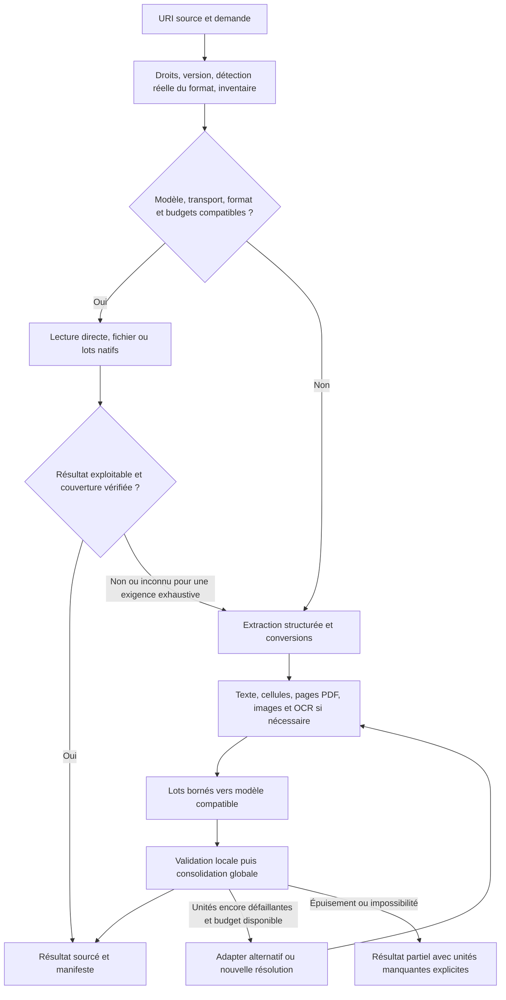

# Analyse documentaire unifiée, conversions et gros fichiers

Statut : `partial` — lecteur commun et analyse reprenable implémentés le 30 septembre 2026.

Le socle `core.document` prépare les pages et convertit les formats Office. La
passerelle Chat route la lecture native et le repli préparé ; Messenger et le harnais
interne réutilisent la préparation avec leurs limites explicites. Le test synthétique
de préparation de 500 pages et la préparation des six fichiers privés ont réussi.
Après rétablissement de l'accès OpenRouter, une campagne Terra en mode automatique
a donné 14 réponses correctes et sourcées sur les six fichiers du corpus privé.
Ce résultat est un benchmark représentatif, pas une qualification exhaustive ou
répétée. Le mode préparé est également exercé ; ses corrections de précision visuelle,
de consolidation et de reprise des erreurs fournisseur restent documentées dans les
artefacts locaux. Le modèle Fireworks du profil testé était inaccessible à l'inférence.
Le second lot ajoute un engine Process avec inférences durables par lot, des checkpoints
de conversion, un cache contrôlé par source et accès, le repli Responses pour les fichiers
incorporés, la convergence des lecteurs Messenger/Hermès et Dream et les données XLSX/ODS
indépendantes de la pagination. La lecture synthétique de 500 pages traverse le Process
et la passerelle LLM avec le fournisseur externe remplacé dans les tests.
Les formats non qualifiés, le XLS structurel, l'isolation réseau des convertisseurs et
la qualification sémantique exhaustive et répétée des grandes sources restent ouverts.
La [décision 0151](../decisions/0151-resumable-document-analysis.md) décrit ce runtime.
Voir la [décision du premier lot](../decisions/0149-transient-document-preparation.md).

## 1. Garantie produit

Tout fichier accessible à un agent entre dans une même chaîne d'analyse, quelle que soit
son origine : Chat, Messenger, pièce jointe de document, Console ou provider file-share.
La chaîne choisit la lecture directe lorsqu'elle est effectivement compatible, prépare
une représentation adaptée lorsque nécessaire, et bascule vers cette préparation après
un échec ou une insuffisance détectée de la lecture directe.

Un rapport de **500 pages doit pouvoir être traité intégralement**, y compris lorsqu'il
est scanné, dépasse le contexte d'un modèle ou la taille admissible d'un appel fournisseur.
L'utilisateur suit la progression, peut interrompre le traitement et le reprendre.

« N'importe quoi » désigne une entrée universelle avec des adapters extensibles et un
diagnostic intelligible pour chaque format. Cela ne permet pas de garantir une transcription
exacte d'une écriture illisible, de déchiffrer un fichier sans mot de passe ou de reconstruire
des octets absents. La garantie ferme est : **aucune omission cachée, aucune invention pour
remplacer une donnée manquante, aucune analyse incomplète présentée comme complète**.
L'objectif de lecture parfaite est vérifié sur des corpus de référence, par format et usage.

Livrables distingués : texte et structure exploitables ; rendu visuel ; analyse sourcée ;
bilan de couverture. Un résumé n'est jamais le substitut unique du contenu extrait.

## 2. Socle à réutiliser

Inventaire vérifié dans le code du worktree ; il ne prouve pas une qualification globale.

| Brique | Acquis | Limite à lever |
|---|---|---|
| [`app.file_share`](../../back/app/file_share/resource_contracts.py) | URI canoniques, métadonnées, droits, versions, matérialisation bornée | `file_read` rend du texte ou du base64 ; ce n'est pas un lecteur documentaire |
| [`app.harness.media`](../../back/app/harness/media.py) | Admission native selon modèle/transport, budget, provenance et temporaires | PDF seulement pour les documents ; échec remplacé par une indication d'outil, sans préparation automatique |
| [`app.messenger.ingest`](../../back/app/messenger/ingest.py) | Fichier natif, rendu PDF vers images, extraction texte | Chemin distinct, utilisé notamment par Hermès ; rendu limité à dix pages par défaut |
| [`pdf_extract`](../../back/app/messenger/pdf_extract.py) | Worker PDF isolé | 16 Mio, 100 pages, 20 000 caractères ; extraction tronquée |
| [`Dream attachment_extract`](../../back/app/dream/attachment_extract.py) | PDF, DOCX/XLSX/PPTX, ODT/ODS/ODP, texte ; worker borné | Pas DOC/ODG ; extraction ne préserve pas toutes les structures, formules et formats |
| [`Dream attachment_processing`](../../back/app/dream/attachment_processing.py) | Résumé par morceaux, LLM documentaire du profil | Extraction prioritaire ; quelques caractères suffisent à écarter la lecture documentaire ; pas de fallback après refus natif |
| [`app.llm`](../../back/app/llm/llm_service.py) | Capacités, modèle documentaire et modèles spécialisés du profil | Un booléen `input_file` ne garantit ni tous les MIME ni une lecture complète |
| [`app.process`](../../back/app/process/contracts.py) | Exécutions longues et contrats publics | Intégration d'un engine documentaire et des checkpoints à concevoir |
| [`qualification`](../../back/scripts/qualify_documents.py) | Empreintes, essais bornés, revue indépendante, répétitions | Comparaison des entrées isolées ; parcours applicatif et corpus complet à ajouter |

Les essais locaux montrent des pertes visuelles dans le chemin PDF brut, une amélioration
avec les pages rendues, des formats bureautiques non extraits et des pertes de métadonnées
de tableur. Ces conclusions orientent les tests ; aucune donnée des fichiers locaux ni
réponse réelle ne devient une fixture versionnée. Les diagnostics restent dans `artifacts/`.

## 3. Architecture proposée

Un domaine `app.document_analysis` possède le routage, les conversions, le manifeste de
couverture et les résultats. Ce domaine est justifié par ses consommateurs communs et son
état durable, distincts du stockage file-share, de la mémoire et de l'inférence.
Confirmer cette frontière à la première étape ; ne pas créer un deuxième catalogue de fichiers.

Il expose des contrats publics pour préparer, analyser, lire les résultats, suivre et
annuler un traitement. Tous les consommateurs utilisent cette façade. Les adapters de
conversion restent derrière des protocoles ; les adapters de fournisseurs restent dans
`bridge.*` et passent par `app.llm`. Un convertisseur CLI local ne devient pas un Tool autonome.

Responsabilités préservées :

- `app.file_share` : source, accès, version et transferts ;
- `app.document_analysis` : représentation documentaire et couverture ;
- `app.llm` : résolution des modèles, inférences et comptabilité ;
- `app.process` : orchestration durable du travail long, reprise et annulation ;
- `app.memory` : persistance éditoriale ou indexation souhaitée, avec ses ACL ;
- `app.dream` : déclenchement opportuniste et enrichissement, via la même façade ;
- harnais et bridges : adaptation de l'entrée et consommation des résultats.

Un outil documentaire spécialisé pourra exposer cette sémantique d'analyse longue avec un
Process et une couverture, sans dupliquer `file_read`, les transports ou les opérations de
fichier. Son nom et son schéma sont à fixer à partir des contrats et du catalogue d'outils.

## 4. Chaîne de traitement

### Admission et choix du mode

Détecter le format par contenu et structure, pas uniquement par extension. Inventorier
pages, feuilles, diapositives, pièces jointes ou entrées d'archive avant de choisir le chemin.
Enregistrer source/version, objectif, langue, budget et capacités effectives.

Croiser modèle, MIME, transport, fournisseur et limites de payload/contexte. Les capacités
inconnues sont distinguées des capacités refusées. Les modèles viennent du profil effectif :
le modèle courant peut lire directement ; le modèle documentaire peut préparer une analyse
pour un modèle courant dépourvu de lecture fichier ; les modèles vision/OCR compatibles
complètent le parcours si nécessaire. Aucun remplacement silencieux de profil.

La préparation locale n'exige pas de LLM. Lorsque le destinataire accepte les images,
les conserver pour les tableaux et figures qui nécessitent la vision. S'il n'accepte que du
texte, extraire descriptions, OCR et données structurées ; une description visuelle produite
par un modèle spécialisé porte sa provenance et reste distincte de l'extraction déterministe.
Sans modèle spécialisé disponible, signaler les parties visuelles non interprétées.

### Fallback contrôlé

Déclencheurs : refus MIME ou taille, incompatibilité transport, extraction vide ou dégradée,
réponse vide, absence de sources requises, unités non couvertes, différences avec les repères
de source ou impossibilité déclarée par le lecteur. Une réponse HTTP 200 ne valide rien seule.

Le contrôle croise l'inventaire, les résultats par unité, les repères textuels/visuels et les
contradictions détectables. Une densité de texte faible est un signal, pas une preuve de scan.
Les couvertures, pages sans texte, tableaux et figures peuvent appeler une vérification visuelle.
La déclaration du LLM « j'ai tout lu » ne suffit jamais à valider la couverture.

Un contrôle automatique ne détecte pas toute erreur sémantique. Pour une demande exhaustive,
une couverture native indémontrable déclenche la préparation structurée ; pour des résultats
critiques, prévoir vérification indépendante et incertitude explicite.

Le nombre d'alternatives est fini et versionné. Refus d'authentification, absence de droits ou
source inaccessible ne deviennent pas une tentative de conversion. Les erreurs temporaires
suivent une politique bornée ; les inférences au résultat incertain ne sont pas rejouées
aveuglément. Chaque fallback garde son motif et n'invalide pas les unités déjà réussies.

## 5. Matrice des formats et convertisseurs

| Famille | Extraction structurée | Représentation complémentaire / fallback |
|---|---|---|
| PDF texte, scan ou mixte | Texte par page, ordre de lecture, tableaux et liens | Rendu PDFium ; OCR ciblé par page ; reconnaissance spécialisée du manuscrit si nécessaire |
| DOCX, ODT, RTF, HTML, Markdown, EPUB | Sections, listes, notes, tableaux, liens et médias | Pandoc vers représentation structurée/HTML ; LibreOffice vers PDF lorsque compatible |
| DOC et bureautique ancienne | Adapter de format après détection | LibreOffice vers format moderne/PDF ; contrôler le nombre de pages et les substitutions |
| XLSX, XLS, ODS, CSV, TSV | Feuilles, cellules, valeurs, formules, caches, formats, fusions et commentaires | Rendu Calc/PDF des graphiques et zones utiles ; la pagination ne doit pas masquer des cellules |
| PPTX, PPT, ODP | Diapositives, notes, objets et texte | LibreOffice vers PDF ; rendu de chaque diapositive |
| ODG, dessins et diagrammes | Libellés et objets si adapter disponible | LibreOffice Draw vers PDF ; PNG/SVG contrôlé lorsque compatible |
| PNG/JPEG/TIFF et images multipages | Métadonnées, images individuelles, OCR | Vision ; rotations, langue et résolution adaptées |
| EML/MIME et archives documentaires | Message, arborescence et fichiers enfants avec provenance | Analyser chaque fichier enfant ; couverture distincte de celle du conteneur |
| Audio et vidéo | Délégation aux façades média existantes | Transcription et scènes pertinentes ; ne pas annoncer une analyse visuelle à partir du seul audio |
| Format inconnu, endommagé ou chiffré | Diagnostic et adapter compatible disponible | Essai de réparation borné ; résultat explicite si mot de passe ou outil manque |

Pandoc est une conversion structurée, pas un moteur universel de rendu fidèle. Il documente
les limites de son modèle intermédiaire et les conversions imparfaites ; DOC nécessite une
autre lecture. Conserver l'original et vérifier les dérivés.
Sources : [formats Pandoc](https://pandoc.org/), [FAQ Pandoc](https://www.pandoc.org/faqs.html).

LibreOffice fournit l'export PDF en ligne de commande. Le plan prévoit une image de worker
avec polices et filtres qualifiés, sans ajouter de conversion lourde au processus HTTP.
Source : [export PDF LibreOffice](https://help.libreoffice.org/latest/en-US/text/shared/guide/pdf_params.html).

Tesseract et OCRmyPDF sont des candidats pour l'OCR imprimé. Leur installation et leurs
réglages sont à qualifier ; aucune page ignorée pour une limite ne compte comme analysée.
La consommation varie avec les pixels et la concurrence.
Sources : [performance OCRmyPDF](https://ocrmypdf.readthedocs.io/en/stable/performance.html),
[paramètres avancés](https://ocrmypdf.readthedocs.io/en/stable/advanced.html).

PDF/HTML sont des dérivés complémentaires : un tableur converti uniquement en PDF perdrait
ses formules et la distinction entre valeur brute et valeur affichée. Les macros ne sont
pas exécutées ; le recalcul éventuel est explicite et conserve les valeurs originales.

## 6. Gros fichiers : cible de réception à 500 pages

Séparer **admission du fichier**, **budget de conversion** et **budget de chaque inférence**.
Ne pas appliquer le plafond d'un appel natif à l'ensemble du fichier source. Fixer les
plafonds d'admission en octets et en expansion selon les limites globales de file-share et
du stockage ; qualifier au minimum un document de 500 pages dépassant 100 Mo.

Le téléchargement est streamé, la source n'est pas encodée intégralement en base64 pour
chaque lot. La conversion est exécutée hors HTTP ; les pages et les médias sont produits
progressivement. Un rendu pleine résolution de toutes les pages ne réside jamais en RAM.

Découper d'abord par structure : sections, pages, tableaux, feuilles ou diapositives.
Dimensionner ensuite chaque lot selon octets, pixels, tokens estimés, budget de réponse et
limites effectives du fournisseur. Un tableau réparti sur plusieurs pages garde ses
en-têtes, continuations et unités. Le chevauchement éventuel conserve les identifiants et
n'introduit pas de doubles comptes lors de la consolidation.

Chaque unité possède un état durable et une empreinte. Après interruption, reprendre les
seules unités restantes ; ne pas reconvertir ni refacturer les unités déjà validées.
Limiter explicitement les workers de conversion, d'OCR et d'inférence ; respecter les
quotas du fournisseur et ceux de l'installation.

Pour une analyse exhaustive : parcourir toutes les unités, conserver les faits structurés,
puis consolider par sections et globalement avec renvoi aux sources. La réduction conserve
les références et objets originaux ; elle ne devient pas le seul contenu consultable.
Pour une question ciblée : recherche dans les unités préparées, citations et portée explicite,
sans prétendre que la sélection constitue une lecture exhaustive.

L'estimation initiale donne taille, unités, mode et budget probable. La progression expose
préparées/traitées/vérifiées/illisibles, coût observé et motifs de fallback. Une échéance ou
un budget atteint produit une pause ou une issue partielle explicite, jamais un succès complet.

## 7. Résultat, provenance, cache et cycle de vie

Le manifeste de résultat conserve : URI source et version ; format réel ; nombre d'unités
attendues ; textes, tableaux et médias ; localisateurs ; chaîne de conversion et versions ;
mode/model/protocole ; limites ; couverture et raisons d'échec ; coûts et temps.

Localisateurs : page physique et numéro imprimé lorsqu'il existe, section, diapositive,
feuille/cellule, figure ou entrée d'archive. Une pagination créée par conversion reste
identifiée comme dérivée. Les coordonnées et relations table/figure/texte sont préservées.

Statuts documentaires proposés : en préparation, prêt, en analyse, complet, partiel,
illisible, annulé. Leur projection respecte les transitions de `app.process`, sans ajouter
un second ordonnanceur. « Complet » exige toutes les unités couvertes et tous les contrôles
contractuels passés ; il décrit une couverture vérifiée, pas une infaillibilité sémantique.

Le cache distingue préparation déterministe et analyse LLM. Clés : version source,
empreinte, versions des outils/polices, options, langue OCR ; ajouter modèle, prompt et
objectif pour les résultats LLM. La réutilisation ne traverse jamais des ACL par simple
égalité de checksum. Vérifier les droits à chaque lecture et ne publier un résultat que
si la version source est toujours courante.

Les dérivés et checkpoints requis pour la reprise ont un stockage interne durable,
une rétention et des quotas explicites. Les matérialisations de travail restent temporaires.
Ils héritent des droits source et ne deviennent pas de nouvelles ressources publiques sans
publication voulue. Une suppression ou révocation interdit immédiatement l'accès ; la
purge respecte les références restantes et le plan d'indexation file-share/Memory.

Les traitements concurrents ont une clé d'idempotence, des leases et des commits atomiques
par unité. Un ancien worker ne remplace pas une analyse récente ; un résultat tardif ne
ressuscite pas un traitement annulé. Annuler stoppe aussi les convertisseurs locaux et
applique la capacité d'annulation réelle des appels distants.

Workers isolés : limites CPU/RAM/disque/temps, profils LibreOffice propres, pas de macros,
pas de chargement réseau implicite des documents, limites d'archives et de récursion.
Les contenus sont des données, jamais des instructions système. Les outils ne journalisent
ni contenu privé ni secrets. Les diagnostics persistés sont structurés et bornés.

## 8. Intégration et déploiement progressif

1. **Contrat et reproduction.** Inventorier les consommateurs, formaliser format/capacité/
   couverture/budget et reproduire les défauts avec fixtures synthétiques. Créer la décision
   d'architecture après choix validé ; préciser frontières, persistence et états.
2. **Préparation commune.** Extraire les workers réutilisables vers la façade ; ajouter
   Pandoc, LibreOffice et les lecteurs structurés nécessaires dans les images Docker.
   Qualifier d'abord DOC/ODG et les couvertures PDF manquées. Réception : mêmes contenus
   accessibles depuis toutes les URI autorisées, original intact, conversions vérifiées.
3. **Routage et fallback.** Implémenter admission effective, choix direct/préparé, contrôles
   de résultat et alternatives bornées. Réception : refus natif et réponse 200 insuffisante
   provoquent le fallback attendu, avec source, motif et couverture.
4. **Traitements durables.** Brancher un engine `app.process`, checkpoints, stockage des
   dérivés et lots. Réception : 500 pages, reprise après arrêt au milieu, déduplication,
   concurrence et annulation ; mémoire plafonnée sans dépendance linéaire au nombre de pages.
5. **Convergence des parcours.** Migrer Chat/Tasks internes, Hermès, Messenger et Dream vers
   la façade, par groupes. Un parcours complet est vérifié avant généralisation. Préserver
   les URI, les historiques, les fichiers seuls, les droits et les options Dream.
6. **Qualification et publication.** Comparer modes et profils, atteindre les critères
   ci-dessous, puis retirer les chemins dupliqués une fois leurs garanties couvertes.
   Préparer documentation FR/EN, migrations DbAdmin si nécessaires, contrôles d'architecture
   et validation isolée complète avant publication. Aucun déploiement implicite.

Le catalogue/index de fichiers reste traité par
[son plan](indexation-file-share-memory.md). Ce service livre une représentation réutilisable
à ce catalogue sans conditionner la lecture à sa réalisation. Les campagnes peuvent ensuite
être intégrées au Lab ; ce raccordement ne bloque pas les premiers benchmarks reproductibles.

## 9. Protocole de qualification et critères de réception

| Garantie | Preuve exigée |
|---|---|
| Deux modes réels | Même source et mêmes questions via mode direct forcé puis préparé forcé ; modèle/protocole/conversion figés et revue indépendante |
| Fallback automatique | Parcours de production avec refus MIME/taille, fichier incompatible, réponse vide et réponse 200 contredite par la source ; alternative réussie ou limite explicite |
| Couverture | 500/500 pages inventoriées et traitées ; texte, tableaux et figures vérifiés ; aucune page implicitement omise |
| Fidélité | Oracle indépendant, localisateurs exacts, nombres/units/formules/valeurs affichées/notes conservés ; erreurs critiques distinctes d'un score moyen |
| Gros documents | Au moins 500 pages texte, 500 pages scannées et un rapport mixte >100 Mo ; annotations de contrôle réparties, dont page 500 |
| Continuité | Tableau multipage, sections dépendantes et conclusion globale ; pas de perte au découpage ni de double compte |
| Reprise | Arrêt worker et serveur, reprise depuis checkpoint ; unités réussies inchangées et pas de second appel facturable pour elles |
| Droits et fraîcheur | Deux agents, révocation, changement source pendant conversion, cache et résultat ancien refusés |
| Erreurs | Mot de passe manquant, corruption, dépendance absente, quota, timeout et budget épuisé ; résultat partiel exploitable et statut honnête |
| Performances | Temps conversion/OCR/inférence, p50/p95, pic RAM, disque, octets et coût par page ; même matériel et mêmes corpus avant/après |
| Application | Dépôt du fichier, progression, résultat sourcé, fallback, retry et réouverture dans l'application ; contrôle des erreurs navigateur/API |

Le corpus versionné est entièrement synthétique. Il contient PDF texte et scans, écriture
manuscrite avec transcription vérifiée, multicolonnes, images, graphiques, tableaux, notes,
Office ancien/moderne, feuilles masquées, cellules formatées, formules, documents volumineux
et fichiers hostiles contrôlés. Les langues initiales sont FR/EN ; les autres langues sont
qualifiées séparément. Les fichiers privés de diagnostic restent locaux et hors fixtures.

Une référence est rédigée depuis le fichier source, jamais depuis la réponse du lecteur.
Chaque campagne conserve empreintes, transformations, payload effectif, usages, coût,
temps, exclusions et revue. Pour chaque combinaison promue, exiger trois essais complets
indépendants sans erreur critique ni omission cachée et un corpus tenu à l'écart.
Ne pas relancer un défaut identique uniquement pour obtenir une réponse favorable.

Séparer : fidélité d'extraction, couverture de préparation, qualité sémantique de l'analyse
et orchestration du fallback. Les extractions déterministes demandent l'exactitude des
valeurs ; OCR/vision/manuscrit demandent des taux d'erreur mesurés et une incertitude
étalonnée, avec aucune erreur sur les champs critiques du corpus de réception.

Les objectifs de latence et coût deviennent chiffrés après une mesure de référence sur
l'installation de qualification. Pas de promesse d'un délai universel pour 500 pages.
Publier la matrice des formats/modèles qualifiés et les limites connues. Le système est
« au point » lorsque ces garanties sont démontrées dans l'application, pas lorsqu'un
fournisseur accepte le payload ou que seuls des tests unitaires passent.
