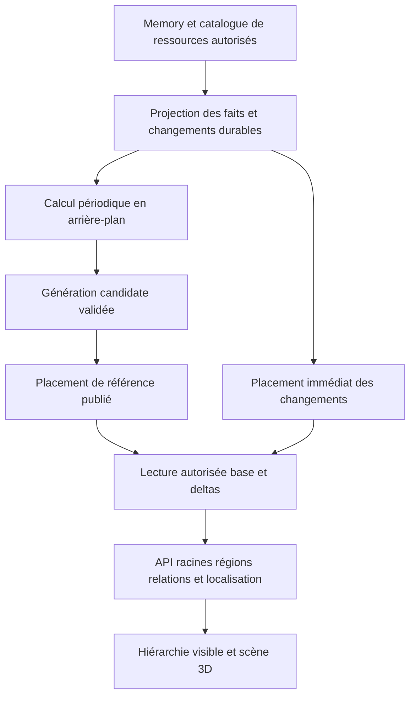

# Carte mémoire 3D — navigation multiechelle et placement précalculé

- Statut : `partial` — socle 2D conservé et rendu 3D local implémenté ; carte serveur régionale encore à construire.
- Revue des sources et conception : 2026-10-09.
- Propriétaire du chantier : `app.memory`, avec les contrats publics de File Share.
- Mise en œuvre du rendu 3D demandée le 2026-10-10 ; aucun commit ni déploiement engagé par cette demande.

## Livraison du rendu local — 2026-10-10

La page ouvre désormais une vue Three.js avec retour explicite en 2D. Le même contrat
de chargement, les mêmes droits, regroupements, filtres, détails et positions personnelles
restent utilisés. `graph3d.worker.ts` calcule le placement hors du thread principal ;
`graph3dScene.ts` regroupe les marqueurs visibles dans un dessin instancié et les relations
dans un dessin de segments. Un index de cellules élimine les régions hors champ avant
projection et sélection. La caméra et les coordonnées GPU relatives permettent le zoom
profond sans agrandir les symboles au-delà des deux tailles éloignée/proche.
Les cellules denses sans ancres communes se replient également en groupes spatiaux
d'affichage, avec seuil lié à la densité et hystérésis. Le clic approche et révèle
les membres ; les liens de même type, direction et statut sont agrégés visuellement.
Les identités et relations canoniques sont conservées. Ce regroupement local ne constitue
pas encore la hiérarchie serveur de L2.

Le rendu reprend les SVG/glyphes, bordures et styles de relations de la 2D, avec un atlas
public borné et des rubans instanciés pour les épaisseurs de liens. Les courbes reprennent
les courbures 2D et adaptent le nombre de segments à leur longueur projetée et à leur
courbure, par tronçons instanciés de quatre segments, jusqu'à 64 par lien sans ajouter
d'appel de dessin. Leurs épaisseurs 3D sont renforcées d'un facteur de 2,25 au loin et
de 1,25 de près. La taille éloignée 2D/3D a été doublée à 56 % de la base plafonnée ; la taille
proche reste à 110 %. Les libellés n'ont pas de fond ; les positions et gestes de
navigation restent inchangés.
Le cadrage 3D adapte la distance et le centre aux limites projetées des marqueurs
rendus, au viewport et à la profondeur, plutôt qu'à une sphère conservatrice. Il s'applique
aussi au recul maximal et au redimensionnement, avec une marge pour les glyphes.

Le rendu n'a pas de boucle permanente. Les titres et aperçus constituent des couches DOM
bornées ; ils ne créent pas un élément DOM pour chaque item. Le cache de miniatures et ses
contrôles d'accès sont réutilisés, avec croissance différée jusqu'au pixel natif. La caméra
3D est persistée séparément de la caméra 2D, dans les préférences personnelles existantes.
Le clic immobile ouvre un détail ; le glissement gauche tourne autour du nœud pressé,
sans le recentrer à l'écran et sans ouverture même après un aller-retour du pointeur.
Un geste gauche commencé sur le fond translate le graphe jusqu'au relâchement, sans rotation.
La molette déplace caméra et cible ensemble vers le pointeur sans rotation ; le pincement
et les boutons conservent l'axe central. Ils peuvent traverser le plan d'un nœud,
puis continuer en espace vide. Le recul maximal retrouve une vue d'ensemble centrée et stable.
Le masquage d'une nature réorganise la vue temporaire sans réécrire la carte complète.
La perte de WebGL revient en 2D. Voir [ADR 0166](../decisions/0166-batched-memory-3d-renderer.md).

Cette étape couvre le rendu et une partie des interactions de L5/L6. Le scénario de volume
exerce 10 000 nœuds et 20 000 relations en 3D, 5 000 et 10 000 en 2D ; ces charges différentes
ne constituent pas une comparaison directe de vitesse. Les pages de 500 s'affichent
progressivement, avec 10 000 liens par page en 3D et 2 500 en 2D, sans plafond global.
La 3D commence par les racines File Share, sujets et contacts, puis dossiers/répertoires,
documents et détails. Elle diffère les descendants connus d'un répertoire accessible et
lit ses enfants à l'approche, par pages de 100 et au plus deux demandes simultanées.
Les branches déjà visitées sont restaurées ; les demandes d'un ancien contexte sont annulées.
Le retour 2D recharge son catalogue complet. La profondeur suit l'espacement local des
branches `parent_of`, sans plans rigides ; les liens dont une extrémité est derrière la
caméra sont masqués. Cette extension des API actuelles ne réalise pas L1–L4 : générations
préparées, journal rejouable, occurrences de fichiers et carte régionale préparée.
Elle ne remplace pas le futur arbre d'emplacements. Les budgets d'ouverture indépendante
du volume global et la qualification à 100 000/million d'items restent des objectifs.

Les parcours `front/browser-tests/memory-3d.spec.mjs` vérifient le rendu WebGL réel,
le culling au zoom, les groupes, le clavier, les filtres, le repli 2D, le changement
d'agent, les gestes clic/glissement, le passage de la caméra au-delà d'un nœud et la
taille native des aperçus. `e2e/specs/memory-graph.spec.mjs` traverse
les API réelles dans les deux vues. Les preuves de performance détaillées restent dans
`artifacts/front-components/`, hors du corpus versionné.

## 1. Résultat attendu et périmètre

Dans **Connaissances → Mémoire → Graphe**, explorer les connaissances comme une carte
3D qui se déroule au zoom. Les schémas de ressources, Topics et contacts sont les portes
d'entrée. Approcher une branche révèle ses enfants ; reculer restitue son contexte.
La profondeur suit les arborescences réelles de fichiers et une hiérarchie d'affichage
pour les connaissances. Il n'existe pas de plafond global d'items représentables.

Le fonctionnement demandé est hybride : **placement de référence précalculé régulièrement,
placement immédiat des ajouts, ouverture rapide à partir des données préparées**.
Le client ne télécharge pas toute la mémoire et ne recalcule pas son placement à l'ouverture.
Une petite mémoire reste directement lisible, sans imposer des regroupements artificiels.

La carte est une projection reconstructible. Elle ne modifie ni classement réel, ni Topics,
ni relations métier, ni contenu, ni déduplication, ni droits. La sélection réutilise les
détails et actions existants. La vue 2D actuelle reste disponible pendant la qualification ;
une représentation 2D accessible de la nouvelle hiérarchie doit aussi rester possible.

Le chantier inclut hiérarchie, calcul et persistance des positions, actualisation,
API régionale, navigation 3D, liens, recherche/localisation, miniatures, qualification et
retour à la vue précédente. Il n'inclut pas une refonte de Memory, un nouveau crawler,
une classification LLM obligatoire ou l'exposition des embeddings au navigateur.

## 2. État vérifié dans le dépôt

| Surface actuelle | Ce qui est disponible | Ce que cela ne démontre pas |
|---|---|---|
| [API mémoire](../../back/app/memory/schemas.py), [service](../../back/app/memory/service.py) | Pages légères par activité, rôles, voisins admissibles, liens, filtres, accès et résolutions de sources. | Ni carte hiérarchique, ni génération de placement durable, ni chargement régional. |
| [Graphe 2D](../../front/app/memory/components/MemoryGraph.vue), [branches](../../front/app/memory/graphBranches.ts), [placement](../../front/app/memory/graphLayout.ts) | Repli des feuilles exclusives, coordonnées conservées, placement borné et niveaux de rendu. Le worktree retire les plafonds client et prépositionne les grandes communautés. | Le chargement reste exhaustif par pages ; le placement est calculé dans le navigateur et n'est pas une carte serveur. |
| [Catalogue File Share](../../back/app/file_share/models.py), [observations](../../back/app/file_share/catalogue.py), [projection mémoire](../../back/app/memory/catalogue_projection.py) | Identités d'emplacements, connexions et générations de binding, présence, liens de parenté observés, fichier canonique accessible par plusieurs emplacements. | Une liste de liens mémoire ne suffit pas à reconstituer sans ambiguïté chaque arborescence d'emplacements. |
| [Modèle Topic](../../back/app/topic/models.py), [modèles mémoire](../../back/app/memory/models.py) | Topics, contacts, conversations et relations sont canoniques ; Topic ne fournit pas une arborescence native de sous-Topics. | Les cycles et multi-appartenances ne sont pas un arbre qu'il suffirait de dérouler. |
| [Accès aux sources](../../back/app/memory/source_access.py), [événements](../../back/app/memory/events.py) | Contrôles vivants, contrôles par lots et événements autorisés. | Un événement websocket ne constitue pas à lui seul un journal durable rejouable pour reconstruire une carte. |
| [Automatisation mémoire](../../back/app/memory/automation.py) | Infrastructure de travaux durables et reprise dans le domaine mémoire. | Il faut qualifier l'isolation du calcul CPU et la publication des nouvelles générations ; ne pas bloquer les captures ou le rappel. |
| [Runtime 3D](../../front/core/util/model3dRuntime.ts), [navigation](../../front/core/util/model3dNavigation.ts) | Three.js est déjà une dépendance et les aperçus ont des contrôles caméra, un cycle de vie et des tests. | Un lecteur de modèles 3D n'est pas un moteur de carte de grande mémoire. |

Références : [ADR 0157](../decisions/0157-stable-memory-leaf-branches.md),
[aperçus persistants](../decisions/0156-persistent-file-thumbnails.md),
[indexation durable](../decisions/0155-durable-file-indexing.md),
[contrat média](../../docs/fr/architecture/flows/media-resources.md),
[catalogue de tests](../../docs/fr/dev/functional-tests.md).
Les changements du worktree et les tests synthétiques ne prouvent pas un déploiement
ni la qualification d'une carte 3D à 100 000 ou un million d'items.

## 3. Garanties d'acceptation transversales

1. **Couverture** : tout élément admissible est accessible directement ou couvert par un
   ancêtre/subgroupe explorable. Un budget de rendu ou de réponse n'en élimine aucun.
2. **Identité** : une mémoire/fichier garde son identité canonique, même avec plusieurs
   emplacements ou portes d'entrée. Une occurrence de navigation n'est pas une nouvelle mémoire.
3. **Petit volume** : un graphe vide, un item isolé ou quelques items se comprennent et
   s'ouvrent immédiatement ; aucun étage artificiel obligatoire n'est ajouté.
4. **Grand volume** : première carte utile sans transfert exhaustif, exploration et caches
   bornés par la région parcourue, possibilité de rejoindre un item ancien ou isolé par recherche.
5. **Repères** : zoom, dépliage, filtre de rendu, thème et ouverture/fermeture du détail ne
   recalculent pas les positions. Une maintenance ne recadre pas brutalement la session active.
6. **Actualité** : un ajout reçoit une position immédiatement utilisable ; suppression et
   révocation prévalent sur toutes les générations anciennes et toutes les réponses tardives.
7. **Permissions** : noms, présence, compteurs, agrégats, coordonnées et chemins ne révèlent
   aucune ressource interdite. Les accès aux sources et connexions sont revérifiés.
8. **Équivalence** : clavier, souris, tactile, localisation et représentation accessible
   permettent de retrouver puis ouvrir les mêmes éléments autorisés.
9. **Reprise** : interruption du précalcul, déconnexion, onglet masqué, perte GPU et reprise
   ne produisent ni carte vide injustifiée, ni état bloqué, ni retour d'items supprimés.

## 4. Architecture retenue pour les premiers lots

### 4.1 Responsabilités et frontières

`app.memory` possède projection d'exploration, calcul, snapshots, deltas, contrats HTTP,
localisation et invalidations. `app.file_share` possède emplacements, capacités, racines,
membership et validité des connexions. Fournir les faits nécessaires par façade/port public
au lieu d'importer ses modèles internes dans le constructeur de carte.

Le frontend Memory sépare service API, cache régional, sélection des niveaux, navigation
caméra, renderer et détails. Le moteur de hiérarchie et la politique de visibilité sont
testables sans WebGL ; Three.js ne possède ni ACL, ni règles de classement.
Réutiliser les contrôles et utilitaires 3D réellement génériques après inventaire des
consommateurs ; ne pas transformer le lecteur de fichiers 3D en composant métier Memory.

Ne pas ajouter un domaine, une Task agentique, un outil MCP ou un Process métier pour un
calcul technique de placement. Utiliser la persistance de travaux du domaine et un exécutant
CPU isolé, à concurrence bornée, enregistré dans le cycle de vie existant.
Les futurs modèles restent SQLAlchemy/DbAdmin ; pas d'Alembic ni de migration SQL manuelle.
Les clés de cache/navigation sont des `*_key` ; les colonnes `*_id` restent de vraies FK.

Stockage dérivé proposé, à ajuster aux modèles existants au lot 1 :

| Objet | Données et cycle de vie |
|---|---|
| Périmètre de projection | Clé de contexte, révision d'accès, référence publiée et point de reprise ; partage uniquement entre accès équivalents. |
| Génération | Version d'algorithme/contrat, révision des faits couverts et références aux versions régionales ; candidate invisible, publication atomique, retrait borné. |
| Version régionale | Parent, emprise, ancres, partitions, placements, réserves et agrégats ; immuable après publication et réutilisable si propre. |
| Occurrence et membership | Identité canonique, emplacement/contexte, région et clé de navigation ; unicité et index de localisation, sans copier contenu ou originaux. |
| Changement durable | Mutation source, état de consommation, identités/révisions concernées et tombstone éventuel ; écrit avec la mutation, rejouable. |
| Delta de placement | Révision de projection validée, génération/région, allocation ou retrait ; conservé jusqu'à intégration et expiration des lecteurs. |
| État de vue personnel | Utilisateur et contexte de carte, version, natures masquées, choix explicites de repli et caméra/focus ; restauré avec le placement, sans modifier la référence des autres lecteurs. |
| Travail de build | Périmètre, cible, checkpoints, lease et jeton de publication ; progression récupérable, erreurs et réessais bornés. |

Index prioritaires : lecture périmètre/génération/parent, localisation canonique et
emplacement, régions sales, changements non consommés, unicité des occurrences et places.
Réutiliser les versions régionales évite de copier toutes les positions à chaque passage.
La charge de stockage se mesure aussi en memberships, occurrences et relations, pas seulement
en items : ne pas matérialiser récursivement tous les chemins possibles d'un graphe cyclique.

### 4.2 Deux niveaux de hiérarchie

**Hiérarchie logique** : racines de ressources et parenté réelle ; portes d'entrée par
Topic, contact et conversation ; rattachements documentaires existants. Une passerelle
relationnelle change le contexte exploré mais ne crée pas de descendance récursive cyclique.

**Subdivisions d'affichage** : partitions supplémentaires d'une branche trop dense.
Elles sont réversibles, identifiées comme regroupements d'affichage et ne créent aucun
Topic, contact ou dossier métier. Les sous-groupes d'un même contexte partitionnent son
ensemble d'occurrences ; les différents contextes peuvent partager les mêmes items canoniques.

Les racines s'organisent en territoires stables pour schémas de ressources, Topics,
contacts et éléments non rattachés. Une petite collection révèle directement ses membres.
Les territoires sont des repères, pas des écrans intermédiaires imposés.
Des milliers de Topics ou contacts sont eux-mêmes regroupés à distance ; tous restent
accessibles et identifiables lors du raffinement/localisation.

### 4.3 Fichiers, emplacements et couverture réelle

Un fichier canonique et ses occurrences d'emplacement sont des objets distincts.
La parenté de navigation vient du catalogue autorisé, dans le bon périmètre de connexion,
binding, runtime et racine, pas seulement d'un lien entre deux fichiers dédupliqués.
Un emplacement connu sans parent observable rejoint une racine de ressources connues.
Un descendant accessible dont un ancêtre est interdit reste atteignable sans exposer cet ancêtre.

La carte décrit la mémoire et le catalogue effectivement connus. Un crawler partiel ou
une connexion indisponible ne permettent pas de prétendre connaître tous les fichiers
distants. Exposer séparément couverture connue, indexation en cours/partielle et fraîcheur.
Naviguer dans la carte ne lance pas un parcours récursif du provider ni un téléchargement
d'originaux ; une actualisation de source reste une action du contrat File Share existant.

### 4.4 Groupement des connaissances

Pour le premier algorithme, utiliser les relations canoniques confirmées : dans un Topic,
regrouper par contexte de conversation/contact lorsqu'il existe, puis par rôle et par
communauté locale déterministe si le volume l'exige ; dans un contact, utiliser ses
contextes et Topics connus. L'ensemble sans rattachement rejoint un groupe explicite.

Dans chaque porte d'entrée, choisir un rattachement principal stable par règles de rôle
et clé persistée ; conserver les autres relations comme passerelles, avec leur provenance.
Une référence à un contexte déjà présent dans le chemin est une passerelle, jamais un
nouvel étage. Les suggestions restent distinctes des relations confirmées et ne déterminent
pas seules le rattachement principal. Éviter que des hubs transversaux absorbent tous les groupes.

Pour un répertoire plat énorme, utiliser un arbre de plages de noms normalisés avec une
clé stable de départage ; pour un groupe sémantique encore trop dense, subdiviser ses
communautés ou, à défaut, ses rôles/segments stables. Les divisions ont des seuils distincts
de scission et de fusion. Un rename n'impose pas de redistribuer les régions non concernées.
Le choix n'ajoute ni inférence LLM ni embeddings exposés ; une variante sémantique ultérieure
doit prouver compréhension, stabilité et coût face à cette référence.

### 4.5 Placement local et continuité des coordonnées

Chaque région possède un repère relatif à son parent, une emprise et des ancres persistées.
Le précalcul place les territoires puis les enfants région par région. Parenté réelle,
groupes frères, liens locaux et passerelles ont des contraintes différentes ; ne pas
simuler toutes les paires du graphe ni parcourir sans limite tous ses liens pour le placement.

Pour les collections structurées, employer un placement déterministe en secteurs/cellules
avec places réservées et marge d'expansion. Pour les communautés, initialiser par appartenance
et utiliser un solveur local borné ; une approximation déterministe des voisinages peut
guider la géométrie, sans modifier couverture ni compteurs réels. Mesurer proximité des
communautés, collisions, occlusions et croisements avant de fixer les paramètres.

**Arrêt et qualité du calcul** : un délai écoulé, un nombre de passes atteint ou un
amortissement des mouvements ne prouvent pas qu'une région est bien placée. Le moteur
actuel sépare animation pour les fenêtres jusqu'à 600 nœuds, avec rééquilibrages de
700 ms, et calcul statique borné à 60–180 passes pour les grandes fenêtres ; l'observation
d'un arrêt prématuré doit être reproduite avant d'attribuer sa cause à l'un de ces chemins.

Pour le précalcul, arrêter normalement sur déplacement relatif faible **et** amélioration
du score faible sur plusieurs passes consécutives. Valider séparément collisions des
emprises, séparation des groupes, proximité des membres et lisibilité sur des cadrages
de référence ; mesurer les croisements par une estimation bornée, sans comparer toutes
les paires de liens. Fixer seuils et poids sur les corpus du lot 0 : des nœuds immobiles
peuvent rester mal placés, et un optimum global n'est pas une garantie réaliste.

Conserver un budget CPU par tranche et un checkpoint de la meilleure candidate. Budget
épuisé ou oscillation : reprendre au passage suivant, ou changer l'initialisation/subdiviser
la région en cas de stagnation. Ne pas publier une candidate dégradée sous prétexte que
le temps est écoulé. Garder la référence utilisable et ses ajouts live ; pour une première
carte, servir un placement structuré provisoire couvrant plutôt qu'attendre indéfiniment.
Le statut distingue préparation, qualité validée et solution provisoire ; le navigateur
affiche des positions préparées, sans attendre ni montrer la relaxation du solveur.

Le placement immédiat attribue aux nouveaux enfants des places libres dans leur région,
proches de leurs relations quand c'est possible, sans déplacer les voisins existants.
Si la réserve est pleine, créer un sous-groupe provisoire accessible, marquer la région à
recalculer et conserver son ancre. Ne pas lancer une relaxation générale sur le chemin HTTP.
Des allocations concurrentes utilisent version de région et réservation atomique ; même
changement rejoué, même occurrence et même position, sans collision de places.

La caméra et le GPU travaillent dans le repère de la région active. Recentrer et renormaliser
à mesure de la descente avec compensation de la caméra ; conserver un chemin et des
transformations d'ancêtres compacts. Traiter les longues chaînes itérativement, sans limiter
arbitrairement la profondeur de navigation ni dépendre de la pile d'appels JavaScript.
Une limite d'indexation du provider reste un état de couverture, pas une limite du zoom.

### 4.6 Précalcul périodique et deltas en direct

**Référence persistée** : une génération publiée contient appartenance, positions,
emprises, compteurs, agrégats de liens et version de l'algorithme pour un périmètre autorisé.
Une lecture régionale utilise ces résultats et les deltas suivants ; ouvrir la vue ne
rejoue pas le solveur. Les petites cartes suivent le même contrat avec une préparation légère.

**Calcul régulier** : point de départ à qualifier, passage de maintenance toutes les
15 minutes sur les régions sales, et contrôle quotidien de cohérence/nécessité d'une
reconstruction. Une région propre est réutilisée ; le calendrier ne force pas une
redistribution globale. Déclencher aussi un travail coalescé après une grosse importation
ou saturation de réserve. Cadence, concurrence et seuils seront intégrés aux paramètres
existants seulement après les mesures du lot 0, sans nouvelle constante cachée par écran.

**Ajout immédiat** : enregistrer le changement durablement avec la mutation canonique,
projeter son occurrence et réserver une place provisoire par un traitement borné. La
lecture inclut le delta sans attendre le prochain précalcul. Si le placement ne tient pas
dans le budget immédiat, rendre l'item localisable dans un groupe d'ajouts en cours et
terminer son positionnement asynchronement ; ne pas le masquer jusqu'à la maintenance.

**Absence de première référence** : produire rapidement les racines et des régions
provisoires autorisées avec couverture explicite, tout en préparant les positions détaillées.
L'état `préparation` ne se confond pas avec `aucun élément`. Une référence existante
continue d'être utilisée pendant un recalcul, après validation actuelle des accès.

**Publication** : figer une entrée cohérente pour le build, relever un point de reprise
des changements effectivement validés, calculer hors transaction longue, rejouer les
changements et valider la candidate avant bascule atomique du pointeur de référence.
Séparer génération de placement, révision des faits, révision d'accès et version de
schéma. Les numéros alloués avant commit ne prouvent pas que toutes les transactions
antérieures sont visibles : le protocole de journal/publication doit traiter les commits
hors ordre et ses tests doivent reproduire ce cas.

Solution de référence pour ce journal : enregistrer une entrée transactionnelle avec la
mutation, puis consommer les **entrées non traitées**, sans avancer seulement sur le plus
grand identifiant. Un projecteur attribue la révision de carte dans une transaction courte
sérialisée par périmètre, avec écriture du delta et marquage de consommation atomiques.
Un commit tardif reste donc une entrée à traiter. Reprojeter l'état canonique courant et
contrôler sa révision évite qu'un événement ancien écrase un état récent ; les suppressions
gardent leur tombstone et les mutations liées sont projetées comme un même changement.
Le build lit cette projection versionnée au point de reprise, pas un mélange d'états source
plus récents et de révisions non intégrées. Les ajouts encore en file restent localisables
par le groupe provisoire autorisé ; ce délai est inclus dans le budget live.

Une capture cohérente des faits utilise une transaction de lecture bornée pour produire
une entrée immuable ; le solveur et les accès réseau n'ont jamais lieu dans cette transaction.
Si la taille dépasse ce budget, préparer une entrée versionnée par régions et valider ses
dépendances avant publication, au lieu de garder une transaction ouverte pendant le build.
Ce choix s'appuie sur les garanties de snapshot et les limites des séquences décrites dans
la [documentation PostgreSQL 17](https://www.postgresql.org/docs/17/transaction-iso.html) ;
le protocole proposé doit être prouvé par les tests transactionnels, pas par cette référence seule.

Les agrégats sont exacts pour la révision annoncée. Une branche en préparation expose son
retard/état, sans présenter un compteur non recalculé comme actuel. Les mises à jour des
ancêtres sont coalescées et le parcours des relations est batché/checkpointé : l'agrégation
complète dépend nécessairement du nombre de memberships et de liens, même si le solveur
et la lecture interactive restent régionaux.

Un build possède lease, checkpoints, clé d'idempotence et état explicite. Un seul build
par périmètre/version cible ; un worker périmé ne peut pas publier après son remplaçant.
Un échec laisse la référence précédente intacte et déclenche un retry borné/coalescé.
Les deltas acceptés après la capture ou pendant la bascule restent lisibles ; les rejouer
est idempotent. Leur rétention dépend du point de reprise et des lecteurs encore actifs,
avec durée et espace bornés puis resynchronisation explicite des sessions trop anciennes.

**Session active** : garder sa génération tant qu'elle reste valide et appliquer les deltas.
Proposer/installer la nouvelle géométrie à un point de navigation sûr, en remappant le focus
par identité, avec transition locale et respect de la réduction des animations. Une mise
à jour de sécurité s'applique immédiatement, indépendamment de cette conservation visuelle.
Une génération retirée du stockage provoque une resynchronisation contrôlée, pas un mélange
de positions de deux générations.
Les changements de faits sont communs, mais leurs placements sont liés à la génération :
un client conservant l'ancienne carte ne reçoit pas les coordonnées d'une région déplacée
dans la nouvelle. Réutiliser un delta géométrique seulement si le repère régional est
compatible ; sinon réserver une place dans chaque génération encore servie. Borner le
nombre de générations actives et leur durée, puis resynchroniser les lecteurs retirés
avec focus remappé. Le coût des ajouts reste ainsi borné, sans mélange de repères.

### 4.7 Accès, filtres et réutilisation des calculs

La clé de périmètre comprend contexte humain/agent effectivement autorisé, droits pertinents,
bindings des sources et contexte logique. Le cache n'est jamais global par simple `agent_id`.
Construire les groupes et agrégats sur les faits admissibles ; ne pas filtrer après avoir
envoyé leurs noms, totaux ou géométrie. Vérifier qu'ajouter des données invisibles ne change
pas le résultat observable pour le lecteur.

Les portes d'entrée stables et régions d'un même périmètre peuvent réutiliser une base.
Les filtres de rendu locaux ne recalculent pas le placement. Les filtres d'admissibilité
créent une vue isolée avec appartenance et compteurs autorisés ; ne pas matérialiser une
carte complète pour chaque texte saisi. Utiliser intersections indexées/membership du
périmètre, cache de résultats régional borné et invalidations explicites.
Un filtre ne doit pas faire déduire l'exclusivité à partir des seuls liens chargés.

Révocation de document, changement de binding, désactivation de connexion ou changement
de session : invalider les régions et médias concernés, retirer les références déjà visibles
et refuser leurs lectures futures. Si le périmètre n'est plus validable, retirer ses données
plutôt que servir une ancienne carte. Un tombstone/révision d'accès prévaut sur un delta
d'ajout ou une réponse antérieurs, y compris pendant un build et une reconnexion.
Pour la nouvelle carte, la déconnexion ne prolonge pas indéfiniment une autorisation :
définir au lot 1 une validité courte et bornée des lectures, suspendre l'affichage protégé
lorsqu'elle expire sans revalidation, puis revalider avant reprise. Une révocation distante
ne peut être connue instantanément par un client déconnecté ; la réception des événements
et l'expiration bornée couvrent respectivement les sessions connectées et isolées.

### 4.8 Contrat de lecture proposé

Contrats additifs dans Memory, noms de routes à arrêter au lot 1 :

| Opération | Résultat et garde nécessaires |
|---|---|
| Ouvrir une carte | Racines, génération utilisable, point de reprise des deltas, contexte d'accès, couverture et état de préparation ; ne bloque pas sur un build complet. |
| Lire une région | Enfants/agrégats, positions relatives, emprises, rôles, compteurs, état et curseur ; génération et périmètre vérifiés. |
| Lire des relations | Relations entre représentants visibles, types, suggestions et quantités ; détail paginé des liens canoniques sur demande. |
| Localiser un item ou emplacement | Chemin autorisé dans la hiérarchie, ancres et région cible ; alternatives pertinentes lorsqu'il a plusieurs emplacements. |
| Rattraper les changements | Deltas autorisés à partir d'un curseur, tombstones et indication explicite de resynchronisation si rétention dépassée. |

Les curseurs sont opaques et liés au périmètre, filtres, parent/région et génération.
Les enveloppes annoncent enfants directs, items canoniques distincts, occurrences et
couverture complète/partielle selon leur sens ; ne jamais sommer les compteurs de Topics
et contacts qui se recouvrent comme s'il s'agissait d'un total unique.
Chaque réponse demeure bornée. Un dépassement renvoie des sous-groupes, un curseur ou
un résumé de couverture, pas un échantillon présenté comme exhaustif.
Les listes navigables respectent défaut 50, choix `[10, 20, 50, 100, 500]` et API jusqu'à 500.
Conserver les anciens endpoints pour les consommateurs 2D durant la transition.

### 4.9 Frontière visible, chargement et caméra

Le navigateur maintient une frontière de hiérarchie : pour une branche, son représentant
ou ses descendants couvrent l'ensemble, sans compter simultanément parent et enfants.
Remplacer le parent uniquement lorsque ses enfants/sous-groupes nécessaires sont prêts.
Pendant une animation, le parent peut rester un repère non compté, avec picking explicite.
Budget épuisé ou erreur : garder le groupe accessible et signaler son état, sans trou de carte.

Le raffinement utilise taille projetée, espacement estimé des enfants, focus, visibilité
et budgets CPU/GPU/réseau ; le seuil de fermeture est inférieur au seuil d'ouverture.
La vitesse de déplacement réduit le préchargement ; arrêter les demandes obsolètes et
prioriser région visée, sélection et voisinage. Ne pas demander une région à chaque frame.
Pagination progressive et workers frontend seulement pour les traitements locaux qui
dépassent le budget, pas pour recréer tout le graphe canonique.

Navigation guidée par défaut : zoom vers la branche visée, entrée centrée sur son ancre,
orbite/déplacement locaux, retour parent, vue d'ensemble et historique de focus.
Le vol libre est une extension après qualification des repères et de la désorientation.
Petites mémoires : cadrage lisible immédiat, parents utiles conservés, chaînes visuelles
à un enfant compressées tout en gardant le chemin logique et ses ancêtres accessibles.

Choisir les représentants 3D et les étiquettes à partir de leur visibilité projetée ;
ne pas raffiner derrière un groupe opaque. Fournir une action d'entrée explicite si
l'occlusion gêne le zoom, et conserver un parent/fil d'Ariane pour remonter.
Clavier, toucher, boutons et recherche utilisent le même contrôleur de navigation.

### 4.10 Renderer, liens et médias

Three.js porte un renderer propre à la carte : géométrie partagée, instances pour marqueurs,
buffers regroupés pour liens, sélection compatible avec ces instances et rendu sur
interaction/changement. Limiter labels DOM/textures, DPR et GPU selon le client mesuré ;
ne pas créer un composant Vue, une texture de titre et une animation permanente par item.
Les composants DOM portent commandes, accessibilité et détails.
Le [contrat Three.js des instances](https://threejs.org/docs/pages/InstancedMesh.html)
permet de partager géométrie/matériau pour réduire les appels de dessin ; cela ne dispense
pas de mesurer picking, étiquettes, emprises mises à jour et libération des ressources.

Les liens canoniques restent intacts. À distance, les regrouper entre régions, par type,
direction et statut confirmé/suggéré. À proximité ou sélection, révéler les liens
individuels pertinents et leurs extrémités localisables. Dédupliquer par identité de lien,
traiter relations internes, boucles, parallèles et arcs traversants sans double comptage.
Les poids résumés restent des quantités, pas de nouvelles relations métier.
Ne pas charger un graphe dense complet pour dessiner ses agrégats : préparer/mettre à jour
les agrégats par lots indexés, et paginer les relations détaillées.

Réutiliser les miniatures autorisées et leurs files/cache. Charger uniquement les dérivés
des éléments réellement visibles et suffisamment grands. Ne pas générer les miniatures
de tous les enfants d'un groupe replié. Bornes séparées pour octets compressés, pixels
décodés, textures GPU et travail de génération ; arrivée sans changer les coordonnées.
Respecter proportions, rôles et palette Solaire ; les états ne reposent pas uniquement
sur la couleur. Perte de contexte WebGL : reconstruire depuis le cache régional valide
ou proposer la représentation 2D/arborescente, avec focus conservé.

### 4.11 Positions et visibilité persistées

Le socle 2D est réalisé en amont du chantier 3D : préférences restaurées avant le rendu,
coordonnées rechargées avec les pages de nœuds, positions connues conservées et nouveaux
éléments placés autour des ancres. L'état appartient à **l'utilisateur**, pour un agent et
un contexte de recherche/Topic/contact. Les natures masquées, branches ouvertes et caméra
sont persistées, ainsi que les coordonnées des nœuds masqués et repliés. Voir la
[décision 0165](../decisions/0165-personal-memory-graph-state.md).

La sauvegarde contient deux ensembles versionnés, restitués dans une même enveloppe :
placement dans le repère du graphe et présentation personnelle. Les coordonnées de **tous
les nœuds admissibles**, y compris masqués par nature ou repliés, restent conservées.
Pour la future carte, utiliser les identités d'occurrence et les repères régionaux lorsque
plusieurs emplacements/contexte partagent le même item canonique.

| État d'affichage | Ce qui est persisté | Règle de restauration |
|---|---|---|
| Nature/rôle masqué | Ensemble des natures/rôles masqués pour l'utilisateur et le contexte de carte. | Les nouveaux nœuds de cette nature héritent du masquage, même absents de la dernière sauvegarde. |
| Choix individuel, si cette action est introduite | Exception explicite par occurrence : hériter, afficher ou masquer ; pas un booléen recopié depuis le renderer. | Appliquer la règle de nature puis l'exception ; retirer les exceptions devenues invalides. |
| Branche repliée/dépliée | Choix explicites par clé stable de branche, distincts du raffinement automatique. | Restaurer les choix encore valides ; les niveaux automatiques suivent caméra, zoom et budgets actuels. |
| Position et navigation | Coordonnées indépendantes du viewport, slots/ancres nécessaires, caméra et focus personnel séparés. | Réafficher un nœud à la même place, sans refaire le placement ; remapper un focus déplacé. |

Un simple `visible: false` ne distingue pas masquage volontaire, branche repliée, hors
viewport, niveau pas encore chargé ou accès interdit. Persister les règles qui expliquent
le choix d'affichage ; reconstruire la visibilité effective à partir de ces règles et
du contexte actuel. Un nœud hors écran ou sous un parent replié ne devient pas définitivement
masqué. Un filtre de nature change le rendu, jamais le repère ni le placement de la carte.
Les droits sont revérifiés et prioritaires : une ancienne préférence `afficher` ne donne
jamais accès à une ressource révoquée.

Enregistrer les positions réellement atteintes après stabilisation et les modifications
explicites de présentation par sauvegardes différées/regroupées. Zoom, thème et rendu sans
changement n'envoient pas de nouveau snapshot de positions ; une modification de visibilité
se sauvegarde même sans changement géométrique. Versionner séparément placement et
préférences ; les deltas portent seulement les champs changés et une version de départ.
Un conflit entre onglets déclenche relecture/fusion contrôlée, jamais écrasement aveugle.
Une vue filtrée ou partiellement chargée ne supprime pas les coordonnées des autres nœuds.

Le socle utilise `memory_graph_views` pour les préférences JSONB/révision et
`memory_graph_positions` pour des coordonnées par nœud, ajoutées par lots de 500 sans
réécriture d'un gros JSON. La révision actuelle couvre une transaction de vue ; la future
carte séparera versions de placement régional et préférences et pourra réemployer les
références communes. Les occurrences 3D, exceptions individuelles et focus remappé du
tableau ci-dessus restent à construire. Une erreur de sauvegarde garde la session courante utilisable,
signale les changements non enregistrés et permet un retry ; la restauration d'un cache
incompatible revient aux défauts et à la référence valide sans perdre les données métier.

## 5. Registre des problématiques et solutions

Chaque ligne doit être fermée par son test/preuve dans le lot indiqué. Les principes
détaillés de la section 4 priment sur les raccourcis de ce tableau.

| Réf. | Problématique | Solution à mettre en œuvre | Preuve de réception | Lot |
|---|---|---|---|---|
| P01 | Vide, singleton ou très petite mémoire illisible avec une grosse infrastructure. | Racines légères, affichage direct, cadrage local, compression des étages visuels inutiles. | Ouvrir 0/1/3/10/50 items et leurs détails au clavier/tactile. | L2, L5 |
| P02 | Volume global immense et transfert exhaustif. | Résumés persistés, API régionale, frontière couvrante et budgets locaux. | À branche identique, augmenter le reste de la mémoire sans accroissement proportionnel du transfert/rendu client. | L2, L4 |
| P03 | Première ouverture sans carte préparée. | Racines/projection provisoires, état de couverture et build asynchrone priorisé. | Première utilisation après import, sans faux état vide ni attente du solveur complet. | L2, L3 |
| P04 | Répertoires très profonds et limites numériques. | Repères relatifs, recentrage caméra, traversée itérative et chemin compact. | Descendre/remonter une chaîne synthétique de 1 000 niveaux sans saut, overflow ou récursion excessive. | L2, L5 |
| P05 | Répertoire plat, hub ou premier niveau à 100 000 enfants. | Subdivisions d'affichage couvrantes avec scission/fusion à hystérésis. | Localiser le dernier enfant et parcourir toutes les partitions sans omission. | L2, L4 |
| P06 | Plusieurs schémas, racines, connexions et runtimes. | Identités de branche issues des bindings/racines autorisés, pas du titre ou du seul schéma. | Deux racines portant les mêmes chemins restent séparées ; reconnecter n'utilise pas un ancien binding. | L1, L2 |
| P07 | Un fichier a plusieurs emplacements. | Occurrences de catalogue distinctes, identité canonique partagée et compteurs distincts. | Ouvrir la même ressource depuis deux répertoires sans fusionner les arborescences ni doubler le total unique. | L1, L2 |
| P08 | Catalogue incomplet, provider indisponible ou parent absent. | Couverture explicite, racine d'éléments connus, absence de crawl implicite. | Distinguer vide/partiel/en préparation et ouvrir les éléments encore admissibles. | L2, L6 |
| P09 | Cycles, multi-appartenances et Topic/contact transversal. | Hiérarchie par contexte, rattachement principal stable et passerelles hors descendance. | Cycle Topic/contact/Topic fini ; mêmes items atteignables par plusieurs entrées. | L2, L6 |
| P10 | Connaissances isolées ou sans Topic/contact. | Territoire explicite des éléments non rattachés, subdivision si dense. | Aucun item admissible absent des chemins de localisation. | L2 |
| P11 | Suggestions et relations multiples produisent un faux classement. | Suggestions séparées ; rattachement par faits confirmés ; déduplication des voisins/liens selon leur sens. | Un lien suggéré/dupliqué ne crée ni nouvelle mémoire ni rattachement principal artificiel. | L2, L6 |
| P12 | Précalcul lent ou coûteux sur le graphe entier. | Régions indépendantes, réemploi des régions propres, solveur local borné et isolation CPU. | Mesurer build, RSS, SQL et impact sur API/capture/rappel pendant la maintenance. | L0, L3 |
| P13 | Ajout en live absent jusqu'au prochain calcul. | Delta durable, place réservée persistée ou groupe provisoire immédiatement localisable. | Ajouter pendant la navigation et ouvrir avant publication de la prochaine base. | L3, L4 |
| P14 | Ajouts concurrents, doublons et saturation de places. | Réservation/version atomique, idempotence et sous-groupe de débordement. | Deux workers/réessais ne créent ni deux occurrences ni deux allocations concurrentes sur une place. | L3 |
| P15 | Commit hors ordre ou mutation pendant le build. | Entrée cohérente, journal validé, replay idempotent et bascule atomique. | Ajout/move/delete avant et après capture/bascule, avec commits inversés et crash injecté. | L1, L3 |
| P16 | Worker mort, build abandonné ou publication périmée. | Lease, fencing, checkpoints, remplacement et candidate non visible avant validation. | Tuer le worker à chaque étape ; seul le propriétaire actuel publie, l'ancienne base reste utilisable. | L3 |
| P17 | Maintenance redistribuant la carte pendant une consultation. | Génération de session, identités/ancres stables, adoption à un point sûr et compensation caméra. | Sélection/détail/retour parent conservent le repère pendant une maintenance et une scission. | L3, L5 |
| P18 | Suppression, révocation et ancienne réponse ressuscitant un item. | Tombstones et révision d'accès prioritaires, contrôle vivant, invalidation médias/chemins et expiration d'accès bornée hors ligne. | Révoquer pendant build/fetch/détail ; déconnecter jusqu'à expiration puis reprendre sans réapparition interdite. | L1, L3, L4 |
| P19 | Fuite par nom de groupe, nombre, position ou chemin d'un ancêtre caché. | Projection et agrégats autorisés, périmètre isolé, racines sûres et tests de non-interférence. | Deux corpus ne différant que par des données interdites donnent la même carte observable. | L1, L2 |
| P20 | Explosion des variantes par utilisateur, filtre et recherche. | Base partageable uniquement à droits équivalents, intersections régionales indexées et caches bornés. | Mesurer cardinalité/rétention des variantes ; changer d'agent/session/filtre ne partage pas une réponse inadmissible. | L1, L4 |
| P21 | Rafales au zoom, oscillations et réponses hors ordre. | Seuils à hystérésis, coalescence, priorités, annulation et génération de contexte. | Gestes rapides et réponses inversées : pas de requête par frame ni de clignotement parent/enfants. | L4, L5 |
| P22 | Curseur périmé, ancienne génération retirée ou websocket perdu. | Cursors liés à la génération, rattrapage durable et resynchronisation explicite. | Déconnecter/reprendre au-delà de la rétention puis retrouver le focus courant autorisé. | L3, L4 |
| P23 | CPU, RAM, disque et GPU croissant avec la durée d'exploration. | Budgets séparés, éviction, rétention des générations/journaux et libération effective. | Parcours de 30 minutes : plateau après échauffement, fermeture rendant les ressources. | L3, L4, L5 |
| P24 | Régression des autres lecteurs 3D et du graphe 2D. | Nouveau renderer métier, contrats additifs et inventaire des utilitaires partagés. | Rejouer les scénarios Memory/Model3d existants, navigation et thumbnails. | L1, L5, L7 |
| P25 | Désorientation, occlusion, branche derrière la caméra. | Navigation guidée, retour parent/accueil, fil d'Ariane, focus et entrée explicite. | Retrouver le parent après orbite et ouvrir un enfant occulté sur desktop/mobile. | L5 |
| P26 | Mobile, clavier, lecteur d'écran ou GPU indisponible. | Contrôleur commun, liste/arborescence sémantique, commandes accessibles et fallback. | Même ressource ouvrable à 390/750/1024 px, clavier seul et WebGL indisponible/perdu. | L5 |
| P27 | Lignes partout ou relations disparaissant à l'agrégation. | Résumés typés/directionnels, détail sur sélection, chemins et liens paginés. | Totaux sans doublons, relation traversante retrouvable du groupe jusqu'aux items. | L6 |
| P28 | Labels, instances et picking devenant plus coûteux que les nœuds. | Budget d'étiquettes projetées, picking des instances et buffers partagés. | Sélection fiable après refinement/recyclage, temps de frame mesuré, pas de DOM par item global. | L5, L6 |
| P29 | Miniatures lourdes, absentes, en retard ou périmées. | Dérivés existants, cache octets/pixels/GPU, files distinctes et invalidation de source. | Absence/réessai/révocation, arrivée sans déplacement, pas de génération pour une branche repliée. | L6 |
| P30 | Recherche retrouvant un résultat absent du viewport. | Localisation canonique/occurrence, chemin préparé, focus et historique de retour. | Ouvrir un ancien item hors cache dans une grande carte et revenir à la région précédente. | L4, L5 |
| P31 | Renommage/move/reclassification cassant liens et favoris. | Identité canonique persistante, remapping de chemin, delta de membership et nouveau placement local. | Le lien sauvegardé retrouve l'item déplacé ; l'ancien chemin n'invente pas un item dupliqué. | L3, L4 |
| P32 | Carte jamais à jour sous flux continu de mutations. | Coalescence par région, priorité foreground, quota de maintenance et suivi du retard. | Débit continu : backlog borné ou dégradation explicite, ajout/revocation traités avant recomposition. | L3, L7 |
| P33 | Algorithme nouveau incompatible avec des caches/snapshots anciens. | Version de contrat/algorithme, bascule progressive, rétention bornée et reconstruction réversible. | Clients ouverts durant upgrade, reprise après rollback et lecture refusée proprement si incompatible. | L1, L7 |
| P34 | Mesures flatteuses limitées aux étoiles ou mocks. | Corpus de topologies mixtes, API/DB réelles, GPU réel et comparaison sous conditions identiques. | Proximité, couverture, parcours et coûts sur plusieurs formes ; rapports avec limites explicites. | L0, L7 |
| P35 | Nouveaux caches/snapshots contenant des données privées retenues indéfiniment. | Stockage privé, purge par périmètre, délais de rétention et révocation des lecteurs/médias. | Suppression d'agent/binding retire les projections correspondantes ; taille disque suit la politique de rétention. | L1, L3, L7 |
| P36 | Calcul périodique couplé à l'heure d'ouverture ou famine de la maintenance. | Scheduler de domaine coalescé, cadence configurable mesurée, worker séparé et métriques de retard. | Carte préparée sans visite ; les lectures n'attendent pas le job ; un job ancien progresse sous trafic. | L3, L7 |
| P37 | Placement arrêté avant convergence, oscillant ou stable mais illisible. | Critères de convergence et de qualité distincts, calcul par tranches reprenables, meilleure candidate conservée et subdivision/fallback structuré. | Corpus mal initialisé et oscillant : budget épuisé ne vaut pas qualité validée ; reprise mesurée et aucune candidate dégradée publiée. | L0, L2, L3 |
| P38 | Réouverture oubliant positions/natures masquées, ou sauvegarde partielle supprimant des nœuds. | Positions conservées pour les nœuds masqués, règles de visibilité personnelles, versions distinctes et sauvegardes de deltas. | Masquer une nature, fermer/rouvrir, ajouter un nœud de cette nature puis la réafficher : préférences et positions conservées ; deux onglets/filtre partiel/révocation n'écrasent pas l'état valide. | L1, L4, L5 |

## 6. Budgets et mesures à arrêter avant implémentation

Les valeurs ci-dessous sont des **objectifs initiaux**, pas des capacités démontrées.
Le lot 0 fixe matériel, navigateurs, réseau, fixtures et protocole ; toute révision des
objectifs est motivée avant de développer le mécanisme concerné.

| Mesure | Objectif initial et conditions |
|---|---|
| Ouverture d'une référence déjà préparée | Première carte navigable p95 ≤ 1 s sur LAN desktop, ≤ 2 s sur mobile de référence ; inclut authentification/lecture/rendu, miniatures exclues. |
| Changement de niveau avec données en cache | p95 ≤ 100 ms pour engager la transition, sans déplacement involontaire des ancres. |
| Région hors cache | p95 ≤ 500 ms sur LAN de référence, groupe parent conservé pendant l'attente. |
| Ajout immédiat localisable | p95 ≤ 500 ms après validation de la mutation sur stack de référence ; comptabiliser séparément l'attente du websocket et le placement détaillé. |
| Fluidité | Temps de frame p95 ≤ 16,7 ms desktop et ≤ 33,3 ms mobile pendant les gestes ; mesurer les longues tâches et le GPU séparément. |
| Première vue | Au plus 1 Mio de données de carte et 8 requêtes applicatives de carte pour un périmètre préparé ; indépendant du total, scripts/miniatures exclus et mesurés séparément. |
| Exploration longue | Plateau des caches et de la scène après échauffement sur un parcours fixe de 30 minutes ; RSS client, textures et disque serveur mesurés séparément. |
| Maintenance | Concurrence et mémoire bornées ; mesurer temps par région/build et retard des deltas, et impact p95 des API existantes. Aucun objectif de build complet inventé avant baseline. |

Définir des profils de budgets de rendu, région, labels, relations, requêtes, cache JSON,
miniatures et GPU après mesure. Ils limitent le travail simultané, pas les items atteignables.
Le retour parent/focus sélectionné est protégé de l'éviction ; aucune donnée hors droits
ne bénéficie de cette protection. Aucun nouveau timeout HTTP client global n'est introduit.

## 7. Lots de réalisation et dépendances

### L0 — Référence, corpus et arbitrages exécutables

Inventorier consommateurs, ACL/sources, formes de parenté, événements, détails et previews.
Reproduire les défauts de volume et mesurer le socle courant. Préparer des datasets
entièrement synthétiques, fixer le protocole et les budgets ci-dessus. Décrire les règles
de groupement sur exemples petits, mixtes et denses ; tester les solutions locales de
placement sur ces mêmes corpus, pas sur une seule étoile.

**Livrables** : rapport technique sous `artifacts/`, règles de groupement, protocole de
mesure, objectifs retenus dans le plan et décisions structurelles proposées en ADR.
**Réception** : tous les cas ont un chemin d'exploration prévu ; budgets et critères de
rejet de l'algorithme sont fixés. Ne pas engager une refonte de renderer avant cette preuve.

### L1 — Contrats, identité, accès et changement durable

Définir DTO de carte/région/occurrence/relations/localisation et types de couverture.
Ajouter les ports File Share nécessaires. Définir scope/révisions d'accès, journal durable,
generation/build/lease et règles de reprise. Décrire les modèles dérivés strictement utiles,
index, purge et convergence DbAdmin ; séparer ces modèles des données canoniques.
Les relations vers Memory/conversation/catalogue doivent suivre leurs vraies identités.
Inclure le contrat d'état de vue personnel : positions et règles de visibilité distinctes,
restauration cohérente, versions, fusion des changements et droits prioritaires.

**Livrables** : contrats typés, tests de permissions et transactions, ADR et surfaces publiques.
**Réception** : isolation humain/agent/connexion/runtime, commits hors ordre couverts,
aucune nouvelle dépendance privée ou API existante cassée. Schéma appliqué par DbAdmin
sur base éphémère et documentation de l'évolution préparée avant validation.

### L2 — Hiérarchie complète et positions locales

Implémenter couverture racine, arborescences d'emplacements, Topics/contacts/conversations,
isolés, subdivisions denses, occurrences et passerelles. Écrire le solveur régional
déterministe, emprises, réserves et invariants. Préparer une référence légère et les
positions des régions selon les données admissibles.

**Livrables** : constructeur/reconstructeur indépendant du renderer, positions et agrégats
validables, tests de partition et de proximité.
**Réception** : couvrir 0 item, plusieurs emplacements, cycles, 100 000 enfants et chaîne
de 1 000 niveaux ; aucune omission, division/fusion oscillante ou nouvelle classification métier.

### L3 — Référence périodique et mutations en direct

Ajouter le job de maintenance dans le cycle de vie Memory, exécutant CPU, coalescence,
priorités, checkpoints et leases. Implémenter allocation live, tombstones, replay,
validation/bascule atomique, rétention et nettoyage. Réemployer les régions propres et
conserver ancres/slots survivants ; suivre l'accumulation de deltas et les saturations.

**Livrables** : carte préparée sans consultation, deltas immédiats, générations récupérables.
**Réception** : tuer/redémarrer les workers durant capture, calcul et publication ; jouer
ajouts/moves/revocations simultanés et adoption de génération ; l'ancienne référence reste
utilisable sans restaurer de faits interdits. Prouver isolation du calcul sur les API courantes.

### L4 — Lecture régionale, cache et localisation

Implémenter ouverture/régions/relations/localisation/rattrapage, curseurs et limites.
Construire le cache frontend par contexte, la frontière couvrante et le chargement
priorisé/annulable. Préparer le contrôleur de navigation logique sans dépendre de Three.js.
Commencer par lecture de groupes/emprises hiérarchiques ; ajouter un index spatial 3D
seulement si les mesures montrent que ces requêtes ne suffisent pas.
Ajouter lecture/sauvegarde de l'état de vue et restauration des natures masquées avant
rendu, avec sauvegardes regroupées, gestion des conflits et erreur/retry sans blocage.

**Livrables** : parcours régional mesurable, variantes de filtre bornées, item localisable.
**Réception** : augmentation du volume hors région n'augmente pas proportionnellement
le trafic client ; pagination et reconnexion complètes ; réponse ancienne incapable de
franchir un changement de droits ou d'agent. Retour dans une région sans nouveau placement.
Réouverture après masquage, ajout d'un nœud masqué, deux onglets concurrents et restauration
partielle/incompatible vérifiés sans perte des coordonnées ni des choix d'affichage.

### L5 — Scène 3D et navigation progressive

Construire renderer instancié, picking, labels, contrôleur caméra guidé, transitions,
recentrage et adoption des positions. Intégrer boutons, fil d'Ariane, historique, focus,
accessibilité, mode réduit et fallback 2D/arborescent. Laisser les détails métier existants
posséder ouverture, permissions, édition et actions. Charger le renderer à l'entrée de la vue.

**Livrables** : première navigation complète de la racine au contenu puis retour, desktop/mobile.
**Réception** : peu d'items aussi utilisables que beaucoup ; stabilité aux zooms/themes/détails,
profondeur longue, occlusion, perte GPU et petit viewport exercés dans l'application assemblée.
Les aperçus 3D existants conservent leurs contrôles et leur nettoyage.

### L6 — Relations, médias et gestes de recherche

Ajouter agrégats exacts de relations, raffinement par sélection, passerelles, recherche
et choix d'emplacement. Réutiliser previews/miniatures et budgets de génération ; affiner
la lisibilité avec les formes/rôles Solaire et l'accessibilité des états.
Conserver aussi la qualification restante des miniatures de liste, jusqu'à 500 items
par page : mêmes dérivés autorisés, lignes visibles prioritaires, absence/réessai non
bloquants et lecture documentaire légère quand nécessaire. Ce consommateur partagé doit
rester valide pendant l'évolution des caches, sans dépendre du renderer 3D.

**Livrables** : parcours « retrouver → rejoindre → ouvrir → suivre une relation → revenir ».
**Réception** : liens internes/transversaux/suggérés retrouvables sans faux totaux ; images
en retard sans changement de positions ; aucun téléchargement d'original pour un dérivé prêt.

### L7 — Qualification, exploitation et bascule

Instrumenter les coûts utiles selon les conventions d'observabilité existantes, sans
titres, contenu, URI privées ou secrets. Exposer préparation, retard, échec récupérable
et reconstruction au bon périmètre d'administration. Rejouer la matrice ci-dessous,
optimiser uniquement les goulets mesurés et vérifier les invariants après optimisation.

Introduire progressivement la vue 3D par choix utilisateur/activation maîtrisée. Une
défaillance du nouveau renderer ne prive pas des données et actions de l'ancienne vue.
Préparer upgrade, rollback et purge des projections sans toucher aux mémoires canoniques.
Mettre à jour parcours FR/EN, décisions, catalogue de tests et statut des plans.

**Réception** : budgets atteints ou écarts explicitement acceptés avant publication ;
`make validate` sur snapshot final, résumé et échecs lus ; reprise/rollback exercés.
Une validation ciblée ne qualifie pas seule le chantier. Le vol libre et des regroupements
sémantiques plus complexes restent hors première bascule tant que leur gain n'est pas prouvé.

Ordre : `L0 → L1 → L2 → L3 → L4 → L5 → L6 → L7`.
Les prototypes de géométrie de L0 utilisent seulement des données synthétiques ; ils
ne changent pas le runtime. Chaque lot stabilise ses contrats avant le suivant.
Évaluer la charge en jours après L0/L1, par livrable et risque ; ne pas promettre une date
globale sans mesure des volumes, des scopes et du coût de maintenance.

## 8. Matrice de qualification et stratégie de tests

### Corpus

| Axe | Cas à couvrir |
|---|---|
| Taille | 0, 1, 3, 10, 50, 500, 10 000, 100 000 ; un million pour qualification de structure/build serveur et lecture régionale avant toute promesse de support à ce volume. |
| Topologie | Étoile disproportionnée, branches profondes, répertoire plat, forêt, composantes denses, hubs transversaux, cycles, liens parallèles/suggérés et isolés. |
| Identité | Deux sources au même chemin/titre, un fichier multi-emplacements, plusieurs portes Topic/contact, rename/move, source disparue puis réapparue. |
| Accès | Plusieurs humains et agents, document partagé, ancêtre caché, binding changé, connexion inactive, révocation pendant build/lecture. |
| Charge | Import massif, flux d'ajouts continu, mutation de hub, scission/fusion, calcul périodique durant interactions, nouveau client sans cache. |
| Infrastructure | Cache froid/chaud, première référence absente, réseau lent/coupé, réponses inversées, websocket manqué, crash/reprise, stockage saturé, GPU perdu. |
| Client | Desktop, mobile sous 1024 px, clavier seul, réduction des animations, orientation/redimensionnement, onglet masqué et retour. |

Échantillonner les combinaisons utiles aux risques, avec un petit noyau reproductible en CI
et des campagnes de volume distinctes ; ne pas lancer un produit cartésien irréaliste.
Créer les données par générateurs synthétiques ; ne jamais anonymiser superficiellement
une conversation, un profil, une arborescence ou une capture de production.

### Couches de preuve

- **Règles pures** : groupement, allocation, couverture, frontière, transforms, budgets,
  compteurs et hystérésis. Tests génératifs pour partitions sans trou/doublon, cycles,
  replay de deltas et séquences de navigation/mutations ; utiliser le skill dédié.
- **DB/services réels** : membership, scopes, comptages exacts, réservation concurrente,
  commit/publication, leases, tombstones, rétention et façade de sources. Mocker les
  providers externes, pas les services internes du workflow testé.
- **Composants réels** : caméra, picking, raffinement, recherche, labels accessibles,
  détails, erreurs/retry, thèmes, médias et nettoyage GPU/cache. GPU logiciel utile pour
  les contrats, insuffisant pour prétendre qualifier les performances d'un GPU réel.
- **E2E assemblés** : quelques parcours complets avec API/DB isolées, desktop/mobile,
  navigation clavier, réouverture et mutation réelle pendant exploration.
- **Campagnes de performance** : mesures SQL/lignes/octets, première carte utile,
  expansions p50/p95, temps de frame, CPU/RAM/GPU/disque, débit de build et retard des
  deltas, coût de retour dans une région et nombre d'actions pour rejoindre un item.

Renforcer les scénarios existants dans `front/app/memory/graphBranches.test.mjs`,
`front/browser-tests/memory.spec.mjs`, `front/browser-tests/model3d.spec.mjs`,
`back/app/memory/tests/` et `e2e/specs/memory-graph.spec.mjs` quand ils protègent déjà
la garantie. Ajouter les contrats régionaux à leur niveau, pas un test par nouveau fichier.
Ne pas figer une disposition esthétique, une couleur ou une capture complète ; vérifier
lisibilité des actions, couverture, permissions, repères et proximité quand elle porte
un contrat d'exploration. Prouver l'échec avant correction pour les régressions reproduites.

Comparer les algorithmes sous les mêmes données, droits, viewport, hardware et état de
cache. Inclure compteurs/positionnement avec et sans corpus invisible pour tester la
non-interférence. Rapports locaux sous `artifacts/`, conclusions publiques agrégées sans
identifiants réels ni chemins d'installation. Documenter précisément les capacités non qualifiées.

## 9. Exploitation, documentation et décisions

Prévoir métriques agrégées de générations, régions sales, saturation de slots, âge des
deltas, builds en retard, reprise, données transférées et cache. Séparer échec de calcul,
accès révoqué, région pas prête et erreur de renderer ; donner un retry/action utile.
Un préchauffage/rebuild technique ne doit pas concurrencer sans limite captures, rappel,
Dream ou accès aux documents. Nettoyer candidates abandonnées et anciennes générations
avec un job borné ; mesurer la dérive de stockage et l'effet des nombreuses variantes de droits.

Publier les ADR lors de l'acceptation des contrats structurants : identité canonique versus
occurrence, hiérarchie par contexte, périmètres autorisés, calcul périodique et overlay live,
publication/reprise, navigation par repères locaux et politique de niveaux de détail.
Ne pas présenter cette conception comme une décision runtime déjà réalisée.

Après implémentation, maintenir FR/EN dans les parcours Mémoire, navigation, architecture
et catalogue de tests. Respecter i18n et palette Solaire, fermeture des détails par fond,
pagination commune et frontière mobile exacte. `make docs-prepare` précède validation et
commit ; cartographies générées uniquement par les cibles du dépôt.
Avant publication, qualification proportionnée puis `make validate` et `git diff --check`.
Une publication ou une intervention de production nécessite sa demande explicite.

## 10. Définition de fin du chantier

La première version est livrable lorsque les garanties de section 3, P01–P38 et les budgets
retenus sont vérifiés sur les volumes annoncés, et que la navigation guidée complète
fonctionne avec la référence périodique et les ajouts en direct. Aucun élément autorisé
n'est perdu derrière un plafond, aucun accès caché n'influence la carte livrée, et la
maintenance ne déplace pas brutalement l'utilisateur.

Les sous-groupes automatiques, la projection et les snapshots sont reconstructibles ;
le rollback ne modifie aucune mémoire ou ressource canonique. Les lacunes de couverture
des sources et les volumes non qualifiés restent visibles dans la documentation de livraison.
Retirer les lots réalisés de ce plan vers tests, décisions et documentation, en conservant
uniquement les écarts encore ouverts et une entrée cohérente dans l'index des plans.
